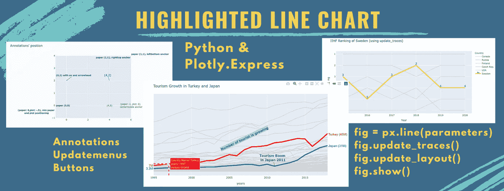
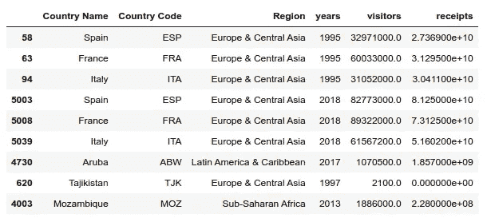
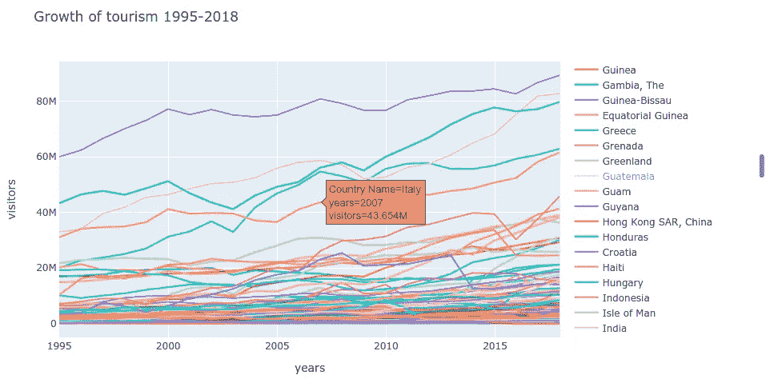
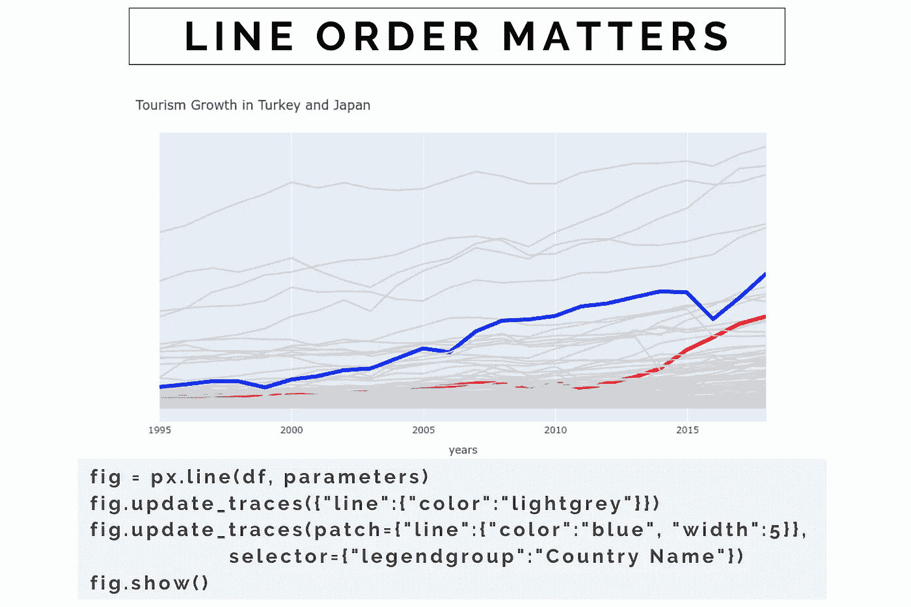
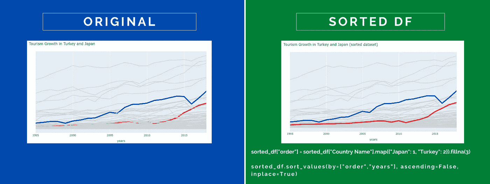
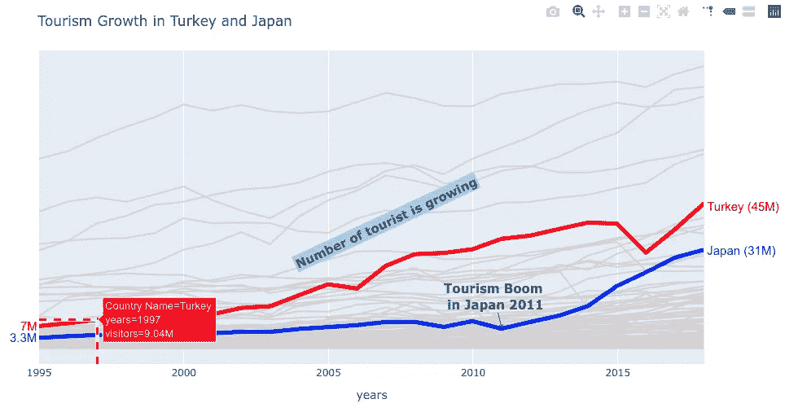
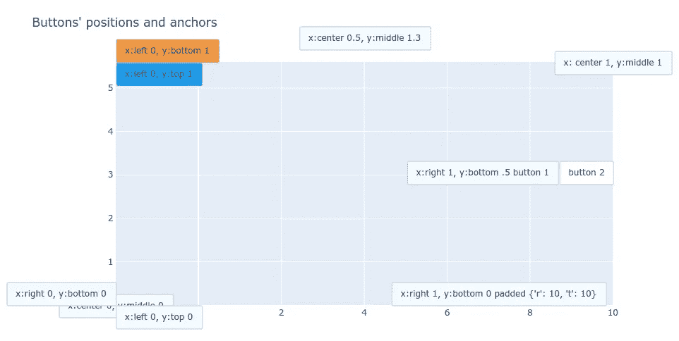
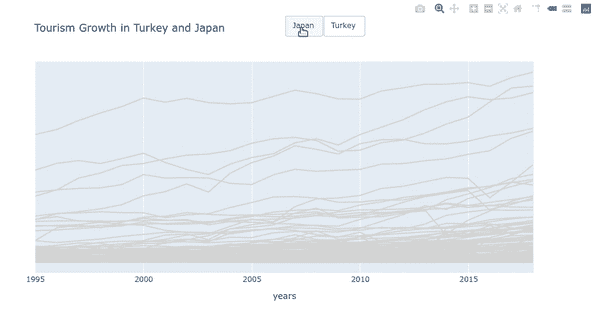
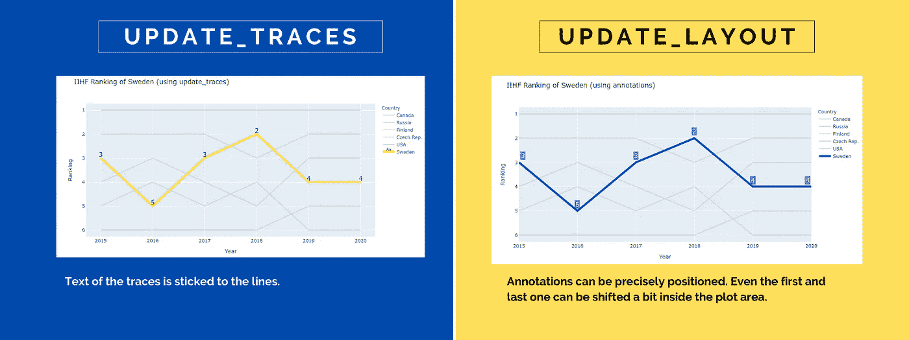

# 用 Plotly 突出显示折线图。表达

> 原文：<https://towardsdatascience.com/highlighted-line-chart-with-plotly-express-e69e2a27fea8?source=collection_archive---------25----------------------->

## 通过在其他线条的灰色背景上突出线条来强调你的观点



与本文中的所有图片一样，图片由作者提供

用 python 的 [Plotly 创建交互式图形。从一个数据框表达](https://plotly.com/python/plotly-express/)像一个魔咒。只需一行代码，您就可以探索数据集的基本特征。再添加几行代码，你就可以变出一个非常奇特但非常有故事性的图表。

在本练习中，我将向您展示在并发事件的阴影进度顶部绘制一条粗线的过程。它有两个巨大的好处:

1.  您想要突出显示的趋势清晰可见
2.  灰色背景表示其他事件的分布

你可以用储存在 [Github](https://github.com/vaclavdekanovsky/data-analysis-in-examples/blob/master/Vizualizations/Plotly/Highlighted_Line_Chart_on_Grey_Lines_Background/Highlight_Lines_on_Grey_Background.ipynb) 上的笔记本和我一起创建所有的图表。在本文中，您将了解到:

*   如何轻松安装
*   如何使用`px.line(df, parameteres)`创建[线图](#abe3)
*   如何使用`fig.update_traces`或`color_discrete_map`给的一些线条上色
*   行的[顺序很重要](#4233)
*   如何[在 Plotly 图表上定位注释](#7f78)
*   如何使用注释来[标记、突出显示、创建图例或描述图表区域](#c34f)
*   如何添加[交互按钮](#1a69)
*   如何用这种图表来展示[排名的变化](#1ddc)

# 数据集

我将使用两个数据集。第一个是关于世界各地旅游业的进展([游客人数](https://data.worldbank.org/indicator/ST.INT.ARVL)，1995 年至 2018 年 215 个国家)，第二个显示了过去 6 年冰球国家队的排名。

数据集在 github 上的 [preprocess.ipynb notebook 中进行预处理，在 python 的 pickle](https://github.com/vaclavdekanovsky/data-analysis-in-examples/blob/master/Vizualizations/Plotly/Preprocess/Preprocessing.ipynb) 中存储[。](/stop-persisting-pandas-data-frames-in-csvs-f369a6440af5)

# 装置

普洛特利。Express 是在版本 4.0.0 的 [plotly](https://plotly.com/) 库中引入的，您可以使用以下命令轻松安装它:

```
# pip 
pip install plotly# anaconda
conda install -c anaconda plotly
```

Plotly Express 还要求安装 pandas，否则当你尝试导入时会得到这个错误。

```
[In]: import plotly.express as px
[Out]: **ImportError**: Plotly express requires pandas to be installed.
```

如果您想在 Jupyter 笔记本中使用 plotly，还有其他要求。对于 Jupyter 实验室你需要`[jupyterlab-plotly](https://plotly.com/python/getting-started/#jupyterlab-support-python-35)`。在普通笔记本上，我必须安装`nbformat` ( `conda install -c anaconda nbformat`)

[](/visualization-with-plotly-express-comprehensive-guide-eb5ee4b50b57) [## 用 Plotly 可视化。快递:综合指南

### 一个数据集和 70 多个图表。交互性和动画通常只需一行代码。

towardsdatascience.com](/visualization-with-plotly-express-comprehensive-guide-eb5ee4b50b57) 

# 带有 Plotly Express 的基本折线图

用 plotly 创建折线图再简单不过了。语法是`px.line(df, parameters)`。看起来很简单，但是[的参数数量](https://plotly.com/python-api-reference/generated/plotly.express.line.html)是相当大的。值得注意的是。Express 喜欢长数据结构(与宽结构相反)，其中每个类别和每个值都是一列。



数据的长结构。对于类别/参数的每个组合，在一行中都有值。

我将为每个国家画一个折线图，显示所有 215 个国家每年的游客数量。Plotly 可以处理，但图表不会告诉你太多信息。你可以使用右边的菜单图例来关闭/打开线路，但是它太长了，你必须滚动才能找到你的国家。当您将鼠标悬停在这些行上时，会弹出一个工具提示，提供有关数据的详细信息。

```
# simple line chart with Plotly Express
px.line(long_df, 
        x="years", 
        y="visitors", 
        color="Country Name", 
        title="Growth of tourism 1995-2018")
```



在这种人口过剩的土地上，你几乎看不到任何趋势

## 仅对所需的线条着色

比方说，为了你的研究或营销目的，你应该介绍日本、🇯🇵和🇹🇷.的旅游业发展所以让我们模糊其他线，给他们一个类似背景的灰色阴影，并通过着色突出日本和土耳其线。你有几个选择来这样做。

```
# first option is to use, .update_traces()
fig = px.line(long_df,
              x="years",
              y="visitors",  
              color="Country Name")# set color of all traces to lightgrey
fig.update_traces({"line":{"color":"lightgrey"}})# color Turkish line to blue
fig.update_traces(patch={"line":{"color":"blue", "width":5}}, 
                  selector={"legendgroup":"Turkey"})# color Japanese line to red
fig.update_traces(patch={"line":{"color":"red", "width":5}}, 
                  selector={"legendgroup":"Japan"})# remove the legend, y-axis and add a title
fig.update_layout(title="Tourism Growth in Turkey and Japan",
                showlegend=False,
                yaxis={"visible":False})# plot the chart
fig.show()
```



惊喜吧。这些线条是有颜色的，但是它们上面覆盖着灰色的线条，所以几乎看不见。

使用`fig.update_traces({"line":{"color":"lightgrey"}})`将所有线条的颜色变为浅灰色。然后我们使用`[.update_traces()](https://plotly.com/python-api-reference/generated/plotly.graph_objects.Figure.html#plotly.graph_objects.Figure.update_traces)`的`patch`和`selector`自变量。`patch`设置生产线的参数，而`selector`定义这些参数应用于哪条生产线。

如果您想知道我是如何知道向字典提供哪些值的，那么`{"line":{"color":"blue", "width":5}`会改变行的属性，并且`legendgroup`是通过`Country name`识别行的正确参数。最简单的方法是读取`fig["data"]`。每个 Plotly 图表都是一个字典，当您更新这个字典时，所有参数都可以更改。

```
**[In]:** fig["data"]
**[Out]:** (Scattergl({
     'hovertemplate': 'Country Name=Aruba<br>years=%{x}<br>visitors=%{y}<extra></extra>',
     'legendgroup': 'Aruba',
     'line': {'color': 'lightgrey', 'dash': 'solid'},
     'mode': 'lines',
...
```

> 每一张图都是一本字典。使用`fig.to_dict()`或`fig[“data”]`查看数值。

## 对行进行排序

但结果并不是我们想要的。我们显示日本和土耳其旅游业发展的轨迹介于两者之间。一些灰线在它们上面，一些在下面。

我们可以尝试 Plotly 的参数`category_orders`来影响行的顺序，但是添加`category_orders={"Country Name":["Japan","Turkey"]})`会使情况变得更糟。首先显示这些轨迹，所有灰色线都在它们上面。


Category_order 参数定义行的顺序。如果您只指定我们想要的，它们会成为第一个。其他的都在上面。

我们可以在最后提供日本和土耳其的完整国家列表，但是对数据框架本身进行排序更容易。我们`.map()`向日本订购 1，向土耳其订购 2，向所有其他线路订购`fillna(3)`，然后按照该值对数据帧进行排序。

```
# sort the dataframe
sorted_df = long_df.copy()# map the value order
sorted_df["order"] = sorted_df["Country Name"].map({"Japan": 1, "Turkey": 2}).fillna(3)# sort by this order
sorted_df.sort_values(by=["order","years"], ascending=False, inplace=True)
```



最晚出现的线被画在最上面。

如何给线条上色的另一个选项是为 plotly 的`color_discrete_map`参数提供一个字典，而不是应用`fig.update_traces()`。dict 结构是`{trace_name: color}`。

```
{'Aruba': 'lightgrey',
 'Zimbabwe': 'lightgrey',
...
 'Turkey': 'red',
 'Japan': 'blue'}
```

要改变宽度，可以直接操作 Plotly 的后端字典。

```
for i,d in enumerate(fig["data"]):
    if d["legendgroup"] in ["Japan","Turkey"]:
        fig["data"][i]["line"]["width"] = 5

fig.show()
```

请记住，所有代码，包括关于如何影响 Plotly 图表外观的各种选项，都可以在 [Github](https://github.com/vaclavdekanovsky/data-analysis-in-examples/blob/master/Vizualizations/Plotly/Highlighted_Line_Chart_on_Grey_Lines_Background/Highlight_Lines_on_Grey_Background.ipynb) 上找到。

# 释文

图表看起来仍然很难看。我们已经去掉了图例和轴心，我们甚至不知道有多少游客来过这些国家。为了向观众展示重要的价值，我们必须注释情节。注释是添加到`.fig.update_layout(..., annotations=[])`中的另一个字典。这个注释参数包含一个字典列表，每个字典都是一个注释。

```
turkey_annotation = \
[{"xref":"paper", "yref":"paper", "x":0, "y":0.15,
  "xanchor":'right', "yanchor":"top",
  "text":'7M',
  "font":dict(family='Arial', size=12, color="red"),
  "showarrow":False}, ... other annotations ...]
```

您可以影响注释的许多参数。它的位置、字体以及是否有箭头从注释文本指向图表上的某个点。文本的坐标`x`和`y`既可以指`plot` 也可以指 `paper-canvas`。在第一种情况下，使用轴上显示的值指定位置，在第二种情况下,`(0,0)`是绘图区的左下角,`(1,1)`是右上角。

位置还取决于`anchor`(上-中-下、左-中-右)、偏移和调整。可以通过设置字体来修改每个注释，或者可以在文本上应用 HTML 标签，如`<b>`或`<i>`。

看看这个要点和由此产生的图，以了解您在注释时的选项。


关于如何在 Plotly 中定位注释的各种选项。

如果您的注释不适合画布，您可以通过在`.update_layout()`内放置`margin={"l": pixels, "r": px, "t": px, "b": px}`来增加绘图周围的空间。

## 标注作为标签和图例

当我们对我们的旅游图表稍加研究时，我们可以取得相当好的结果。我们将`xref`设置为`paper`，并将`0`设置为行的开始。添加`xanchor="left”`将文本对齐到绘图区的左侧。您可以设置`yref=”paper"`并尝试在 0 和 1 之间找到理想的位置，但是不将其设置为`paper`并使用准确的位置更容易，例如`3 300 000`(注意，从 python 3.6 开始，由于 PEP515 ，您可以在数字文字中使用[下划线，并将百万写成`3_300_000`)](https://www.python.org/dev/peps/pep-0515/)

因此，完整的图表如下所示:



用注释 Plotly 表示突出显示的折线图

> 我认为关于绘图区域之外的注释，最有趣的是你可以引用画布上的`x`和图表上的坐标`y`。可以设置，`"x":0 (on the canvas), "xanchor":"right`和`"y": 7_000_000 on the plot, "ynachor":"middle"`。

# 交互式按钮

上面的图表非常令人印象深刻，不是吗，但是如果你可以添加更多的东西呢？如果您可以让用户选择突出显示他们想要的任何数据，会怎么样？这可以通过交互式按钮来实现。

通过`fig.update_layout(updatemenus=[])`添加按钮。您现在可能已经习惯了这样一个事实，即每个元素都由一个 python 字典来描述，按钮也不例外。

每个按钮都有几个参数:

*   `args`:点击按钮会发生什么
*   `args2`:取消选中时会发生什么(创建切换按钮)
*   `label`:按钮上写的是什么
*   `method`:按钮是否改变绘图、布局或两者

`args`、`args2`中的每一个也接受 3 个参数——轨迹变化、布局变化和受影响的轨迹列表。例如

```
args=[
    # updates to the traces
    {"line.color":["blue"],"line.width":5}, 

    # changes to the layout
    {"title":"Tourism growth in Japan",
      "annotations": annotation_japan}, 

    # which trace is affected  
    [1,2]
     ]
```

按钮集提供了影响其位置和样式的附加参数。与注释类似，您可以在绘图周围放置按钮。您还可以在单个按钮、一组按钮或下拉列表之间进行选择。



各种位置的 plotly 互动按钮和风格。

让我们添加按钮来打开/关闭关于日本和土耳其旅游的两个亮点。



按钮可以提高 Plotly 的交互性

Plotly Express 中的按钮不是万能的。如果您点击日本和土耳其按钮，而没有通过第二次切换-点击清除绘图，您将看到两条彩色线。我没有发现如何确保一个是染色的，而其他的都是灰色的。这样复杂的交互只有通过 Plotly 的仪表盘库才能实现——[Dash](https://plotly.com/dash/)。它的回调动作允许几乎所有可以想象的输出。

> 您可能还会注意到，如此多的行，Plotly 自动选择的 [WebGL 格式](https://en.wikipedia.org/wiki/WebGL)被证明提高了具有许多数据点的 JavaScript 绘图的可用性。

# 显示排名——IIHF 排名

当我第一次遇到这种图表时，它显示了最受欢迎的国家公园的排名以及它是如何随着时间的推移而演变的。我再也找不到这个例子了，所以我决定创建一个我自己的等级演变图。我会看看过去 5 年里冰球国家队的排名。

因为最近换了 Linux，所以手动把数据收集到[里。ods](https://en.wikipedia.org/wiki/OpenDocument) 电子表格。您可以使用`pd.read_excel(path, engine="odf)`来收集数据，但是我必须安装`pip install odfpy`来实现。

然后你重复上面的代码来显示排名的概况，并突出显示你喜欢的国家。不过，在这里我不得不处理一个新问题。我想显示标签，显示每年的排名，只有这一行突出显示(而它应该是隐藏的所有其他人)。

同样，这个问题有两个结果略有不同的解决方案。你可以使用`fig.update_traces()`来设置颜色和标签。在这种情况下，您必须指定`text`和`mode`:

```
fig.update_traces(
    patch={
        "line":{"color":"yellow", "width":5}, 
        "text":sweden["Ranking"].values,
        "textposition":"top center",
        "mode":"lines+text",
        "textfont":{"size":15, "color":"blue"},
        }, 
    selector={"legendgroup":"Sweden"})
```

用这种方法，文本是一种丑陋的坚持行，我没有强迫它解除。当你简单地用`fig.update_layout(annotations=[])`注释时，这就可以做到。迭代数据框，并准备一个包含每个注释的字典列表:

```
annotations = []
for index, row in sweden.iterrows():
    annotations.append(
        {"x": row["Year"], 
         "y": row["Ranking"], 
         "yshift": 6,
         "text": row["Ranking"],
         "xanchor": "center", 
         "yanchor": "bottom", 
         "showarrow":False,
         "font":{"color":"blue", "size": 15}
        }
    )
```



如何突出显示和标记 plotly 的一条线的两个选项。

# 结论

我希望您喜欢这篇介绍 python 的 Plotly Express 的技巧的文章。您已经学习了如何创建包含大量信息的折线图，以及如何向受众突出显示这些数据的重要部分。您已经看到，实现相同目标的方法通常不止一种。最后，我们用同样的方法在灰色背景上用彩色线条来显示排名的变化。

对于这种类型的图表，您还有其他使用案例吗？

```
If you want to create inspiring graphics like those in this post, use [canva.com](https://partner.canva.com/vdek) (affiliate link, when you click on it and purchase a product, you won't pay more, but I can receive a small reward; you can always write canva.com to your browser to avoid this). Canva offer some free templates and graphics too.Other articles:* [Plotly Histogram - Complete Guide](/histograms-with-plotly-express-complete-guide-d483656c5ad7)
* [Everything you wanted to know about Kfold train-test split](/complete-guide-to-pythons-cross-validation-with-examples-a9676b5cac12)
* [How to turn a list of addreses into a map](/pythons-geocoding-convert-a-list-of-addresses-into-a-map-f522ef513fd6)
```

所有练习都可以在 Github 上的笔记本中完成—[highlight _ Line _ Chart _ on _ Grey _ Lines _ Background](https://github.com/vaclavdekanovsky/data-analysis-in-examples/blob/master/Vizualizations/Plotly/Highlighted_Line_Chart_on_Grey_Lines_Background/Highlight_Lines_on_Grey_Background.ipynb)