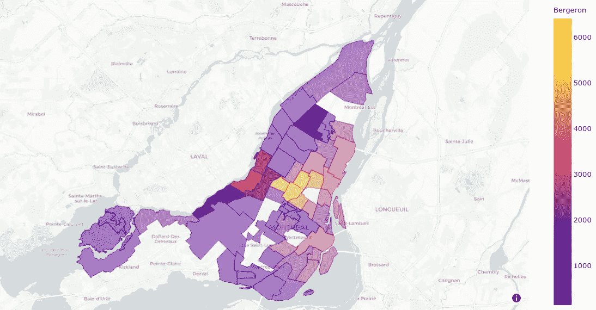
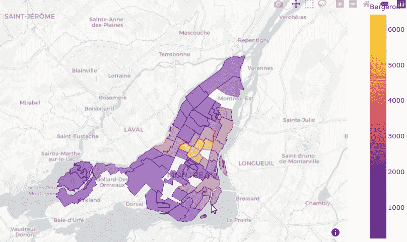

# 高亮显示 Plotly Choropleth 地图上的点击数据

> 原文：<https://towardsdatascience.com/highlighting-click-data-on-plotly-choropleth-map-377e721c5893?source=collection_archive---------28----------------------->

作者图片

在最近的一个项目中，我做了一个[英国房价 Plotly 应用程序](https://ukhouseprice.project-ds.net/)。一个挑战是突出显示 choropleth 地图中被点击的部分。在撰写本文时，这样的功能还不容易获得，所以这里有一个方法来解决它。

为了便于说明，我将修改 [plotly 文档](https://plotly.com/python/mapbox-county-choropleth/)中的 election-choropleth 示例。完整的代码可以在[这里](https://colab.research.google.com/drive/1NtoBgYEH-StOGwWu6cJ-d8XCQxbrZzHE?usp=sharing)的谷歌可乐实验室笔记本上找到。

基本思想是添加第二个图层，其中仅包含相应 geojson 中的选定区域，并跟踪在状态变量中被单击或取消单击的区域。

GeoJSON 是一种开放标准地理空间数据交换格式。对于我们的 geojson 文件，我们希望选择包含所选地区的 geojson['features']元素。为了加快查找过程，我们将首先获得一个 district_lookup 字典:

然后，我们编写一个函数来获取所选地区的 geojson 文件:

给定一个选择列表，现在我们可以在图的第二层使用函数 *get_highlights()* 来获得高亮效果，我们将选择的不透明度从 0.5 增加到 1.0。我们还可以用其他方式高亮显示被点击的区域——只需为第二层指定所需的格式。

现在我们准备运行应用程序。dash_core_components.graph 组件有一个属性“click data”——当地图上有点击时，事件会触发回调函数，更新集合“selections”和图。

作者图片

希望这个小技巧对你有所帮助，祝你的项目好运！