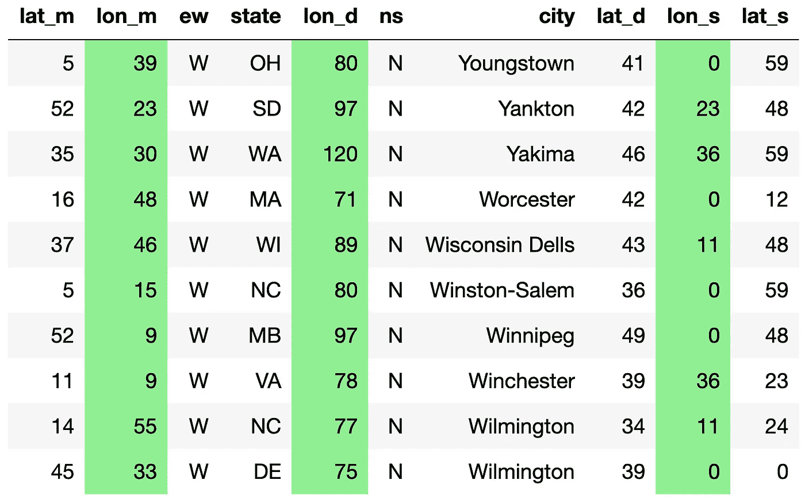

# 突出显示熊猫数据框架中的列

> 原文：<https://towardsdatascience.com/highlighting-columns-in-pandas-dataframe-bf2ff77d00bc?source=collection_archive---------31----------------------->

## 提高效率

照片由[米切尔罗](https://unsplash.com/@mitchel3uo?utm_source=medium&utm_medium=referral)在 [Unsplash](https://unsplash.com?utm_source=medium&utm_medium=referral)

如果处理数据是你的日常工作，你肯定用过，或者至少听说过熊猫。简而言之，Pandas 提供了您在 Python 中探索数据集所需的一切。

如果你试图通过向某人展示你的原始数据框架来解释数据，你会让他们感到困惑而不是理解。设计你的数据框架，突出重要的部分，将有助于你更清晰地传递信息。

如果您正在对一组列应用处理步骤，并来回检查数据帧的结果，那么您很可能是在浪费时间定位要查看的列。当然，切片和切块会有所帮助，直到你面对它们不起作用的某些情况。

*风格*模块熊猫就是你需要的。有条件地设置数据帧样式的功能允许许多自定义样式的可能性。突出显示列是您可以实现的一种自定义样式。

下面的函数提取了突出显示功能，并准备好复制/粘贴到您的笔记本上。

所有的奇迹都发生在第 5 行代码上。您访问 DataFrame 的 style 属性，并对指定要突出显示的每一列，将"*background-color:light green "*设置为它们的样式配置。该函数返回 Styler 对象，而不是 DataFrame。

Pandas 数据框架中的列突出显示示例

对于这个和其他造型选项，请看一下[熊猫造型模块](https://pandas.pydata.org/pandas-docs/stable/user_guide/style.html)。