# HireAttorney——为辩护律师带来更集中的市场

> 原文：<https://towardsdatascience.com/hireattorney-bringing-a-more-focused-market-to-defense-attorneys-a928b08c9b36?source=collection_archive---------57----------------------->

## 使用机器学习识别更有可能雇佣私人律师的被告。

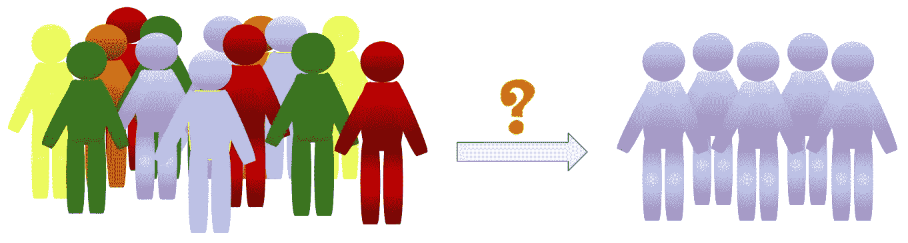

作者图片

我最近为一家律师事务所提供咨询，以确定哪些被告更有可能使用他们的服务。

此前，他们试图向所有被告发送电子邮件，但回复率接近于零。他们还试图在运用另一种营销策略的同时，根据被告的经验来确定雇用他们的可能性较高的被告，但这有两个问题。一个是这很耗时，因为他们需要手动分析被告的所有信息。另一个原因是，即使他们利用自己的经验来指认被告，回应率仍然很低。他们要么向错误的人营销，浪费了大量的营销资金和时间，要么忽视了一个客户，错过了一笔潜在的财富。

那么，如何确定一个高质量的市场，使公司更好地利用他们的时间和金钱，同时，他们不会失去任何潜在的客户？

一种解决方案是使用机器学习预测被告聘请私人律师的概率，这为他们提供了一种快速准确的方法来识别潜在客户。

# 有哪些数据可用？

我掌握的数据是 35。包含 10 年历史犯罪记录的 txt 文件。将数据合并到。csv 文件，我有超过 3M 的行，超过 40 个混合数据类型的变量，包括文本，分类和数字数据。一些列是文件日期、案件编号、案件类型、逮捕日期、犯罪日期、法官、被告信息等。我还注意到数据集是未标记的。

# 创建标签

因为数据集是无标签的，所以第一步是根据律师的姓名创建标签。

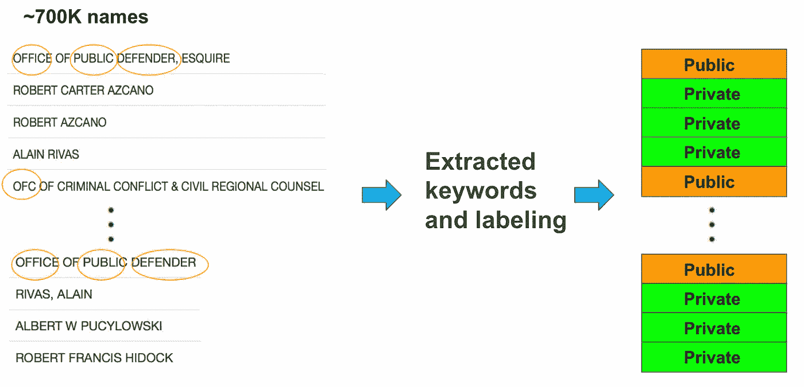

**图。1** 作者图片

这是一种半自动的方法。我写了一个 python 函数来识别关键字。它选择了公共律师中最常见的词，如办公室，公共等。但随着它添加更多的关键字，它将一些私人律师归类为公共律师。在这种情况下，我必须从关键字集中删除这些单词。我反复进行这个过程，以尽量减少错误。然后使用精炼的关键词集来创建标签。如果该名称包含任何关键字，则它被分类为 public 否则就是隐私。

当我得到标签时，我意识到数据集是不平衡的。公设律师的观察次数大约是私人律师的 5 倍。

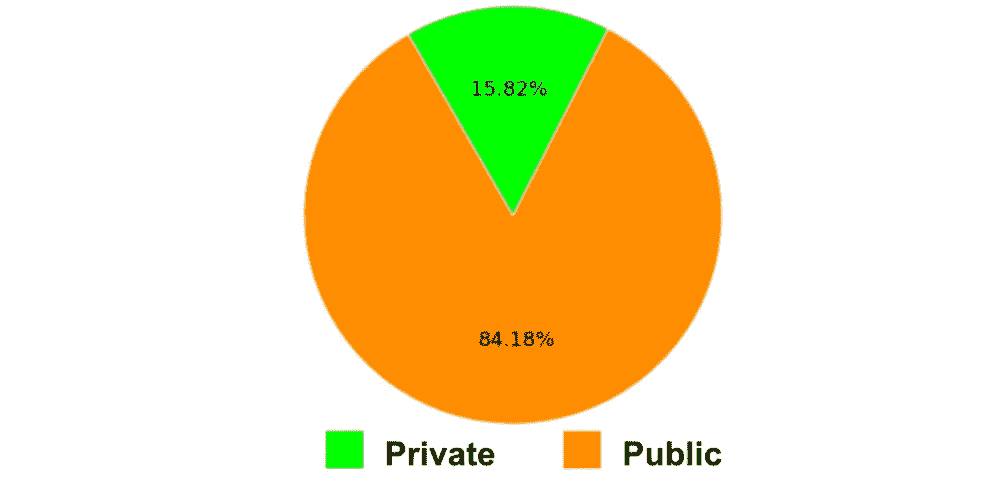

**图。2** 作者图片

# EDA 和数据清理

创建标签后，我做了 EDA、数据清理和功能工程。我重复了这个过程来提炼特性。

数据集相当混乱。例如，日期采用不同的格式，同一类别可以有不同的名称、空格、空单元格等。以下是我如何清理数据的一些例子。

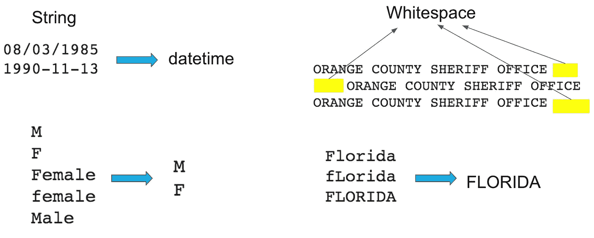

**图。3** 作者图片

我对所有日期进行了规范化，并将其转换为 datetime 类型。对于文本数据，我删除了所有的前导和尾随空格，并将小写转换为大写。至于名称不同但指向同一事物的类别，我将其合并为一个。

# 特征工程

特征工程是这个项目中最具挑战性的部分之一。虽然有超过 40 个变量，除了性别和种族，我不能直接使用任何变量。我与该公司密切合作，了解哪些因素会影响被告的决定。我选择了相关变量，并推导出可以反映被告行为的重要特征。

具体来说，在特征工程中，我关注三件事。首先，我删除了未来信息，以确保未来不会被用来预测过去。一些变量，如处置描述、监禁类型等，在被告决定是否聘请私人律师时是未知的，这些信息会导致数据泄露。

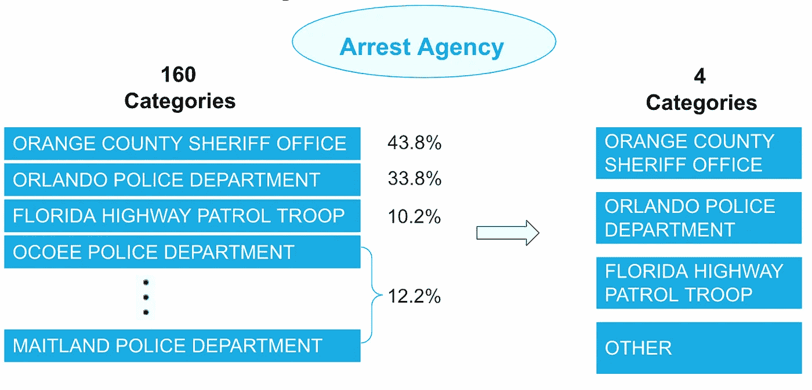

**图。4** 作者图片

第二，我降低了一些有太多层次的分类特征的类别。比如在特写逮捕机构，我有 160 个类别。但是只有三个类别是最常见的，所以我将其他类别归为一类，总共分为四类。

最后也是最重要的，我得出了反映被告行为的重要特征。这里有两个例子。

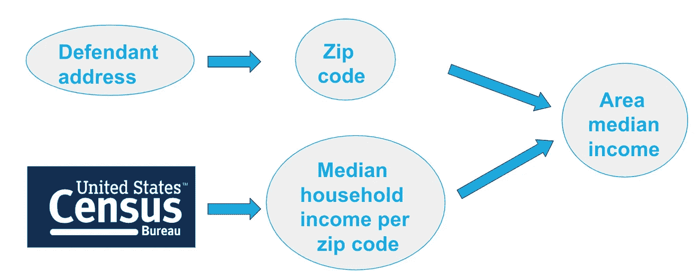

**图。5** 作者图片

**地区收入中位数**反映了被告的经济状况。我从被告的地址中提取了邮政编码，我从美国人口普查中收集了中等收入数据。我将这两者结合起来，得到我的数据集的地区中值收入。

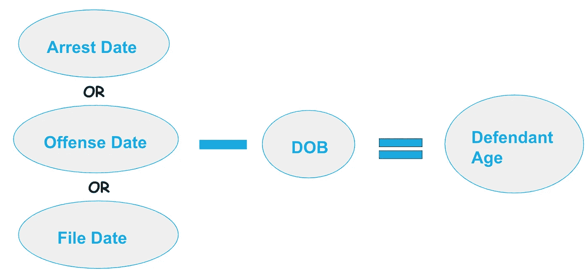

**图。6** 作者图片

**年龄**是反映被告行为的另一个重要特征。为了估计被告的年龄，我把三个日期结合起来，取其一，然后减去被告的出生日期。

# 建模和性能

一个合适的算法应该能够处理混合的特征类型和不平衡的结果。它应该具有良好的预测性能，运行速度快且可解释。所以我选择了一个平衡随机森林作为我的最终模型。

标准随机森林从训练数据的引导样本(即，具有替换的样本)中归纳出每个单独的树。在学习不平衡数据时，很有可能引导样本包含很少或甚至不包含少数类，从而导致树在预测少数类时性能不佳。为了克服这个问题，平衡随机森林在每个类中使用分层引导样本，即，当构建每个单独的树时，它从每个类中抽取相同数量的案例，以便它从每个类中学习。

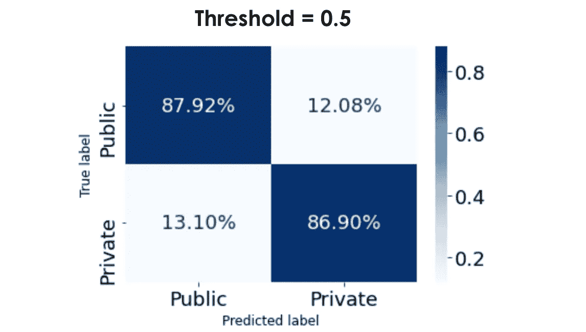

**图。7** 作者图片

从混淆矩阵来看，真阳性率和真阴性率都在 85%以上，表明我的模型对多数类和少数类都表现良好。

# **最低成本**

当向被告营销时，我们遭受两种类型的错误。

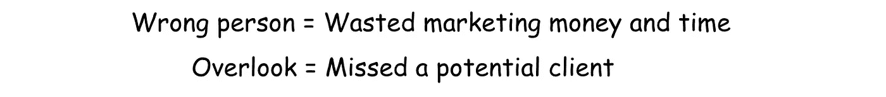

该模型输出被告聘请私人律师的概率，并根据阈值做出决定。

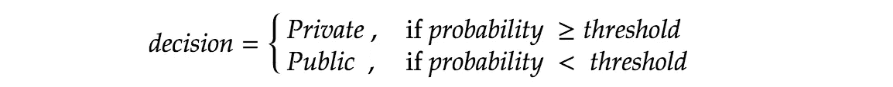

那我们应该如何选择门槛呢？例如，如果我们将阈值设置为 0.2，我们会“忽略”更少，但我们会接触更多的“错误的人”。相反，如果我们将阈值设置为 0.9，来自“错误的人”的错误会更少，但我们会“忽略”更多。那么我们应该如何平衡这两类错误呢？

为了使我们在向被告营销时遭受的两类错误的成本最小化，我引入了一个有成本的模型。

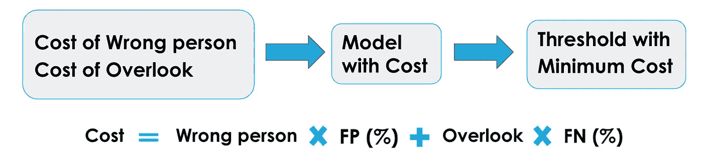

**图。8** 作者图片

当我们将两种错误的估计成本代入模型时，我们会得到一个建议的阈值和最小成本。

让我们看看它是如何工作的。

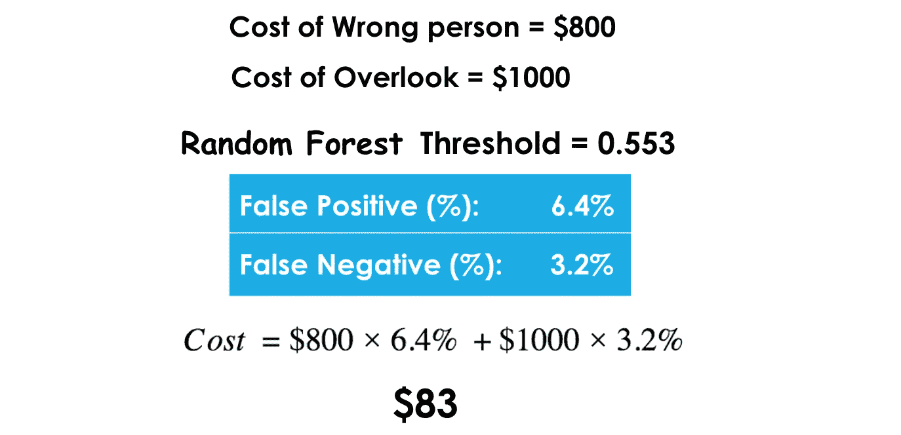

**图。9** 作者图片

当我们将“错误的人”的估计成本(800 美元)和“忽视”的估计成本(1000 美元)输入到有成本的模型中时，模型将基于所有阈值计算不同的总体成本。然后，该模型选择给出最小成本的阈值。在这个例子中，最佳阈值是 0.533，最小成本是 83 美元。

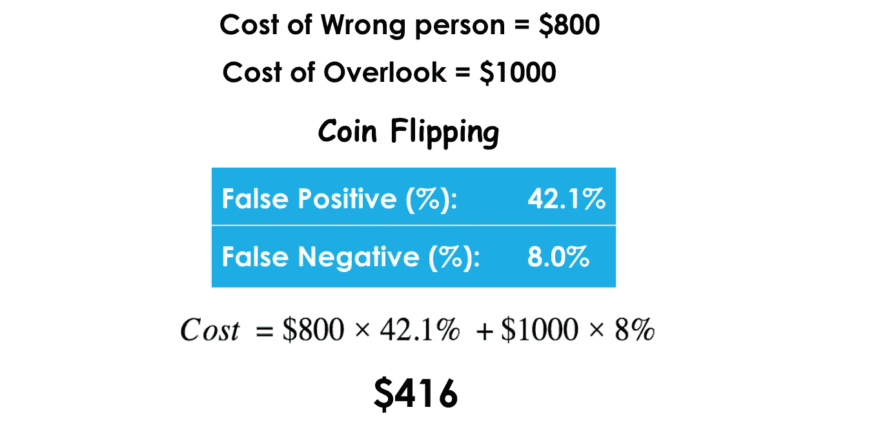

**图。10** 作者图片

我还计算了遭受这两种错误的成本，即 416 美元，这表明当使用我的模型时，我们每例平均节省了 300 多美元。

# **数据伦理**

由于数据的敏感性，我确实观察了不同人口统计群体的模型表现，如性别和种族，我的模型对每个群体都通用。

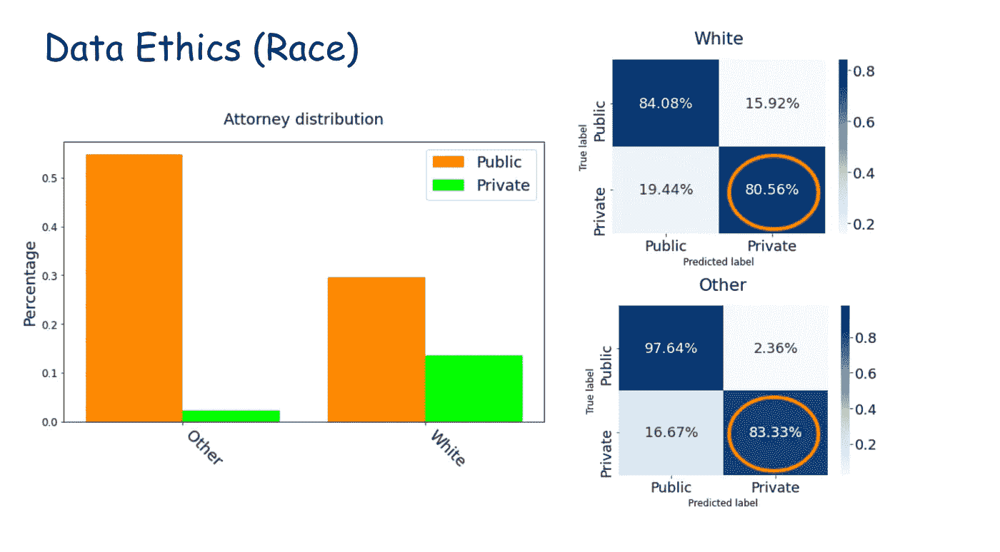

**图。11** 作者图片

两组中的律师分布是不同的。根据数据，白人的私人律师比其他种族的多。但是我的模型在向两个群体推荐私人律师方面有相似的比例，这意味着这个模型对每个群体都是通用的，它没有偏见。

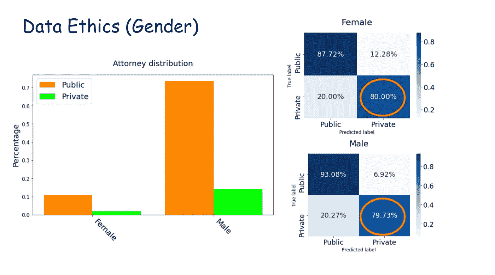

**图。12** 作者图片

同样的事情也发生在性别上。我的模型对女性和男性推荐私人律师的比例相似，这意味着该模型对女性和男性都通用。

感谢阅读！享受你剩下的一天吧！

参考资料:

[1]陈超、安迪·廖和利奥·布雷曼，[使用随机森林学习不平衡数据(2004)](https://statistics.berkeley.edu/sites/default/files/tech-reports/666.pdf) ，加州大学伯克利分校技术报告