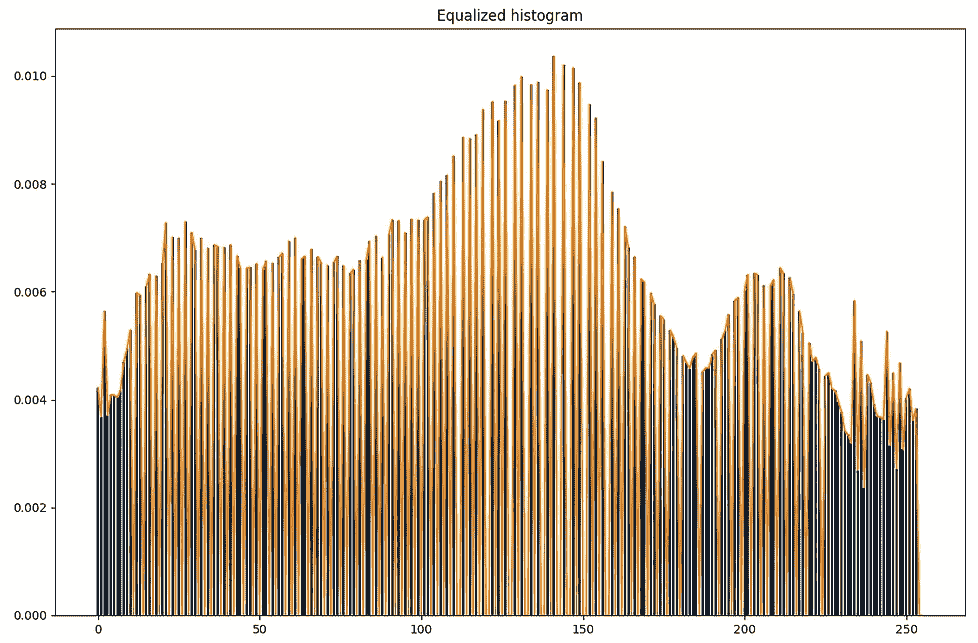

# 直方图匹配

> 原文：<https://towardsdatascience.com/histogram-matching-ee3a67b4cbc1?source=collection_archive---------2----------------------->

## 如何为一幅图像生成直方图，如何均衡化直方图，最后如何修改你的图像直方图，使其与另一幅直方图相似。

这里的代码可以在 [**Github**](https://github.com/aliprf/CV-HistogramMatching) 上找到。

如果你喜欢这个帖子，请**鼓掌**。

## 什么是图像直方图？

在开始定义直方图之前，为了简单起见，我们使用灰度图像。然后，我解释了彩色图像的过程。

图像直方图表示图像的强度分布。换句话说，图像直方图显示了图像中具有特定强度值的像素数量。例如，假设像素强度从 0 到 255 变化的正常图像。为了生成直方图，我们只需要计算亮度值为 0 的像素的数量，然后是 1，直到 255。在图 1 中，我们有一个样本 5*5 的图像，像素差异从 0 到 4。在生成直方图的第一步中，我们通过计算每个像素强度的数量来创建直方图表格。然后，我们可以通过基于直方图表创建条形图来轻松生成直方图。

**图 1** :生成图像直方图的过程

## 如何生成图像直方图？

在 python 中，我们可以使用以下两个函数来创建并显示图像的直方图。

**代码 1** :生成直方图

大多数情况下，当我们创建直方图时，我们通过将每个亮度值的像素数除以归一化因子来归一化直方图，归一化因子是图像宽度和图像高度的乘积。为了便于使用，如果 generate_histogram 函数的输入图像是一幅彩色图像，我们首先转换成一幅灰度图像(见第 6 行)。

## 如何均衡一个图像直方图？

直方图均衡化通常用于增强图像的对比度。因此，这种技术不能保证总是提高图像质量。计算 CDF(累积分布函数)是均衡图像直方图的常用方法。在图 2 中，我们已经计算了我们在图 1 中创建的样本图像的 CDF。此外，在图 3 中，我们显示了先前样本的均衡直方图。

**图 2:** 计算 CDF。

**图 3:** 均衡直方图。

为了用 python 计算均衡直方图，我创建了以下代码:

**代码 2:** 均衡直方图

这是我拍摄的三张不同的照片，作为例子。如图 4 所示，对于第一幅图像，直方图显示低强度像素的数量多于较亮像素。第二幅图像的情况完全相反，较亮像素的密度比较暗像素的密度大得多。第三个图像似乎有一个半正态直方图。

**图 4** :三种不同类型的图像及其直方图以及均衡直方图。

## 使用均衡直方图增强图像

如上所述，我们可以使用图像的均衡直方图来修改图像的对比度。如 Code.2 第 12 行所示，对于输入图像中的每个像素，我们可以使用其均衡值。结果可能比原始图像更好，但不能保证。在图 5 中，我们描绘了 3 个图像的修改版本。如图所示，使用图像的均衡直方图修改图像会产生具有更高对比度的图像。这一特性在许多计算机视觉任务中非常有用。

**图 5:** 使用均衡直方图的对比度修改。最左边一列是原始图像。中间的列是对比度修改的结果。最右边的列是修改图像的直方图。

## 什么是直方图匹配？

假设我们有两幅图像，每幅图像都有其特定的直方图。所以我们想在更进一步之前回答这个问题，*有没有可能根据一个图像的对比度来修改另一个图像*？答案是肯定的。事实上，这就是直方图匹配的定义。换句话说，给定图像 A 和 B，可以根据 B 修改 A 的对比度级别。

当我们想要统一一组图像的对比度时，直方图匹配是有用的。事实上，直方图均衡化也可以看作是直方图匹配，因为我们将输入图像的直方图修改为类似于正态分布。

为了匹配图像 A 和 B 的直方图，我们需要首先均衡两个图像的直方图。然后，我们需要使用均衡直方图将 A 的每个像素映射到 B。然后我们基于 b 修改 A 的每个像素。

让我们用图 6 中的例子来阐明上面的段落

**图 6:** 直方图匹配

在图 6 中，我们将图像 A 作为输入图像，将图像 B 作为目标图像。我们希望根据 b 的分布修改 A 的直方图。在第一步中，我们计算 A 和 b 的直方图和均衡直方图。然后，我们需要根据均衡直方图的值将 A 的每个像素映射到 b 的值。因此，例如，对于 A 中亮度级别为 *0* 的像素，均衡直方图的对应值为 *4。*现在我们看一下 B 均衡直方图，找到 4 对应的强度值，也就是 0。因此，我们将 A 的 *0* 强度映射到 B 的 *0* 强度。我们继续对 A 的所有强度值进行映射。如果 A 到 B 的均衡直方图中没有映射，我们只需选取最接近的值。

我也用 Python 实现了上述过程

**代码 3:**Python 中的直方图匹配

**图 7:** 直方图匹配示例。我们修改了左边图像的直方图以匹配中间图像的直方图。

图 7 示出了直方图匹配的例子。如您所见，虽然最左边的图像是明亮的图像，但就对比度而言，中间的图像可以被认为是更好的图像。所以，我们决定使用中心图像的契约来修改最左边的。结果，也就是最右边的图像得到了改善。

## 结论

在这篇文章中，我解释了*直方图匹配*，这是一个有用的方法，当我们处理图像。我首先解释了如何生成图像*直方图*。然后如何*均衡*生成的直方图，最后如何根据另一张图片的对比度修改一张图片，称为直方图匹配。带有解释的代码也可以在 [**Github**](https://github.com/aliprf/CV-HistogramMatching) 上找到。

这里的代码可以在 [**Github**](https://github.com/aliprf/CV-HistogramMatching) 上找到。

如果你喜欢这个帖子，请鼓掌。