# 直方图与 kde 解释

> 原文：<https://towardsdatascience.com/histograms-vs-kdes-explained-ed62e7753f12?source=collection_archive---------6----------------------->

## 用砖块和沙堆解释直方图和核密度估计器

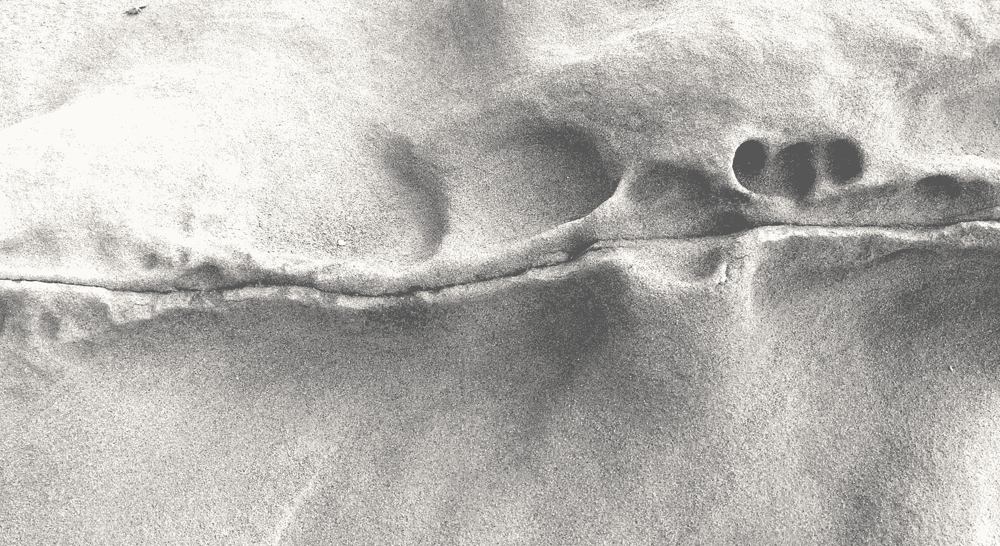

2020 年朱利安·韦吉鲁克

在这篇博文中，我们将探索直方图和核密度估计器(kde)的基本属性，并展示如何使用它们从数据中获得洞察力。

直方图在数据科学界是众所周知的，并且经常是探索性数据分析的一部分。但是，我们将从头开始构建一个直方图，以了解它的基本属性。

核密度估计器(kde)不太受欢迎，而且起初看起来可能比直方图更复杂。但是生成直方图和 kde 的方法实际上非常相似。由于它们的灵活性，kde 值得再看一眼。基于直方图示例，我将解释如何构建 KDE，以及为什么应该将 KDEs 添加到您的数据科学工具箱中。

# 数据

为了说明这些概念，我将使用我在过去几个月中收集的一个小型数据集。大约两年前，我开始定期冥想，并且在某个时候，我开始记录每天冥想的持续时间。

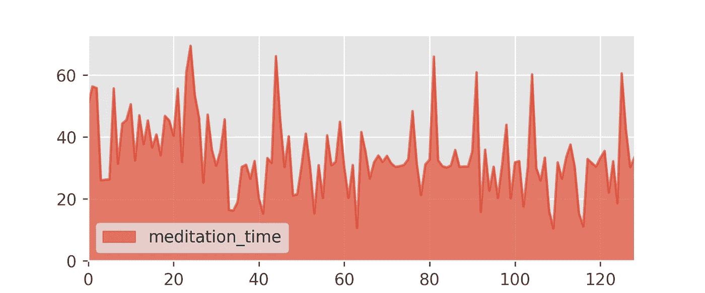

如你所见，我通常每天冥想半小时，一些周末的户外活动会持续一小时左右。但是有时候我很累，我只冥想 15 到 20 分钟。当我觉得一个会话应该结束时，我就结束它，所以会话持续时间是一个相当随机的量。

[冥想. csv](https://www.wergieluk.com/histograms-and-kdes/meditation.csv) 数据集包含以分钟为单位的会话持续时间。

# 直方图

我想知道更多关于这个数据和我的冥想倾向。例如，随机选择的会话持续 25 到 35 分钟的可能性有多大？

对于初学者来说，我们可以试着排序数据点并绘制数值。

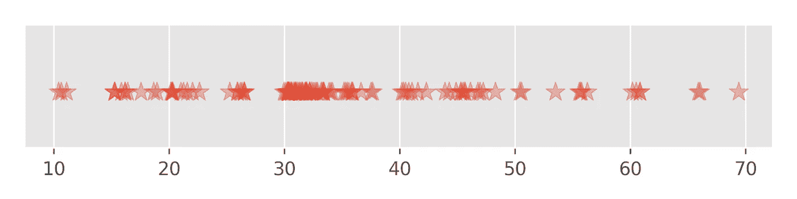

这种可视化的问题是，许多值过于接近，无法分开并绘制在彼此之上:没有办法告诉我们在数据集中有多少个 30 分钟的时段。相反，我们需要使用图的垂直维度来区分具有不同数据密度的区域。这个想法把我们引向直方图。

让我们将数据范围分成几个区间:

[10, 20), [20, 30), [30, 40), [40, 50), [50, 60), [60, 70)

我们有 129 个数据点。对于第一个区间[10，20]中的每个数据点，我们放置一个面积为 1/129 的矩形(大约。0.007)和区间[10，20]上的宽度 10。就像在堆砖头。由于我们在区间[10，20]中有 13 个数据点，13 个堆叠的矩形的高度约为。0.01:

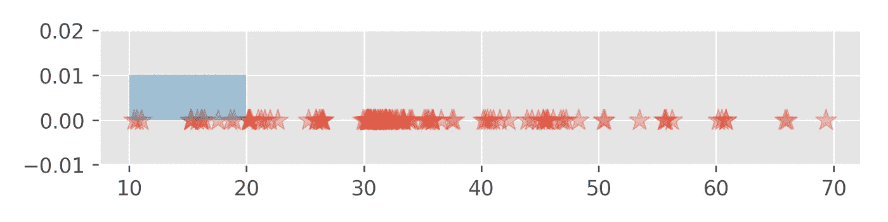

如果我们对所有剩余的音程重复这个过程会发生什么？

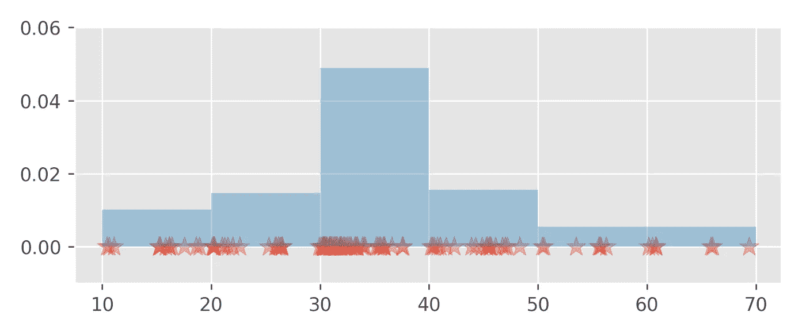

因为所有矩形的总面积是 1，所以标记堆叠矩形的上边界的曲线是概率密度函数。

密度很方便，因为它们可以用来计算概率。例如，要回答我最初的问题，随机选择的会话将持续 25 到 35 分钟的概率可以计算为区间[25，35]中密度函数(图)和 x 轴之间的面积。

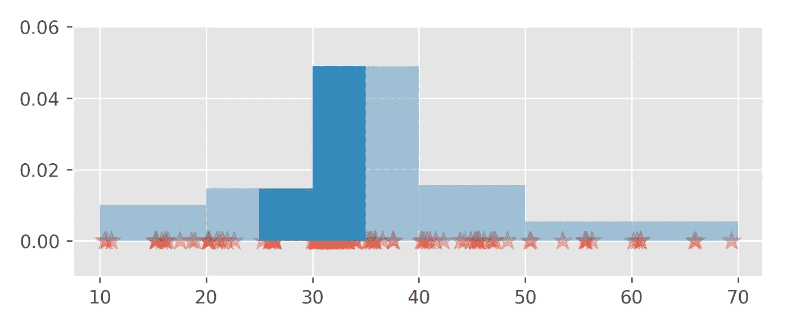

这个面积等于 0.318。

请注意，只有在与底部宽度相结合时，条形的高度才有用。也就是说，我们不能直接从 y 轴上读出概率；概率只能作为曲线下的面积来访问。这不仅适用于直方图，也适用于所有密度函数。

然而，粗略的计算通常会产生令人满意的结果。例如，从直方图我们可以推断出[50，60]和[60，70]条的高度约为 0.005。这意味着会话持续时间在 50 到 70 分钟之间的概率大约等于 20*0.005 = 0.1。精确计算得出概率为 0.1085。

间隔(又名“仓”)的选择是任意的。我们还可以将数据范围划分为长度为 1 的区间，或者甚至使用不同长度的区间(这并不常见)。使用小的间隔长度会使直方图看起来更不规则，但也允许更精确地定位具有高观察密度的斑点。例如，持续时间在 30 到 31 分钟之间的会话出现的频率最高:

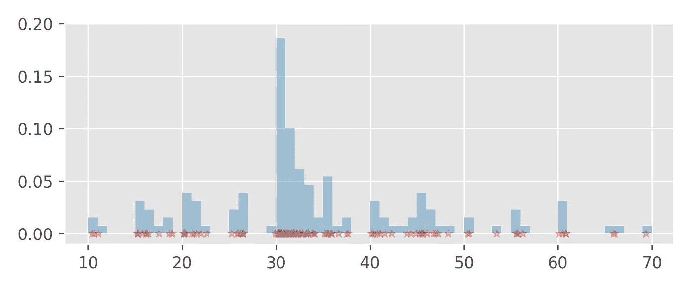

pandas 等流行的数据科学软件包中的直方图算法实现会自动尝试生成赏心悦目的直方图。

# 核密度估计量

密度估计值或密度估计值只是猜测的一个花哨词:我们试图猜测能够很好地描述数据随机性的密度函数 *f* 。

无论我们如何选择间隔长度，直方图看起来总是不规则的，因为它是一堆矩形(再想想砖块)。有时，我们对计算更平滑的估计感兴趣，这可能更接近现实。为此，我们可以稍微修改一下我们的方法。

直方图算法将每个数据点映射到一个具有固定面积的矩形，并将该矩形放置在该数据点的“附近”。如果我们不使用矩形，而是在每个数据点上倒“一堆沙子”，然后看看沙子是如何堆积的，会怎么样？

例如，数据集中的第一个观察值是 50.389。让我们在上面放一堆沙子:

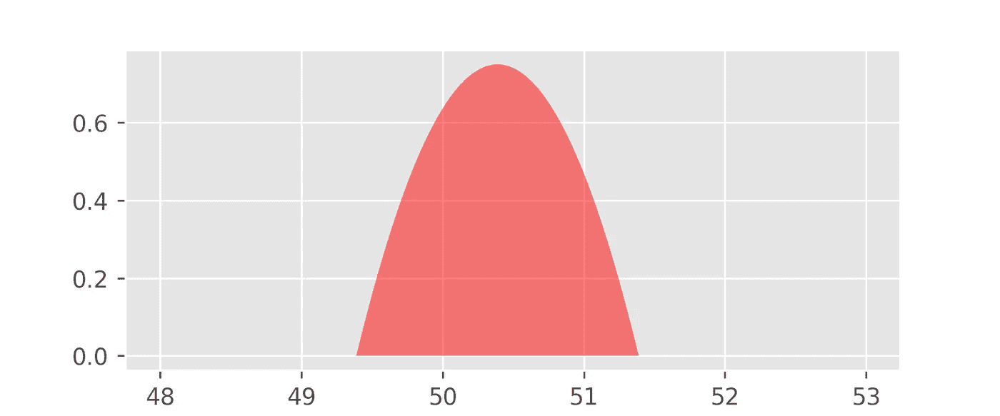

我们为这堆沙子建立的模型叫做 Epanechnikov 核函数:

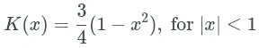

Epanechnikov 核是一个*概率密度函数*，这意味着它是正的或零，并且其图形下的面积等于 1。函数 *K* 以零为中心，但是我们可以通过从它的自变量 *x* 中减去一个常数来很容易地沿着 x 轴移动它。

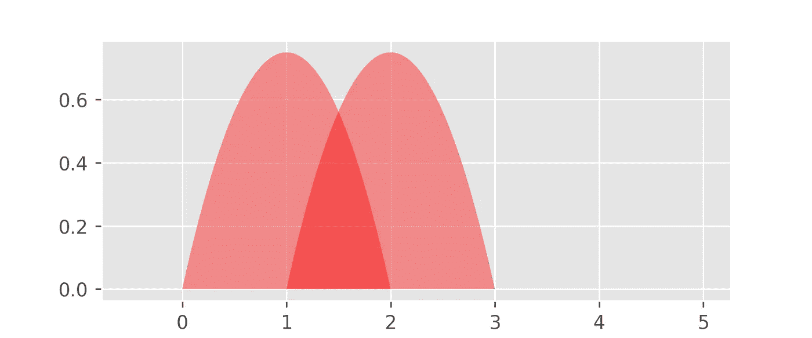

上面的图显示了

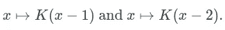

接下来，我们还可以调整所用沙子的“粘性”。这是通过用正参数 *h* 缩放核函数 *K* 的自变量和值来实现的:

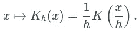

参数 *h* 通常被称为*带宽*。

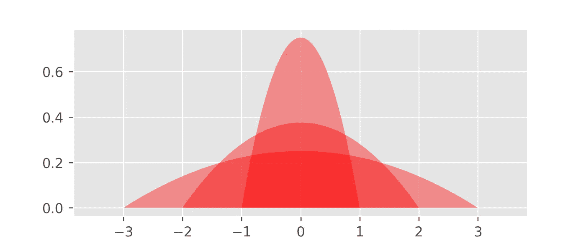

上图显示了 *K[1]* 、 *K[2]* 和 *K[3]* 的图形。较高的值 *h* 使函数图变平( *h* 控制“反向粘性”)，因此带宽 *h* 类似于直方图算法中的间隔宽度参数。函数 *K[h]* ，对于任何 *h > 0* ，也是面积为 1 的概率密度——这是微积分替换规则的结果。

让我们使用我们的核函数 *K[h]* 来推广直方图算法。对于我们包含 129 个观察值的数据集中的每个数据点 *x* ，我们在 *x* 处放置一堆沙子。换句话说，根据观察结果

我们构造函数

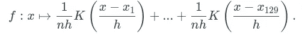

请注意，每个沙堆

面积为 1/129，就像用于构建直方图的砖块一样。由此可见，函数 *f* 也是一个概率密度函数(其图形下的面积等于 1)。让我们来看看:

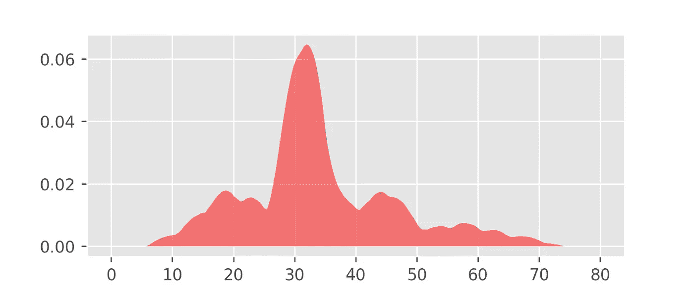

注意，这个图看起来像前面构建的直方图的平滑版本。

函数 *f* 是**核密度估计器** (KDE)。

Epanechnikov 内核只是沙堆模型的一种可能选择。另一个流行的选择是[高斯钟形曲线](https://en.wikipedia.org/wiki/Gaussian_function)(标准正态分布的密度)。任何概率密度函数都可以起到核的作用来构造核密度估计量。这使得 KDEs 非常灵活。例如，让我们用下面的“箱式内核”替换 Epanechnikov 内核:

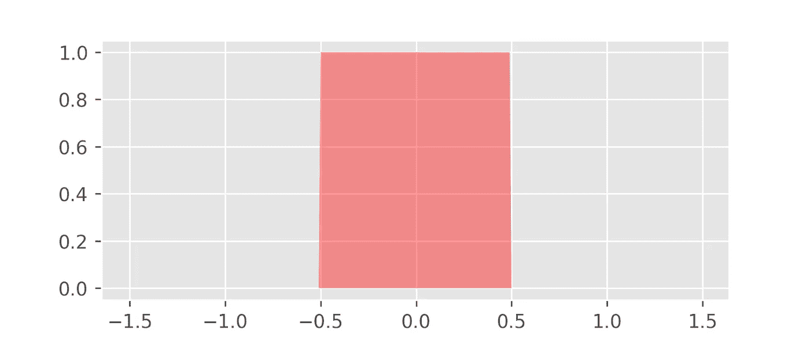

下图描绘了使用该盒核的冥想数据的 KDE。

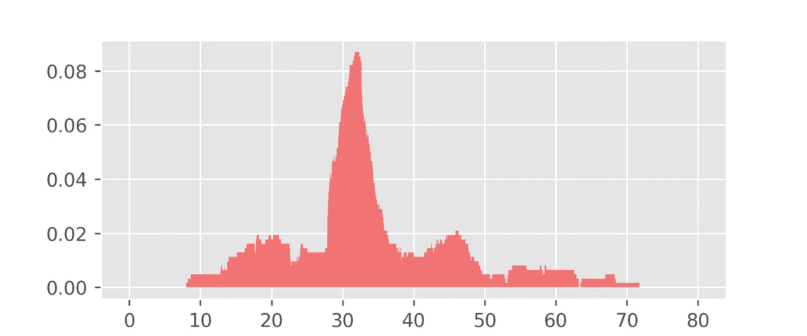

选择正确的核函数是一个棘手的问题。在实践中，尝试几个内核并比较产生的 kde 通常是有意义的。核的选择也可能受到关于数据生成过程的一些先验知识的影响。例如，如果我们先验地知道真实密度是连续的，我们应该更喜欢使用连续的核。

# 熊猫

大多数流行的数据科学库都有直方图和 kde 的实现。例如，在*熊猫*中，对于给定的数据帧 *df* ，我们可以用 *df.hist()* 绘制数据的直方图。类似地， *df.plot.density()* 给出了具有高斯核的 KDE 图。

以下代码加载冥想数据并将两个图保存为 PNG 文件。

# 结束语

在这篇博文中，我们学习了直方图和核密度估计器。两者都给我们基于观测数据的未知密度函数的估计。

计算直方图和 kde 的算法非常相似。kde 提供了更大的灵活性，因为我们不仅可以改变带宽，还可以使用不同形状和大小的内核。

用于生成这篇博文中所有情节的 python 源代码可从这里获得:[冥想. py](https://www.wergieluk.com/histograms-and-kdes/meditation.py)

*非常感谢 Sarah Khatry 阅读了这篇博文的草稿，并提供了无数的改进意见和更正。*