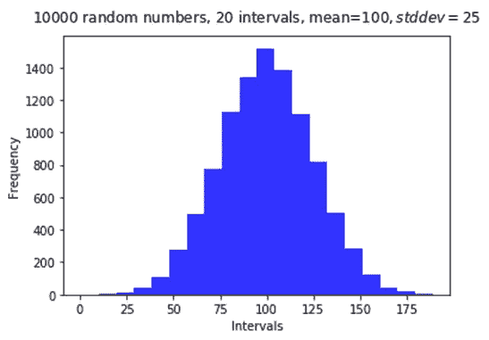
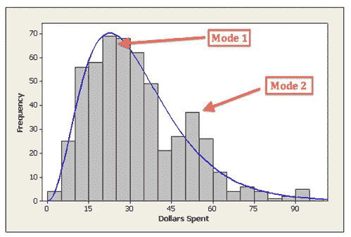
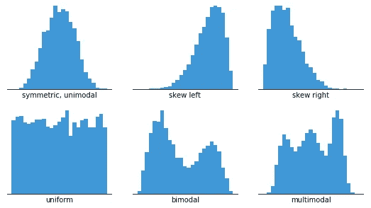
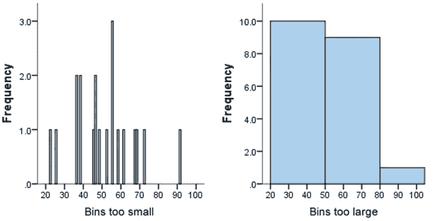
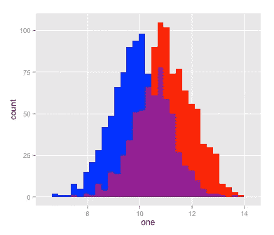
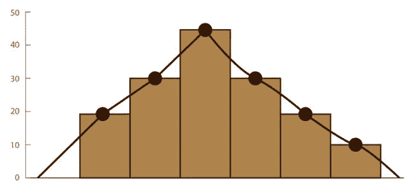
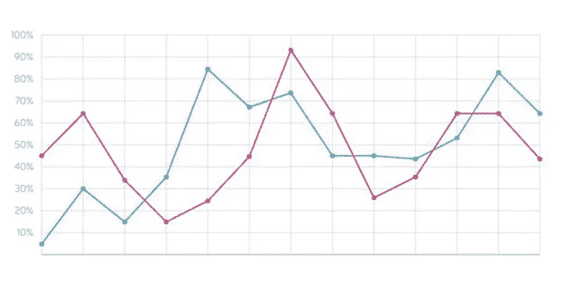
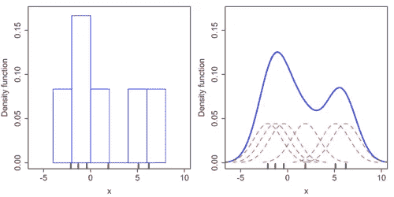
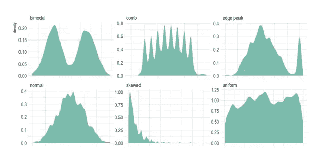

# 直方图、为什么和如何、讲故事、技巧和扩展

> 原文：<https://towardsdatascience.com/histograms-why-how-431a5cfbfcd5?source=collection_archive---------24----------------------->

图片来自 Pixabay

**又名**:柱状图

**为什么**:直方图是数据集分布的图形表示。虽然它的外观类似于标准条形图，但直方图不是在不同项目或类别之间进行比较，也不是显示一段时间内的趋势，而是一种图表，让您显示潜在的频率分布或单个**连续数字变量的**概率分布**。**

让我澄清一下，概率分布表示某个随机变量可能取的所有值，以及这些值的概率汇总。简而言之，连续数值变量是指在一个范围或区间内可以取无限多个值的变量。比如:身高，体重，年龄，温度。

**如何**:直方图是有两个轴的二维图；纵轴是频率轴，而横轴被分成一系列数值(间隔或**箱**)或时间间隔。每个仓的频率由垂直矩形条的面积表示。每个柱覆盖了所研究变量的连续数值范围。纵轴显示从每个箱的计数中导出的频率值。

中点值是为间隔命名的值。当一个数值正好对应于间隔的一个边界时，它将根据可视化工具的默认设置被分配给左侧或右侧间隔。有些工具可以修改这个默认设置，以适应用户的偏好或需求。

直方图有时有不相等宽度的条。然而，通常以相同的宽度绘制它们，以表示每个间隔的相同范围的数据。作为反例，可以指出下面的情况:从人群中的个体收集数据，在 10 年年龄范围的箱之间分割数据，但是在单个间隔中累积来自 75 岁以上的人的数据。当**条宽**在所有区间都相同时，相当于用条长替换条面积。

**示意图:**

参考消息的性质，直方图显示了**频率分布**，用于(或应该用于)表示单个连续定量变量的概率分布。从概念上讲，与每个区间的频率成比例的不是矩形的高度，而是矩形的面积，而这又与连续变量被划分的每个值范围的概率有关。

请记住，频率分布是一种表示，它显示某个变量的值在给定数据集中出现的频率(多少次)。

为了说明这个想法:一个中等规模的社区 24 小时便利店从 537 名顾客那里收集了单次光顾该店所花金额的数据。下面的直方图显示了分布模式。分布的整体形状向右倾斜，在$25 附近有一个清晰的模式。此外，它在 50-55 美元区间附近有第二个较小的峰值。尽管大多数客户每次购物平均花费 25 美元，但还有一小部分客户每次购物大约花费 50 美元。

来源:#1

**讲故事**:直方图是对连续变量进行初步探索的合适图形。通过一组竖线，它显示了该变量的数值是如何分布的。直方图允许计算所研究的连续变量的任何值的表示概率，如果我们想从我们的**样本**的结果中进行推断和估计**人口**值，这是非常重要的。

直方图提供了数据集分布的直观表示:数据的位置、分布和偏斜度；这也有助于观察分布是对称的还是左右倾斜的。另外，如果是**单峰，双峰或者多峰**。它还可以显示数据中的任何异常值或缺口。简而言之，直方图总结了连续数值变量的分布特性。

在这一点上，澄清一些统计学术语是很重要的:**总体**是组成被研究对象的完整元素集合；更广泛的人群、汽车、事物、花费的金钱等。你打算向他推广你的研究成果。**样本**是整个总体的子集，通过某种抽样方法获得，并被选择来代表该总体。示例:调查结果或便利店收集的数据。

**模式**是一种集中趋势的度量，代表数据集中出现频率最高的值。单峰分布是具有唯一模式或一个单峰的分布；如果呈现两个峰或模式，则为双峰；如果呈现两个或多个峰，则为多峰。下图显示了左偏或右偏、对称、均匀或多峰分布的表示。

来源:#2

**直方图提示**

垂直轴基线总是从 0 开始。由于分布是由矩形的高度显示的(对于相等的 binwidths ),如果我们修改基线，我们不可避免地会扭曲视觉；

间隔的大小和数量没有严格定义的规则。总是尝试一些不同的 binwidth 值。虽然可视化工具包括这些参数的选择标准，但试验其他值也很重要。间隔的数量可以由数据集的性质或通过观察视觉信息的大小的深刻变化来建议。永远记住:很少的间隔不允许我们阐明数据分布的精细结构；许多区间重视抽样误差。

来源:#3

尽管最好对所有区间使用相同的二进制宽度，但有时某些二进制的数值很少，特别是在极端情况下。还记得前面那个来自 75 岁以上老人的反例吗？在这些情况下，在更宽的间隔内累积这些稀疏值。包括清楚地指示该变化的附加信息。

**直方图(HG)和标准条形图(BC)之间的差异**

标准条形图用于在类别之间进行数字比较，而直方图用于显示数据集的频率分布；

BCs 绘制类别图(离散定性元素),而 HGs 绘制按区间分组的定量数据图；

直方图的条之间没有“间隙”或空间；必须在 BC 上的条形之间留出一些空间，以清楚地表明它指的是离散的(互斥的)组。

BCs 可以重新排列(升序、降序、字母顺序等)。);HGs 不能被重新排序，因为它们有一个内在的排序；

HGs 显示区域，而 BCs 显示长度。在水银柱中，横轴和纵轴都有数值，因此可以计算出面积。在 BC 中作为一个轴显示类别，没有办法计算面积；

BC 中的所有条形必须具有相同的宽度。直方图可能有不同宽度的条。

**观察:**直方图一词来源于希腊语: *histos* 的意思是“直立的任何东西”*Grama*的意思是绘画或书写。

**扩展 1** : **重叠直方图**

它们用于比较连续变量在两个或更多类别中的频率分布。要非常小心，因为屏幕上出现两个以上的直方图可能会让观众感到困惑。

**扩展 2:频率多边形**

这是一个从典型的直方图中得到的图表。它由通过连接直方图条的上边缘的中点而形成的连接线段组成。频率多边形中的所有条形必须具有相同的宽度。

来源:#4

频率多边形用作重叠直方图的替代方法，以同时比较两个或多个频率分布。通常的过程(如下图所示)是删除产生直方图的条，只留下生成的多边形。

**扩展 3** : **密度图**

**又名**:核密度图，核密度估计，密度迹图

它是直方图的“自然”延伸，并使用相同的数值进行开发。密度图试图通过连续曲线显示数据集的概率密度函数。考虑到这个目标，密度图应用了一个统计过程(**内核**密度估计)，其思想是平滑表征直方图的矩形条。结果，获得了平滑的曲线，其允许分布形状的更好的可视化。

使用相同数据构建的直方图(左)和核密度估计(右)的比较。6 个单独的内核是红色虚线；蓝色曲线是核密度估计。数据点是水平轴上的地毯图。来源:#5

核是应用于一组数值的对称函数。密度估计方法累积由核函数提供的所有信息，并生成表示密度的最终估计的平滑曲线。三个最常用的核函数是:高斯，均匀或 Epanechnikov。

密度图是具有两个轴的二维图:垂直轴是密度轴，而水平轴是数值轴。密度曲线通常被缩放，使得曲线下的面积等于 1。曲线的峰值表示所研究的数据集的值集中的位置。

来源:#6

密度图的关键思想是消除直方图的锯齿状特征(不要忘记比较这些图)。为此，它“诱导”直方图的相邻间隔或区间之间的重叠。直方图的平滑版本显示了被研究变量的概率密度函数。

记住概率密度函数描述的是连续随机变量的相对概率。

密度图的外观取决于两个参数:核函数和带宽。该参数相当于直方图中的二进制宽度。出于与直方图中间隔大小相关的问题所描述的相同原因，请始终尝试几个不同的带宽值。此外，尝试不同的内核函数也是明智的。

最后两个**警告** : a)密度图需要大量数据，以使平滑曲线真正代表基本分布；b)它们倾向于在不存在数据的地方产生数据，特别是在尾部。因此，不小心使用密度估计很容易导致数字产生无意义的陈述(来源:#7)。

如果你对这篇文章感兴趣，请阅读我以前的:

**散点剧情，为什么&怎么样，评书，提示&警告**

【https://medium.com/analytics-vidhya/search?q=weitz】T5[T6](https://medium.com/analytics-vidhya/search?q=weitz)

**条形图，为什么&如何，讲故事，提示&警告**

[*https://medium.com/@dar.wtz/bar-graphs-why-how-8c031c224c9f*](https://medium.com/@dar.wtz/bar-graphs-why-how-8c031c224c9f)

***参考文献***

*# 1:*[*https://bolt . mph . ufl . edu/6050-6052/unit-1/one-quantitative-variable-introduction/descripting-distributions/*](https://bolt.mph.ufl.edu/6050-6052/unit-1/one-quantitative-variable-introduction/describing-distributions/)

*# 2:*[*https://chartio.com/learn/charts/histogram-complete-guide/*](https://chartio.com/learn/charts/histogram-complete-guide/)

*# 3:*[*https://statistics . laerd . com/statistical-guides/understanding-histograms . PHP*](https://statistics.laerd.com/statistical-guides/understanding-histograms.php)

*# 4:*[*https://www.webyempresas.com/poligono-de-frecuencia/*](https://www.webyempresas.com/poligono-de-frecuencia/)

【https://en.wikipedia.org/wiki/Kernel_density_estimation】# 5:

**# 6:*[*https://www.data-to-viz.com/graph/density.html*](https://www.data-to-viz.com/graph/density.html)*

**# 7:*[*https://serial mentor . com/dataviz/histograms-density-plots . html*](https://serialmentor.com/dataviz/histograms-density-plots.html)*