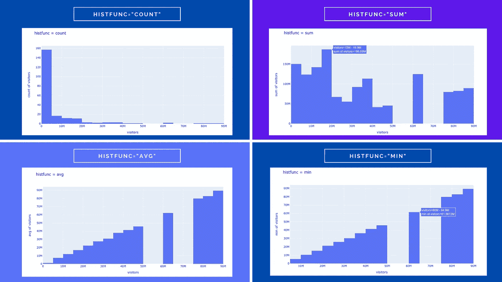
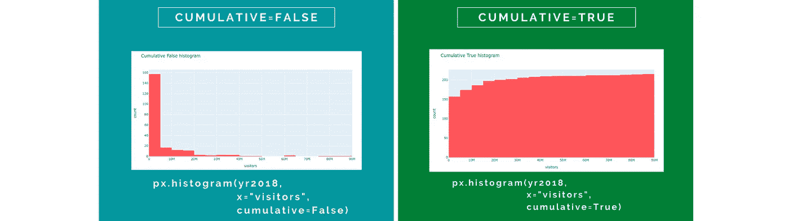
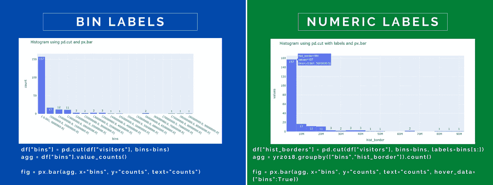
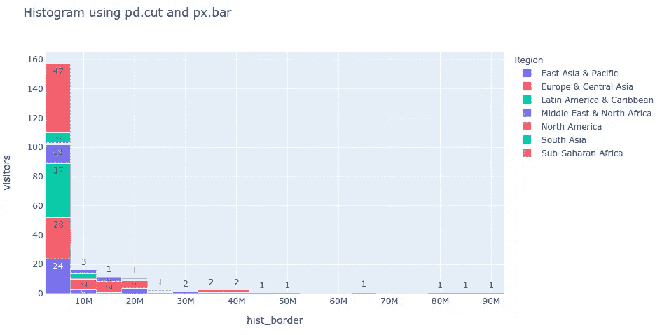

# 带 Plotly Express 的直方图:完整指南

> 原文：<https://towardsdatascience.com/histograms-with-plotly-express-complete-guide-d483656c5ad7?source=collection_archive---------1----------------------->

## 一个数据集，60 多个图表，以及所有解释的参数


大多数图形都是用 canva 创建的

直方图是一种特殊的条形图，显示变量的分布。 [Plotly。Express](https://plotly.com/python/plotly-express/) 允许使用一个函数`px.histogram(df, parameters)`从数据集创建几种类型的直方图。在本文中，我想探究所有的参数以及它们如何影响图表的外观和感觉。

普洛特利。Express 是 python [Plotly](https://plotly.com/) 库的高级 API，专门用于处理数据帧。它创建交互式图表，您可以放大和缩小，打开和关闭图形的一部分，当您将鼠标悬停在图上的任何元素上时，会出现一个带有信息的工具提示。

所有的图表都可以使用**本笔记本上的** [**GitHub**](https://github.com/vaclavdekanovsky/data-analysis-in-examples/blob/master/Vizualizations/Plotly/Histogram/Histograms.ipynb) 来创建。请随意下载、播放和更新它。

## 目录

*   [安装](#78e6)
*   [数据集](#78e6) —在示例中使用
*   [直方图的类型](#05d6)
*   [直方图使用 plotly 条形图](#c08f)
*   参数:c [olor](#0e45) ，b [armode](#6e00) ， [nbins](#0b51) ， [histfunc](#00d1) ，c[umulatual](#9a88)， [barnorm](#06d3) ， [histnorm](#9e5e) ， [category_orders](#d071) ， [range_x and range_y](#6791) ，[color _ discrete _ sequence](#9567)，

# 装置

普洛特利。Express 是在 plotly 库的 4.0.0 版本中引入的，您可以使用以下命令轻松安装它:

```
# pip 
pip install plotly# anaconda
conda install -c anaconda plotly
```

Plotly Express 还要求安装 pandas，否则当你尝试导入时会得到这个错误。

```
[In]: import plotly.express as px
[Out]: **ImportError**: Plotly express requires pandas to be installed.
```

如果您想在 Jupyter 笔记本中使用 plotly，还有其他要求。对于 Jupyter 实验室你需要`[jupyterlab-plotly](https://plotly.com/python/getting-started/#jupyterlab-support-python-35)`。在普通笔记本上，我必须安装`nbformat` ( `conda install -c anaconda nbformat`)

[](/visualization-with-plotly-express-comprehensive-guide-eb5ee4b50b57) [## 用 Plotly 可视化。快递:综合指南

### 一个数据集和 70 多个图表。交互性和动画通常只需一行代码。

towardsdatascience.com](/visualization-with-plotly-express-comprehensive-guide-eb5ee4b50b57) 

# 数据集

直方图可在您想要查看分布的任何时候使用:

*   一段时间内出现的错误
*   每个班次的成品
*   统计分布——身高、体重、年龄、价格、工资、速度、时间、温度、周期、差值范围

Plotly 的直方图很容易使用，不仅是常规直方图，而且也很容易用于创建一些类型的条形图。您可以通过间隙从条形图中识别直方图，因为直方图的条形之间没有间隙。

我将使用我最喜欢的数据集，了解世界各国的游客人数以及他们在假期的花费。数据被预处理成一个长格式——每个类别`Country Name`、`Region`、`Year`是一列，这些类别的每个组合占据一行，显示两个数据值`[number of visotors](https://data.worldbank.org/indicator/ST.INT.ARVL)`和`[receipts](https://data.worldbank.org/indicator/ST.INT.RCPT.CD)`当地人从这些游客那里获得的美元。关于游客的数据从 1995 年到 2018 年。


预处理数据集的样本-1995 年至 2018 年关于 2015 个国家的数据

普洛特利。如果每个类别和每个值都是数据集的一列，Express 可以创造奇迹。在这个例子中，我将使用:

*   `long_df`—95 年至 2018 年 215 个国家的完整数据集
*   `yr2018`—2018 年的数据
*   `spfrit` —关于西班牙、法国和意大利的数据

# 直方图的类型

最常见的直方图显示一个数字变量的分布，该分布被分成多个区间。在我们的案例中，2018 年的访客数量分布在 0 到 89 322 000 之间。

```
# import the libraries
import plotly.express as px
import pandas as pd# create the simples histogram
px.histogram(yr2018, x="visitors")
```

simples 直方图将 215 个国家分为 18 个区域，每个区域覆盖 500 万游客。第一层包括 157 个国家，游客数量在 0-490 万之间，第二层包括 17 个国家，游客数量在 500-990 万之间，依此类推。


Simples 直方图将国家划分为多个区域

关于如何创建条块，您有更多的选择，它们可以基于一个类别(例如，我们的数据框架中的`Region`)或一个日期值，该日期值被划分为包含几天、几个月或几年的条块。


将 x 变量指定为数值、分类或日期列会导致不同的箱。在这种情况下，年份可以是数值，生成的 bin 将是 int(1995)到 int(1999)或日期 1995 年 1 月到 1999 年 1 月。

您可能已经注意到，范围直方图和分类直方图显示的是落入分类框的国家的数量，而日期直方图显示的是访问者的数量。您可以使用`y` —参数指定将哪一列聚合到直方图中。因为我们的数据集每年包含 215 个国家，所以对行进行计数会产生一个平坦的直方图。


在 Plotly Express 直方图中指定 Y 会改变聚合

# 因素

除了`x`和`y`之外，plotly 的直方图还有许多其他参数，这些参数在[文档—直方图](https://plotly.github.io/plotly.py-docs/generated/plotly.express.histogram.html)中有所描述。让我们一个接一个地回顾它们，这样您就可以知道如何将直方图包含到您的下一个可视化中。

## 参数:颜色

像所有其他情节一样。Express chart，`color`参数需要一个包含某个类别的列，它将用单独的颜色对属于该类别的值进行着色。

```
fig = px.histogram(yr2018, x="visitors", nbins=10, color="Region", title="Visitors per region")
fig.show()
```


定义颜色以指定按颜色分割直方图。

## 参数:Barmode

因为直方图实际上是一个条形图，所以您可以设置三种类型的条形图:

*   `stacked` —值堆叠在另一个之上
*   `grouped` —以分组条形图的形式显示直方图
*   `overlayed` —在彼此顶部显示半透明条


将颜色和条形模式结合起来会产生不同的图表类型。没有按颜色划分组的 Barmode 结果总是在同一个图表中。

这些条必须按颜色分开，这样`barmode`才有效果。在上面的例子中，我们看到每年有 50 万游客参观阿拉比亚，但是土耳其和西班牙占据了更多的位置。

如果你对这些年来这些国家的旅游业如何发展感兴趣，你可以通过改变`x`和`y`参数来快速实现。

```
fig = px.histogram(sptuar, 
            x="years", 
            y="visitors", 
            color="Country Name", 
            barmode="group",
            title=f"Visitors in Aruba, Spain, Turkey - {barmode}")
fig.update_layout(yaxis_title="Number of Visitors")
fig.update_xaxes(type='category')
fig.show()
```


普洛特利。Express 是非常通用的，通过改变 x 和 y 参数可以得到不同的图。

除了更改`x`和`y`之外，我还将图表分配给了一个变量`fig`，这允许我们使用`fig.update_layout(yaxis_title="title axis")`更新`yaxis`，更重要的是，修改年份颜色，使其既不被视为`int`也不被视为`date`，而是被视为一个类别，这意味着每年都有一个单独的条形`fig.update_xaxes(type="category")`。

> Plotly 图表在后台存储为字典，可以通过打印`fig.to_dict()`来查看

## 参数:nbins

如果使用类别，nbins 参数将被忽略，并为每个类别绘制一个条形。但是如果你的`x`是数字或日期类型，就把你的数据分成`n`个区间。文件上说:

> **nbins**([*int*](https://docs.python.org/3/library/functions.html#int))—正整数。设置箱子的数量。

但实际上，箱的数量通常是不同的。我尝试用不同的`nbins`运行我的图表，结果如下:

*   nbins = 3–2 箱
*   nbins = 5–5 个箱
*   nbins = 10–9 个箱子
*   nbins = 20–18 箱


增加 nbins 参数会导致更多的箱数

甚至关于 [plotly 直方图](https://plotly.com/python/histograms/)的示例页面也有 nbins=20，导致只有 11 个柱。尽管增加数量通常会导致箱的数量增加。Plotly 还确定了箱的开始和结束位置。例如，使用宁滨的年份可以从 1990、1994 或 1995 年开始。

*   nbins = 3–3 个箱(1990–1999，2000–2009，2010–2019)
*   nbins = 5–5 个箱(95–99，00–04，05–09，10–14，15–19)
*   nbins = 10–5 个箱(95–99，00–04，05–09，10–14，15–19)
*   nbins = 20–13 个箱(94–95，96–97，98–99，00–01…)

> 你影响箱子的数量和范围的能力有限，但是很快就会进化，所以这很可能会在未来的版本中得到改进。

要获得所有的能量，自己计算，然后用 [plotly express 条形图](#c08f)绘制，如本文末尾所示。

## 参数:histfunc

到目前为止，我们已经看到直方图计数和求和的价值。Plotly 的直方图允许使用 5 个函数来聚合值— `count`、`sum`、`avg`、`min`、`max`。



Plotly 历史函数的各种参数。

当然，当我们使用分级箱时，avg 产生箱的平均值，min 产生最小值，max 产生最大值，所以`avg`、`min`和`max`总是形成某种上升的阶梯。在这种情况下，对分类值应用直方图更有意思，这在技术上创建了一个条形图。


将 histfunc 应用于分类箱显示，尽管我们在拉丁美洲、非洲、欧洲和东亚有类似数量的国家，但欧洲国家总体上是最多人访问的，而北美国家是平均水平。游客数量最多的非洲国家不超过 1200 万。

## 参数:累积

如果累积参数设置为`False`，直方图会显示频率(sum，avg …)，但如果是`True`，则每个后续柱会累积所有先前柱的值。



累积直方图累积所有先前条形图的值。

## 参数:barnorm

如果`barnorm`为`None`，该参数允许显示精确值，或者显示每个颜色类别的百分比。您可以通过将`barnorm`设置为`fraction`或`percent`来实现。


Barnorm 表示堆积直方图上的零、分数或百分比。

右边的最后一幅图像被`fig.update_layout(yaxis={"ticksuffix":"%"})`修改，添加了一个百分号。

如果在分组图表上应用 barnorm，比例保持不变，但绝对值变为分数或百分比:


组合直方图保留条形的比例，但轴标签会改变。

使用`fig.update_layout(yaxis={"tickfont":{"size":18}})`对`xaxis`进行格式化，使标签更大。

## 参数历史标准

一个条柱的`barnorm`百分比总和等于 100%,而所有相同颜色的条柱相加后`histnorm`达到 100%。它提供了 5 个选项:

*   `None` —显示骨料的绝对值
*   `percent` —占箱中总值的百分比(0–100%)
*   `probability` —容器中总量的分数(0–1)
*   `density` —总面积除以总面积(所有条形面积之和等于样本点总数)
*   `probability density`—`histfunc`对给定条柱的输出进行归一化，使其对应于随机事件落入该条柱的概率，该随机事件的分布由`histfunc`的输出描述(所有条柱面积之和等于 1)


histnorm 的前三个参数。

我已经从几个角度研究了`density`和`probability density`，但是可能会有一个 bug，因为每个 bin 的累积图和普通图的值是不同的。

## 参数类别 _ 订单

当你用`color`划分图表时，你可能会对定义这些彩色类别的顺序感兴趣。默认情况下，顺序基于输入数据帧中的外观，这可能很难控制。使用`category_order`让你对图上的类别进行排序。

您必须指定为哪一列定义顺序(作为字典)。这是您在`color`参数中使用的列。

```
fig = px.histogram(spfrit, 
      x="years",
      y="visitors",
      **color="Country Name",**
      barmode="group",
      title=f"Ordered Italy, Spain, France",
      category_orders={"**Country Name**":["Italy","Spain","France"]}
      )
fig.show()
```


Plotly 表示直方图参数，允许改变类别的顺序

## 参数 range_x 和 range_y

这两个参数不会改变图表的范围，但它们会根据设定的边界放大数据。您可以随时使用 Plotly 的交互式菜单取消缩放。

```
fig = px.histogram(long_df, 
                   x="years", 
                   y="receipts", 
                   range_x=["2009","2018"],
                   title="Yearly Histogram",
                  )
fig.show()
```


放大很多可以看到 plotly 认为年份是`floats`，因为会加上`2016.5`这样的标签。如果您想确保 Plotly 显示的年份始终为`"2016"`而不是小数`2016.5`或月份`Jan 2016`，请使用`fig.update_xaxes(type='category')`。这将悬停改变直方图到一个条形图和差距之间的酒吧将出现。


数字形式的条柱可能会出现意外的带小数的网格线，而分类直方图会变成带缺口的条形图。

## 参数颜色 _ 离散 _ 序列

color_discrete_sequence 参数允许您影响条形的颜色。simples 直方图的所有条形都具有相同的颜色，您可以使用以下命令进行更改:

```
px.histogram(df, x="column", 
    color_discrete_sequence=["blue"])
```

Plotly 期望一个列表作为输入，因此您必须将您的颜色包装到一个列表中`["#00ff00"]`。您可以使用任何颜色名称-蓝色、红色、浅灰色，如果您没有猜出正确的名称，plotly 的错误将提供可通过名称访问的颜色的完整列表:

```
**ValueError:** 
    Invalid value of type 'builtins.str' received for the 'color' property of histogram.marker
        Received value: 'lightgreene'

    The 'color' property is a color and may be specified as:
      - A hex string (e.g. '#ff0000')
      - An rgb/rgba string (e.g. 'rgb(255,0,0)')
      - An hsl/hsla string (e.g. 'hsl(0,100%,50%)')
      - An hsv/hsva string (e.g. 'hsv(0,100%,100%)')
      - A named CSS color:
 **aliceblue, antiquewhite, aqua, aquamarine, azure,
            beige, bisque, black, blanchedalmond, blue, ...**
```

也可以用 hash string 或者 rgb/rgba，hsl/hsla 和 hsv/hsva(谷歌这个术语如果他们不对钟的话)。最后一个`a`代表`alpha`，它控制条的不透明度。

如果您在未使用`color`参数的情况下为未分割直方图列出了多种颜色，则仅应用列表中的第一种颜色。当您使用`color`分割条形时，您在`color_discrete_sequence`中提供的色调将绘制每个类别的条形。您可以使用前面的参数 category _ orders 来更改顺序或类别。


如果您只能选择一个类别，列表中的第一种颜色将用于所有条形图。有多个类别，您可以指定更多的颜色。如果你设置的颜色没有你的类别多，那么第一种颜色将用于那些未指定的类别。

如果你不确定选择哪种颜色，但你想让这些颜色搭配在一起，试试 plotly 的一些[预建颜色集](https://plotly.com/python/builtin-colorscales/)。

```
fig = px.histogram(...                      color_discrete_sequence=px.colors.qualitative.Pastel2,
...)
```


使用定性分析。Pastel2 按颜色顺序构建。

## 参数颜色 _ 离散 _ 映射

您也可以使用字典来指定颜色。在这种情况下，您使用参数`color_discrete_map`。这个字典的关键字是在`color`中指定的列中的值。

```
px.histogram(df, x="column",
color="Country Names",
color_discrete_map={
    "Spain":"lightgreen", 
    "France":"rgba(0,0,0,100)", 
    "Italy":"#FFFF00"}
)
```


使用颜色 _ 离散 _ 映射设置颜色

还有一个选项是在数据框中使用包含颜色名称或其哈希代码的列。在你使用`color="column with colors name"`和`color_discrete_map="identity"`的情况下。这种方法的缺点是会丢失交互式图例，因为它不再包含类别的名称(例如国家名称)，而是包含颜色的名称。

```
# create a color column specifying color for each of the countriesspfrit["color"] = spfrit["Country Name"].map(
{"Spain":"red", 
"France":"black", 
"Italy":"orange"}
)# spfrit now contains: 
# country_name year visitors **color**
# Spain        1995 32971000 **red**
# France       1995 60033000 **black**
# ...""" Parameter color_discrete_map using identity in case color contains real color names/hex codes """fig = px.histogram(spfrit, 
 x="year",
 y="visitors",
 color="color",
 barmode="group",
 title=f"Histnorm {histnorm} histogram",
 category_orders={"Country Name":["Italy","Spain","France"]},
 color_discrete_map="identity"
)
fig.show()
```


如果使用 color_discrete_map="identity "，则缺少图例，但是可以使用带有颜色名称的现有列来指定条形的颜色

## 参数 facet_col 和 facet_row

有时，您更喜欢在列中并排显示类别，或者在行中上下显示类别。`facet_col`和`facet_row`参数用于此目的。


Facet_row 和 facet_col 可以与 color 参数结合使用，以不同的色调对条形进行着色。

通常，您可以将`facet_col`或`facet_row`与一个`color`参数结合起来，以区分每一行或每一列中条形的颜色。

```
px.histogram(df, 
  x="value column",
  color="column",
  facet_col="column")
```

如果您有太多的列，您可以通过参数`facet_col_wrap`在每第 x 列之后拆分它们。以下示例显示了由`facet_col_wrap=3`在 3 列后拆分的 9 个类别

```
px.histogram(df, x="value column",
  color="column",
  facet_col="column",
  facet_col_wrap=n)
```


使用`facet_col_wrap=3`将 9 个不同的类别分成 3 行

> 所有的图都是相连的，因此当您放大或平移其中一个图时，所有其他的图也会发生变化。

行没有 facet_row_wrap 参数，但是您可以通过`facet_row_spacing`调整行之间的间距。

```
px.histogram(df, x="value column",
  color="column",
  facet_row="column",
  facet_row_spacing=0.2)
```


Facet_row_spacing 在各行之间创建一个间隙。当您放大一行时，所有其他行也会放大。

## 参数 hover_name 和 hover_data

Hover_name 和 hover_data 影响工具提示的外观。`hover_name`高亮显示工具提示顶部的列，使用`hover_data`可以在工具提示中删除或添加列

```
hover_data={
# to remove
"Column Name 1":False, # to add
"Column Name 2":True
}
```

这些参数在 plotly 中总是工作得很好，但是在直方图的情况下有一些 bug，并且`hover_name`根本不工作，而`hover_data`只是有时工作。

## 参数定向

直方图可以水平或垂直定向。`Orientation`参数有两个值`v`和`h`，但是方向受`x`和`y`的影响较大。切换`x`和`y`的顺序，可以垂直旋转水平图表。


垂直或水平条受 x 和 y 参数影响，而不是受方向参数影响。

如果您需要颠倒轴的顺序，以便最小的数字框位于顶部而不是底部，请使用:

```
fig.update_yaxes(autorange="reversed")
```

这同样适用于同时指定`x`和`y`的情况。通过切换它们，你可以将水平图变成垂直图。


将 x =“years”改为 y =“years”会改变方向。

在上图中，你可以看到悬停显示所有类别的工具提示。因为我点击了 Plotly 菜单中的`Compare data on hover`图标(右数第二个)。

## 参数**边际**

我想向您展示的一个有趣的参数是，可以选择添加一个边缘子图来显示变量的详细分布。您可以从 4 种边际地块中进行选择:

*   `histogram` —与其下方的直方图基本相同
*   `rug` —显示每个数据值在
*   `violin` —做小提琴图，估计变量的概率密度
*   `box` —突出显示中间值、第一个和第三个四分位数的箱形图


4 种边际参数——直方图、地毯、小提琴和盒子。这些图出现在垂直直方图的上方，也是交互式的。

甚至可以为多个类别绘制边际图。在这种情况下，将计算一个单独的边际图。注意，在这种情况下，你不能使用`barmode="group"`。


多类别情况下四种类型的纵横军图

## 参数动画 _ 帧

我们今天要讨论的最后一个参数是 Plotly 的另一个交互特性，它可以让您制作图表动画。添加单个参数`animation_frame="years"`会将绘图变成动画，可通过`play`和`stop`按钮启动，或者您可以通过点击菜单导航至单独的幻灯片。

通常需要指定动画图表的范围，以避免网格尺寸的变化。

```
px.histogram(spfrit, 
    y="Country Name", 
    x="visitors",
    color="Country Name", 
    barmode="group", 
    # add the animation
    animation_frame="years",
    # anchor the ranges so that the chart doesn't change frame to frame  

    range_x=[0,spfrit["visitors"].max()*1.1]
)
```


动画帧允许您设置值的进度动画

它也可以用于分类列。

```
px.histogram(long_df, 
    x="years",
    y="visitors",
    color="Region",
    animation_frame="Region",
    color_discrete_sequence=px.colors.qualitative.Safe,
    range_y=[0,long_df.groupby(["Region","years"])["visitors"].sum().max()*1.1]
            )
```


使用分类列的动画可能不如动画有用，但是滑块可以帮助用户查看各种选项。

# 使用 plotly 条形图的直方图

如你所见，当我们讨论`nbins`参数时，Plotly 对宁滨数据很固执。如果你想保持你的自由，你总是可以自己收集数据并绘制一个规则的条形图。使用`pd.cut`对数据进行分类，`groupby`对分类中的值进行聚合，并将结果传递给`px.bar(df, parameter)`可以让您获得自己的直方图。

这样你有更多的选择。您可以在 x 轴`(5, 10]`上显示箱，或者当您使用`pd.cut(df, bins=bins, labels=bins[1:])`装箱时，您可以只显示边界编号`10M, 20M etc.`。您可以在条形中或条形上方添加标签，以显示每个条形包含的出现次数。使用`fig.update_layout(bargap=0)`可以调整杆之间的间隙



使用 pd.cut 计算直方图，并通过 px.bar 绘制



多个类别，当按媒体夹和类别分组时

或者，您可以通过 numpy 的`np.histogram`来绑定数据。

```
# bin with np.histogram
counts, bins = np.histogram(yr2018["visitors"], bins=bins)# turn into data frame
df = pd.DataFrame({"bins":bins[1:], "counts":counts})# chart using Plotly.Express
fig = px.bar(df, x="bins", y="counts", text="counts")
```

# 结论

Plotly 的直方图是描绘数据变量分布的一种快速方法。Plotly Express 直方图也有助于绘制多种条形图，将数据按类别或时间进行汇总。

然而，到目前为止，plotly 直方图缺少一些功能(其他 Plotly 图表也有)，尤其是添加标签的选项。箱不容易修改，并且`nbins`参数并不总是提供预期的结果。您可以随时自己进行计算，并使用`px.bar()`得出结果。

Plotly 正在定期改进，所以也许这些东西会很快更新，我们可能会选择添加一个估计分布曲线覆盖。

现在轮到你研究直方图了。下载一个数据集，例如，世界各地[城市](https://www.kaggle.com/sudalairajkumar/daily-temperature-of-major-cities?select=city_temperature.csv)的历史温度，并研究各个地区的温度分布。


```
If you liked this article, check other guidelines:
* [Visualize error log with Plotly](/visualize-error-log-with-pandas-and-plotly-d7796a629eaa)
* [How to split data into test and train set](/complete-guide-to-pythons-cross-validation-with-examples-a9676b5cac12)
* [Various pandas persistance methods](/stop-persisting-pandas-data-frames-in-csvs-f369a6440af5)
* [Unzip all archives in a folder](/unzip-update-and-zip-again-xmls-in-a-folder-7d57f9710ddb)Many graphics on this page were created using [canva.com](https://partner.canva.com/vdek) (affiliate link, when you click on it and purchase a product, you won't pay more, but I can receive a small reward; you can always write canva.com to your browser to avoid this). Canva offer some free templates and graphics too.
```

所有的图表都可以通过这个笔记本中的 python 脚本运行 Github 上的[直方图与 Plotly](https://github.com/vaclavdekanovsky/data-analysis-in-examples/blob/master/Vizualizations/Plotly/Histogram/Histograms.ipynb) 。