# 使用 Python 的 Matplotlib 绘制直方图

> 原文：<https://towardsdatascience.com/histograms-with-pythons-matplotlib-b8b768da9305?source=collection_archive---------1----------------------->

## 如何使用这个简单的可视化来有效地显示分布

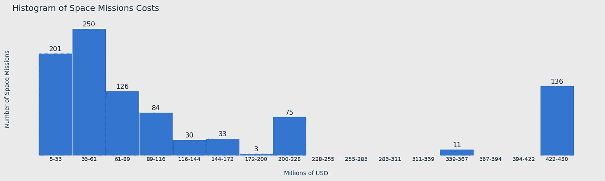

直方图—作者提供的图像

卡尔·皮尔逊创造了术语直方图，但是很难说是谁发明了可视化，很可能在皮尔森命名之前就已经使用了。

威廉·普莱费尔被认为是条形图的发明者，也是第一个发表这种图表的人，所以不难想象他会画几幅这样的图表来形象化 18 世纪末或 19 世纪初的频率。

毕竟，直方图基本上就是这样；它们是条形图，通常用相连的条来可视化，其中的值被分成相等的范围，称为条块或类。条形的高度代表该类别中记录的数量，也称为频率。

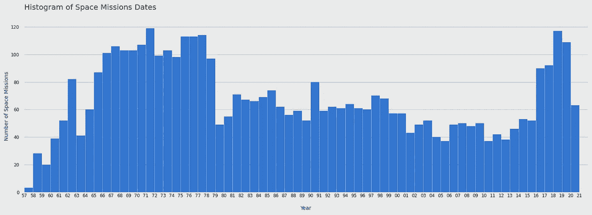

直方图—作者提供的图像

在本文中，我将介绍这种可视化的基础知识，并且在了解更多直方图的同时，我们还将探索 Matplotlib 的许多定制选项。

## 太空任务直方图

我将在 Jupyter 中运行我的代码，使用 Pandas、Numpy 和 Matplotlib 来开发视觉效果。

```
import pandas as pd
import numpy as np
import matplotlib.pyplot as plt
from matplotlib.ticker import AutoMinorLocator
from matplotlib import gridspec
```

在这个例子中，我们将要探索的[数据集](https://www.kaggle.com/agirlcoding/all-space-missions-from-1957)包含了自 1957 年以来所有太空任务的数据，并且是由 [Agirlcoding](https://www.kaggle.com/agirlcoding) 从[nextspaceflight.com](https://nextspaceflight.com/launches/past/?page=1)搜集而来的。

```
df = pd.read_csv('medium/data/Space_Corrected.csv')
df
```

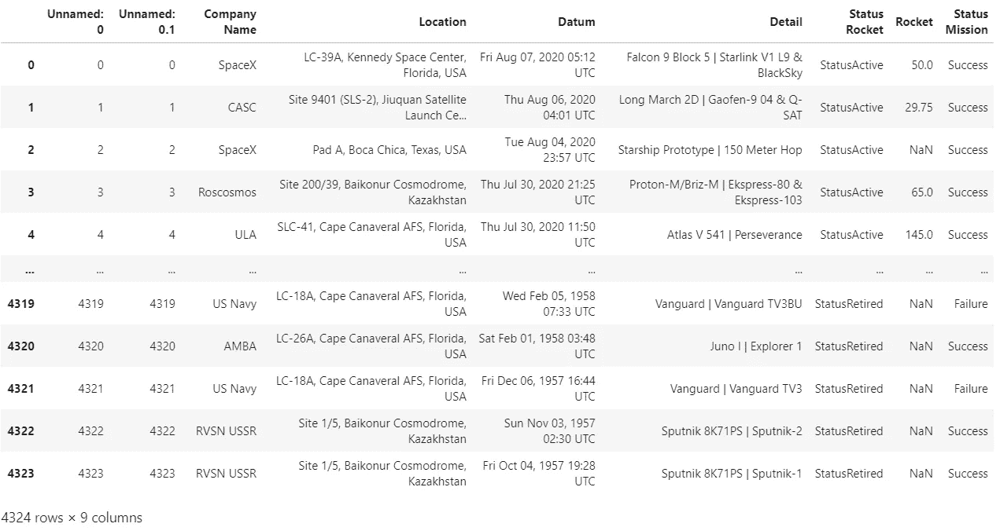

清理前的数据帧

加载数据集后，我们可以进行一些清理和小的调整。

```
# date column to datetime
df['Datum'] = pd.to_datetime(df['Datum'], utc=True)# costs column to numeric
df['Rocket'] = pd.to_numeric(df[' Rocket'], errors='coerce')# drop columns
# ' Rocket' had an extra space and was renamed
df.drop([' Rocket', 'Unnamed: 0', 'Unnamed: 0.1'], axis=1, inplace=True)
```

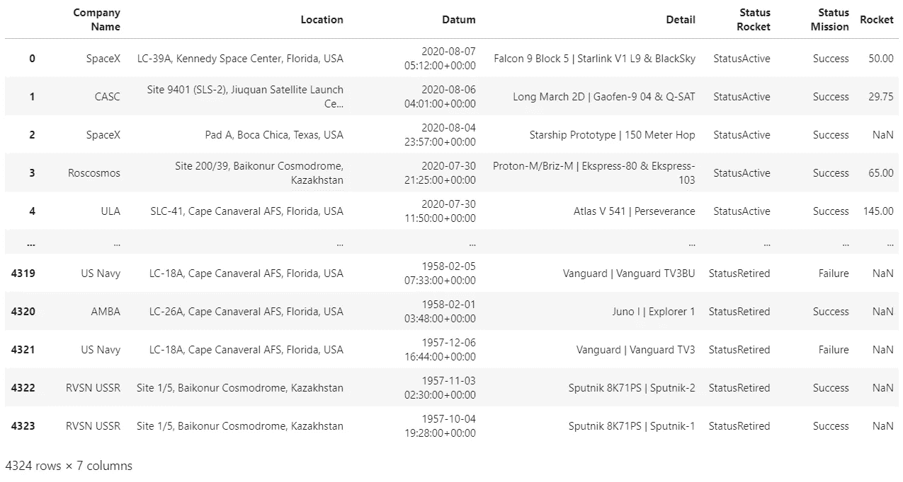

清理后的数据帧

现在一切都设置好了，我们可以毫不费力地用 Matplotlib 绘制直方图。

主要是我想把“火箭”一栏的数据可视化，这是以百万美元为单位的任务成本。我的想法是观察该列中值的分布。

```
plt.hist(df.Rocket)
plt.show()
```

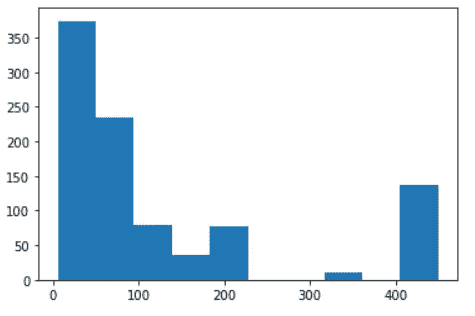

默认直方图

没关系，默认的图表给了我们一个简单的 x 轴和 y 轴，棒线被自动划分为条块。

在继续之前，让我们将直方图的仓分配给一个变量，以便更好地观察它。

```
n, bins, patches = plt.hist(df.Rocket)bins
```

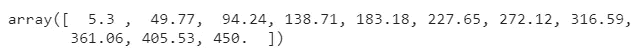

包含容器范围的数组

这意味着我们的值被分成十个箱，就像这样:

*   5.3 ≤ n < 49.77
*   49.77 ≤ n < 94.24
*   …
*   405.53 ≤ **n ≤ 450**

请注意，每个容器的顶部值被排除在外(

很好，现在我们有了一个包含我们的箱子边缘的列表，让我们试着用它作为 x 轴的刻度。

让我们也添加一个数字，并增加我们的图表的大小。

```
fig = plt.figure(figsize=(16,6))n, bins, patches = plt.hist(df.Rocket)plt.xticks(bins)
plt.show()
```

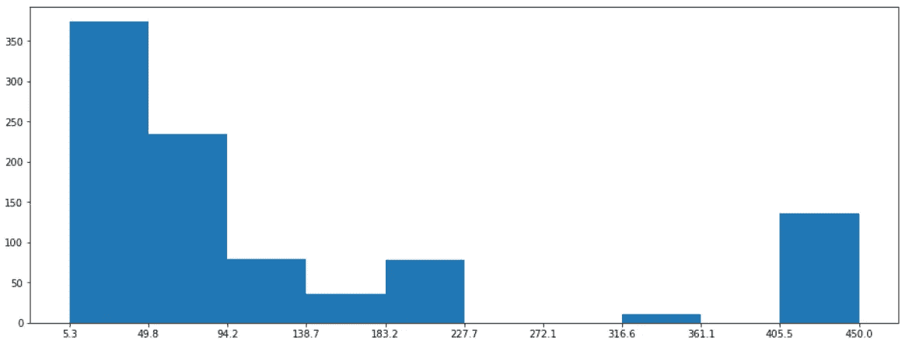

根据条形调整刻度的直方图

那更好。

因为我们没有给 Matplotlib 任何关于 bin 的信息，所以它自动定义了它的数量和范围。

我们可以在定义绘图时通过传递一个边列表来设置箱；这允许我们创建不均匀间隔的容器，这通常是不推荐的——但是也有这种情况。

我们可以设置它们的另一种方式是使用一个整数，其中包含我们想要的箱数。

```
fig = plt.figure(figsize=(16,6))n, bins, patches = plt.hist(df.Rocket, bins=16)plt.xticks(bins)
plt.show()
```

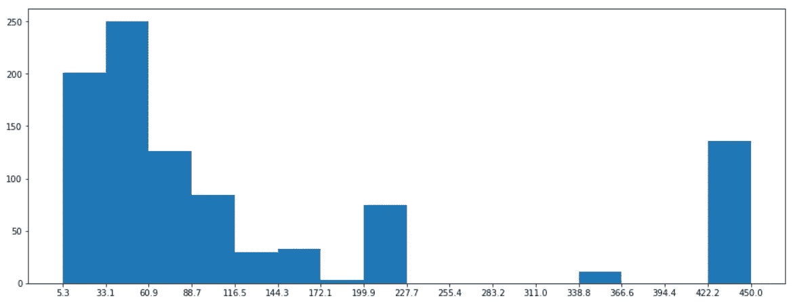

有 16 个柱的直方图

直方图的主要目的是可视化我们数据的分布。我们不希望我们的图表有太多的容器，因为那会隐藏我们数据中的浓度；同时，我们不希望类的数量很少，因为我们可能会误解分布。

在我们的直方图中选择类的数量有时非常直观，但其他时候相当困难。幸运的是，我们有大量的算法，Matplotlib 允许我们选择使用哪一个。

```
fig = plt.figure(figsize=(16,6))# 'auto', 'sturges', 'fd', 'doane', 'scott', 'rice' or 'sqrt'
n, bins, patches = plt.hist(df.Rocket, bins='rice')plt.xticks(bins)
plt.show()
```

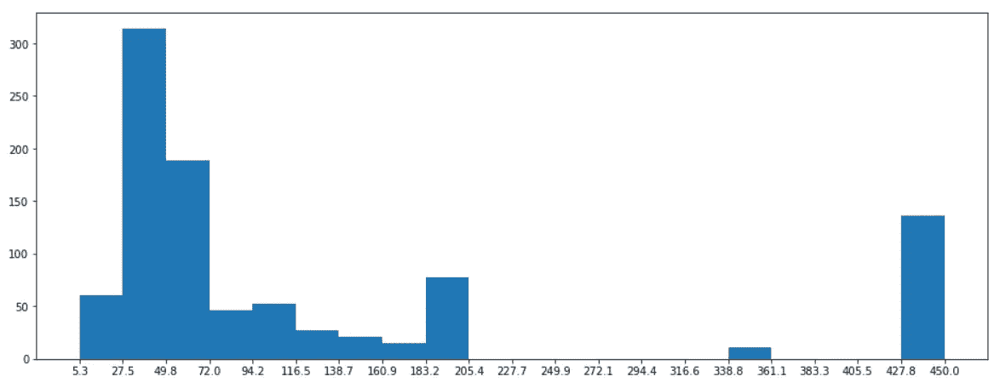

由“rice”算法计算的条柱直方图

很简单，我们已经知道直方图的基本原理。现在我们可以尝试自定义它。

我们可以在 x 轴上使用一些网格线来更好地显示箱子开始和结束的位置。一个标题也很好。

```
fig = plt.figure(figsize=(16,6))n, bins, patches = plt.hist(df.Rocket)plt.xticks(bins)
plt.grid(color='white', lw = 0.5, axis='x')plt.title('Histogram of Space Missions Costs', loc = 'left', fontsize = 18)
plt.show()
```


带有网格线和标题的直方图

如果分笔成交点位于条形的中心并同时显示范围的下限和上限，效果会更好。

我们可以通过遍历除最后一个之外的所有容器来定义标签，同时将当前值与下一个值相结合。

大概是这样的:

```
# x ticks labels
[ "{:.2f} - {:.2f}".format(value, bins[idx+1]) for idx, value in enumerate(bins[:-1])]
```

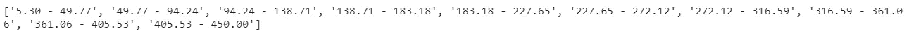

类别的标签列表

刻度位置应该在两个值的中间，如下所示:

```
# x ticks positions
[(bins[idx+1] + value)/2 for idx, value in enumerate(bins[:-1])]
```

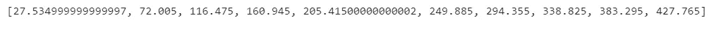

为类绘制标签的位置列表

酷，当我们把它添加到我们的绘图中时，我们需要重新定义网格。如果我们用刻度画网格线，我们会在条形的中间画一条线。

为了解决这个问题，我们将使用我们在开始时导入的类`AutoMinorLocator`。该类将帮助我们设置次要刻度，我们可以用它来绘制网格。

```
fig = plt.figure(figsize=(16,6))
n, bins, patches = plt.hist(df.Rocket)**# define minor ticks and draw a grid with them
minor_locator = AutoMinorLocator(2)
plt.gca().xaxis.set_minor_locator(minor_locator)
plt.grid(which='minor', color='white', lw = 0.5)****# x ticks
xticks = [(bins[idx+1] + value)/2 for idx, value in enumerate(bins[:-1])]****xticks_labels = [ "{:.2f}\nto\n{:.2f}".format(value, bins[idx+1]) for idx, value in enumerate(bins[:-1])]****plt.xticks(xticks, labels = xticks_labels)**plt.title('Histogram of Space Missions Costs (Millions of USD)', loc = 'left', fontsize = 18)
```


一个直方图，用一个刻度描述每个条形

它开始看起来很棒；让我们删除图表的脊线和刻度线，使其看起来更清晰。

```
fig, ax = plt.subplots(1, figsize=(16,6))n, bins, patches = plt.hist(df.Rocket)# define minor ticks and draw a grid with them
minor_locator = AutoMinorLocator(2)
plt.gca().xaxis.set_minor_locator(minor_locator)
plt.grid(which='minor', color='white', lw = 0.5)# x ticks
xticks = [(bins[idx+1] + value)/2 for idx, value in enumerate(bins[:-1])]
xticks_labels = [ "{:.2f}\nto\n{:.2f}".format(value, bins[idx+1]) for idx, value in enumerate(bins[:-1])]
plt.xticks(xticks, labels = xticks_labels)**# remove major and minor ticks from the x axis, but keep the labels
ax.tick_params(axis='x', which='both',length=0)****# Hide the right and top spines
ax.spines['bottom'].set_visible(False)
ax.spines['left'].set_visible(False)
ax.spines['right'].set_visible(False)
ax.spines['top'].set_visible(False)**plt.title('Histogram of Space Missions Costs (Millions of USD)', loc = 'left', fontsize = 18)
```

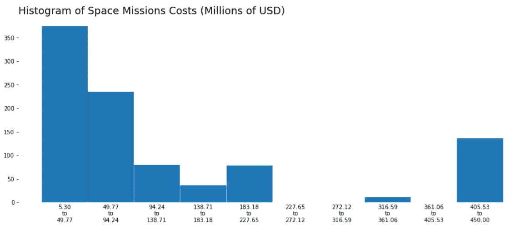

先前直方图的更清晰版本

对于 y 轴，我们可以将值打印在条形的顶部，并删除 y 刻度。

`n`我们从绘制直方图中得到的第一个变量包含一个列表，其中包含每个 bin 的计数。

我们可以从前面构建的列表中获得`xticks`的 x 位置，从`n`中获得标签和 y 值。

```
fig, ax = plt.subplots(1, figsize=(16,6))
n, bins, patches = plt.hist(df.Rocket)# define minor ticks and draw a grid with them
minor_locator = AutoMinorLocator(2)
plt.gca().xaxis.set_minor_locator(minor_locator)
plt.grid(which='minor', color='white', lw = 0.5)# x ticks
xticks = [(bins[idx+1] + value)/2 for idx, value in enumerate(bins[:-1])]
xticks_labels = [ "{:.2f}\nto\n{:.2f}".format(value, bins[idx+1]) for idx, value in enumerate(bins[:-1])]
plt.xticks(xticks, labels = xticks_labels)
ax.tick_params(axis='x', which='both',length=0)**# remove y ticks
plt.yticks([])**# Hide the right and top spines
ax.spines['bottom'].set_visible(False)
ax.spines['left'].set_visible(False)
ax.spines['right'].set_visible(False)
ax.spines['top'].set_visible(False)**# plot values on top of bars
for idx, value in enumerate(n):
    if value > 0:
        plt.text(xticks[idx], value+5, int(value), ha='center')**plt.title('Histogram of Space Missions Costs (Millions of USD)', loc = 'left', fontsize = 18)
plt.show()
```

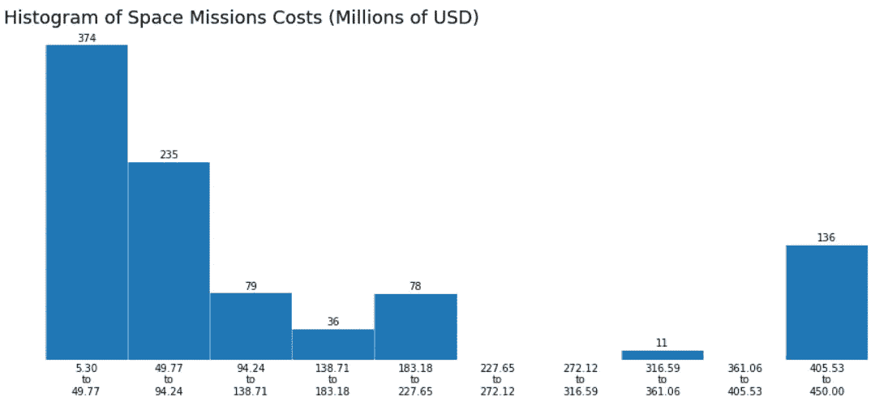

功能元素就位后的最终直方图

厉害！

要素已经到位；剩下要做的就是更改颜色、字体大小，在 x 和 y 轴上添加一些标签，并根据需要定制图表。

```
**facecolor = '#EAEAEA'
color_bars = '#3475D0'
txt_color1 = '#252525'
txt_color2 = '#004C74'**fig, ax = plt.subplots(1, figsize=(20,6), **facecolor=facecolor**)
**ax.set_facecolor(facecolor)**n, bins, patches = plt.hist(df.Rocket, **color=color_bars**, **bins='doane'**)#grid
minor_locator = AutoMinorLocator(2)
plt.gca().xaxis.set_minor_locator(minor_locator)
plt.grid(which='minor', **color=facecolor**, lw = 0.5)xticks = [(bins[idx+1] + value)/2 for idx, value in enumerate(bins[:-1])]
xticks_labels = [ "{:.0f}-{:.0f}".format(value, bins[idx+1]) for idx, value in enumerate(bins[:-1])]
plt.xticks(xticks, labels=xticks_labels, **c=txt_color1, fontsize=13**)
# remove major and minor ticks from the x axis, but keep the labels
ax.tick_params(axis='x', which='both',length=0)
# remove y ticks
plt.yticks([])# Hide the right and top spines
ax.spines['bottom'].set_visible(False)
ax.spines['left'].set_visible(False)
ax.spines['right'].set_visible(False)
ax.spines['top'].set_visible(False)for idx, value in enumerate(n):
    if value > 0:
        plt.text(xticks[idx], value+5, int(value), **ha='center'**, **fontsize=16, c=txt_color1**)plt.title('Histogram of Space Missions Costs\n', loc = 'left', fontsize = 20, **c=txt_color1**)
**plt.xlabel('\nMillions of USD', c=txt_color2, fontsize=14)
plt.ylabel('Number of Space Missions', c=txt_color2, fontsize=14)**
plt.tight_layout()
plt.savefig('costs.png', facecolor=facecolor)
```


太好了！我们得到了一个数值场，并用漂亮的图表描述了它的分布。现在让我们看看如何处理直方图中的日期。

为了弄清楚这个事件的分类，我们可以从查看数据中最早和最晚的日期开始。

我们可以使用 Matplotlib 支持的许多不同算法轻松地为数值字段选择箱，但这些技术在处理日期时可能不会产生最佳结果。

不要误解我的意思，你会发现，描述变量分布的最佳仓位大小是 378 天，用一整年更容易理解。

好了，让我们将日期时间对象转换成 Matplotlib 可以处理的数字格式，然后我们将调整我们的刻度，看看它看起来怎么样。

```
import matplotlib.dates as mdates# convert the date format to matplotlib date format 
plt_date = mdates.date2num(df['Datum'])
bins = mdates.datestr2num(["{}/01/01".format(i) for i in np.arange(1957, 2022)])# plot it
fig, ax = plt.subplots(1, figsize=(22,6))
n, bins, patches = plt.hist(plt_date, bins=bins)# x ticks and limit
ax.xaxis.set_major_locator(mdates.YearLocator())
ax.xaxis.set_major_formatter(mdates.DateFormatter('%y'))
plt.xlim(mdates.datestr2num(['1957/01/01','2021/12/31']))plt.show()
```

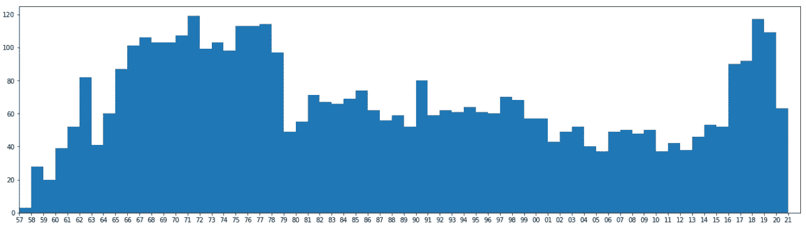

以年份为条块的直方图

那很有趣。我们可以看到太空竞赛从 1957 年到 1970 年代末逐渐成形，最近五年太空计划有所增加。

现在，我们可以根据新的直方图调整之前的设计。

```
facecolor = '#EAEAEA'
color_bars = '#3475D0'
txt_color1 = '#252525'
txt_color2 = '#004C74'# convert the date format to matplotlib date format 
plt_date = mdates.date2num(df['Datum'])
bins = mdates.datestr2num(["{}/01/01".format(i) for i in np.arange(1957, 2022)])# plot it
fig, ax = plt.subplots(1, figsize=(22,8), facecolor=facecolor)
ax.set_facecolor(facecolor)n, bins, patches = plt.hist(plt_date, bins=bins, color=color_bars)ax.xaxis.set_major_locator(mdates.YearLocator())
ax.xaxis.set_major_formatter(mdates.DateFormatter('%y'))
plt.xlim(mdates.datestr2num(['1957/01/01','2021/12/31']))#grid
plt.grid(axis='y', color=color_bars, lw = 0.5, alpha=0.7)
plt.grid(axis='x', color=facecolor, lw = 0.5)#remove major and minor ticks from the x axis, but keep the labels
ax.tick_params(axis='both', which='both',length=0)# Hide the right and top spines
ax.spines['bottom'].set_visible(False)
ax.spines['left'].set_visible(False)
ax.spines['right'].set_visible(False)
ax.spines['top'].set_visible(False)
ax.spines['left'].set_position(('outward', 10))plt.xticks(c=txt_color1, fontsize=12)
plt.yticks(c=txt_color1, fontsize=12)plt.title('Histogram of Space Missions Dates\n', loc = 'left', fontsize = 20, c=txt_color1)
plt.xlabel('\nYear', c=txt_color2, fontsize=14)
plt.ylabel('Number of Space Missions', c=txt_color2, fontsize=14)
plt.tight_layout()
plt.savefig('hist.png', facecolor=facecolor)
```


就是这样！我们构建了两个直方图，了解了定义箱和类的不同方法，更改了许多可视元素以使我们的图表看起来像我们想要的那样，探索了日期格式、主要和次要刻度、网格线和文本。

感谢阅读我的文章。我希望你喜欢它。

你可以在这里找到更多关于 Python 和 Matplotlib [的教程。](https://linktr.ee/thiagobc23)

**资源:**
[数据](https://www.kaggle.com/agirlcoding/all-space-missions-from-1957)；
[代码(GitHub)](https://github.com/Thiagobc23/Matplotlib-Histogram-Example)；
[Matplotlib。hist](https://matplotlib.org/3.1.1/api/_as_gen/matplotlib.pyplot.hist.html)；
[Matplotlib 日期](https://matplotlib.org/3.1.1/api/dates_api.html)；
Matplotlib Tick 格式化程序 s；
[Matplotlib 日期刻度标签—示例](https://matplotlib.org/3.1.1/gallery/text_labels_and_annotations/date.html)；
[历史直方图](http://www.vldb.org/conf/2003/papers/S02P01.pdf)；