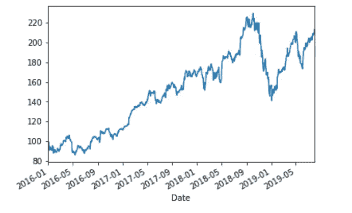
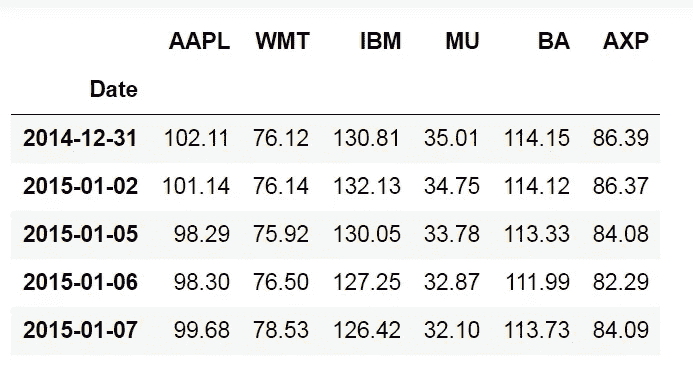
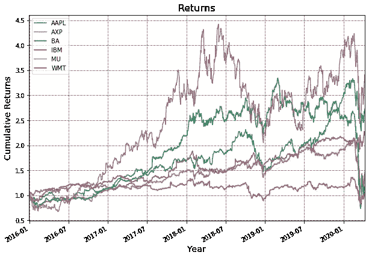
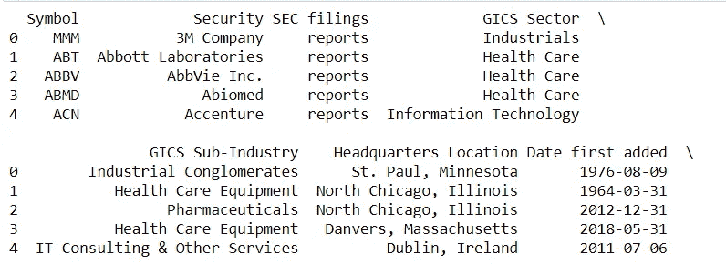
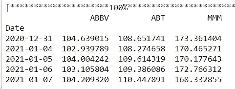

# Python 中的历史股票价格数据

> 原文：<https://towardsdatascience.com/historical-stock-price-data-in-python-a0b6dc826836?source=collection_archive---------3----------------------->

## 使用雅虎财经获得每日和分钟级别的历史股票数据。拿到 S&P500 的股票行情列表。

由[奥斯汀·迪斯特尔](https://unsplash.com/@austindistel?utm_source=medium&utm_medium=referral)在 [Unsplash](https://unsplash.com?utm_source=medium&utm_medium=referral) 上拍摄的照片

股票是非常不稳定的工具，因此在做出任何交易决定之前，我们彻底分析价格行为是非常重要的。这就是为什么获取和分析价格是至关重要的。python 可以方便地做到这一点。

股票数据可以从 yahoo finance、quandl 和 alpha vantage 等不同的软件包下载。在本文中，我们将研究如何从 yahoo finance 获取每日和分钟级别的数据。这是获取数据的简要版本，如果你正在寻找其他方法和不同的数据类型，那么你可以参考下面。

 [## Python 中的股票市场数据和分析

### 在这篇文章中，你将学会如何获得股票市场的数据，如价格、成交量和基本面数据…

blog.quantinsti.com](https://blog.quantinsti.com/stock-market-data-analysis-python/) 

# 雅虎财经

我们将使用 yfinance 包获取数据。您可以使用安装此软件包！pip install yfinance(如果尚未安装)。以下代码显示了如何获取 AAPL 从 2016 年到 2019 年的数据，并绘制数据的调整后收盘价。

AAPL 每日价格

# 多只股票的数据

在下面的代码中，我们将获取多个股票的数据，并将其存储在 dataframe data 中。然后我们将使用 matplotlib 软件包计算每日回报并绘制所有股票价格的累积回报。

# 分钟级数据

通过 yfinance，还可以取分钟频率的数据。你可以通过调整下面第 8 行的间隔参数来下载其他频率。区间支持以下值:`1m`、`5m`、`15m`、`30m`、`60m.`

您可以分析这些数据，创建交易策略，并使用 pyfolio 软件包分析策略的性能。它计算夏普比率，索蒂诺比率，最大下降和许多其他指标。

我希望你发现这是有用的和快乐的交易和分析。

# S&P500 证券交易所列表

下一个合乎逻辑的要求是，如何获得构成你最喜欢的指数或在特定交易所上市的股票。为此，您可以从维基百科页面获取报价器，并使用这些报价器从 yfinance 获取数据。

股票代码列表和其他信息。

S&P500 股票的收盘价。

## 来源和参考

1.  y 金融