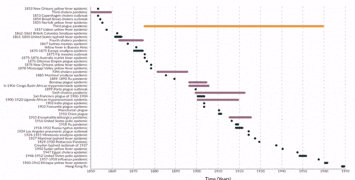
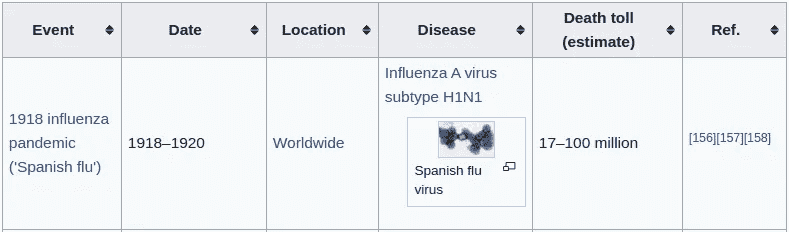
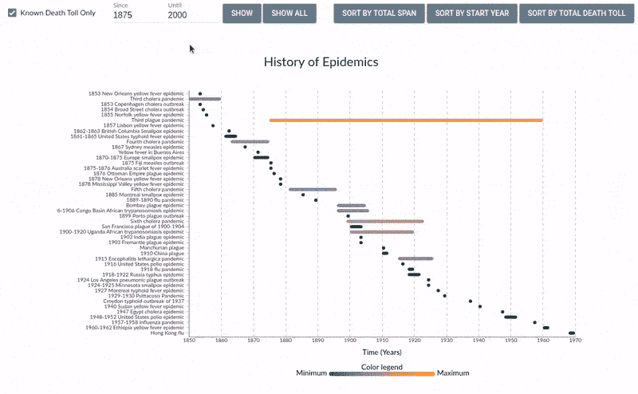

# 单个图表中的流行病历史

> 原文：<https://towardsdatascience.com/history-of-epidemics-in-a-single-chart-4aea1804c54e?source=collection_archive---------28----------------------->

## 流行病和大流行仍然是一个热门话题，所以让我们使用交互式水平条形图和 D3.js 来可视化它们的历史吧！

新冠肺炎是本月数据可视化的热门话题，每个人都想使用这个数据集。然而，在这篇文章中，我们将后退一步，看看更大的图景——世界流行病和大流行的整个历史。为此，我们将使用一个名为*水平条形图*的交互式图表。

图表演示

完整的图表可以在 https://martinheinz.github.io/charts/horizontal-bar-chart/的[找到。它包含了发生在公元前 1200 年至 2020 年间的近 250 种流行病的列表。每个条形代表一种流行病。横轴显示时间，以年为单位，纵轴显示疫情。](https://martinheinz.github.io/charts/horizontal-bar-chart/)

你可以将鼠标悬停在每个条形上，查看名称、时间跨度和死亡人数。要查看关于疫情的进一步描述，请将鼠标悬停在左侧的标签上。您可以使用顶部的字段深入查看特定的时间段。你也可以按总流行时间跨度、起始年份或死亡人数对图表上的条形进行排序。

# 数据集

根据标题和主题，本文的数据集是历史或世界流行病列表。我能找到的附有最多数据的最完整的列表来自*维基百科*文章[这里](https://en.wikipedia.org/wiki/List_of_epidemics)。

这个数据集实际上只是一个包含所有瘟疫、流行病甚至小规模爆发的大表格。作为一个快速示例，这里有一行:

维基百科中的示例行

为了能够在可视化中使用这些数据，我们需要一种对计算机更友好的格式，即 *CSV* 。我使用简单的 *Python* 脚本生成了这个 *CSV* ，你可以在这里找到[。这个脚本所做的就是使用 *BeautifulSoup* 从*维基百科*中抓取表格，从中检索所有值，并将其写入 *CSV* 文件。](https://github.com/MartinHeinz/charts/blob/master/preprocessing/prepare.py)

这里还有一个解析数据的示例行:

至于任何替代的数据来源——我真的找不到任何这类详尽的列表，每个条目都有足够的信息。我在网上能找到的大多只是*“十大流行病排行榜”*或者只是大量的新冠肺炎数据。如果你知道比这个更好的数据集，请告诉我！

# 水平条形图

水平条形图实际上只是一个旋转了 90 度的普通条形图，即垂直轴上有数据类别，水平轴上有数据值的图表。尽管它比普通的条形图有很多优点。

一个非常简单的优点是，通过将类别标签放在纵轴上，您可以获得更多的空间来显示它们。另一个是显示时间的能力——它自然地显示在水平轴上，这在普通的条形图上是做不到的。

接下来的几个优势源于我们在这个特定的可视化中使用图表的方式。正如您已经从上面的演示中看到的，单个条形并不仅仅显示一个值。他们显示了长度(以年为单位)以及实际的时间框架。与基本条形图不同，单个条形图并不都连接到水平轴，而是使用每个条形图的起点(也是终点)来显示额外信息。

除此之外，我们还使用工具提示来传达更多的数据，并使用调色板来以易于理解的方式显示数据。同样重要的是要提到调色板的选择是非常重要的，因为如果图表不直观的话，它会使图表很难阅读。一般来说，使用高对比度、发散的*冷-暖*调色板是最安全的，就像在[这篇文章](http://www.kennethmoreland.com/color-maps/)中描述的那样。

# 密码

这种可视化所需的代码相当长，而且大部分都不那么有趣，所以我不会查看每一行代码，我将只展示和解释最重要的部分。如果你想深入了解代码的细节，那就去我的知识库中的[横条图. js](https://github.com/MartinHeinz/charts/blob/master/horizontal-bar-chart/horizontal-bar-chart.js) 或者查看我之前的[关于蜂群图](/better-data-visualization-using-beeswarm-chart-bb46a229c56b)的文章，在那里我展示了关于代码和 *D3.js* 的更多细节。

# 过滤

此图表上显示的数据集非常大，几乎有 250 条记录，一次显示所有记录可能会很难阅读。因此，过滤选项对于用户体验至关重要。GUI 允许用户根据时间范围(即流行病的开始和结束年份)进行过滤，并可以选择过滤出死亡人数未知的流行病。

这两种过滤器都需要对数据集和轴进行一些操作。遍历行列表并删除/添加符合过滤标准的行非常容易。但是，当我们已经准备好更新的数据时，我们如何更新图表呢？

第一步是更新 X 轴和 Y 轴的比例。这些刻度中的每一个都有映射到一个范围的域。在我们的例子中，对于 X 轴，我们将年份映射到图表的宽度(范围):

如上面的代码片段所示，我们从数据集中的所有行中提取最小开始年份和最大结束年份，并将其映射到浏览器窗口中的图表大小。使用此图表上的默认设置，最终会将年份[1875–2020]投影到像素[250，980]上。

类似的情况也适用于垂直(Y)轴，我们需要将所有流行病的标题映射到各个蜱:

这里，我们使用波段刻度代替线性刻度，它更适合分类或顺序数据，如标题。这里的域由所有标题的列表组成——同样——投影到图表的大小(高度)上。正如你在上面所看到的，我们也添加了填充以避免标题重叠。我们图表的一部分将以这样的映射结束:

随着比例尺和坐标轴的更新，我们现在需要关注图表中最重要的部分——条形图。使用 *D3.js* ，该过程有两个部分，包括所谓的*进入*和*退出*选择。首先，我们使用`exit`选项从图表中删除现有数据:

如注释中所述，上面的代码从查询所有带有类`.bars`的 HTML 元素开始。接下来，它将空数组作为数据集绑定到所选的 HTML 元素。在第三行，它应用了`exit`选择——简单地说——从选择中删除所有以前在那里并且不应该再在那里的数据(我们只是绑定了一个空数组给它，所以它只是删除了所有的数据)。最后，最后一行删除数据。

删除数据后，我们还需要放回一些东西来显示。这就是`enter`选择的由来:

我们再次选择和以前一样的 HTML 元素。然而，这一次，我们将过滤后的数据集绑定到选择，而不是空数组，并执行`enter`选择，这是与`exit`相反的操作。在最后一行，我们使用了`append`函数...为 SVG 的每个数据条目追加 1 个`rect`元素，创建我们所有的小条。在这一点上，我们有了所有的条，有了所有的数据，但是它们没有任何属性，比如宽度、位置、颜色等等。但是，我们将在下一节中解决这个问题！

*注:对* `*enter*` *、* `*exit*` *和* `*append*` *的解释非常简单，我建议查看 Jonathan Soma* *的这篇文章，了解更多上下文。*

# 动画片

仅仅显示更新的数据并不有趣。因此，为了让观众看起来更加愉快，我们将为这些数据更新添加一些过渡。

与我们更新数据时一样，我们将从 X 轴开始。这是我们如何创建它的动画/过渡:

如果你不习惯于 *D3.js* 代码，上面的片段可能对你来说不太清楚，所以让我们从说明过渡实际上是什么开始——过渡在 *D3.js* 中是一种动画形式，其中动画的起点是 DOM 的当前状态，终点是你指定的样式、属性和特性的集合。

现在，让我们一行一行地检查代码。首先，我们选择带有`.x`和`.axis` CSS 类的元素，在这种情况下是横轴——这是我们动画的*起点*。接下来，我们开始转换，并将其持续时间设置为 1 秒。之后，我们使用`.call`函数，该函数将过渡的*结束点*作为参数，在本例中，该点是从上一节定义的`xScale`创建的底轴，加上 15 个垂直刻度。剩下的就是 D3.js *魔*了。

现在，在 Y 轴上。理解了前面的代码之后，这一段就简单了，因为它几乎是一样的东西:

我们只改变了 CSS 类(`.y`，并将`axisBottom`换成了`axisLeft`，就这样，我们完成了 Y 轴的动画和渲染:

垂直轴更新

与前一部分一样，我们将结束所有的小酒吧。为了将它们全部动画化，我们将采用与之前的过渡相同的方法，除了在这种情况下，我们将不使用`.call`而是直接使用每个`attr`函数:

这看起来很复杂，但实际上并不复杂。我们需要意识到的是，这不是一个单独的动画，而是每个条形对应一个动画。对于它们中的每一个，我们希望结束过渡点的*是一个条，其`x`坐标等于其`d.start`，其`y`坐标等于 Y 轴上匹配标题的 Y 坐标，其`width`等于其`d.end`和`d.start`之差。至于最后一个属性——我们根据它的长度(`d.start - d.end`)设置它的颜色，这个长度映射到预定义的色标。*

# 整理

在这一点上，我们可以让图表保持原样，这样就很好了，但是我们可以通过添加排序选项为用户提供不同的(可能更可读的)数据视图。顶部的 3 个排序按钮允许用户按流行病的总跨度、开始年份和总死亡人数进行排序。让我们看看如何实现这一点:

所有的工作都由一个名为`drawSort`的函数来完成，这个函数监听来自上述按钮的*点击*事件。根据点击的按钮，它决定应用哪种排序。在每种情况下，它都根据每条记录各自的属性以升序/降序对数据集进行排序。然后，这个排序后的数据集被应用于垂直比例，以与我们在上面的*过滤*部分中所做的相同的方式更新它的域。接下来，我们执行与上一节相同的转换。这样，最终结果将如下所示:

完整图表动画

# 结论

在这篇文章的最后，我想说的是，并不是所有的图表和情节都是一样的。在我看来，其中一些——比如这种水平条形图——应该得到更多的关注，应该更频繁地使用。所以，希望这个可视化和简短的解释给你足够的信息，也许可以在你的下一个数据可视化中使用这个图表。如果你想看这个图表的完整源代码，你可以到我的知识库[这里](https://github.com/MartinHeinz/charts/tree/master/horizontal-bar-chart)，并随时留下反馈或在问题中提问，或者如果你喜欢这种内容，就给它打个星。😉

*本文最初发布于*[*martinheinz . dev*](https://martinheinz.dev/blog/30?utm_source=tds&utm_medium=referral&utm_campaign=blog_post_30)

 [## 使用蜂群图表实现更好的数据可视化

### 让我们使用 D3.js 创建交互式蜂群图表，以便更好地可视化您的数据。

towardsdatascience.com](/better-data-visualization-using-beeswarm-chart-bb46a229c56b)  [## 自动化 Python 项目的各个方面

### 每个 Python 项目都可以从使用 Makefile、优化的 Docker 映像、配置良好的 CI/CD、代码…

towardsdatascience.com](/automating-every-aspect-of-your-python-project-6517336af9da)  [## 用 Javascript 实现 2D 物理学

### 让我们在实现真实的 2D 物理模拟和可视化的同时享受一下 JavaScript 的乐趣吧！

towardsdatascience.com](/implementing-2d-physics-in-javascript-860a7b152785)