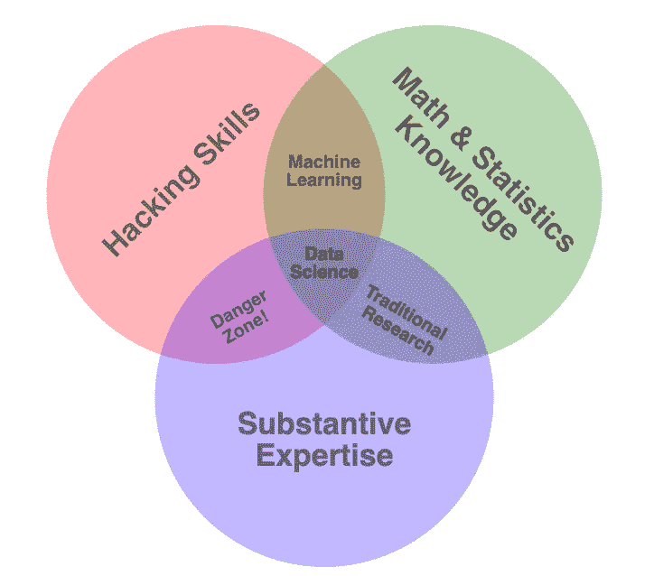
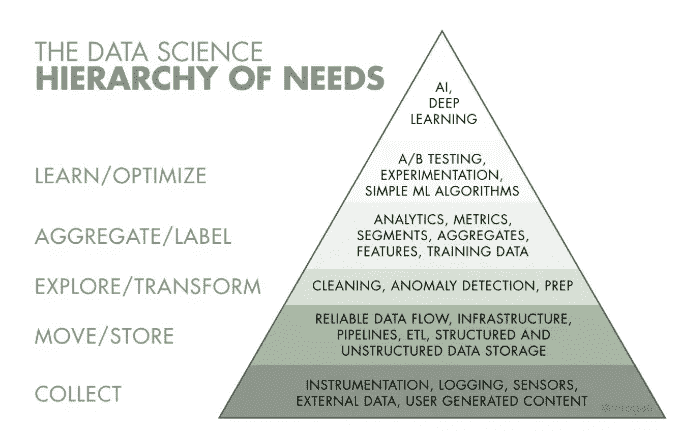
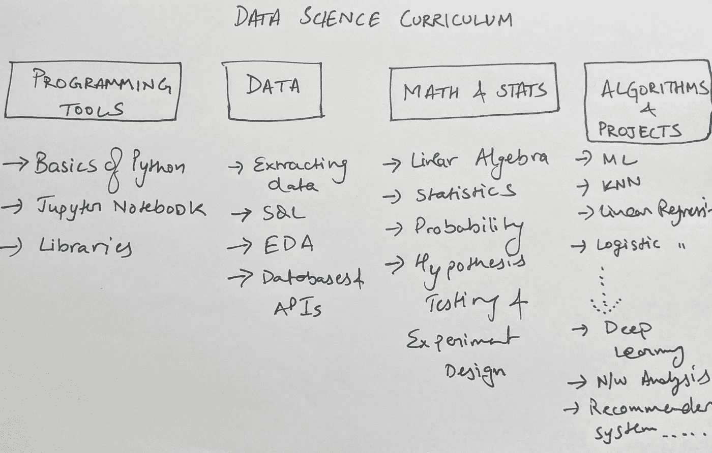
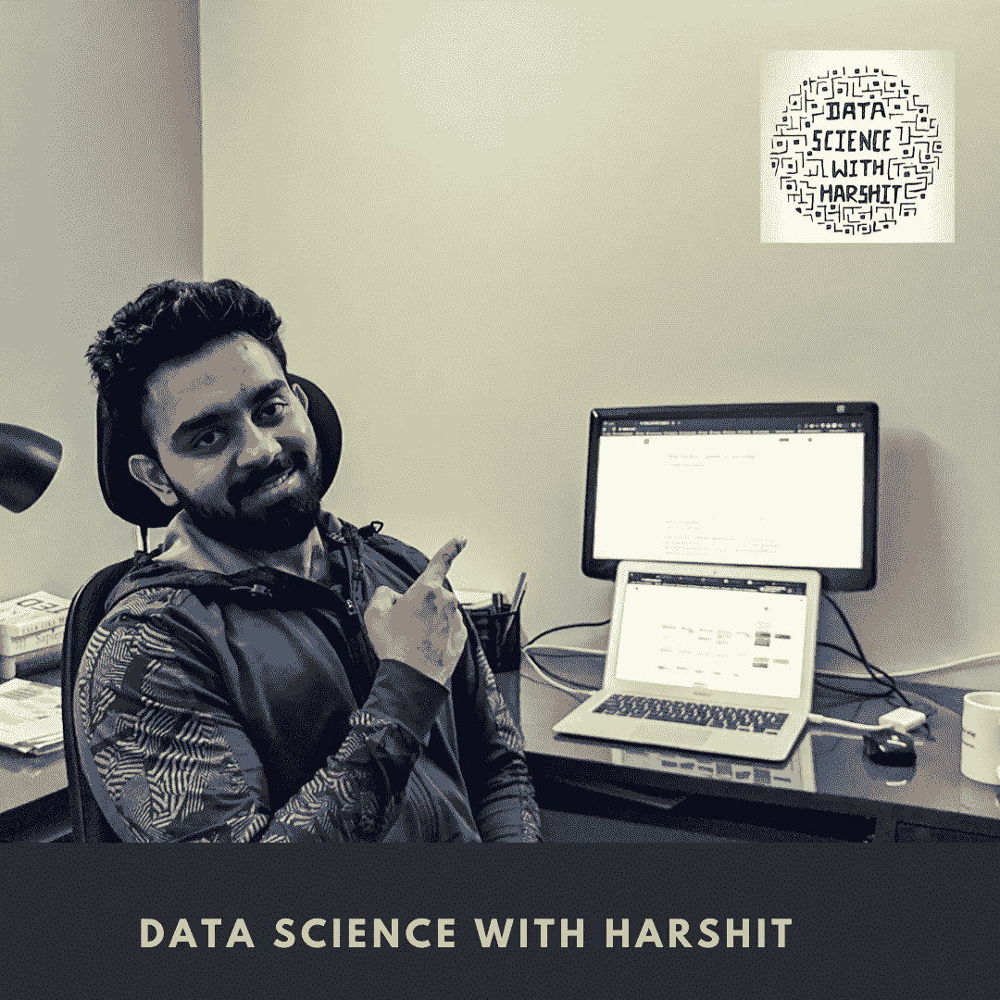

# 数据科学学习指南

> 原文：<https://towardsdatascience.com/hitchhikers-guide-to-learning-data-science-2cc3d963b1a2?source=collection_archive---------21----------------------->

## 学习数据科学的途径应该是什么样的

随着公司使用术语“数据科学”筹集大量资金，该技能的价值已经建立了相当长一段时间。数十亿美元被用来雇佣有才华的数据科学家，他们可以建立一个最先进的演绎机器来使用 zettabytes 的数据。随着我们的生活越来越依赖于零售、娱乐、体育、医疗保健、金融和语言等主要行业，这场革命现在已经成为现实。如果使用得当，数据是所有这些主要领域的一个非常有前途的驱动力，这也是对数据科学家的需求不断增加的原因。

在与全球数千名学生和专业人士讨论了与学习数据科学相关的**挑战/问题**后，我开设了这个频道来应对所有这些挑战，并帮助你们每个人定义自己从数据到涅槃的道路。

开始于，

## 数据科学家(DS)的真正含义是什么？

这里有一个非常著名但有点误导的维恩图，它将数据科学解释为数学、黑客技能和实质性专业知识的混合。

来自[http://drew Conway . com/Zia/2013/3/26/the-data-science-Venn-diagram](http://drewconway.com/zia/2013/3/26/the-data-science-venn-diagram)

作为一名 DS，你的最终目标是为高管提供指路明灯，让他们做出更明智的决策，并通过解决实际数据问题创造尽可能大的影响。

1.  对于一名优秀的数据科学家来说，你必须知道如何定义精确的、有意义的问题，这些问题的答案可以映射到潜在的商业计划中。这需要你有一些领域知识(图中的实质性专业知识)。这是随着你解决越来越多的问题而积累的经验。

2.对于许多问题来说，需要从不同的来源搜寻数据，并将其压缩成更容易处理的形式。编写复杂的 SQL 查询提取数据，使用 python 或 R 脚本操纵 CSV 和文本文件，理解矢量化运算和编码算法；这些让你成为一个优秀的数据黑客。

3.所有的机器学习算法都是基于数学和统计学的。拥有足够数学和统计知识的黑客技能将使你成为一名优秀的机器学习实践者，但不是数据科学家。科学谈论回答导致发现的动机问题。

因此，数据科学家必须专注于 3 个主要课题，**领域知识**，**数学和统计原理以及数据编程/黑客技能。**

## 数据科学的层次结构

数据科学是一个广阔的学习空间，数据科学家在一个组织中工作的职位和部门各不相同。例如，谷歌为工程、客户解决方案、运营、谷歌地图等领域雇佣数据科学家。他们不需要在我们谈到的所有三个领域都表现出色。这就是我们谈论的数据科学和行业实际要求之间的差距。

这里是数据科学技能金字塔，用于在更精细的层面上理解数据科学。你需要覆盖至少 3-4 个层次的知识，才能被一家不一定是数据科学家而是分析师的公司聘用。然后，当你到达金字塔的顶端时，你被称为研究科学家，数据科学家核心，他们由机器学习工程师协助。

作者 Monica Rogati—[https://medium . com/hacker noon/the-ai-hierarchy-of-needs-18f 111 FCC 007](https://medium.com/hackernoon/the-ai-hierarchy-of-needs-18f111fcc007)

**注意:重点是你可以从数据科学领域瞄准一堆工作描述。**

## 学习数据科学的先决条件

基于 python 的数据科学课程/程序/书籍要求您对 python 编程和数学能力有所了解。我将介绍基本的 python 编程和概念，它们在处理数据时将变得非常方便。

因此，要掌握数据科学，你需要的只是学习的意愿、好奇的头脑以及明确定义和引导的途径。

## 顶级数据科学课程

我设计的数据科学课程分支！

我认为数据科学课程有 4 个主要分支有助于培养 rockstar 数据科学家。这是按顺序排列的名单

1.  **黑客编程工具—**
2.  **数据** —从提取到执行探索性分析。
3.  **数学和统计—** 所有的先决数学概念都有助于你对算法及其原理有一个坚实的理解。
4.  **算法和项目【V . Imp】—**从不同的机器/深度学习算法到实现这些模型的基于领域的企业级项目。

## 学习目标

一旦你找到了一条路可走，下一个重要的问题是你的学习目标是什么，例如，我的一个学员在金融领域工作了 20 年，现在他们想学习数据分析，因为这将有助于她在自己的岗位上成长，并能够寻找其他机会。您可能是以下人员之一:

*   希望转换你的职业领域(例如，从软件工程师到数据科学家)，但在同一个领域。
*   找数据科学的工作，苦苦挣扎。
*   对数据科学及其给你的个人资料带来的职业前景感兴趣的学生。
*   我想从事一些自由职业数据项目。

现在，根据你属于哪一类，你必须找出你的**优势和你的**劣势。例如，软件工程师的优势在于编程，但不一定在于数学建模，统计学家可能会发现自己在 python 或 r。

一旦你从自己的弱点中找到了主要的关注点，那么你只需要在你的强项上花更多的时间在你的弱项上。

## 制定自己的学习计划

你的学习目标会给你指明方向，但是能够继续前进是人们为自己开脱的地方。

> 问:**动机是这里的关键问题。**

一个深思熟虑的学习计划可以帮助你实现你的目标。但是什么是好的学习计划呢？
鼓励大脑学习更多知识的制度。构建/解决一个现实世界的问题会给你的思维提供背景和清晰性，这反过来会让你有兴趣去发现隐藏的模式，以及清晰定义的下一步，以防止你迷路。

> **回答:保持你的学习过程项目/问题驱动。解决不同复杂程度的现实世界问题，并在学习新概念和新技术的过程中不断进步。**

其他**常见问题**有:

> 一个人应该做什么样的项目？
> 
> 答:如果你不想呆在自己的专业领域，你应该参与不同行业的项目组合，即医疗保健、金融、电子商务、生物信息学、旅行和旅游、制造业等。
> 
> 问:学数据科学需要多少时间？
> 
> 答:这取决于个人，但平均需要 3-4 个月来涵盖所有主题及其在 6-8 个项目中的实施，因为你每天投入 2 个小时。
> 
> 问:有哪些学习数据科学的好资源？
> 
> Ans:
> 1。对于 Python 编程，可以使用:[https://www.learnpython.org/](https://www.learnpython.org/)或者[https://docs.python.org/3/tutorial/](https://docs.python.org/3/tutorial/)
> 
> 2.使用 Scikit-learn、Numpy、Pandas、Keras 和 Tensorflow 等库的官方文档。
> 
> 3.对于数学或者统计学，可以用书:[https://mml-book.github.io/book/mml-book.pdf](https://mml-book.github.io/book/mml-book.pdf)
> 
> 4.对于项目，开始在 [Kaggle](https://www.kaggle.com/) 上练习。注意:我将写另一篇关于资源的文章。

*   找出一天中最适合你的时间。
*   养成阅读研究论文的习惯。

整个计划的唯一问题是有许多主题要涉及，有许多地方要寻找。所以，我尝试在一个地方给你提供最好的资源，我的 YouTube 频道叫做:

# Harshit 的数据科学

通过这一渠道，我计划推出几个关于上述数据科学需求层次的系列。以下是你应该订阅[频道](https://www.youtube.com/channel/UCH-xwLTKQaABNs2QmGxK2bQ)的原因:

*   该系列将涵盖每个主题和副主题的所有必需/要求的高质量教程。
*   解释了为什么我们在 ML 和深度学习中做这些事情的数学和推导。
*   与谷歌、微软、亚马逊等公司的数据科学家和工程师以及大数据驱动型公司的首席执行官的播客。
*   项目和说明，以实现迄今为止所学的主题。

订阅我的 YouTube 频道，第一个视频将于 3 月 23 日发布:

 [## Harshit 的数据科学

### 涵盖整个数据科学课程和其他所有内容。指导了 1500 多名学生，课程…

www.youtube.com](https://www.youtube.com/channel/UCH-xwLTKQaABNs2QmGxK2bQ) 

你可以在 [LinkedIn](https://www.linkedin.com/in/tyagiharshit/) 、 [Twitter](https://twitter.com/tyagi_harshit24) 或 [Instagram](https://www.instagram.com/upgradewithharshit/?hl=en) 上与我联系(在那里我谈论健康和福祉。)

注意:在这段黑暗的日子里，自我隔离给了我们一些自我提升的空间，我们可以利用它来发展新的技能、爱好，并帮助我们未来的自己从新冠肺炎这样的大流行病中吸取教训。