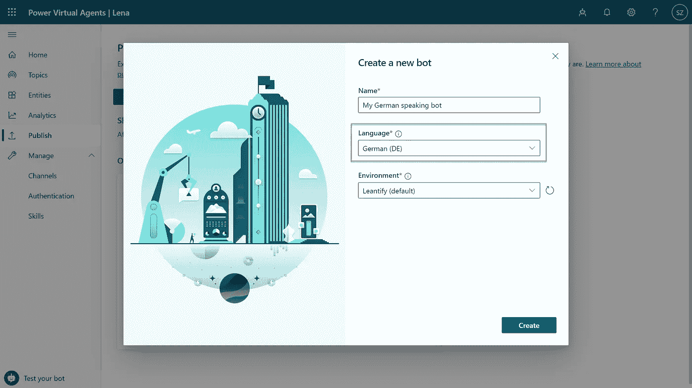
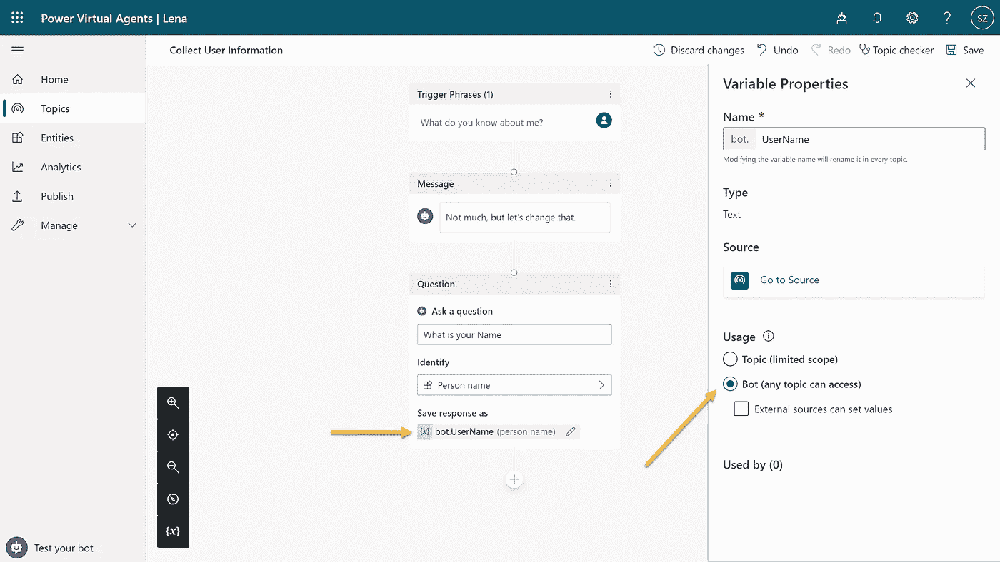
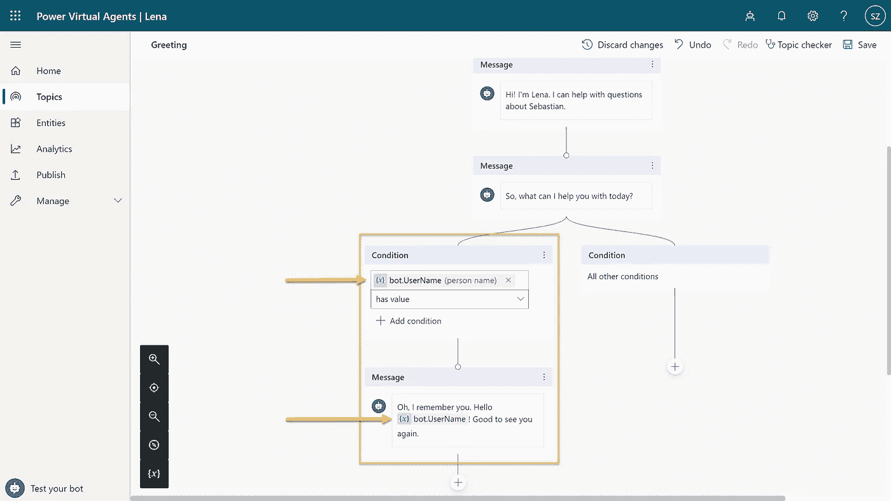
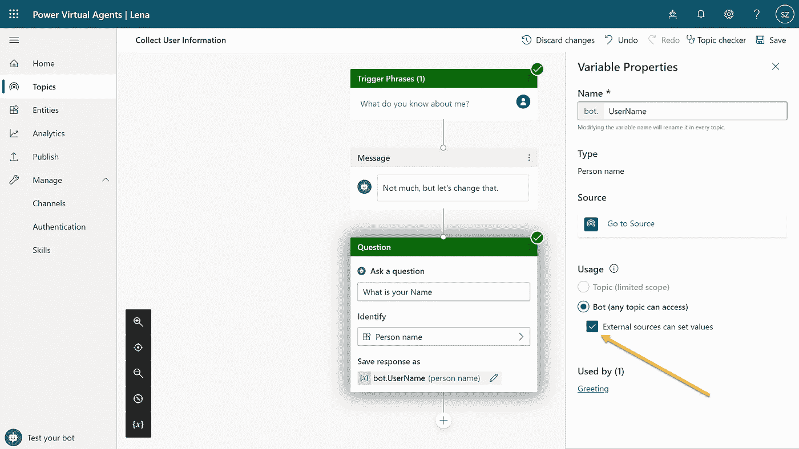
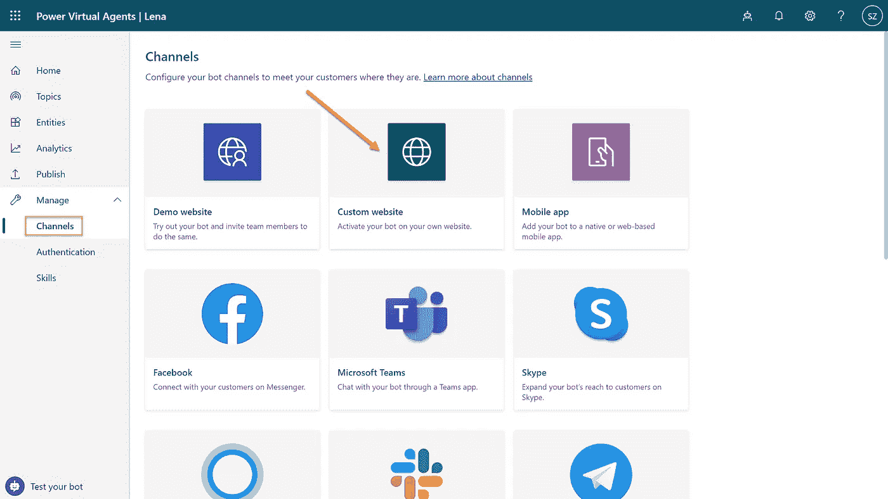
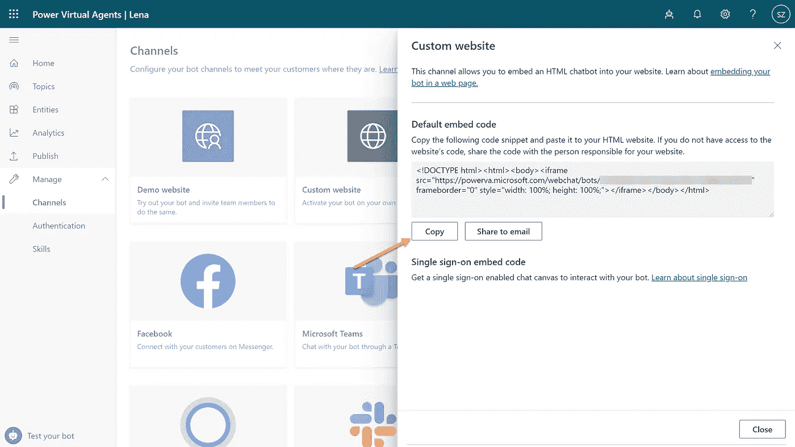
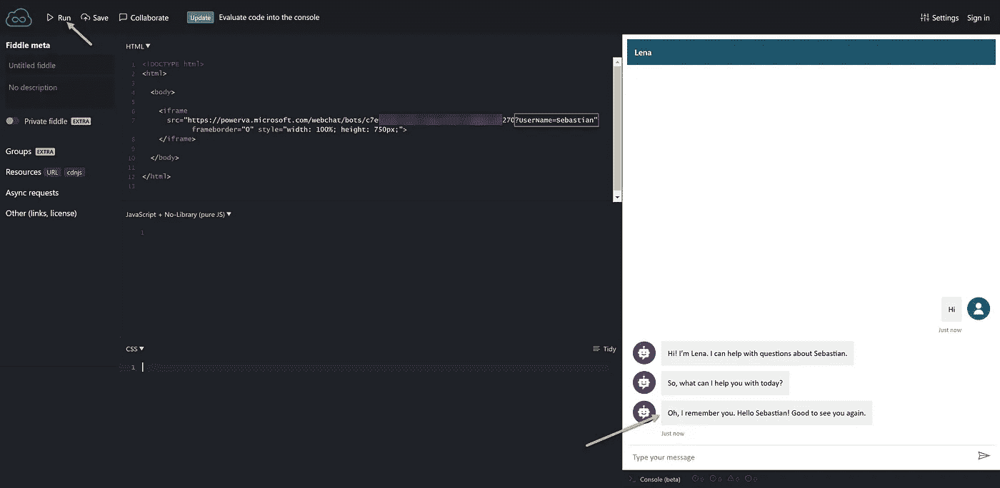
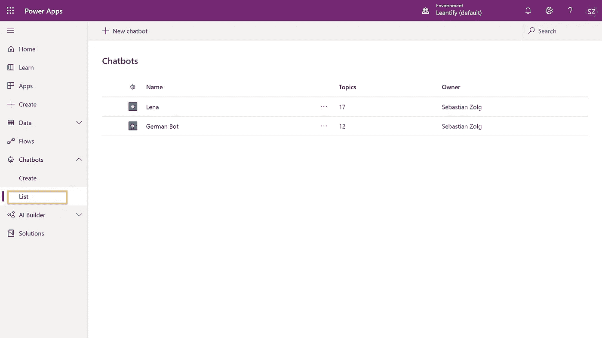
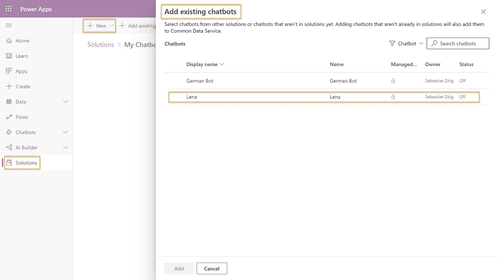
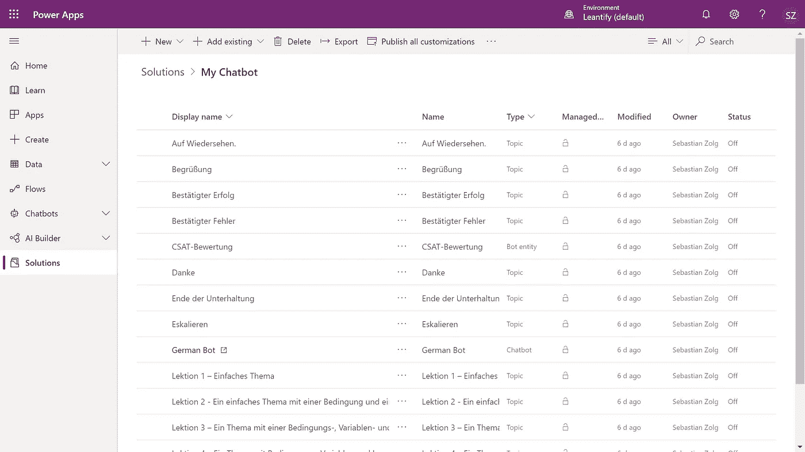

# ¡Hola! 你好！Hej ! — Multilanguage and more for Power Virtual Agents.

> 原文：<https://towardsdatascience.com/hola-%E4%BD%A0%E5%A5%BD-hej-multilanguage-and-more-for-power-virtual-agents-5dd3896b833d?source=collection_archive---------54----------------------->

## 微软 POWER 平台解决方案

## Power 虚拟代理有什么新特性？作为微软 Power 平台的一部分，Power 虚拟代理聊天机器人的最新改进概述

乔恩·泰森在 [Unsplash](https://unsplash.com?utm_source=medium&utm_medium=referral) 上的照片

在过去的几年里，低代码解决方案变得越来越流行。对于微软 Power 平台及其最新成员 Power 虚拟代理，其低代码聊天机器人引擎来说尤其如此。

到目前为止，这个解决方案有其局限性；最重要的是，我们只能用英语创建聊天机器人。幸运的是，微软最近大大改进了这个解决方案。

这一简要概述涵盖了最重要的功能:

*   多语言支持
*   全局对话框变量
*   来自外部源的全局对话框变量
*   应用生命周期管理支持

如果你是电力虚拟代理新手，你可以按照我的逐步介绍[这里](/meet-lena-a-simple-ai-no-code-chatbot-8ac006c92a45?source=friends_link&sk=9f1762ab65cd382a30c769fcd63a29b5)。

# 2020 年夏季 Power 虚拟代理的新特性

## ¡Hola! 你好！Hej! — Multilanguage Support

有了这个新版本，我们现在可以为多种语言创建一个聊天机器人，而且非常简单。只要创建一个新的机器人，你会在第一步看到语言下拉菜单。

根据文档，支持的语言如下:

*   英语(已正式发布)
*   中文(简体)
*   中文(繁体)
*   丹麦的
*   荷兰人
*   法语
*   德国人
*   印度尼西亚的
*   意大利的
*   日本人
*   挪威的
*   葡萄牙语
*   俄语
*   西班牙语
*   瑞典的
*   土耳其的
*   印地语
*   韩国的
*   抛光剂

要获得支持语言的完整列表，请点击这里查看官方文档。

> 注意，一个机器人一次只能说一种语言。如果你想让同一个聊天机器人支持多种语言，比如说德语和英语，你可以创建两个聊天机器人。这就是像 Microsoft Bot Framework 这样的亲代码解决方案给你带来显著优势的地方，它允许你构建一个 Bot 来检测所说的语言并动态地调整语言。

## 全局变量

直到最近，我们可以在单个对话框中定义变量来收集、存储和管理机器人的上下文。我们可以很容易地收集像用户名这样的细节，并在同一个对话框(主题)的后续步骤中使用这些信息。然而，我们不能在不同的对话框之间共享信息，这使得体验有点模糊，因为我们需要多次问用户同样的问题。

随着全局变量的引入，我们现在可以在不同的对话框之间共享这些信息。

让我们做一个快速测试。创建一个名为**的新话题收集用户信息**。添加问题“**你叫什么名字？”**。给输出变量起一个有意义的名字，比如**用户名、**并将**用法**选项切换为 **Bot(任何主题都可以访问)。**

这个变量现在可以从任何其他主题中访问，包括像问候对话框这样的内置主题。

例如，您可以在问候对话框中添加分支逻辑，看看我们是否已经知道了用户的名字。如果是这样，我们输出一个更加个性化的问候消息。

如果变量没有值，Power Virtual Agent 将自动切换到**收集用户信息**对话框，尝试收集该信息。

## 外部来源的全局变量

我们不仅可以从对话框中创建全局变量，还可以从外部资源中设置它。我们可以从外部传入一些参数，例如，从嵌入聊天机器人的网站传入。

为此，我们需要选中复选框**外部源可以在我们的目标变量上设置值**。如描述所示，这允许我们从外部设置变量。

让我们使用 iFrame 来尝试一下。

确保您已经发布了您的更改(这可能需要 15 分钟)，然后转到**频道**并点击**定制网站**。

从那里，你可以复制 html 代码并在任何网站上使用。

我们使用[jsfiddle.net](https://jsfiddle.net/)来模拟这个过程。只需将复制的 html 片段粘贴到 html 面板，然后单击**运行**。

要使用这个 iFrame 代码传递变量的值，只需将它作为 URL 变量附加在 **src** 属性的末尾。要设置用户名，只需追加`?UserName=Sebastian`并再次运行代码。

聊天机器人将不再提示您的姓名。

> *请注意，参数必须是 URL 编码的，以防它包含特殊字符或空格。*

## 支持应用生命周期管理

Power Virtual Agents 现在支持**解决方案**。这意味着可以使用 Microsoft Power Platform 的解决方案概念来管理它。请将解决方案视为每个应用程序或 chatbot 使用 Microsoft Power Platform 构建的基本构建块的包。

您可以打包、导出、导入解决方案，并在不同的环境之间共享它们。

这使得能够使用应用生命周期管理(ALM)实践来管理这样的解决方案。您可以使用您最喜欢的 CI-CD 解决方案在不同阶段之间移动您的聊天机器人，如开发、测试、试运行和生产。

要查看您的所有机器人，请前往[make.powerapps.com](https://make.powerapps.com)>**聊天机器人>列表**。

要打包您的聊天机器人，只需进入**解决方案**，点击**新建**并创建一个空解决方案。

接下来，点击**添加现有的**并从列表中选择**聊天机器人**。

最后，您选择想要添加到解决方案中的聊天机器人，并点击**添加**按钮。

从这里，我们可以开始导出解决方案或开始实施 CI-CD 管道。

我最近写了一篇关于如何用 Azure DevOps 实现这样一个[管道的博文。你可以很容易地将它应用到聊天机器人上。](/what-has-changed-ba0f5ccf2f73?source=friends_link&sk=c059a4fa6c16d6dccec8482e87a7e56e)

就是这样。试试看。

就这样吧。👉

—塞巴斯蒂安