# 霍尔特-温特斯指数平滑

> 原文：<https://towardsdatascience.com/holt-winters-exponential-smoothing-d703072c0572?source=collection_archive---------1----------------------->


使用霍尔特-温特斯指数平滑法生成的销售预测(数据来源: [US FRED](https://fred.stlouisfed.org/series/MRTSSM44112USN) )(图片由[作者](https://sachin-date.medium.com/)提供)

## 时间序列数据的超快速预测工具

霍尔特-温特斯指数平滑法用于预测既显示趋势又显示季节变化的时间序列数据。霍尔特-温特斯技术由以下四种预测技术叠加而成:

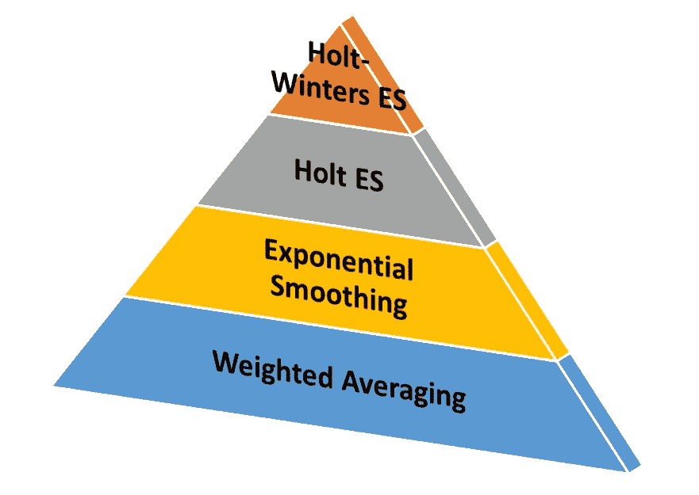

(图片由[作者](https://sachin-date.medium.com/)提供)

**加权平均值:**加权平均值就是对 *n* 个数字进行平均，其中每个数字都被赋予一定的权重，分母是这些 *n* 个权重的总和。重量通常根据一些称重功能进行分配。常见的加权函数有对数函数、线性函数、二次函数、三次函数和指数函数。平均作为一种时间序列预测技术，具有在计算预测时消除历史值变化的特性。通过选择合适的加权函数，预测器确定在计算时间序列的未来值时应该强调哪些历史值。

**指数平滑:**指数平滑(ES)技术使用所有先前值的加权平均值来预测下一个值，其中权重从最近的历史值到最早的历史值呈指数衰减。当您使用 ES 时，您做出了一个重要的假设，即时间序列的最近值比旧值更重要。ES 技术有两个大的缺点:当你的数据表现出趋势和/或季节变化时，它不能被使用。

**霍尔特指数平滑:**霍尔特 es 技术弥补了简单 ES 技术的两个缺点之一。Holt ES 可用于预测具有趋势的时间序列数据。但是 Holt ES 在时间序列中存在季节性变化时就失效了。

**霍尔特-温特斯指数平滑法:霍尔特-温特斯法修正了霍尔特-温特斯法，使其可以用于趋势和季节性并存的情况。**

要了解霍尔特-温特斯指数平滑法的工作原理，必须了解时间序列的以下四个方面:

## 水平

通过一个例子可以更好地理解级别的概念。以下时间序列显示了默克公司在纽约证券交易所的收盘价。水平红线表示时间序列在上升和下降过程中的一些级别:


数据来源:[雅虎财经](https://finance.yahoo.com/quote/MRK/history?p=MRK)

## 趋势

水平以某种模式变化的时间序列被称为具有趋势。水平围绕某个平均值随机变化的时间序列可以说表现出随机趋势。除了知道趋势是随机的之外，当趋势是随机的时候，趋势的概念就没有那么有用了，相比之下，趋势可以用一些函数来建模。

让我们放大上述股价图中的一个特定区域来说明积极趋势的概念:

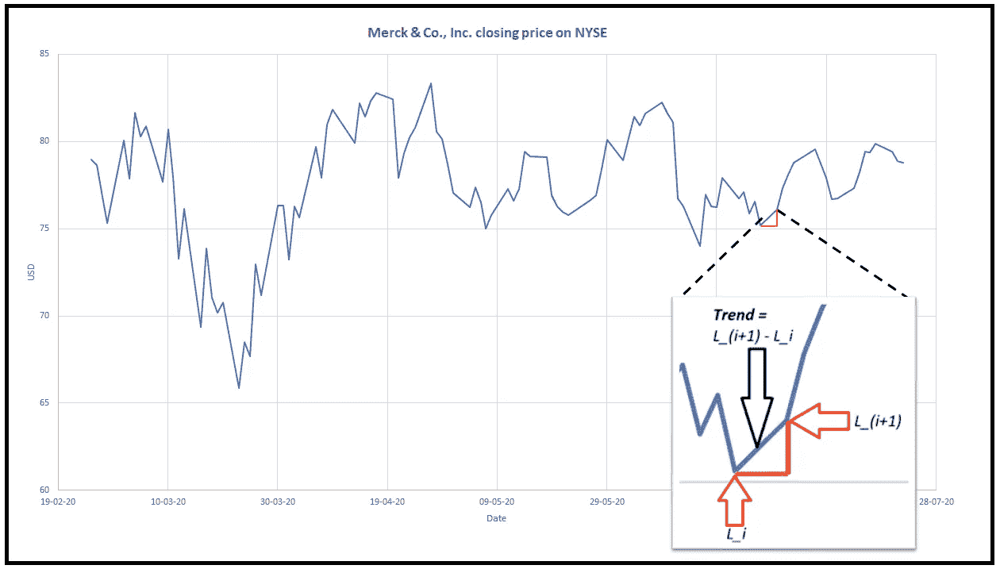

两个连续水平之间的积极趋势的例证

一些常见的趋势是线性、平方、指数、对数、平方根、倒数和三阶或更高阶多项式。使用相应的数学函数，即 log(x)、linear、x、exp(x)等，可以很容易地对这些趋势进行建模。

高度非线性的趋势需要复杂的建模技术，例如人工神经网络来成功地对其建模。

观察趋势的一个有用的方法是作为一个比率，或者作为时间序列在给定水平上的速度。

这使得趋势成为一个有大小(变化率)和方向(增加或减少)的向量。

让我们把趋势的这种解释作为一种速率或速度放在我们的脑海里。我们将在解构霍尔特-温特斯指数平滑的预测方程时使用它。

## 季节性

许多时间序列显示围绕当前水平的周期性上下运动。这种周期性的上下运动被称为季节性。以下是展示季节性模式的时间序列示例:


每日太阳黑子计数。数据来源: [SILSO](http://www.sidc.be/silso/datafiles) (图片由[作者](https://sachin-date.medium.com/)提供)

## 噪音

噪声只是时间序列数据中你无法(或不想)解释的一个方面。

水平、趋势、季节性和噪声被认为以相加或相乘的方式相互作用，产生您观察到的时间序列的最终值:

## 乘法组合(具有加法趋势)

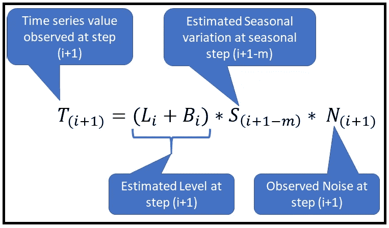

加法趋势、乘法季节性、乘法噪声(图片由[作者](https://sachin-date.medium.com/))

## 完全加法组合

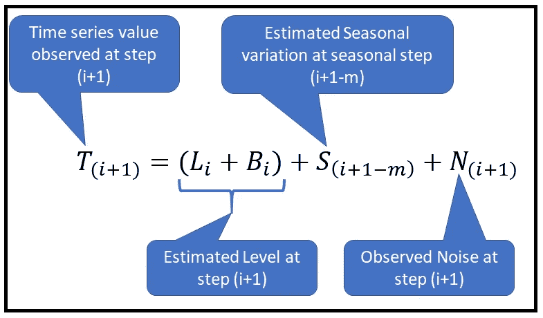

加法趋势、季节性和噪声(图片由[作者](https://sachin-date.medium.com/)提供)

## 霍尔特-温特斯指数平滑方程

我们现在准备看看霍尔特-温特指数平滑技术的预测方程。我们将首先考虑趋势增加到当前水平的情况，但是季节性是倍增的。这是现实世界时间序列数据中的常见情况。

因为我们指定了预测模型的方程，所以我们将忽略噪声项。

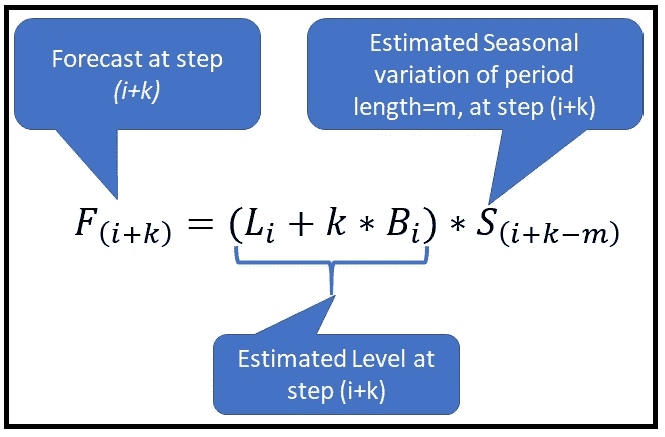

(图片由[作者](https://sachin-date.medium.com/)提供)

在上面的等式中，我们预测了从某个任意步 *i* 开始的时间序列 *k* 的值。假设季节变化具有已知的周期长度 *m* 时间步长。例如，对于年度变化， *m=12。*

让我们看看如何估计 *L_i，B_i* 和 *S_i.*

让我们从步骤 *i* 的趋势 *B_i* 的估计开始:

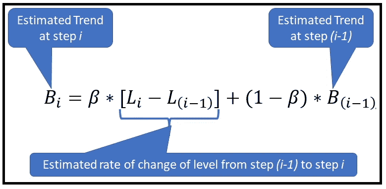

(图片由[作者](https://sachin-date.medium.com/)提供)

上面的等式通过以下两种不同的方式计算来估计在步骤 *i* 中观察到的趋势 *B_i* :

***【L _ I _ L _(I-1)】*:**这是两个连续电平之间的差值，它代表电平 *L_(i-1)* 处的电平变化率。看待这一项的一种方式是把它想象成数据在水平 *L_i* 处的速度，它来自水平 *L_(i-1)* 。

***【B _(I-1)*:**这就是在*【L _(I-1)*的电平变化率，递归表示。为了计算 *B_(i-1)* ，我们通过用 *(i-1)* 替换 *i* ，对 *B_i* 使用相同的等式，并且我们一直这样做，直到我们到达 *B_0* ，其值我们假设为初始条件。一会儿会有更多关于估计初始条件的内容。

下图说明了对 *B_i* 的上述递归关系的递归分解:

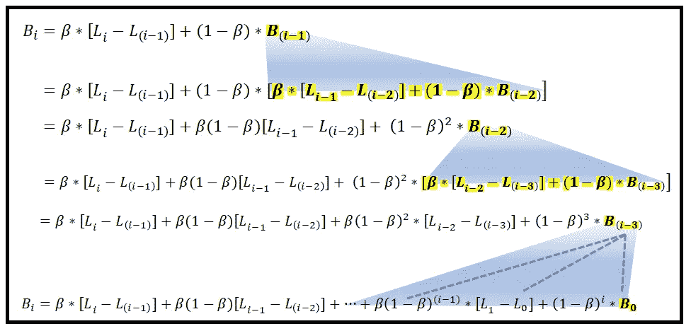

(图片由[作者](https://sachin-date.medium.com/))

现在应该很清楚指数加权平均是如何形成霍尔特-温特斯技术的弱点的。这里有三个重要的观察结果:

*   重量 *β(1-β)、β(1-β)、β(1-β)*…等。形成几何级数。
*   这个数列的每一项 *β(1-β)^k* 对时间数列*中两个连续电平*[l _(I-k)-l _(I-k-1)】*之差进行加权。*
*   最近的两个级别*【L _ I—L _(I-1)】*之间的差异具有最大的权重 *β* ，并且随着时间的推移，权重以因子 *(1-β)* 呈指数衰减。

还要注意的是， *B_i* 的估算要求我们知道步骤 *i* 和 *(i-1)* 、 *(i-2)* 等的水平，直到我们假设的初始条件 *L_0* 为止。

现在让我们看看如何在时间步 *i* 估计水平 *L_i* :

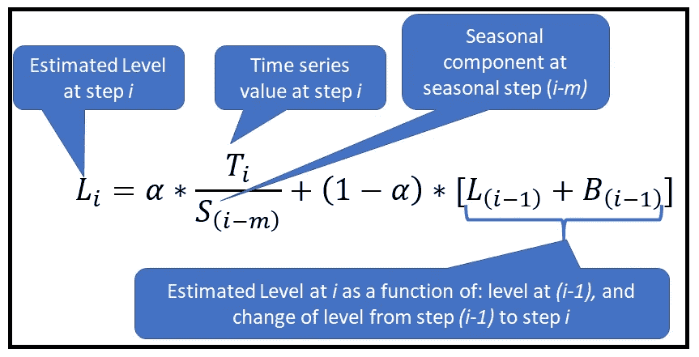

(图片由[作者](https://sachin-date.medium.com/))

正如趋势 *B_i* 一样，上述等式通过以两种不同的方式计算来估计水平 *L_i* ，然后取两个估计值的加权平均值，如下所示:

***T _ I/S _(im)*:**回想一下，我们已经假设水平和季节性是相乘的，即 *T_i=L_i*S_(i-m)*N_i.* 因此，如果你选择忽略噪声的影响*N _ I*，那么 *L_i* 的一个好的估计值就是*T _ I/S _(im)*

***【L _(I-1)+B _(I-1)】*:**在本项中，我们通过将 *L_(i-1)* 与 *L_(i-1)* 到 *L_i* 之间发生的水平变化相加，即趋势 *B_(i-1)* 来估计水平 *L_i* 。

与 *B_i* 一样，我们递归地求解这个方程，直到我们碰到 *T_0* 、 *S_0* 、 *B_0* 和 *L_0。T_0* 只是我们训练数据集中最老的数据点。*s0、B0*和*l0*为水平、趋势和季节变化的初始值。它们是用各种技术估算的，我很快就会讲到。现在，我们假设它们被设置为一些合理的初始值。

在 *L_i* 的上述等式中，为了估计 *L_i* ，我们还需要估计季节性成分 *S_(i-m)* 的贡献。因此，让我们看看如何在步骤 *i* 中估算季节性成分:

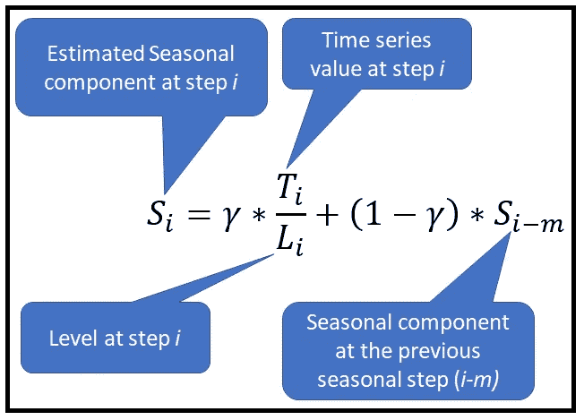

(图片由[作者](https://sachin-date.medium.com/)提供)

您可以看到，季节性成分 *S_i* 的估算策略与趋势 *B_i* 和水平 *L_i* 的估算策略相似，它通过两种不同的方式计算来估算 *S_i* ，然后取两个估算值的加权平均值。

现在我们知道了如何估计时间步 *i* 的水平、趋势和季节性成分，我们准备将三个估计值放在一起，以获得步骤*【I+k】*的预测值*(I+k)*，如下所示:**

**

*(图片由[作者](https://sachin-date.medium.com/)提供)*

## *初始条件的估计*

*由于 Holt-Winters 方法的所有方程都是递归关系，我们需要为这些估计方程提供一组初始值，以启动预测引擎。具体来说，我们需要设置 L_0，B_0，S_0 的值*。**

*有几种方法可以设置这些初始值。我将解释 Python[*stats models*](https://www.statsmodels.org/stable/generated/statsmodels.tsa.holtwinters.ExponentialSmoothing.html?highlight=holt%20winters)库使用的技术。(我们将很快使用 *statsmodels* 来构建 Holt-Winters ES 估计器，并使用它来预测未来的 12 个时间步长)。*

***估算 *L_0*** : Statsmodels 将 *L_0* 设置为您提供的时间序列的所有观测值的平均值，*位于指数 0，m，2m，3m 等*，其中 *m* 为季节周期。例如，如果您告诉 statsmodels 您的时间序列显示 12 个月的季节周期，它将按如下方式计算 *L_0* :*

*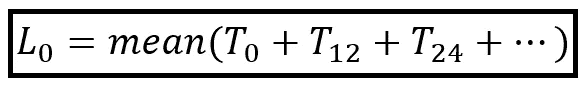*

*(图片由[作者](https://sachin-date.medium.com/)提供)*

*注意，T_0 是时间序列数据中最老的值。*

*即使时间序列不显示季节性，也可以使用霍尔特-温特斯预测技术。在这种情况下，statsmodels 会将 *L_0* 设置为训练数据集的第一个值。即*

****l0 = t0****，当数据中没有季节变化时**

***估计 *B_0*** :如果您的时间序列显示一个相加趋势，即其水平线性变化，statsmodels 通过计算观察值 *T_i* 在 *m* 时间步上的变化率，然后取这些变化率的平均值，来估计初始趋势 *B_0* 。例如，如果您告诉 statsmodels，您的时间序列显示出一个相加趋势，并且它有一个 12 个月的季节周期，它将按如下方式计算 *B_0* :*

*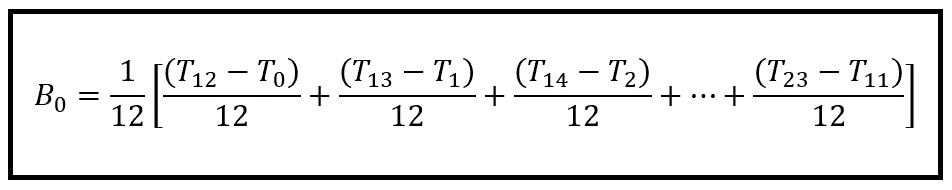*

*(图片由[作者](https://sachin-date.medium.com/)提供)*

*如果你的时间序列呈现倍增趋势，即水平以与当前水平成比例的速率增长， *statsmodels* 对 *B_0 使用看起来稍微复杂的估计器。最好用年度季节性的例子来说明( *m=12* ):**

*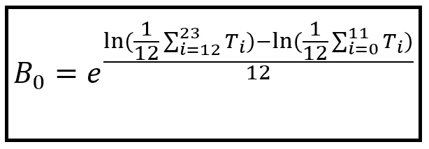*

*(图片由[作者](https://sachin-date.medium.com/)提供)*

*但是，如果您的时间序列不显示季节性变化，如果趋势是乘法的，则简单地将*B0*设置为*t1/t0*，如果趋势是加法的，则设置为*(t1-t0)*。*

***估计 *S_0* :** 如果季节性是倍增的，即给定水平的季节性变化值与该水平的值成比例，那么 *S_0* 估计如下:*

*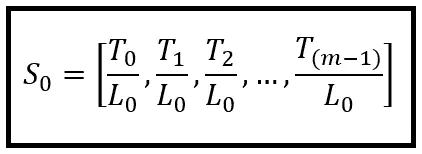*

*(图片由[作者](https://sachin-date.medium.com/)提供)*

*当季节变化是常数或在每个水平上增加一个固定的量，即它是累加的，那么*s0*估计如下:*

*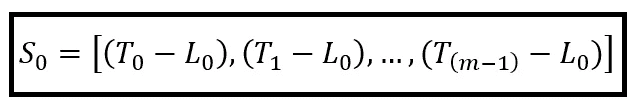*

*(图片由[作者](https://sachin-date.medium.com/)提供)*

*当你的时间序列没有季节变化时， *S_0* 是[]，一个空向量。*

*注意一件重要的事情。虽然 *L_i* 和 *B_i* 是标量，但是 *S_i* (因此 *S_0* )是长度为 *m* 的*向量*，其中 *m* 是季节周期。在您的时间序列中的每个时间步 *i=0，1，2，…n* ，位于矢量位置 *(0 mod m)，(1 mod m)，(2 mod m)，…，(i mod m)，…，(n mod m)* 的相应季节因子用于预测 *F_i.**

## *估计α、β和γ*

*加权系数 *α、β和γ* 通过给它们初始值，然后针对某个合适的分数迭代优化它们的值来估计。最小化 MSE(均方误差)是一个常用的优化目标。Statsmodels 将初始 *α* 设置为 *1/2m，将β* 设置为 *1/20m* ，当存在季节性时，将初始 *γ* 设置为 *1/20*(1 — α)* 。*

*一旦*l0，B0 和 s0*被估计，并且 *α，β和γ* 被设定，我们可以使用 *L_i，B_i，S_i，F_i* 和 *F_(i+k)* 的递推关系来估计时间序列在步骤 *0，1，2，3，…，I，…，n，n+1，n+2，…，n 的值**

*如果您的训练数据集有 *n* 个数据点，那么位置 *n+1，n+2，…，n+k* 对应于使用霍尔特-温特斯估计技术生成的 *k* 样本外预测。*

## *在 Python 中使用霍尔特-温特斯指数平滑法*

*我们将使用 Holt-Winters 指数平滑技术估计美国二手车经销商零售时间序列的 12 个未来值:*

**

*零售二手车销售。数据来源:[美国弗雷德](https://fred.stlouisfed.org/series/MRTSSM44112USN)(图片由[作者](https://sachin-date.medium.com/))*

*数据集可从这里下载[。](https://gist.github.com/sachinsdate/40b07da727f8d3d2476dbef4a2f06b6a)*

*让我们从导入所有需要的包开始。*

```
***import** pandas **as** pd
**from** matplotlib **import** pyplot **as** plt
**from** statsmodels.tsa.holtwinters **import** ExponentialSmoothing **as** HWES*
```

*将数据集读入熊猫数据框。请注意，日期列(列 0)是索引列，其格式为 mm-dd-yyyy。*

```
*df = pd.**read_csv**('retail_sales_used_car_dealers_us_1992_2020.csv', **header**=0, **infer_datetime_format**=True, **parse_dates**=[0], **index_col**=[0])*
```

*将索引频率明确设置为每月一次，这样 *statsmodels* 就不必尝试推断它。*

```
*df.index.**freq** = **'MS'***
```

*绘制数据:*

```
*df.**plot**()
plt.**show**()*
```

*我们得到了下面的图表:*

*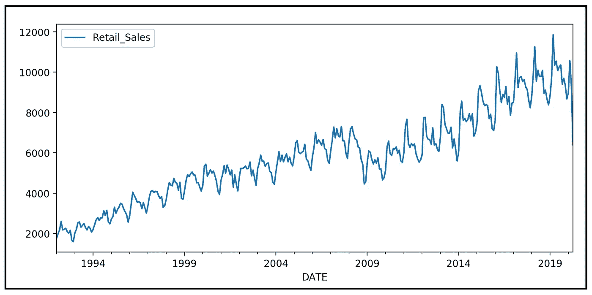*

*(图片由[作者](https://sachin-date.medium.com/)提供)*

*在训练数据集和测试数据集之间拆分。最后 12 个周期形成测试数据。*

```
*df_train = df.**iloc**[:-12]
df_test = df.**iloc**[-12:]*
```

*根据训练数据建立和训练模型。在上图中，时间序列的水平似乎是线性增加的。所以我们把趋势设为相加。然而，每一水平周围的季节变化似乎与当前水平成比例增加。所以我们把季节性设为倍增。*

```
*model = **HWES**(df_train, **seasonal_periods**=12, **trend**='add', **seasonal**='mul')
fitted = **model**.fit()*
```

*打印出培训总结。*

```
***print**(fitted.**summary**())*
```

*我们得到以下输出:*

*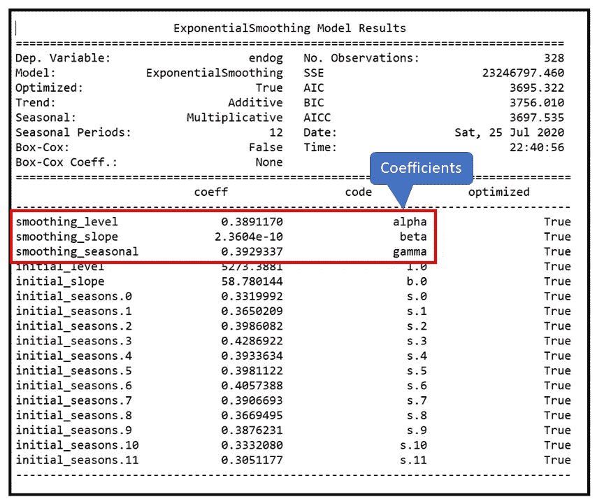*

*(图片由[作者](https://sachin-date.medium.com/)提供)*

*为训练数据集中最后一个数据点之后的 12 个步骤创建样本外预测。*

```
*sales_forecast = fitted.**forecast**(**steps**=12)*
```

*将训练数据、测试数据和预测绘制在同一个图上。*

```
*fig = plt.**figure**()
fig.**suptitle**('Retail Sales of Used Cars in the US (1992-2020)')
past, = plt.**plot**(df_train.index, df_train, **'b.-'**, label=**'Sales History'**)
future, = plt.**plot**(df_test.index, df_test, **'r.-'**, **label**='Actual Sales')
predicted_future, = plt.**plot**(df_test.index, sales_forecast, **'g.-'**, **label**='Sales Forecast')
plt.**legend**(**handles**=[past, future, predicted_future])
plt.**show**()*
```

*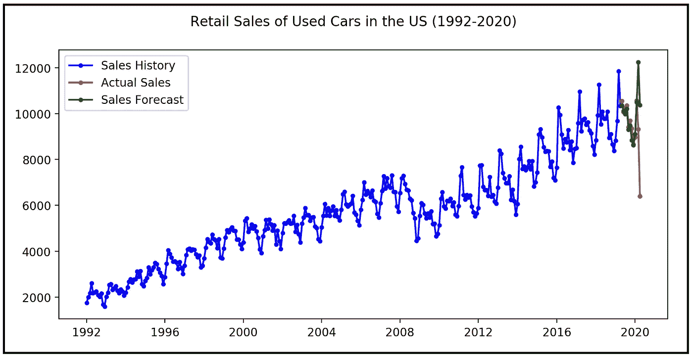*

*(图片由[作者](https://sachin-date.medium.com/)提供)*

*让我们放大到最近 12 期。您可以看到预测滞后于急剧的转折点，这对于任何基于移动平均线的预测技术来说都是应该的:*

*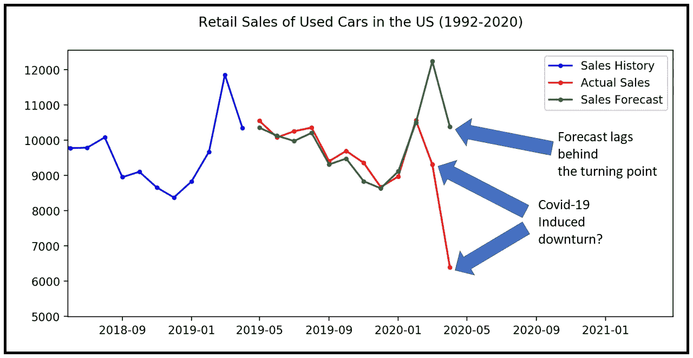*

*(图片由[作者](https://sachin-date.medium.com/)提供)*

*以下是完整的源代码:*

## *进一步阅读*

*温特斯出版社(1960 年)。[通过指数加权移动平均线预测销售额](https://pubsonline.informs.org/doi/abs/10.1287/mnsc.6.3.324)。管理科学。*

*Makridakis，s .、Wheelwright，S. C .、Hyndman，R. J. [预测方法和应用](https://www.amazon.com/dp/0471532339)。第三版。约翰·威利的儿子们。*

## *引用和版权*

*美国人口普查局，零售销售:二手车经销商[MRTSSM44112USN]，检索自圣路易斯美联储银行弗雷德；[https://fred.stlouisfed.org/series/MRTSSM44112USN](https://fred.stlouisfed.org/series/MRTSSM44112USN)，2020 年 6 月 17 日，根据[弗雷德版权条款](https://fred.stlouisfed.org/legal/)。*

*SILSO，世界数据中心-太阳黑子数和长期太阳观测，比利时皇家天文台，在线太阳黑子数目录:[http://www.sidc.be/SILSO/,](http://www.sidc.be/SILSO/,)1818–2020([CC-BY-NA](https://creativecommons.org/licenses/by-nc/4.0/)*

*默克公司(MRK)，纽约证券交易所——历史调整收盘价。货币为美元，[https://finance.yahoo.com/quote/MRK/history?p=MRK](https://finance.yahoo.com/quote/MRK/history?p=MRK)，2020 年 7 月 23 日。版权所有雅虎财经和纽约证券交易所*

*本文中的所有图片版权归 [CC-BY-NC-SA](https://creativecommons.org/licenses/by-nc-sa/4.0/) 下的 [Sachin Date](https://www.linkedin.com/in/sachindate/) 所有，除非图片下面提到了不同的来源和版权。*

**感谢阅读！如果您喜欢这篇文章，请* [***关注我***](https://sachin-date.medium.com/) *获取关于时间序列分析的提示、操作方法和编程建议。**