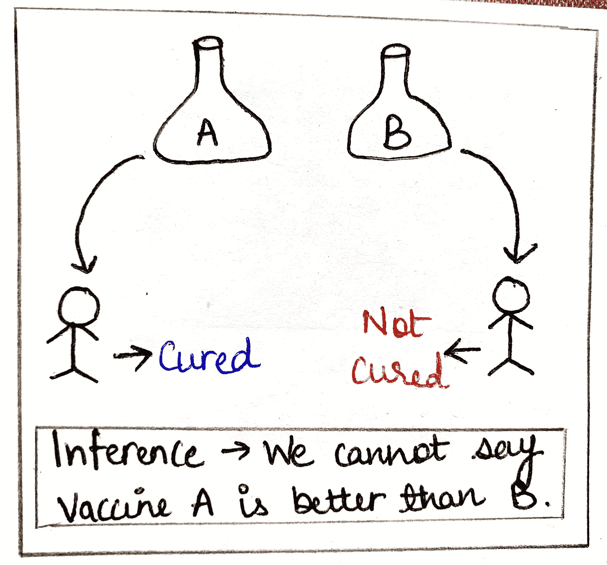
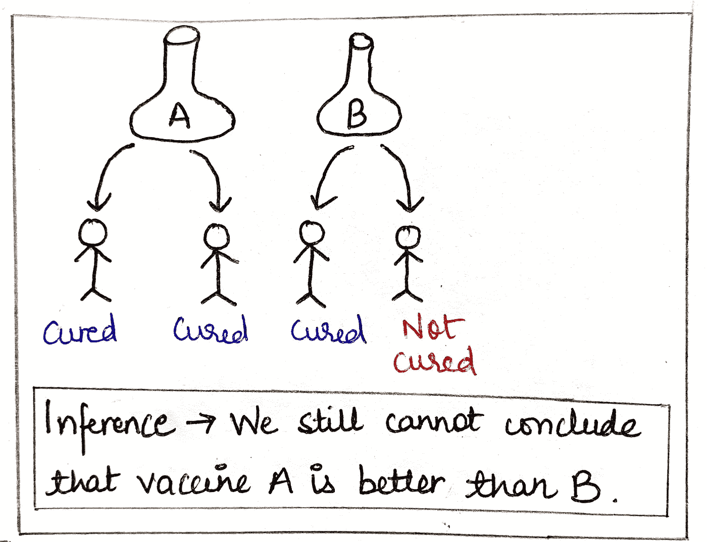
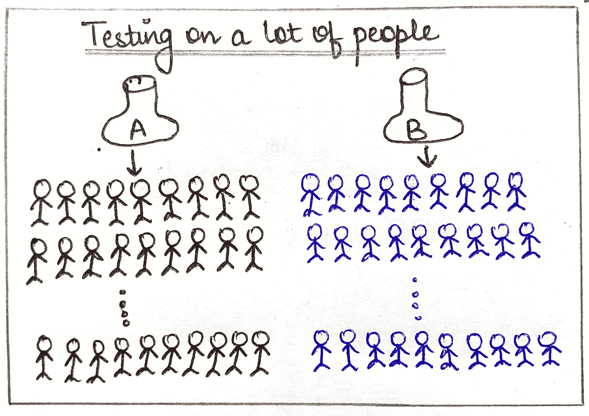
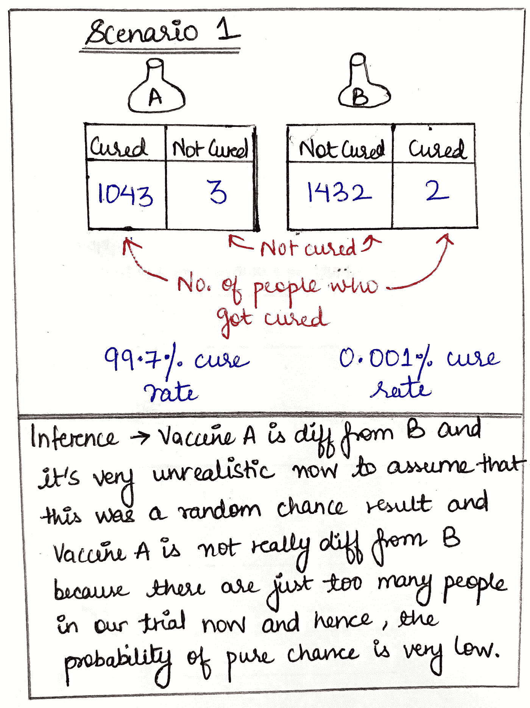
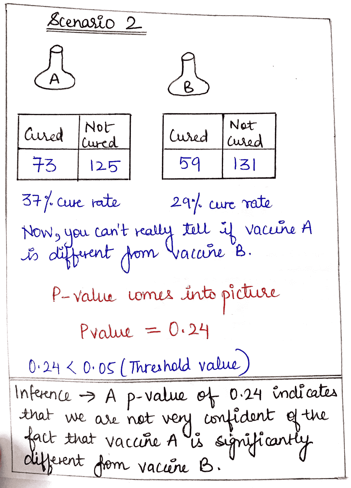
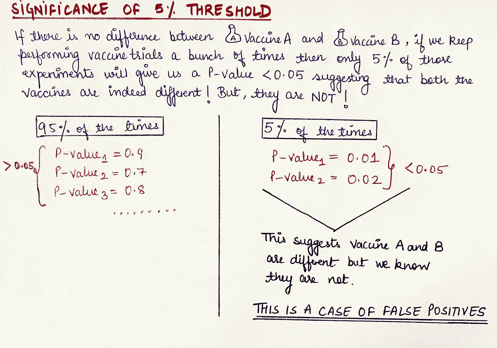

# P 值的圣杯以及它们如何帮助我们进行假设检验

> 原文：<https://towardsdatascience.com/holy-grail-for-p-values-and-how-they-help-us-in-hypothesis-testing-bce3d0759604?source=collection_archive---------43----------------------->

## 你是数据科学/ML 领域的吗？那你一定要看这个！

## 所有的互联网资料都把 p 值的概念搞得太复杂了，让我们通过简单的例子来解读它

这篇文章将会用例子来解释下面的概念:

1.  什么是 p 值？
2.  **如何解读它们？**
3.  **什么是阿尔法，为什么阿尔法=0.05 是普遍的规范？**
4.  **假设检验(什么是无效假设和替代假设，以及 p 值如何与它们相关联？)**

## 这篇文章中会用到的例子

让我们假设一个医学实验室正在开发多种疫苗，以便能够成功治疗冠状病毒。科学家们已经开发出了两种疫苗株- A 和 B，现在他们必须确定它们的有效性。

因此，在第一次试验中，他们分别在一名感染者身上测试了这两种疫苗。结果出来了，注射疫苗 A 的人被治愈了，但是注射疫苗 B 的人没有被治愈。

**现在，我们能说疫苗 A 比疫苗 B 好吗？不，我们不能。因为这只是一个人的试验，这给很多事情留下了机会。也许注射疫苗 A 的人有很强的安慰剂效应，或者注射疫苗 B 的人已经是心血管病人，并且对疫苗 B 的一种成分过敏。无数的事情都可能发生。因此，**总的推论是，我们不能基于一个样本量就说疫苗 A 比疫苗 B 好。****

现在，让我们假设科学家们进行了另一项试验。这一次，他们对两个人分别进行了两种疫苗的测试。

结果-注射疫苗 A 的人都被治愈了，而注射疫苗 B 的人被治愈了。现在，我们能自信地说疫苗 A 比疫苗 B 好吗？

**不，我们仍然不能这样说，因为我们在单人实验中谈到的机会因素在这里也适用。样本量仍然太小，无法推断出任何结论。**

继续，试验是在很多人身上进行的。

现在，让我们看看多种结果场景。

在图中显示的第一个场景中，请注意疫苗 A 的治愈率为 99.7%，而疫苗 B 的治愈率仅为 0.001%。现在，让我们假设，在疫苗 A 的试验组中，许多态度积极的中间派人士被排挤，导致安慰剂效应，而在疫苗 B 的试验中，许多过敏人群被排挤。 这可能会导致他们体内的反应，导致他们的症状没有减轻，或者可能会发生任何其他随机事件，可能有利于疫苗 A 而不利于疫苗 b。但是，因为我们可以在这里看到试验组的规模足够大，因此，抛开一些随机事件， 疫苗 A 对应的成功事件太多，疫苗 B 对应的失败事件也太多。**这一结果确实让我们有信心推断出疫苗 A 与疫苗 B 显著不同，可以说它是两者中较好的一个。**

现在，看看第二个结果场景，其中疫苗 A 和 B 的治愈率分别为 37%和 29%。现在，只看这些百分比，你能自信地宣称一种疫苗一定比另一种好吗？

不，我们不能，因为这里不像第一种情况那样有大约 0%和大约 100%的利率。

我们在分析世界中遇到的所有现实生活中的情况更接近于第二种情况，在这种情况下，仅仅靠人类的判断是不够的！在这里，我们求助于统计数据！

*我们对困惑之神说什么？不是今天* :D *(哈哈！对于门外汉来说，这是一个蹩脚的、小得了的参考)*。

相反，聪明的统计之神把 P 值作为我们武器库中的一个重要工具交给了我们，可以在这种情况下使用。

# 什么是 P 值？

> 它是一个介于 0 和 1 之间的数字，用于量化我们对疫苗 A 与疫苗 b 不同的确信程度。该值越接近 0，我们就越确信这两种疫苗之间存在显著差异。

## p 值阈值(Alpha)

现在，问题来了，P 值应该有多小才能让我们足够自信？标准α值通常取为 0.05

> 如果满足以下条件，则证明存在统计上的显著差异:
> 
> p 值≤α(一般为 0.05)

在上述情景 2 中，我们看到 p 值=0.24，显然不小于 0.05，**因此我们得出结论，两种疫苗彼此之间没有显著差异。**

> **记住，一个小的 p 值并不能告诉我们 A 和 B 有多大的差异。**例如，p 值=0.04 只是告诉我们 A 和 B 有显著差异，但不能告诉我们有多大的差异(差异可能很小，也可能很大)

## 但是，让我们更多地讨论为什么要设定 5%的门槛，以及它实际上意味着什么？

如果我们假设我们正在测试两种疫苗，它们实际上是来自一种疫苗的两个相同样本，因此它们彼此没有区别。*尽管如此，我们继续用 5%的α值测试这些样本，这意味着 95%的情况下我们会得到 p 值> 0.05，这将确认这两种疫苗没有不同，但是* ***对于剩余的 5%的情况，由于一系列随机原因，我们可能会得到 p 值< 0.05，这当然会指示错误的结果，这就是假阳性。*** (例如-妊娠试验结果为阳性，但该女士实际上并未怀孕，患者得到的活检报告为恶性，而肿瘤为良性-假阳性病例)

因此，alpha 值为 5%意味着 100 次中有 5 次会出现误报。

现在，如果我们在航空科学或生物科学领域工作，精度非常重要，不能让大量的假阳性发生，那么在这些情况下，我们必须使用α值，比如说 0.00001，这意味着 100，000 次中只有 1 次会出现假阳性。这种精度的成本非常高，因此很少有行业/用例要求 alpha 值小于 0.05。

类似地，如果你遇到一个自由的用例，比如垃圾车在每天早上 8 点 30 分钟内到达，我们也可以允许 alpha 值达到 0.2 或 20%。

> 因此，普遍接受的值 0.05 已经被一般化，因为它适合许多用例，但是在不符合这个置信度要求的情况下，它可以并且应该被调整。

现在让我们接触一下假设检验，因为我们已经讨论了它的前提。我遇到过许多关于这个主题的复杂文章，但是现在你已经阅读了疫苗的例子，这对你来说是小菜一碟，请继续阅读！

*   **无效假设:**两种疫苗没有区别(不需要证明什么，如果没有替代假设的证据也可以接受)*无罪直到被证明有罪是一个假设无效假设的例子，直到原告毫无疑问地证明被告部分确实是凶手，这样很容易记住定义:)*
*   **替代假设:**疫苗确实不同，我们说有 95%的置信度(在α= 0.05 的情况下)(这必须用显著的 p 值来证明，这使我们有信心拒绝零假设)

看，这些令人生畏的统计术语确实存在简单的解释！！

来源:[Zazzle.com 的 Pinterest](https://in.pinterest.com/pin/16888567341530267/)

到此为止，我们已经结束了这篇文章，如果你有兴趣，你也可以看看我关于统计学和机器学习的其他文章，所有这些文章都有我的手绘插图，简单的例子和大量的学习:)

 [## 解释清楚:正态分布和中心极限定理

### 这些概念有什么正常或不正常的地方？

towardsdatascience.com](/clearly-explained-normal-distributions-and-the-central-limit-theorem-8d7cc5a6052f)  [## 解释清楚:强大的中心极限定理

### 这实际上是最重要的统计定理之一，请继续阅读以获得简单的解释！

towardsdatascience.com](/clearly-explained-the-mighty-central-limit-theorem-b8152b94258)  [## 基础统计术语解码

### 用 VS 风格解释，先左后右！

towardsdatascience.com](/foundation-statistics-terms-decoded-f1def3721c1e) 

保重！快乐学习！保持安全和健康:)