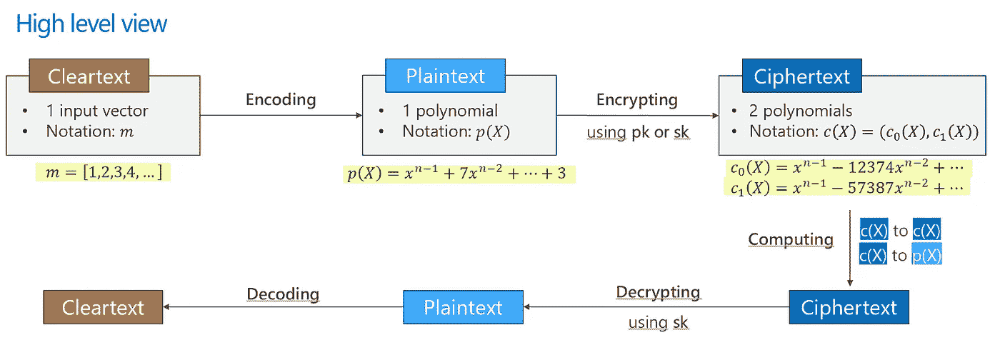

# 同态加密简介:第二部分:景观与 CKKS

> 原文：<https://towardsdatascience.com/homomorphic-encryption-intro-part-2-he-landscape-and-ckks-8b32ba5b04dd?source=collection_archive---------39----------------------->

## 描述同态加密的前景，他是什么，并首先看看 CKKS 的一个他方案的复数。

来源:[维基媒体](https://upload.wikimedia.org/wikipedia/commons/c/c8/Untersberg_Mountain_Salzburg_Austria_Landscape_Photography_%28256594075%29.jpeg)

**同态加密简介:**

[第 1 部分:概述和用例](https://medium.com/@dhuynh95/homomorphic-encryption-intro-part-1-overview-and-use-cases-a601adcff06c)

第二部分:何山水与 CKKS

[第三部分:CKKS 的编码和解码](/homomorphic-encryption-intro-part-3-encoding-and-decoding-in-ckks-69a5e281fee?source=friends_link&sk=f5f395522d78853747e9f1b913092d4e)

**一、引言**

在之前的文章[https://medium . com/@ dhuynh 95/homo morphic-Encryption-intro-part-1-overview-and-use-cases-a 601 ADC ff 06 c 中，](https://medium.com/@dhuynh95/homomorphic-encryption-intro-part-1-overview-and-use-cases-a601adcff06c)我们看到了为什么我们需要隐私保护机器学习，Homomorphic Encryption 如何实现它，以及它可以解决什么用例。

在本文中，我们将介绍同态加密的基础知识，并首先看看一个 he 方案的机制，来自论文[“用于近似数字算术的同态加密”](https://eprint.iacr.org/2016/421.pdf)的 **CKKS** ，与其他只对整数起作用的方案如 **BGV** 或 **BFV** 相比，它允许对实数进行近似算术。

因为在何的领域上很少有全面的指南存在，我们将花时间探索的基本力学，除了代数的基本知识之外，没有对读者背景的太多假设。

[环论(数学 113)](https://math.berkeley.edu/~gmelvin/math113su14/math113su14notes2.pdf) 为初学者提供环论的简单介绍。

**二。同态加密**

**A .核心原则**

他是一种加密方案，允许数据所有者加密他们的数据，并让第三方在不知道底层数据是什么的情况下对其进行计算。然后，对加密数据的计算结果可以发送回数据所有者，他将是唯一能够解密加密结果的人。

更正式地说，两个环 **R** 和**R’**之间的环同态 **h** 满足这两个性质:

*   **h(x + y) = h(x) + h(y)**
*   **h(x * y) = h(x) * h(y)**

这意味着，如果我们有一个加密同态 **e** ，一个解密同态 **d** ，使得 **d(e(x)) = x** ，以及一个函数 **f** ，它是加法和乘法的组合，那么我们可以有下面的场景:

*   用户使用 **e** 加密她的数据 **x** ，并将 **e(x)** 发送给不可信的第三方。
*   第三方对加密的 **e(x)** 执行计算 **f** 。因为 **e** 是同态，所以我们有 **f(e(x)) = e(f(x))** 。然后，第三方将数据发送回用户。
*   最后，用户解密输出，得到 d(e(f(x))) = f(x) ，而不会将她的数据直接暴露给不可信的第三方。

**B .简史**

这些方案首先从 RSA 开始，RSA 提供了一个同态方案，但是只有同态乘法。这是第一个部分同态加密(PHE)，这是一个只有一个操作的方案。其他类型的 he 方案可能是某种程度上的同态加密(SWHE ),具有有限数量的运算，以及最有趣的一种，完全同态加密(f HE ),它允许任意数量的评估。

自从 RSA 以来已经提出了几个 HE 方案，例如 Paillier 在论文[“基于复合度剩余类的公钥密码系统”](https://link.springer.com/chapter/10.1007%2F3-540-48910-X_16)中为 PHE 提出的方案，但是直到 Craig Gentry 的工作才在他的博士论文[“完全同态加密方案”](https://crypto.stanford.edu/craig/craig-thesis.pdf)中提出了第一个 FHE 方案。

Gentry 的突破是通过向 SWHE 引入自举实现的。其思想是，SWHE 通过添加噪声将明文加密成密文。可以对密文进行操作，但代价是增加噪声，如果操作太多，解密将提供错误的结果。Gentry 的 boostrapping 技术可以去除密文中的噪音，因此可以对密文进行无限制的操作。

虽然 bootstrapping 为 FHE 提供了一个理论框架，但它的效率太低，无法用于实践。从那以后，出现了更实用的方案，如 BGV 和 BFV 的整数算法，CKKS 的实数算法。

在关于 he 的这个系列的剩余部分中，我们将集中于 CKKS，一种分级的同态加密方案，这意味着加法和乘法是可能的，但是有限数量的乘法是可能的。虽然自举在 CKKS 是可用的，但是这种操作仍然是昂贵的，并且使得它在实践中不太可用。

**三世。CKKS**

这里我们将集中讨论 CKKS 方案。本节将介绍 CKKS 的基础，我们将在后面的文章中看到如何实现它。

CKKS 概况(资料来源:Pauline Troncy)

上图提供了 CKKS 的高层次视图。我们可以看到，消息 **m** ，它是我们想要对其执行计算的值的向量，首先被编码成明文多项式 **p(X)** ，然后使用公钥加密。

CKKS 使用多项式，因为与向量上的标准计算相比，多项式在安全性和效率之间提供了一个很好的折衷。

一旦消息被加密成由几个多项式组成的 **c** ，CKKS 提供了几种可以对其执行的操作，比如加法、乘法和旋转。

虽然加法非常简单，但乘法的特殊性在于它会大大增加密文中的噪声，因此为了管理它，只允许有限次数的乘法。旋转是给定密文的槽上的置换。

如果我们用 **f** 表示一个由同态运算合成的函数，那么我们得到用秘密密钥解密**c’= f(c)**将产生**p’= f(p)**。因此一旦我们解码它，我们将得到 **m = f(m)。**

这为我们提供了 CKKS 工作方式的高级视图，我们将在下一篇文章中看到如何实现实现这种方案所必需的加密原语，它们是:

*   设置方案的参数
*   创建密钥和公钥
*   将向量编码成明文多项式，并将明文多项式解码成向量
*   使用公钥将明文多项式加密成密文多项式对，并使用私钥对其进行解密。
*   对密文进行加法、乘法和旋转

**结论**

我们看到了他一般是如何工作的，他的方案有哪些不同的类型，并且预演了实数近似算术的 CKKS 方案。

这让我们对他有了一个更高层次的了解，并为下一篇文章铺平了道路，在下一篇文章中，我们将深入研究代码并从头开始实现 CKKS。

我希望您喜欢这篇文章，并为下一篇文章做好准备，在下一篇文章中，我们将看到如何在同态设置中将向量编码成多项式！

如果您有任何问题，请不要犹豫，通过 [Linkedin](https://www.linkedin.com/in/dhuynh95/) 联系我，您也可以通过 [Twitter 找到我！](https://twitter.com/dhuynh95)