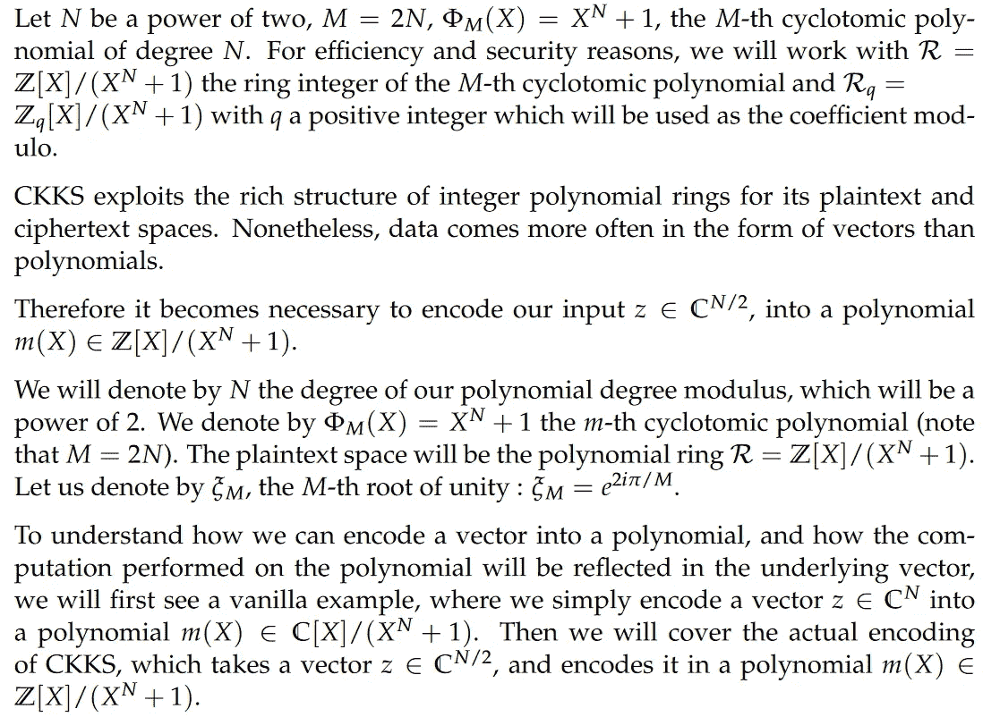

# 同态加密介绍:第 3 部分:CKKS 的编码和解码

> 原文：<https://towardsdatascience.com/homomorphic-encryption-intro-part-3-encoding-and-decoding-in-ckks-69a5e281fee?source=collection_archive---------26----------------------->

来源: [Pixabay](https://pixabay.com/photos/message-in-a-bottle-bottle-message-5322112/)

**编辑:**这篇文章现在可以在 OpenMined 的博客上看到。由于编写代码和数学的问题，我决定在 OpenMined 上发布该系列的其余部分，以获得更舒适的读者体验。链接如下:

[CKKS 解释道:第一部分，普通编码和解码](https://blog.openmined.org/ckks-explained-part-1-simple-encoding-and-decoding/)

[CKKS 解释:第二部分，完全编码和解码](https://blog.openmined.org/ckks-explained-part-2-ckks-encoding-and-decoding/)

[CKKS 解释:第三部分，加密和解密](https://blog.openmined.org/ckks-explained-part-3-encryption-and-decryption/)

**同态加密简介:**

[第 1 部分:概述和用例](https://medium.com/@dhuynh95/homomorphic-encryption-intro-part-1-overview-and-use-cases-a601adcff06c)

[第二部:何山水与](https://medium.com/@dhuynh95/homomorphic-encryption-intro-part-2-he-landscape-and-ckks-8b32ba5b04dd)

第 3 部分:CKKS 的编码和解码

**简介**

在上一篇文章中，我们看到了什么是同态加密，它是如何工作的，并对 CKKS 有一个简短的了解。

CKKS 概况(资料来源:Pauline Troncy)

上一篇文章中的这张图展示了 CKKS 的工作流程。如前所述，要对加密的向量执行计算，我们必须先将其编码成多项式，然后再将其加密成一对多项式。

你可能会问，为什么我们需要它使用多项式而不是向量？这是因为多项式有一个“好”的结构，允许非常有效地进行一些计算，同时仍然保持很高的安全性。

因此，CKKS 首先将一个向量编码成一个明文多项式。人们可以把它看作是把一条信息放进一个玻璃瓶，因为信息被装在一个容器里，使它“更容易”处理，而信息仍然清晰可见，任何人都可以恢复它。

**注意:**由于介质的限制，很难编写 LaTeX 和代码，所以在我的 Github 存储库中有一个笔记本，包含了与本文相同的内容，其中包含了所有带代码的文章:[https://github.com/dhuynh95/homomorphic_encryption_intro](https://github.com/dhuynh95/homomorphic_encryption_intro)

感兴趣的笔记本是[https://github . com/dhuynh 95/homo morphic _ encryption _ intro/blob/master/01 _ encoding _ decoding _ ckks . ipynb，](https://github.com/dhuynh95/homomorphic_encryption_intro/blob/master/01_encoding_decoding_ckks.ipynb)你可以在[https://Colab . research . Google . com/github/dhuynh 95/homo morphic _ encryption _ intro/blob/master/01 _ encoding _ decoding _ ckks . ipynb](https://colab.research.google.com/github/dhuynh95/homomorphic_encryption_intro/blob/master/01_encoding_decoding_ckks.ipynb)使用 Google Colab 执行它

以下 LaTeX 文档截图来自我的硕士论文《同态随机森林》。

**一、预赛**

**二。普通编码**

我们现在将看看如何在实践中实现这一点:

**三世。CKKS 编码**

我们现在将在实践中看到如何通过修改普通编码器和解码器来编码 CKKS 编码器和解码器:

**结论**

在本文中，我们看到了编码和解码是如何在 CKKS 中执行的，以及这些过程是如何同态的，因此允许将向量的多项式表示相加和相乘，稍后会发现底层值也被修改了。

这是我们同态旅程的第一步，稍后我们将看到如何使用同态加密和解密多项式。

所以，我希望你喜欢读这篇文章，如果能得到你的反馈，那就太好了，我会在未来试着发布更多的文章。

如果您有任何问题，请不要犹豫，通过 [Linkedin](https://www.linkedin.com/in/dhuynh95/) 联系我，您也可以通过 [Twitter 找到我！](https://twitter.com/dhuynh95)