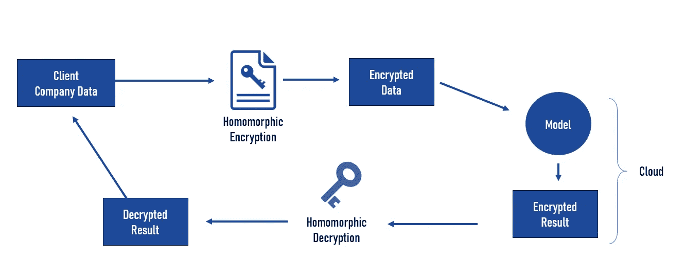

# 同态加密和机器学习:新的商业模式

> 原文：<https://towardsdatascience.com/homomorphic-encryption-machine-learning-new-business-models-2ba6a4f185d?source=collection_archive---------26----------------------->

## 同态加密介绍、用例以及对机器学习项目的影响

乔恩·摩尔在 [Unsplash](https://unsplash.com/s/photos/lock?utm_source=unsplash&utm_medium=referral&utm_content=creditCopyText) 上的照片

人工智能项目的一个主要“问题”是数据隐私。事实上，您可能会为您的公司确定最佳用例，然后意识到您的业务项目依赖于您不被允许使用的数据，因为您无法遵守现有的数据隐私法规(有充分的理由)。这种情况阻碍了我们在现实生活的商业应用中利用人工智能的能力。

**事实上，大多数机器学习系统都是由非常敏感和私人的数据(客户数据、健康记录、闭路电视录像等)提供的。).**在这个行业的几个项目之后，我可以向你保证，对隐私法律问题的担忧是开发新的人工智能解决方案和商业模式的严重障碍。

此外，大多数公司都没有意识到，他们可以利用自己掌握的数据创造新的收入来源，同时保护这些数据的隐私。一种叫做同态加密的解决方案可能有助于改善这种情况。

在本文中，我将解释什么是同态加密(HE)，这种技术目前的局限性，以及它如何在保护数据隐私的同时帮助创建新的商业模式。

# 今天的问题

让我们从一些常见的 ML 问题开始。机器学习模型很难在各种用户之间共享。此外，共享模块是不可行的，因为它在每一端都需要高计算量。

大多数公司依赖云计算，并通过云 API 利用 ML 模型。这种情况有助于解决计算能力的问题，但会将数据暴露给云提供商。

> 在一些欧洲国家，拥有美国云提供商会阻止你与公共组织和国有公司做生意( [1](https://www.wired.com/insights/2011/12/microsofts-pushes-back-on-eu-cloud-concerns-as-european-rivals-move-in/) )。

此外，目前的数据隐私法规，如欧洲的 GDPR ( [2](https://en.wikipedia.org/wiki/General_Data_Protection_Regulation) )限制了人工智能解决方案的使用。例如，如果您在金融服务行业工作，您的组织需要处理大量个人身份信息(PII)和金融数据，这些信息在存储和传输时都需要加密。

> **个人身份信息(PII)** :任何与可识别的人相关的信息( [3](https://en.wikipedia.org/wiki/Personal_data) )。

最后，由于相互之间缺乏信任，竞争对手几乎不可能交换数据。这种情况限制了我们在需要更多数据(健康研究)时的创新能力。拥有一种新的加密方法将使许多公司受益，创造新的生态系统和商业模式。

# 什么是同态加密？

他允许直接对加密数据进行计算。通过使用先进的密码学，使得**“在匿名数据集上运行机器学习而不丢失上下文”** ( [5](https://www.microsoft.com/en-us/ai/ai-lab-he) )成为可能。

> **计算**:数学计算的动作。

无论您处理的是静态数据还是传输中的数据，当前大多数公钥加密都要求在操作数据之前必须对其进行解密。

事实上，现有的加密算法使得不先解密就无法处理数据——而解密你的数据并不能让你遵守数据隐私法。如果数据通过任何其他方式加密，在处理之前必须首先解密，这使得数据容易受到未经授权的访问。

他让你在使用数据之前不再需要解密。换句话说，在您处理数据时，数据完整性和隐私得到了保护。事实上，同态加密允许在加密数据仍处于加密状态时对其进行处理。

他/云流程

遵守数据隐私法(GDPR 等。)经常让人工智能团队花时间试图绕过法规或缩小项目范围。**他会帮助我们将所有数据加密存储在云端，并对加密数据进行计算**。

尽管有这种潜力，这项技术还没有准备好大规模采用。在不久的将来，我希望看到更多有限形式的高等教育，如“可搜索加密”和“多方计算”成为主流。这些解决方案或多或少能达到同态加密所能达到的效果。但是，他们没有何的主要缺点:**运算速度慢(**[**6****)。**](https://blog.openmined.org/what-is-homomorphic-encryption/)

目前，同态加密非常慢。这部分是因为同态加密比明文运算具有更大的计算开销。

> 虽然这项技术已经存在了 40 多年，但计算障碍使它只能停留在学术/研究领域。

# 新的商业模式

从商业角度来看，将机器学习算法的执行委托给计算服务，同时保持训练和测试数据的机密性将成为可能。**这可能是行业的重大变革，并改变云行业。**

他还将促成几家竞争公司之间的合作。要理解为什么，首先要分析云计算的兴起。云服务提供商的成功(例如:Azure、Google Cloud 等。)可以解释为在数据中心进行了大量投资，以提供帮助小公司降低成本的服务。

> 很快，我们可以想象一个用户使用 API 将其加密的数据发送到云端，并从机器学习模型中获得加密的结果。在整个过程中，数据既不会被解密，也不会存储在云中。因此，云提供商无法访问用户的数据。

然而，采用这些服务的一个障碍与云提供商处理的数据的隐私和保密性以及该数据的商业价值/保护敏感数据处理的法规有关。通过利用 HE，云公司可能能够说服新公司使用他们的服务。

> 他将实现以前不可能实现的新商业模式。

他将帮助创建一个全新的数据行业，将拥有数据的公司与需要数据的公司或个人结合在一起。这种情况使得现有的敏感或受监管数据资产能够以以前被认为不可能的方式被使用。

**我希望看到更多的数据市场，使公司能够利用他出售他们的数据。**

由于最近的危机，创造新的收入来源的需要变得更加具有战略意义。因此，越来越多的公司开始分析如何利用现有的数据资产。

他可以帮助公司**安全地利用数据赚钱，同时保护客户和数据本身的隐私。我希望看到更多专门创建数据市场的创业公司，使公司能够使用 he 出售他们的数据。**

通常，公司可能最终拥有与其业务完全无关的大量有价值的数据集(与制造过程相关的数据，等等)。).因此，他们应该寻找一种方法来将这些资产货币化，并将其提供给数据科学家，这些科学家寻求额外的训练数据，以使他们的人工智能系统更加准确，同时保持底层数据的隐私和安全。

在市场营销中，公司经常需要在顾客旅程的每一步(线上和线下)收集数据，以构建购物体验的完整画面。然而，由于数据隐私法规，一些有趣的潜在数据源仍然遥不可及。同态加密可能有助于公司在遵守隐私法规的同时利用新的数据源。

> **大多数人工智能营销项目缺乏完全准确的上下文数据。**

人工智能厂商可能熟悉数据可用性的问题。在一些用例中，人工智能供应商需要更多的数据来成功进行概念验证(缺乏准确性等)。).然而，由于法律原因，这并不总是可能的。利用 HE，人工智能供应商可以访问额外的数据，并在真实数据(银行、医疗机构等)上展示他们的算法。).

> 他将通过共享数据来帮助竞争对手公司进行合作。

谈到合作，我们可以想象，由于同态加密，同一行业的公司将开始共享数据，并创建新的流。保证数据隐私和经济回报的可能性可能有助于激励通常不愿分享公司数据的参与者(见:联合学习)。

> **联邦学习:**一种机器学习技术，它在多个分散的边缘设备或保存本地数据样本的服务器上训练算法，而不交换它们( [7](https://en.wikipedia.org/wiki/Federated_learning) )。

**在具体的使用案例中，从 AI 的角度来看，与类似公司共享数据是最好的解决方案**。事实上，你可能会遇到竞争对手的金融机构，它们可能会认为，围绕某些共同风险(如洗钱)开展合作符合它们的利益。通过利用 HE，公司可以将他们的数据集中起来“共同构建反洗钱模型，同时保持他们的敏感客户数据的私密性”( [8](https://venturebeat.com/2020/01/16/meet-the-new-twist-on-data-encryption-that-promises-better-privacy-and-security-for-ai/) )。在医疗保健行业也可以找到类似的使用案例。

可以肯定的是，在未来几年里，他将会带来更多的突破。正如世界经济论坛( [9](https://www.weforum.org/agenda/2020/01/new-paradigm-data-sharing/) 所提到的，数据共享已经帮助了很多行业。例如:

*   用于医学研究的大型集合患者数据
*   实时位置数据让城市交通更加智能

与许多突破性技术一样，市场对 he 的采用将取决于利用 HE 的用例数量。我预计会有越来越多的初创公司变得专门从事同态加密的实施，而咨询公司可能会帮助公司接受与竞争对手分享更多数据的想法。

## 有关同态加密的更多信息，我推荐以下链接:

*   [同态加密相关项目](https://www.microsoft.com/en-us/ai/ai-lab-he)
*   [超越信任:为什么我们需要数据共享模式的转变](https://www.weforum.org/agenda/2020/01/new-paradigm-data-sharing/)
*   [用于机器学习的全同态加密](https://tel.archives-ouvertes.fr/tel-01918263v2/document)
*   [什么是同态加密？](https://blog.openmined.org/what-is-homomorphic-encryption/)
*   [使用全同态加密保护云计算](https://www.researchgate.net/publication/304339109_Using_Fully_Homomorphic_Encryption_to_Secure_Cloud_Computing)
*   [同态加密能实用吗？](https://eprint.iacr.org/2011/405.pdf)
*   [了解数据加密的新趋势，它承诺为人工智能提供更好的隐私和安全性](https://venturebeat.com/2020/01/16/meet-the-new-twist-on-data-encryption-that-promises-better-privacy-and-security-for-ai/)