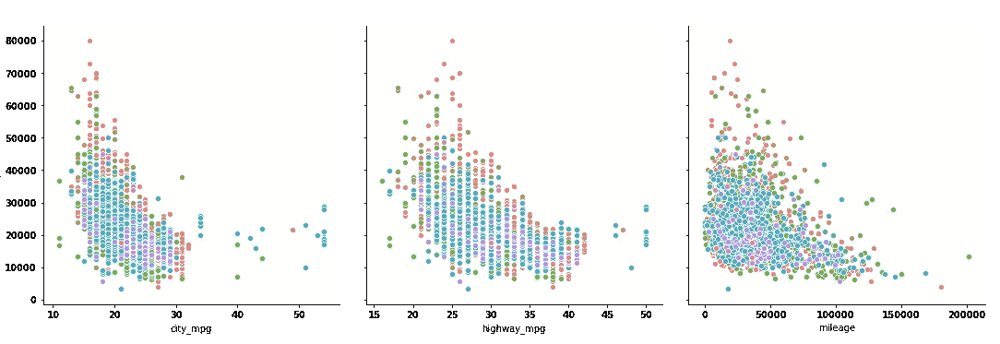
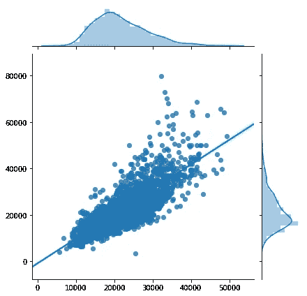

# homscedasti-whatsidity？

> 原文：<https://towardsdatascience.com/homoscedasti-whatsidity-9c925b94b9b7?source=collection_archive---------23----------------------->

由[edu·劳顿](https://unsplash.com/@edulauton?utm_source=unsplash&utm_medium=referral&utm_content=creditCopyText)在 [Unsplash](https://unsplash.com/s/photos/flying-umbrella?utm_source=unsplash&utm_medium=referral&utm_content=creditCopyText) 上拍摄的照片

## 当数据科学借用玛丽·波平斯的话

大家好，今天我们要谈论的是同音异义性，也就是数据科学中最难发音的词。这将是一个简短的概述，因为与所有数据科学一样，进入杂草中的机会非常大。

那么什么是同方差呢？字幕上说它是从《欢乐满人间》中借用的，但实际上，这个词源于希腊语。我们有前缀 *Homo-* 来自希腊语，表示“相同”，我们加上- *skedacity* ，或 *skedastikos* ，根据韦氏词典的说法，希腊语表示“能够分散”。所以同方差意味着相同或相似的离差。好了，完成了，现在我们不用再谈了。

哈！开个玩笑，我们将向您展示一些图形，以便您可以真正了解正在发生的事情。如果你想把它分解成简单的英语，我们可以观察数据的分布，并确定误差项，或任何导致我们的数据不整齐一致的东西，在所有的数据点上都是相同的。这导致了一些非常可预测的结果，以统计为生的人喜欢看到同质性，但并不总是如此。同方差确实提供了一个坚实的可解释的地方来开始他们的分析和预测工作，但有时你希望你的数据是杂乱的，如果没有别的原因，只是说“这不是我们应该寻找的地方。”

# 线性回归中的同方差

让我们来看看同性恋是什么样子的，好吗？要真正知道发生了什么，你还必须知道异方差或它的对立面。如果某样东西不是异方差的，它要么是异方差的，要么两者都有。我们可以使用数学方法，通过检查方差或运行 [F 检验](https://en.wikipedia.org/wiki/F-test)来确定某样东西是同方差还是异方差，但最简单的检查方法是运行散点图并查看数据。可视化太棒了！

茄子，墨西哥胡椒，花

现在，在上面的图表中，我们可以看到我的二手车线性回归价格预测项目的一些基本散点图相关性。如果我们知道同异方差意味着相同的分布或离差，那么上面的三张图表示同异方差还是异方差？如果你说异方差，你就赢了！我们看到的是一个典型的异方差的例子！

异方差分布的一个特征是趋向于锥形，正如我们在最右边的图中可以清楚地看到的。它们也可以看起来像我们在左图和中间图中看到的茄子和墨西哥胡椒。基本上，任何时候我们**不能**自信地通过我们的数据画一条线，并且知道我们得到了大多数值的范围内，那么我们可以开始怀疑异方差！

那么，同性恋是什么样子的呢？这是一个同方差散点图的样子:

这并不完美，但是初步观察，你可以说这倾向于同质化。它肯定比前面的图更具同质性。您可能会注意到，在这个图中有大量的异常值。在线性回归中，异常值对确定数据集的同方差有很大影响。根据它们的影响程度，如果它们对结果没有实际影响，您可以选择忽略它们，或者如果有显著影响，您可以选择进一步转换数据。如果它们倾斜得太厉害，你可以尝试添加更多的特性，或者完全抛弃这个模型。

不管离群值的存在，我们可以看到我们的模型成功地在所有数据点的合理距离内。这满足了我们对“同分布”的定义也就是说，它们沿着我们的模型的线类似地分布。要记住的一件重要的事情是，不管你读了多少教科书，或者像这样的博客，当涉及到真实世界的数据时，从来没有真正的同质性。真实的世界嘈杂、混乱、充满谎言，这将会影响你的数据。因此，所有的模型都会有些混乱，所以我们希望尽可能接近同方差，除非进一步分析残差和进行额外的测试，否则我们可以确信我们观察到的是同方差。

# 结论

我希望你喜欢这个关于数据科学中最有趣的词的简要概述。对我来说，这可能是我有生以来最难发音的单词。

同异方差，或接近同异方差，是想要得到一个工作模型的数据科学家的黄金标准，事实上，对它的测试，或对异方差的测试是开发这些模型的一个关键组成部分。让它们运行并确认它们意味着运行一个好模型和一个坏模型的区别。

所以下次你看到那个圆锥体的时候，记住，它不是同性恋！