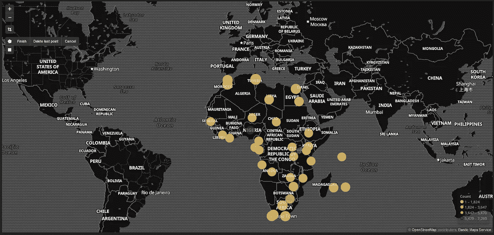
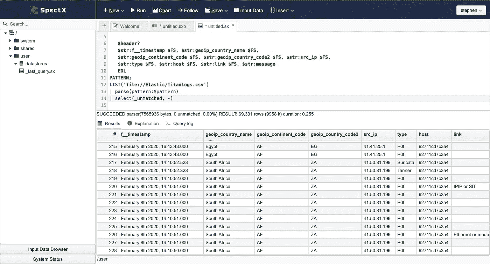
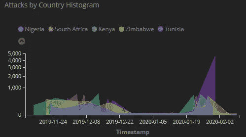
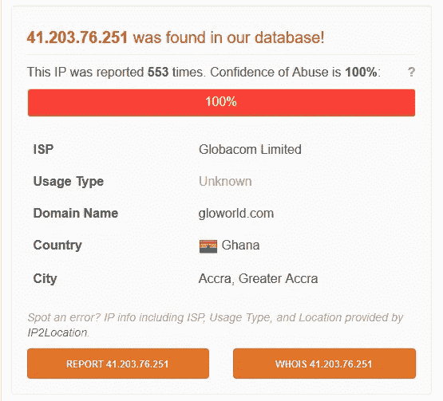
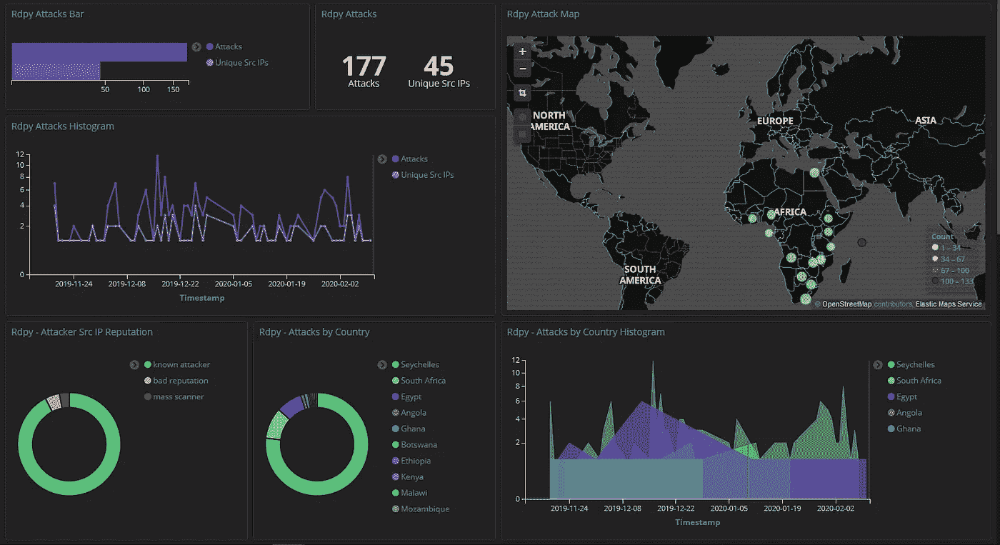
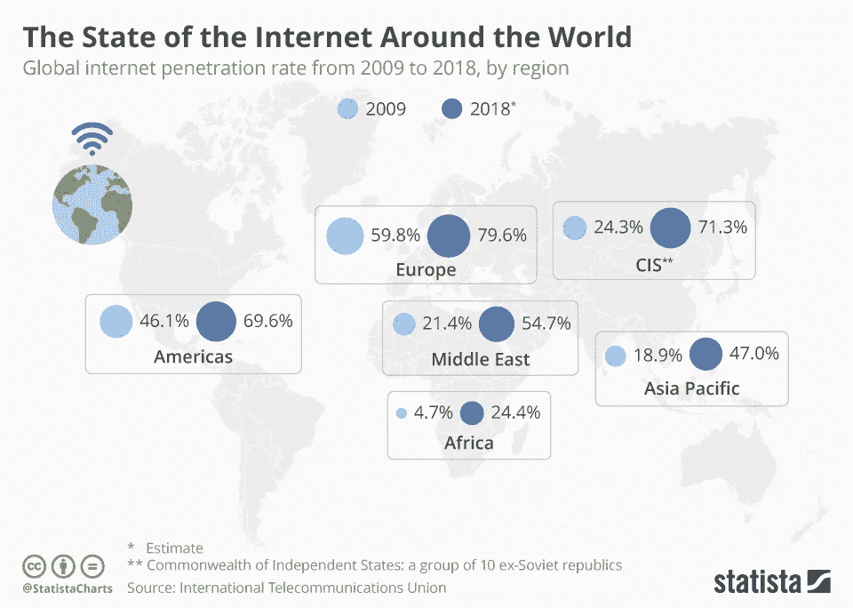

# 蜜罐&非洲:用 Kibana & SpectX 分析网络威胁

> 原文：<https://towardsdatascience.com/honeypots-africa-analysing-cyber-threats-with-kibana-spectx-d1176ad7232e?source=collection_archive---------32----------------------->

## 网络安全与非洲



非洲各地的网络威胁— Kibana(弹性地图服务)

围绕网络安全的讨论通常集中在世界上四大恶意攻击者身上。美国、俄国、中国&朝鲜，讨论范围从大规模数据泄露到国家支持的对基础设施的恶意攻击(例如[stat xnet](https://en.wikipedia.org/wiki/Stuxnet)或 [BlackEnergy 2](https://en.wikipedia.org/wiki/BlackEnergy) )。2019 年，[我构建并部署了一个蜜罐系统](https://towardsdatascience.com/@Stephen_Chap)，用来吸引攻击者并监控和记录活跃的网络事件。蜜罐系统被设计成模仿真实的系统，攻击者在侵入系统之前不会知道其中的区别。它可用于检测攻击或使攻击偏离合法目标。它还可以用来获取有关网络罪犯如何运作的信息。但是我对这些数据的关注是在非洲。我想了解网络安全的前景，因为最近网络安全和技术已经成为整个非洲大陆宣言和政策的焦点。但是作为一个大陆，非洲是互联网普及率最低的地区之一。这对网络安全格局有何影响？

# 非洲有网络安全问题吗？

我会说是，原因如下。2018 年 1 月，许多媒体报道([首先由法国报纸《非洲世界报](https://www.lemonde.fr/afrique/article/2018/01/26/a-addis-abeba-le-siege-de-l-union-africaine-espionne-par-les-chinois_5247521_3212.html)报道)称，在埃塞俄比亚亚的斯亚贝巴的非洲联盟总部发生了一起令人担忧的违规事件。

> 非洲联盟是一个大陆联盟，由位于非洲大陆的 55 个成员国组成。

漏洞每天都在发生，对吧？但不是像这样。这一违规行为据称持续了 5 年。2012 年，中国出资在亚的斯亚贝巴建造了一座价值 2 亿美元的新建筑，中国公司获得了内部技术基础设施的合同。2017 年，在[非洲联盟(AU)](https://au.int/) 总部建成 5 年后，分析师发现，从 2012 年到 2017 年 1 月，数据传输活动在每晚午夜到凌晨 2 点之间处于高峰。我们发现所有系统的数据都被转移到了位于上海的服务器上。中国否认了所有的指控，非盟拒绝对此事发表评论。然而，其结果是，非盟切断了与[埃塞俄比亚电信](https://www.ethiotelecom.et/)的联系，并对所有电子通信实施了加密，建立了全新的基础设施。但现在问题来了，五年来，什么样的网络政策在监控网络活动？同样值得注意的是，被替换的大部分基础设施是华为网络设备… *(如果你有兴趣阅读更多关于这个故事的内容，* [*请查看贾斯汀·谢尔曼*](https://medium.com/dukeuniversity/whats-the-deal-with-huawei-and-a-hack-at-african-union-headquarters-1e454c1f31a2)*[*杜克大学*](https://medium.com/u/f69fb1ad537a?source=post_page-----d1176ad7232e--------------------------------) *的报告。)**

> *[华为发布了关于“违规”和他们与非盟合作的声明。](https://www.huawei.com/en/facts/voices-of-huawei/statement-on-huaweis-work-with-the-african-union)*

# *让我们来看数据！*

*   *T-Pot 蜜罐— [我写了一篇关于如何部署的指南。](https://medium.com/@Stephen_Chap/deploying-monitoring-honeypots-on-gcp-with-kibana-899fef6fdf76)*
*   *我还写了一个如何使用它的指南。*
*   *SpectX——当我无法访问 GUI 并且需要解析日志时使用。可以远程查询日志和进行分析，而无需导入数据。*

## *我如何查看来自非洲的数据？*

*非洲有 54 个国家，过滤掉所有 54 个国家将花费很长时间，因此我们可以在 Kibana 上使用以下过滤器进行解析:*

```
*{
  "query": {
    "match": {
      "geoip.continent_code": {
        "query": "AF",
        "type": "phrase"
      }
    }
  }
}*
```

*如果您使用 SpectX 查看日志文件:*

```
*| filter (geoip.continent_code = “AF” )*
```

*其他*GeoIP . continental _ codes*:*

```
*AF - Africa
AN - Antarctica
AS - Asia
EU - Europe
NA - North America
OC - Oceania
SA - South America*
```

*   *[CC2ASN](http://www.cc2asn.com/) —为属于世界上任何给定国家的 AS 号码和前缀提供简单的查找服务。*

*如果你的蜜罐没有访问数据的前端系统，我推荐使用 [SpectX](https://www.spectx.com/get-spectx) 并将其指向你的日志。它自动检测*中的列。csv* 文件，您还可以编写一个解析器来给出典型字段的结果:*

```
*$pattern = <<<PATTERN
   $str=(CSVDQS{2,256000}:value| CSVSQS{2,256000}:value| DATA{0,256000}:value);
   $header=(BOS LD EOL);
   $FS=',';

   $header?
   $str:f__timestamp $FS, $str:geoip_country_name $FS,
   $str:geoip_continent_code $FS, $str:geoip_country_code2 $FS, $str:src_ip $FS,
   $str:type $FS, $str:host $FS, $str:link $FS, $str:message
   EOL
PATTERN;
LIST('file://Elastic/TitanLogs.csv')
| parse(pattern:$pattern)
| select(_unmatched, *)*
```

**

*SpectX —查看蜜罐数据的另一种方式 Stephen Chapendama 截图*

> *审查这些数据描绘了一幅有趣的非洲网络安全图景。3 个月内，蜜罐遭受了***2186197 次*** 攻击。25，787 来自非洲。*

## *按国家/地区列出的前 5 大攻击直方图*

**

*尼日利亚、南非、肯尼亚、津巴布韦和突尼斯 Stephen Chapendama 截图*

*过去几周，来自尼日利亚的日志有明显的峰值，因此决定通过过滤以下内容进行调查:*

```
*{
  "query": {
    "match": {
      "geoip.country_name.keyword": {
        "query": "Nigeria",
        "type": "phrase"
      }
    }
  }
}*
```

*有趣的是，在 6000 次攻击中，有 4620 次来自一个 IP 地址，这使得尼日利亚的调查变得更加容易。**嗨，*41.203.76.251😒令人惊讶的是，这是一个在加纳注册的网络，所以有人试图掩盖他们的踪迹。自 2019 年 9 月首次被报告以来，这一威胁行为者一直活跃在 [AbuseIPDB](https://talosintelligence.com/reputation_center/lookup?search=41.203.76.251#whois) 上，有 553 份报告，目前已被列入 [Talos 安全情报黑名单](https://talosintelligence.com/reputation_center/lookup?search=41.203.76.251#whois)，大多数攻击集中在暴力和 SSH 攻击上。****

**

*这个 IP 已经被举报 553 次了！—由 AbuseIPDB 提供*

## *帮助您调查的开源资源:*

*   *这是我在调查 IP 地址时最喜欢的信息来源之一。通常，安全分析师会连接 API 并自动报告恶意流量，因此它总能让我大致了解一个 IP 最近一次活跃在可疑行为中的时间，以及人们看到的攻击类型。它还提供了批量 IP 检查。*
*   *思科的 Talos Intelligence(Talos Intelligence)—我经常使用这个平台作为第二信息来源来确认我可能已经知道的事情。思科 Talos 的优势在于，它还能给我提供关于垃圾邮件、邮件数量和网络声誉的信息。*

## *漏洞呢？*

*大多数基于 Windows 的攻击都试图利用[**CVE-2001–0540**](https://www.cvedetails.com/cve/CVE-2001-0540)，*Windows NT 和 Windows 2000 中终端服务器的内存泄漏，这使得远程攻击者能够通过大量畸形的 RDP* 造成拒绝服务(内存耗尽)。在大多数非洲政府大楼里，经常没有修补的旧版本窗户随处可见，更不用说私营部门了。在一些国家的农村地区，大多数电脑没有连接到互联网，这反过来保护他们免受威胁，因为他们通常依赖簿记和纸质记录。由于蜜罐也在监控 RDP 的攻击，数据如下:*

**

*RDP 攻击面 Stephen Chapendama 截图*

## *CVE 的笔记:*

*   *[CVE-2019–0708 |远程桌面服务远程代码执行漏洞](https://www.cvedetails.com/cve/CVE-2019-0708)*
*   *[CVE-2001–0540 |无效的 RDP 数据会导致终端服务中的内存泄漏](https://docs.microsoft.com/en-us/security-updates/securitybulletins/2001/ms01-040)*
*   *[CVE-2012–0152 |终端服务器拒绝服务漏洞](https://www.cvedetails.com/cve/CVE-2012-0152)*

## *如果您对部署以服务器为中心的蜜罐感兴趣:*

*   *[Amun](http://amunhoney.sourceforge.net/) —漏洞仿真蜜罐*
*   *[蜜罐](http://conpot.org/) —低交互服务器端工控系统蜜罐*
*   *[KFSensor](http://www.keyfocus.net/kfsensor/) —基于 Windows 的蜜罐入侵检测系统(IDS)*
*   *[蜜罐](https://github.com/tillmannw/honeytrap) —低交互蜜罐和网络安全工具，用于捕获针对 TCP 和 UDP 服务的攻击*

## *互联网普及率低对非洲大陆有什么影响？*

*非洲也有恶意机器人和攻击者的问题。尽管欧洲大陆和世界上一些国家的互联网普及率最低，但网络攻击者正在寻找一种针对企业的方法。但是根据国际电信联盟收集的数据，事情正在发生变化，国际电信联盟是联合国的一个国际专门机构，负责信息和通信技术方面的问题；*2011 年，13.5%的非洲人口接入了互联网，而当时非洲人口占世界人口的 ***15%*** ，这意味着当时世界互联网用户的 ***6.2%*** 是非洲人。**

****

**来自 Statista 的关于全球互联网渗透率的数据。**

> **到 2019 年，从国际电信联盟发布的[数据来看，非洲*28.2%的地区以每 100 名居民为单位拥有互联网接入。相比之下，亚洲&太平洋地区 *48.4%* 的互联网接入率与欧洲的 *82.5%* 相比。*](http://www.itu.int/ict/statistics)**

***从蜜罐数据来看，令我惊讶的是，来自塞舌尔的黑客比来自南非的黑客与蜜罐互动得更多。一个常见的误解是，根据南非的面积，你会认为它的互联网普及率更高。非洲的互联网接入往往分布不规则。塞舌尔在 2017 年，*37%的人口拥有互联网接入，相比之下，南非只有 11%的人口拥有互联网接入。然而，值得注意的是，与其他大陆相比，这些数字并没有反映出非洲互联网使用的复杂性。例如，网吧亭现在在英国已经很少见了，但是在非洲，这仍然是人们非常流行的上网方式。但撇开这些信息不谈，非洲电信市场的增长速度比世界其他地区都要快。****

## ****结论****

****在网络安全方面，看到非洲互联网的发展是积极的一步。然而，移动货币的采用和金融科技的繁荣也将带来针对这一领域的网络犯罪的新增长。但随着互联网变得越来越容易访问，它为用户提供了跟上时代和学习基本网络概念的机会。肯尼亚和尼日利亚都有活跃的网络安全社区，爱好者和商业领袖经常在主要城市定期聚会。2017 年的一份关注非洲网络安全的报告提到，非洲的银行和金融服务占了非洲大陆网络犯罪损失的近四分之一，其次是政府、电子商务、移动交易和电信。****

****普华永道在 2019 年 1 月发布了他们的[第 22 届年度全球首席执行官调查](https://www.pwc.com/mu/pwc-22nd-annual-global-ceo-survey-mu.pdf)，网络威胁被确定为全球增长的第五大威胁，排在过度监管、政策不确定性、技能可用性和贸易冲突之后。随着这一行业的持续增长，它将为非洲的失业者提供就业机会。****

****总之，随着非洲互联网使用的增长，网络足迹也将增长，这创造了一个机会之窗，造就了下一代网络安全专家，但与此同时，它也将为世界制造新的威胁因素。企业必须适应，社区必须接受教育，最终，非洲将全部连接起来。****

## ****延伸阅读:****

*   ****[网络犯罪和数据隐私:非洲如何升级游戏](https://www.africaportal.org/features/cyber-crime-and-data-privacy-how-africa-can-its-game/)****
*   ****[安全分析领域的 SpectX](https://www.spectx.com/articles/spectx-in-the-landscape-of-security-analytics)****
*   ****[非洲互联网用户统计](https://www.internetworldstats.com/stats1.htm)****
*   ****[非盟指责中国黑客攻击总部](https://www.ft.com/content/c26a9214-04f2-11e8-9650-9c0ad2d7c5b5)****
*   ****[华为关于违约的声明](https://www.huawei.com/en/facts/voices-of-huawei/statement-on-huaweis-work-with-the-african-union)****

****作者:斯蒂芬·查彭达玛****