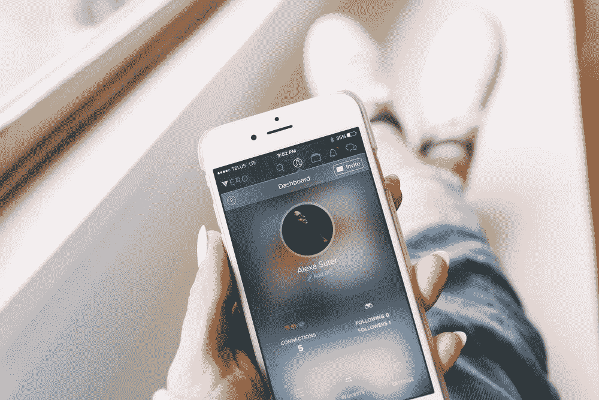
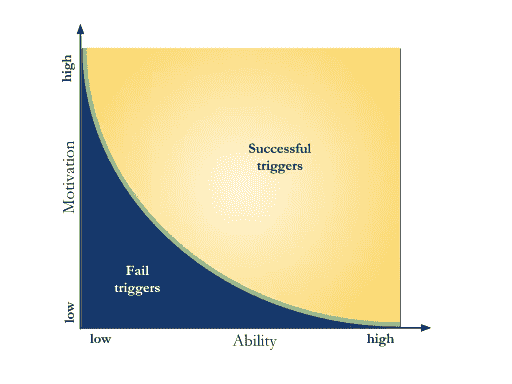
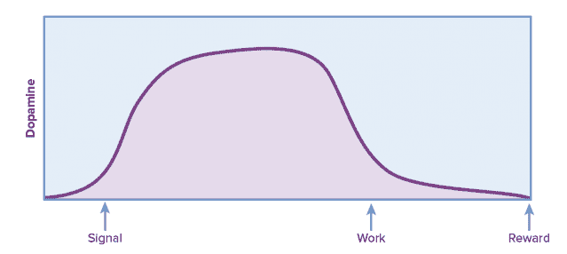
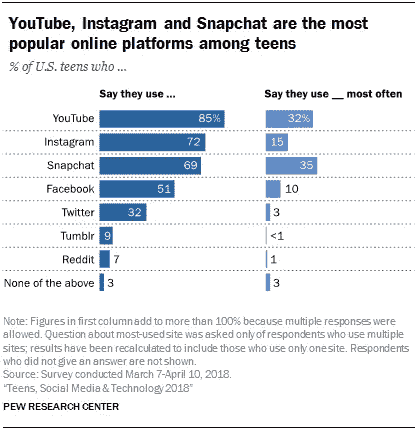

# 钩状的

> 原文：<https://towardsdatascience.com/hooked-b44813baf91e?source=collection_archive---------49----------------------->

## 大型科技公司如何开发令人上瘾的应用程序

照片由 [Alexa Suter](https://unsplash.com/@studiomedia) 拍摄(通过 [Unsplash](http://unsplash.com)

*   为什么脸书吸引了我们的注意力，而其他一些应用却没有？
*   YouTube 遵循什么基本原则来确保用户的持续参与？
*   [你希望一款应用能为你解决什么问题](https://www.nirandfar.com/hooked/)？

## 行为发生的条件

B.J. Fogg 有一个公式说，三个要素——动机(M)、能力(A)和触发因素(T)——必须在足够的程度上共存，行为(B)才会发生。

当你有一个高能力、低动机(脸书)或低能力、高动机(魔兽)的应用时，触发器就成功了。当你能力低、动机低时，触发器就会失效(C++编码)。

福格行为模型(通过[维基百科](https://commons.wikimedia.org/wiki/File:BFM.svg)

执行一个行为的可能性取决于你的动机、能力和触发因素是否都实现了。

## 期待比获得奖励更让你快乐

作为社会动物，我们需要建立社会纽带，获得归属感。当我们在现实生活中无法获得情感支持时，我们会求助于虚拟社交网络来寻求情绪缓解。社交媒体上催产素、血清素和多巴胺的突然激增让我们感到快乐。

研究人员观察到，当大脑期待奖励时，多巴胺水平会激增。伏隔核帮助大脑形成对显著环境刺激的记忆。伏隔核不是在你收到奖励的时候被激活，而是在你预期它的时候。

在罗伯特·萨波尔斯基·⁴做的一项实验中，猴子在看到光(信号)后按下一根棒十次(工作)，就会得到食物奖励。当猴子看到信号时，多巴胺会立即释放，甚至在它们为之努力之前。

猴子一看到信号，多巴胺就会激增。(经由[苏珊·温申克](https://www.slideshare.net/susanweinschenk/top5-thingsbuyingbrainvslideshare) ⁵)

预期比即时的满足让你更快乐。与先入为主的观念相反，萨波斯基的实验发现不可预测性增加了我们的预期。手指轻轻一扫就能在网飞调出意想不到的视频，这有点类似于玩⁶.的赌场老虎机

## 一个动作越简单，你就越有可能去做

十年前，在网上分享自己的观点并不像今天这么容易。首先，你必须购买一个域名和一个网络服务器。然后你需要用 WordPress 或者 Blogger 建立一个博客平台。另一方面，在你真正开始写之前，你必须安装插件，修改管理设置。自托管的博客不保证流量。你可能需要做搜索引擎优化来赚钱你的博客。

Twitter 已经不成比例地降低了进入博客世界的门槛。Twitter 刚推出时，每个状态只允许 140 个字符。现在 Twitter 已经把字数限制放宽到了 280 个字符。在 Twitter 上，任何人都可以键入几个词，分享一张古怪的照片或热门视频，然后点击“发布”。简单。简单。

## 冲浪速度越快，人们越投入

谷歌减少了在网上搜索平凡事物所需的认知努力和时间。谷歌自动纠正拼写，保存密码和自动完成表格。它甚至会根据你的搜索历史给出预测结果。[冲浪速度越快，人们越投入](https://www.thinkwithgoogle.com/marketing-resources/the-google-gospel-of-speed-urs-hoelzle/) ⁷.

为了让搜索像“天气”这样的关键词变得更快更容易，谷歌从网页上索引了万亿字节的信息，给谷歌添加了更多可点击的操作系统。网页根据流量、浏览量、受欢迎程度和相关性进行排名。

## 算法现在更聪明了

当你对语音助手说“食谱派柠檬”时，你会得到相关的搜索结果。放心 Alexa 或者 Siri 不会给你“背圆周率引理”之类的误用。

即使你拼错了水果“不能私奔”，你仍然可以得到“哈密瓜”和“摩登家庭*不能私奔*电视剧集”。

如今，语音助手已经极大地改进了其搜索算法，以处理自然语言查询。如果你让谷歌助手把这个翻译成俄语:

> "心有余而力不足。"

回到英语，你应该并且会得到同样的东西。

但是如果你在 20 世纪 50 年代用计算机算法来翻译它，你会得到像这个⁸:这样滑稽的误导性翻译

> *“伏特加很好，但是肉烂了。”*

## 情感触发因素

行动号召、付费广告和促销活动通常会促使新用户订阅某个频道、追随某个影响者并最终购买产品。付费触发器是在新闻网站或社交媒体新闻源上弹出的广告。它们引人注目，但仍然不如关系触发器有效(看到朋友使用抖音会促使你加入)，甚至不如自有触发器有效(自愿订阅电子邮件时事通讯)。

## 渴望社会认可

当用户向 Quora 或 Stack Overflow 提交答案时，其他成员会对该响应进行投票。被评为最佳答案的回答将帮助作者赢得分数。当积分累积到一定水平时，会员将获得授予特权的徽章。

《英雄联盟》(LoL)、《使命召唤》(CoD)和《魔兽争霸》上的巨魔横行霸道，但却被匿名所掩盖。英雄联盟不得不遏制巨魔的滥用。实行了荣誉制度。玩家被赋予了将因果积分奖励给和蔼可亲、受人尊敬的玩家的能力。这样做，他们也变得合作。

## 劳动导致爱情

宜家向顾客出售预组装家具。自己组装书架的顾客对自己作品的估价是修理工安装书架的五倍。我们在制造产品或服务上投入了越多的时间和精力，我们就越珍惜它。我们热爱劳动成果，不管是我们的还是别人的。

## 参照效应

你的台灯坏了。你急需一盏台灯。在亚马逊网站上搜索后，你有四种台灯可供选择，它们看起来几乎没有区别。你会买哪一个？

> 灯 A 售价 29.99 美元。库存只剩 10 个了。
> 
> 灯 B 售价 26.99 美元。库存只剩 12 个了。
> 
> 灯 C 售价 25.99 美元。库存只剩 5 个了。
> 
> Lamp D 售价 19.99 美元。库存只剩 2 个了。

出于稀缺效应，你可能会选择灯 D。你也会受到锚定效应的影响，因为价格比较信息锚定了你的购物决定。在易贝的 Craigslist 或者你当地的电子商店可能会有更便宜的台灯。然而，通过选择 D，你会觉得好像你赢得了一笔交易。

## 天赋进步效应

由于天赋进步效应，当人们相信他们接近完成时，他们就会有动力更加努力地工作。

EdX 提供了学习新编程语言的分步指导。你可以保存你的进度，离开然后随时回来。哈佛 CS50 和 MIT6.00.1x 提供视频讲座、宣讲会、动画、基于云的 Ubuntu 环境、基于浏览器的编辑器、论坛和对作业的即时反馈。除了期末考试和参赛证书，所有资源都是免费的。免费的开源材料被赋予给你，这样你在开始学习时就不会感到不知所措。

## 沉没成本谬论

Instagram、Twitter、脸书和 YouTube 在其存储库中存储了大量你的信息、照片、视频和联系。仅仅是跨平台传输大量数据的想法就足以让大多数人感到恐惧。你在现有社交网络上分享的照片和视频越多，你就越有动力坚持下去。

YouTube 是美国青少年中最受欢迎的在线平台(通过[皮尤研究中心](https://www.pewresearch.org/internet/pi_2018-05-31_teenstech_0-01-test/) ⁹)

Facebook 是新冠肺炎疫情期间美国成年人使用最多的社交媒体平台(通过[商业内幕情报](https://www.insider-intelligence.com/bii/) ⁰)

沉没成本谬论是不合理的。你在一项努力上投入了越多的感情，即使它不再有利可图或有意义，你也会继续投入更多的努力和时间。

如果你在社交媒体上创建内容，你可能有更大的机会接触到更多的人，并以喜欢、评论、分享和忠实追随者的形式获得社会认可。如果你幸运的话，你的视频可能会像病毒一样传播开来，获得数百万的浏览量。但是这些都是很大的假设。

如果你继续追求一个失败的计划，而你有可能扭转局面，那么从长远来看，你可能会遭受更大的损失(时间、努力、金钱、幸福)。社交网络应用可能会吸引、吸引你，并把你进一步拖入无穷无尽的深渊，要求你在未来投入更多的时间和注意力。

## 互惠偏差

[沃伦·巴菲特和查理·芒格](https://www.academia.edu/37441703/Seekingwisdomfromdarwintomunger_130625055939_phpapp)认为，随着消费者越来越习惯于习惯性地使用一种产品，他们往往会更少关注价格。如果一种产品的价格提高了一点点，消费者几乎不会注意到。

视频游戏、软件或应用程序通常会提供免费试用或有限的访问权限，以刺激购买行为。Audible 和 Spotify 为新用户提供 30 天的免费试用，可以随时取消，无需支付任何费用。当试用期结束时，输入信用卡信息的免费试用用户将自动转换为付费用户。由于互惠偏见，我们觉得有义务通过支付订阅费来回报 Audible 的青睐。

## 框架效应

如果给你看这两个看似相似的广告，哪一个听起来更有说服力？

> “如果你在下周一之前购买这个大师班在线课程，你将节省原价的 20%。”
> 
> "如果你在下周一之前购买这个大师班在线课程，你将获得 20%的折扣."

大多数人选择了后者。

框架效应影响你对得失的感知。我们试图通过防止损失来维持现状。比起未来的潜在收益，我们更倾向于优先考虑规避损失。禀赋效应让我们高估了我们已经拥有的东西。

## 当我们感觉良好时，我们会付出更多

克里斯托弗·卡彭特发现了一种心理技巧，可以影响人们给一个向他索要车费的陌生人多少钱。通过调整一些微妙的词语，听众受到潜意识信息的影响，给出更多:

> “但你可以自由接受或拒绝。”

在请求的末尾加上这八个字给了人们一种坚定的自主感。人们很乐意帮忙，给了两倍的钱。更重要的是，它在电子邮件以及 Patreon、Indiegogo 和 GoFundMe 等筹款平台上发挥了神奇的作用。

## 人类的行为很容易受到影响

用户心理可以用来影响人类行为。然而，最好不要出于邪恶的目的滥用知识来创建应用程序。否则，这将被认为是一种操纵、剥削和欺骗自己利益的行为。

## 参考

1.  尼尔·埃亚尔。2014.[上钩](https://www.nirandfar.com/hooked/)
2.  bj .福格。2009.[劝导设计的行为模型](https://dl.acm.org/doi/pdf/10.1145/1541948.1541999)
3.  维基百科。2017.[BJ·福格行为模型](https://commons.wikimedia.org/wiki/File:BFM.svg)
4.  罗伯特·萨波斯基。2012.[多巴胺头奖！萨波斯基论快乐的科学](https://www.dailymotion.com/video/xh6ceu)
5.  苏珊·温申克。2015.[购买的脑科学](https://www.slideshare.net/susanweinschenk/top5-thingsbuyingbrainvslideshare)
6.  加州新港。2019.[数字极简主义](https://books.google.com.my/books?id=S4NbDwAAQBAJ&pg=PT18&lpg=PT18&dq=which+social+media+platform+is+unpredictable&source=bl&ots=USlP6MWE65&sig=ACfU3U2i0AMJEJS8H9QIHTy1zGXP-eyxZQ&hl=en&sa=X&ved=2ahUKEwiVmIGUzfzoAhXbF3IKHUOGCooQ6AEwCXoECAgQAQ#v=onepage&q=which%20social%20media%20platform%20is%20unpredictable&f=false)
7.  乌尔斯·赫尔兹勒。2012.[谷歌速度福音](https://www.thinkwithgoogle.com/marketing-resources/the-google-gospel-of-speed-urs-hoelzle/)
8.  迈克尔. j .嘉宝德。2018.[自然语言处理简单介绍](https://becominghuman.ai/a-simple-introduction-to-natural-language-processing-ea66a1747b32)
9.  莫妮卡·安德森和江晶晶。2018. [YouTube、Instagram 和 Snapchat 是最受青少年欢迎的平台](https://www.pewresearch.org/internet/2018/05/31/teens-social-media-technology-2018/)
10.  商业内幕情报。2020.[新冠肺炎疫情期间美国成年人使用的社交媒体平台](https://www.insider-intelligence.com/bii/)
11.  彼得·贝弗林。2007.[从达尔文到芒格寻求智慧](https://www.academia.edu/37441703/Seekingwisdomfromdarwintomunger_130625055939_phpapp)
12.  克里斯托弗·卡彭特。2013.[对“但你是自由的”合规技巧有效性的荟萃分析](https://www.researchgate.net/publication/234839851_A_Meta-Analysis_of_the_Effectiveness_of_the_But_You_Are_Free_Compliance-Gaining_Technique)