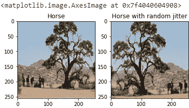
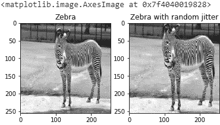
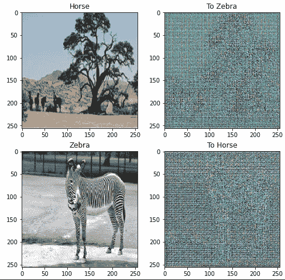
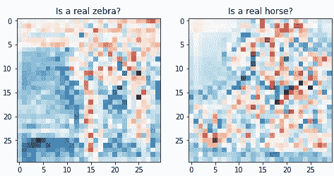
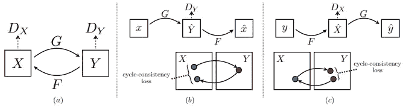
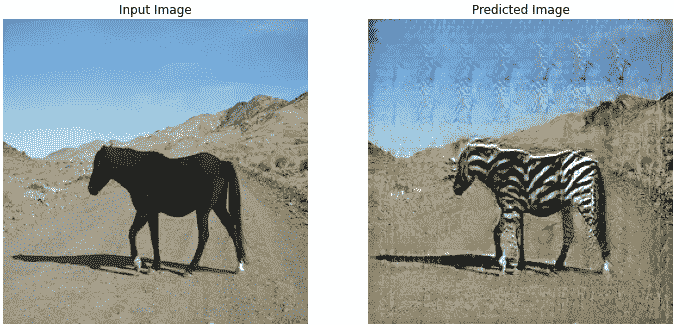

# TensorFlow 2.0 中的马到斑马循环 GAN

> 原文：<https://towardsdatascience.com/horse-to-zebra-cycle-gan-in-tensorflow-2-0-d5ad979d0314?source=collection_archive---------27----------------------->

## 了解如何实现 cycle GAN 最流行的应用之一

我自己生成的图像

当我开始深度学习时，我遇到了马到斑马循环 GAN。使它从其他甘人中脱颖而出的是这样一个事实:性状的转移不再需要 DNA 了！物理特性不仅仅局限于生物课，创造力也不仅仅局限于艺术课。

我很难理解如何实现，但是 TensorFlow API 让我的工作变得更容易了。

我将向您展示马到斑马循环 GAN 的 TensorFlow 实现。

**先决条件:**

1.  TensorFlow:版本 2.x
2.  Python:版本 3.6.7
3.  MatPlotLib:版本 3.x
4.  还有一杯咖啡:)

这篇博客中的所有实现都是受 TensorFlow 的 CycleGAN 教程[1]的启发。

好吧！所以让我们从 Tensorflow 收集预定义的生成器和鉴别器开始。

# 鸟瞰图

*   生成对抗网络
*   CycleGAN
*   导入库
*   输入管道
*   分为训练集和测试集
*   数据预处理
*   绘图
*   发生器和鉴别器
*   损失函数
*   让我们训练我们的模型
*   来源

# 生成对抗网络

首先，让我们快速地抛出生成对抗网络(GAN)的基础知识，以帮助不熟悉它的读者。让我们想象一个场景，我们想要生成一个属于特定领域的图像。例如，我们想为年轻人设计一套新服装，我们要求计算机来完成这项任务。要做到这一点，我们需要一个时装设计领域空间的代表。假设有一个函数 F 和一个输入图像 X，我们需要一个非常接近目标区域的 Y，其中 Y=F(X)。GAN 是最终能够找到我们的目标域 Y 的近似表示函数 F 的网络

GAN 是如何做到这一点的？这里有一个技巧，解决方案有两个部分:( I)我们需要一个生成器，它不断从随机初始化中生成图像;( ii)我们需要一个鉴别器来区分生成的图像和真实的图像。因此，发电机就像一个新的时装设计师，他对时尚一无所知，但总是蓬勃发展，以复制一个杰作青年服装，而鉴别者是一个高级时装设计师，他可以说新服装有什么错。只要我们的鉴别器善于判断，我们的发生器就能从反馈中获益。在某一点上，我们的发生器将处于从鉴别器获得正反馈的位置。所以我们将使用深度学习来构建我们的生成器和鉴别器。

为了做出一个好的鉴别器，我们需要将生成的和原始的图像输入到我们的模型中，然后通过比较它的决定和实际情况来训练它。对于发电机，它取决于鉴别器的决定，如果它得到正反馈，则表明发电机正朝着正确的方向前进，反之亦然。有趣的是，他们互相学习，并试图重击对方。

渐渐地，生成器和鉴别器都会擅长它们的任务，这样我们就可以把生成器拿出来独立完成服装设计任务。那么 GAN 是如何把马变成斑马的呢？如果我们稍微思考一下，事实上从随机初始化生成一套新衣服类似于从一匹马生成一匹斑马，唯一的区别是这里我们从一匹马的图像而不是随机初始化开始我们的预测。为此，我们需要一个配对的数据集，但是如果我们没有这样的数据呢？如何从不成对的数据中完成这个任务？

# CycleGAN

幸运的是，有一种方法可以从不成对的数据中完成这项任务。CycleGAN 背后的主要思想是，我们可以形成一个循环，其中两个生成器工作来来回转换图像，而不是使用成对的数据来训练鉴别器。准确地说，如果我使用一个生成器将我的图像(比如 x)转换为胡须男(比如 y)，使用另一个生成器将我的胡须图像(y)转换为正常图像(比如 x’)，如果图像 x 和 x’相同，那么我们可以得出结论，我们的 GAN 可以很好地处理不成对数据。

让我们实现马对斑马的循环吧！

# 导入库

让我们通过导入所有需要的库来预热烤箱。一些库是:

1.  张量流
2.  张量流 _ 数据集
3.  tensor flow _ examples . models . pix 2 pix

# 输入管道

有两种方法可以为模型构建输入管道:

1.  从您的计算机上传数据。(这就像冬天下雨一样！)
2.  从 TensorFlow 数据集(tfd)加载数据，这是一个相当简单的方法！但约束是，它可能无法满足您的要求。比如说，如果你要研究“莫奈到甘的摄影周期”，你需要寻找其他的存储库。TensorFlow 还拥有广泛的数据集(请查看[2])。

# 分为训练集和测试集

我们可以进一步将测试集分成验证集，这里没有实现。

现在让我们在代码之前初始化一些参数，这样我们可以根据需要调整它们。

# 数据预处理

为了防止过度拟合，我们需要将一些预处理技术映射到我们的数据，为此我们需要编写一些函数:

*   **random_crop** :将图像裁剪到随机的高度和宽度，以确保我们的模型可以处理各种尺寸的图像。

random_crop 的代码片段

*   **归一化**:将像素值范围从[0，255]缩放到[-1，1]。

用于规范化的代码段

*   **random_jitter** :执行论文【3】中提到的随机抖动和镜像。

随机抖动的代码片段

现在让我们定义两个父函数来合并这些代码片段。

*   **预处理 _ 图像 _ 训练**

预处理图像训练的代码片段

*   **预处理 _ 图像 _ 测试**

预处理图像测试的代码片段

注意:random_jitter 仅用于预处理训练集，以使我们的模型更进一步。

现在让我们结合所有的片段。

# 绘图

地图功能:

map(参数 1，参数 2):其中参数 1 是必须映射的函数。参数 2 是数据样本。

shuffle(BUFFER_SIZE)。batch(1)-混洗数据并按样本方式映射预处理技术。

*   让我们将预处理 _ 图像 _ 训练函数映射到训练 _ 马匹和训练 _ 斑马数据

*   让我们将预处理图像测试函数映射到测试马匹和测试斑马数据

唷！完成预处理。

现在，让我们从 train_horses 和 train_zebras 中选取一个随机样本，并在应用我们的预处理技术之前和之后绘制它，以确保我们没有搞砸。

sample_horse.py 的输出

sample_zebra.py 输出

嗯，我们的预处理技术一切都很好

# 发生器和鉴别器

让我们来设计模型的主干——生成器和鉴别器！

**一、发电机:**

生成器的体系结构被分成编码器和解码器，这类似于改进的 U-Net 的体系结构。

1.  编码器中的每个块将具有以下层:卷积层-> Batchnorm 层-> Leaky ReLU 层。
2.  解码器中的每个块都会有以下几层:转置卷积层-> Batchnorm 层-> Dropout 层(仅针对前 3 个块，以避免过拟合)-> ReLU 层。
3.  编码器用于向下采样[4]并抓住图像的本质。另一方面，解码器从编码图像向上采样[5]图像。
4.  此外，编码器和解码器之间存在类似于 U-Net 的跳跃连接。

**二世。鉴别器:**

1.  鉴别器是一个 PatchGAN，其中输出的每个 30×30 片对输入图像的 70×70 部分进行分类。
2.  鉴别器中的每个块将具有以下层卷积层-> BatchNorm 层-> Leaky ReLU 层，并且最后一层之后的输出形状是 batch_size 30 x 30 x 1。
3.  因此，鉴别器函数有两个参数:

*   输入图像和目标图像，它应该分类为真实的。
*   输入图像和生成的图像，它应该将其归类为假的。

在循环 GAN 的情况下，我们使用实例规范化来代替批量规范化，我们也可以使用基于 ResNet 的生成器来代替 U-Net。(在我们的例子中，为了简单起见，我们使用 U-Net)。

周期 GAN 需要训练两个生成器(比如 G1 和 G2)和两个鉴别器(比如 D1 和 D2)。

*   生成器 G1 学习转换图像 X 到 Y(马到斑马)
*   生成器 G2 学习将图像 Y 转换为 X(斑马转换为马)
*   鉴别器 D1 学习区分原始图像 X 和生成的图像 X (G2(Y))
*   鉴别器 D2 学习区分原始图像 Y 和生成的图像 Y (G1(X))

我们不打算为生成器和鉴别器编写代码，而是使用在 pix2pix 中实现的 TensorFlow 预定义的生成器和鉴别器。

我们跑吧！

我们的发电机和鉴别器。

check_generator.py 的输出

check_discriminator.py 的输出

这是我们的发生器和鉴别器产生的随机噪声，我们现在该怎么办？

哦是的！你猜对了！为了得到公平的输出，我们需要一个损失函数。

# 损失函数

**发电机损耗:**

它是所生成的图像和一个“1”的阵列的 sigmoid 交叉熵损失，使得它允许所生成的图像在结构上变得与目标图像相似。

**鉴频器损耗:**

鉴别器损失函数采用 2 个输入，即真实图像和生成图像。

*   real_loss 是真实图像和 1 的数组的 sigmoid 交叉熵损失(因为这些是真实图像)，generated_loss 是生成的图像和 0 的数组的 sigmoid 交叉熵损失(因为这些是伪图像)。
*   total_loss 是 real_loss 和 generated_loss 之和。

好了，现在我们的鉴别器能够区分输出是马还是斑马，但它不能确定输入和生成的图像之间的相似性。

为了明确这个问题，我们将使用重建损失。那么什么是重建损失呢？

让我们假设我们已经把一个英语句子翻译成了印地语句子，现在当我把我的印地语句子转换回英语时，它必须与最初的语句相同，这被称为**循环一致性**。

摘自“使用循环一致的对抗网络进行不成对的图像到图像的翻译”[3]

**重建损失:**

*   让我们假设图像 x 经由生成器 G1 传递，生成器 G1 产生生成的图像 Y^.
*   并且生成的图像 Y^经由生成器 G2 传递，生成器 G2 产生重建的图像 X^.
*   现在重建损失是 x 和 X^.之间的平均绝对误差

这里我们需要一个名为 lambda 的新参数，这是你可以调整的，它决定了输出与输入相比有多相似。

现在有一个东西叫做**恒等损失**，生成器 G 负责把图像 X 转换成 Y，恒等损失就是，如果你把图像 Y 馈送给生成器 G，它应该产生真实的图像 Y 或者类似于图像 Y 的东西。

TensorFlow 还允许我们为训练保存检查点(重量)，这是完全可选的。

# 让我们训练我们的模型！

培训过程由 4 个基本步骤组成:

㈠获得预测

㈡计算损失

㈢计算梯度(反向传播)

㈣对优化程序应用梯度

我们需要一个函数来打印每个时期的输入图像和预测图像，让我们定义它。

啊，看起来有点复杂，对吧？

让我们将所有这些步骤合并到一个函数中。

酷，现在看起来不错。

现在我们已经为训练创建了一个函数，我将为每 5 个时期保存一个检查点。我们还可以调整时期的数量以获得更好的准确性，这里我运行了 40 个时期。

一旦训练完成，我们就可以在测试集上测试我们的模型。

以上代码片段的输出

# 来源

[1][https://www.tensorflow.org/tutorials/generative/cyclegan](https://www.tensorflow.org/tutorials/generative/cyclegan)

[2][https://www . tensor flow . org/datasets/catalog/overview # cycle _ gan](https://www.tensorflow.org/datasets/catalog/overview#cycle_gan)

[3] J. Zhu，T. Park，P. Isola，A. A. Efros，[使用循环一致对抗网络的不成对图像到图像翻译，](https://arxiv.org/abs/1703.10593)《2017 IEEE 计算机视觉国际会议(ICCV)，威尼斯，2017 年，第 2242–2251 页，DOI: 10.1109/ICCV.2017.244

[https://www.giassa.net/?page_id=174](https://www.giassa.net/?page_id=174)

[https://www.giassa.net/?page_id=200](https://www.giassa.net/?page_id=200)

我的 LinkedIn[https://www.linkedin.com/in/murki-sai-srikanth-083093189](https://www.linkedin.com/in/murki-sai-srikanth-083093189)(随意连接)。