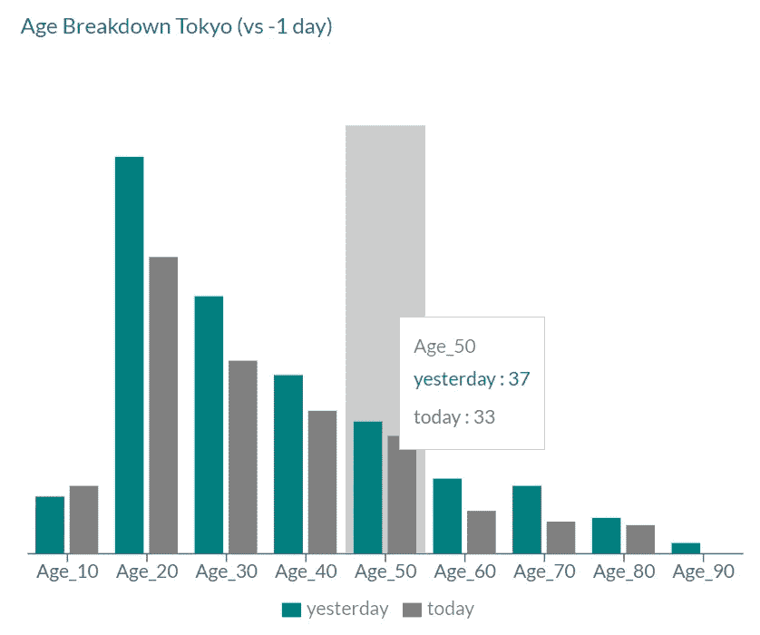

# 以每月 1 美元的价格托管一个数据仪表板

> 原文：<https://towardsdatascience.com/host-a-data-dashboard-for-1-month-d05b13e43002?source=collection_archive---------44----------------------->

## 用 AWS S3、Lambda、Pandas 和 React 在一个周末建立一个动态数据驱动的站点


在 [Unsplash](https://unsplash.com?utm_source=medium&utm_medium=referral) 上由[halance](https://unsplash.com/@halacious?utm_source=medium&utm_medium=referral)拍摄的照片

我想建立一个简单的网站，每天自动刷新显示一个基本的图表仪表板。(以一种我可以与朋友分享的方式自动化我的日常 COVID 分析)。

刷新我的 AWS 技能是一个额外的收获，因为我已经几年没有使用它了。

# 设计

## 计划:

*   收集最新的东京 COVID 数据
*   在 JSON 中运行一些计算和输出
*   构建动态 Web GUI，在仪表板中显示最新数据

## 并发症:

*   源数据在下午 6 点到 10 点之间更新不一致
*   网站必须自动更新，是免费维护
*   必须是超低成本

## 解决方案:

*   AWS Lambda 可以获取和处理数据，Cloudwatch 事件可以安排运行，SNS 会向我发送警报
*   React.js w/ Material-UI 和 RE-Chart 为我提供了 GUI
*   S3 将主办 React 编译网站& Lambda 生成的数据

通过使用 S3 网站托管选项，与托管 Node.js 或 Python 服务相比，成本低得令人难以置信。


最简单的设计？(图片由作者提供)

# 界面

由于这是一个低技术 S3 托管网站，唯一的“接口”是我们每天更新的 JSON 文件。我想要用 JSON 建模的 3 个数据集:

*   **东京和日本当天的每日指标**
*   **趋势指标**查看历史数字并计算滚动平均值
*   性别和年龄等人口统计数据的细分

一旦我修复了 JSON 格式，我就可以独立地构建前端和后端了。

```
**# dailyData.json** {“NewTokyoCase”: 258, “NewJapanCase”: 630, “TokyoCase”: 18865, 
 “JapanCase”: 56462,“LastTokyoCase”: 339, “TokyoCaseChange”: -81,
 “TokyoCaseAvg7d”: 256,“TokyoCaseAvg30d”: 293, 
 “TokyoCaseAvgDiff”: -19, “TokyoCaseAvg30dDiff”: 0}**# dailyTrend.json** [{"name":"2020-02-18","Tokyo":3,"7dayAvg":3.0},
 {"name":"2020-02-19","Tokyo":3,"7dayAvg":3.2857142857},
 {"name":"2020-02-21","Tokyo":3,"7dayAvg":3.5714285714},
 ... ]**# dailyDemo.json** [{"name":"Gender_F","value":135.0,"value2":105.0},
 {"name":"Gender_M","value":204.0,"value2":153.0}, 
 {"name":"Age_10","value":16.0,"value2":19.0},
 {"name":"Age_20","value":111.0,"value2":83.0}, 
 ... ]
```

# AWS Lambda 代码库

Lambda 支持多种语言，但是对于这种类型的工作，Python 是合适的工具。代码库非常简单，只需 HTTP 获取 CSV 文件——然后通过一些 Pandas analytics 运行它，并以目标 JSON 格式输出到 S3。

由于缺少源数据更新的信号，我们只能轮询。仅仅检查文件头是不够的，因为文件似乎一直在更新。最可靠的方法是读取整个文件，并在我们看到添加了新日期时处理它。

代码基础很简单，需要封装在 Lambda 函数中，并返回带有 HTTP 代码的 JSON。

fetch 方法使用请求库，并传回结果以供下一步处理。

analyzeAndSave 代码使用 pandas 和 AWS 的 boto3 库向 S3 写入数据

# React.js 代码库

使用 React 样板，如 Material-UI dashboard 及其变体，可以使 GUI 工作得非常快。我削减了[材质感](https://github.com/alexanmtz/material-sense)提供了一个简单的仪表板。


基于材料设计的材料感:作者的图像

GUI 只是在页面加载时获取 Lamda 生成的 JSON 文件。它将 JSON 数据传递给 re-chart 图形和图表。由于材质的主题，默认情况下看起来不错。

记住，React 编译成静态 JS 文件，并且纯粹是一个客户端应用程序(不需要后端 Node.js！).我只是将静态文件复制到 S3，提供给浏览器，这是一个非常便宜又简单的解决方案。

详述 React 超出了本文的范围，但是我强烈建议学习它[6]。下面是我们获取 JSON 并传递给组件的一些关键代码片段:

re-chart 代码也很基本，从 main.js 调用:

```
<SimpleReactiveBarChart data={this.state.dailyDemo.slice(2,12)} />
```

上面的组合创建了一个漂亮的图表，可以跨浏览器工作，有浮动工具提示、图例等，代码很少:



作者图片

# 部署

让你的 S3 水桶像一个网站一样简单，只需打开一个选项框(并确保文件是公开可见的)。


作者从 AWS 控制台提供的图片

要构建和部署 React，我们只需更新节点的包管理器(package.json ),以调用 AWS CLI 将目标构建文件复制到 S3:

```
cd ~/git/tokyocovid/material-sense/buildaws s3 cp precache-manifest.*.js s3://tokyocovid/aws s3 cp static s3://tokyocovid/material-sense/static — recursive
```

后端 Lambda 代码的设置和部署有点棘手，因为 1)您无法轻松地测试 Lambda 2)一些库(如 Pandas)不在默认的 Python env 中，但除此之外，您可以直接压缩和复制。使用 AWS CLI 将文件直接复制到 AWS Lambda:

```
zip aws_lambda.zip lambda_function.pyaws lambda update-function-code — function-name fetcher — zip-file fileb://aws_lambda.zip
```

Lambda 有一个很棒的特性，叫做层来管理依赖关系——你可以安装或引用现有的配置(层)来集合你需要的东西。在我的情况下，下面这 3 个支持我所需要的(核心 Py SciPy，Pandas 和 Requests)。


作者从 AWS 控制台提供的图片

# 最终产品:

虽然这不是开创性的，但对于周末的工作来说，我还是很满意的。它节省了我手动挖掘数据和动态重新运行不同测量的时间。我在运行或更新网站时遇到 0 个问题。


图片由作者查看现场@[http://tokyocovid.foostack.org](http://tokyocovid.foostack.org)

请注意下面的“反应式”显示屏在移动设备上的表现。


向左移动，向右调整浏览器大小。(图片由作者提供)

# 到目前为止的账单:


AWS 控制台上作者的图像

给你。这花了我一个周末的时间，我在飞行中学会了 Lamda layers。我怀疑，如果我有 1 亿次点击，我的成本将远远超过 1 美元/月，但我很高兴处理这个问题，如果它发生了。

看看 [github](https://github.com/dougfoo/tokyocovid) 源码，开始你自己有趣的项目。

# 参考

[1]材料感:【https://github.com/alexanmtz/material-sense】T4

React 的材质界面:[https://material-ui.com/](https://material-ui.com/)

[3]我这个项目的 GitHub:[https://github.com/dougfoo/tokyocovid](https://github.com/dougfoo/tokyocovid)

[4]东京的 COVID 来源站点:[https://stopcovid 19 . metro . Tokyo . LG . jp](https://stopcovid19.metro.tokyo.lg.jp)

[5]AWS 上的托管站点:【http://tokyocovid.foostack.org/ 

【6】正派 React 视频教程:[https://www.youtube.com/watch?v=sBws8MSXN7A&t = 1527s](https://www.youtube.com/watch?v=sBws8MSXN7A&t=1527s)