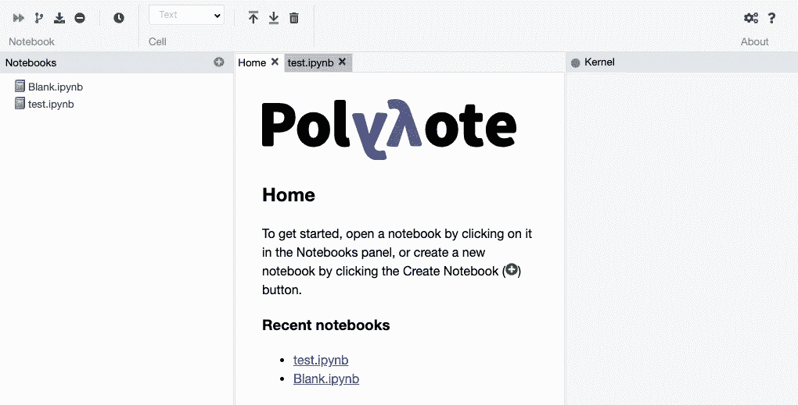

# 在 AWS Fargate 上使用 Terraform 进行基本身份验证的主机 Polynote 笔记本

> 原文：<https://towardsdatascience.com/host-polynote-notebooks-with-basic-authentication-on-aws-fargate-with-terraform-65d4ff3ba730?source=collection_archive---------48----------------------->

## 本文将帮助您使用 Terraform 在 ECS 上轻松部署安全的 Polynote 环境。

最近我发布了一篇关于旋转 Jupyter 笔记本的文章。本文描述了如何使用 Terraform 轻松启动 Jupyter 笔记本环境。这篇文章将大致相同，但然后与 Polynote 笔记本。

[](/spinning-up-jupyter-notebooks-as-ecs-service-in-aws-with-terraform-805ac111d74b) [## 使用 Terraform 在 AWS 中将 Jupyter 笔记本电脑升级为 ECS 服务

### 在这篇文章中，我将解释如何使用 Terraform 在几秒钟内在 AWS 上运行 Jupyter 笔记本。

towardsdatascience.com](/spinning-up-jupyter-notebooks-as-ecs-service-in-aws-with-terraform-805ac111d74b) 

为什么我发表了两篇有些相同的文章？嗯，Jupyter 笔记本有一个问题，对我们(我所在的团队)来说，这个问题使它无法工作。问题是当你刷新页面时输出会丢失，这是一个[已知的问题](https://github.com/jupyter/jupyter/issues/83)。根据我在互联网上搜索后的理解，这只是一个可视化/表示错误，你的脚本实际上会在后台继续运行，但输出会发送到浏览器会话，当你刷新页面或在另一个设备上打开它时，输出会丢失。除了这个问题，Jupyter 并不是最适合我们的需求，设置需要一些额外的步骤，这些步骤与上一篇文章无关:

*   Polynote 需要一个配置文件，该文件需要包含在定制的 Docker 映像中。
*   Polynote 环境不能像 Jupyter 笔记本一样用令牌或密码来保护，所以我们需要为此添加一个额外的层(先睹为快:将使用 NGINX)。

## 先决条件

要使这个设置工作起来，有一些先决条件，让我们从已经启动并运行的 AWS 服务开始(设置这些不在本文的讨论范围之内):

*   ECS 集群
*   应用程序负载平衡器
*   Route53 内的托管区域和域

我们将与 Terraform 合作，所以你也需要[在你的设备上安装那个](https://learn.hashicorp.com/terraform/getting-started/install.html)。Terraform 使您能够以代码的形式组织和管理您的(云)服务和基础设施。您还需要一个像 [AWS 命令行界面](https://aws.amazon.com/cli/) (CLI)这样的工具，配置一个概要文件，这样我们就可以，或者说是 Terraform，与您的 AWS 环境进行通信。或者，您可以在您的设备上安装 [Docker](https://docs.docker.com/get-docker/) ，以防您想要更改 Polynote 配置文件并重建 Docker 映像，或者更改 NGINX 映像并重建它。

# 下载或克隆文件

现在，我假设您已经设置了所需的 AWS 服务，并且已经在您的计算机上安装了所需的软件。出于本文的目的，我已经建立了[这个 GitHub 库](https://github.com/sschrijver/spawn-polynote-notebooks-fargate)，在这里你可以找到我们在这里讨论的代码片段的所有最终文件。为了避免可能的错误，我建议将存储库克隆到您的计算机上/从 repo 下载文件，而不是复制并粘贴本文中的所有代码片段(有些部分将不讨论，因此它们不包含在本文中)。

# 知识库结构

如您所见，存储库包含 3 个文件夹:

*   多项式码头
*   nginx
*   将（行星）地球化（以适合人类居住）

*polynote-docker* 文件夹包含创建官方 Polynote docker 映像的 Docker 映像所需的所有文件。简而言之；通常，当你想运行 Polynote Docker 映像时，你需要一个 *config.yml* 文件。我已经将该文件包含在自定义映像中，因此我们不必在 ECS 中添加卷。我们不会进一步讨论 Docker 映像，因为我已经将一个映像推送到 Docker Hub，它将在本设置中使用。我还创建了自己的 NGINX 映像，基于这个映像:[dtan 4/NGINX-basic-auth-proxy](https://github.com/dtan4/nginx-basic-auth-proxy)。这张图片向我们的 NGINX 添加了基本的 auth，并且我为 websockets 添加了一个额外的路径，这是 Polynote 工作所必需的。 *terraform* 文件夹包含在 AWS 上设置整个环境所需的所有文件，该文件夹由以下三个文件组成:

*   main.tf(“魔法”发生的地方)
*   vars.tf(在 *main.tf* 中使用的变量声明)
*   vars.tfvars(为变量赋值)

# 编辑变量. tfvars

我们将从编辑 *vars.tfvars* 文件开始，因为这些变量值将在后面的*main . TF**文件中使用。您必须重新访问除了`cpu`和`memory`之外的所有变量值，当然，除非您想要增加或减少资源。*

***变量. tfvars***

```
*vpc_id = "YOUR_VPC"
region = "eu-west-1"
profile_name = "LOCAL_PROFILE_NAME"
ecs_cluster_name = "CLUSTER_NAME"
loadbalancer_arn = "LOAD_BALANCER_ARN"
hosted_zone_id = "HOSTED_ZONE_ID"
fargate_subnets = [  
    "PRIVATE_SUBNET_1",  
    "PRIVATE_SUBNET_2",  
    "PRIVATE_SUBNET_3"
]
cpu = 1024
memory = 2048
domain = "mydomainname.com"*
```

*所有信息都可以在 AWS 控制台中找到，除了配置文件名称，这将是您在本地计算机上用来配置 AWS CLI 的 AWS 配置文件名称，例如通过
`aws configure --profile=test`，这里的“测试”是配置文件名称。如果您没有设置配置文件名，它可能会设置为“默认”。*

# *`Gain Insight Into the Working of The main.tf File`*

*现在，让我们看一下 *main.tf* 文件，正如我之前所说的，所有的“魔法”都发生在这里。这个文件包含了我们需要的所有资源来使这个设置工作。幸运的是，如果我们做得很好，我们唯一要做的就是运行一个命令，Terraform 会完成剩下的工作，所以知道文件中有什么是很好的。我不会深入研究地形的概念。*

## *获取现有 ECS 集群*

```
*data "aws_ecs_cluster" "ecs_cluster" {
  cluster_name = var.ecs_cluster_name
}*
```

*在上面的块中，将检索现有的 ECS 集群，稍后将在脚本中使用该集群。*

## *生成唯一标识符*

```
*resource "random_string" "random_string" {
  length = 8
  special = false
}*
```

*这可能非常令人困惑，为什么要生成随机字符串呢？因为我们希望能够同时启动多个环境，所以我们需要给一些资源名称添加一个独特的部分。我们正在创建的某些资源不能与现有的同类型资源同名。如果我们不添加这个独特的部分，并且人员 A 已经有了一个正在运行的 Polynote 环境，那么人员 B 就不能创建一个新的环境，因为 AWS 中已经存在一个具有该特定名称的特定资源。*

## *添加任务执行角色*

```
*resource "aws_iam_role" "ecs_task_execution_role" {
  name = "ecsTaskExecutionRole-polynote-${random_string.random_string.result}"
  assume_role_policy = <<ASSUME_ROLE_POLICY
{
"Version": "2012-10-17",
"Statement": [
    {
      "Sid": "",
      "Effect": "Allow",
      "Principal": {
        "Service": "ecs-tasks.amazonaws.com"
      },
      "Action": "sts:AssumeRole"
    }
  ]
}
ASSUME_ROLE_POLICY
}data "aws_iam_policy" "amazon_ecs_task_execution_role_policy" {
  arn = "arn:aws:iam::aws:policy/service-role/AmazonECSTaskExecutionRolePolicy"
}resource "aws_iam_role_policy_attachment" "policy_role_attachment" {
  role = aws_iam_role.ecs_task_execution_role.name
  policy_arn = data.aws_iam_policy.amazon_ecs_task_execution_role_policy.arn
}*
```

*上面的代码行将创建一个任务执行角色，并将已经存在的*amazonectaskexecutionrolepolicy*(由 Amazon 提供)附加到该角色，这允许您将容器的日志发送到 CloudWatch。如果您需要访问 Polynote 笔记本中的其他 AWS 服务，您需要编写必要的策略，并将它们附加到一个新角色(任务角色)上，并将其作为`task_role_arn`添加到`polynote_task_definition`中。我们不会在本文中讨论这个问题，但是所需的部分可以在 Git 存储库中找到，并且现在已经被注释了。*

## *添加云观察日志组*

```
*resource "aws_cloudwatch_log_group" "polynote_ecs_log_group" {
  name = "/aws/ecs/polynote-${random_string.random_string.result}"
}*
```

*出于日志记录的目的，我们还创建了一个日志组。*

## *生成密码以访问笔记本*

```
*resource "random_string" "password" {
  length = 24
  special = false
}*
```

*因为我们想用至少一个密码来保护 Polynote 笔记本环境，所以我们生成了一个随机字符串。这一步需要重新考虑，因为在当前的设置中，密码将作为纯文本环境变量传递给容器。最好在秘密管理器中设置一个秘密，并使用任务定义中的`secrets`属性来解决这个问题。*

## *创建 ECS 任务定义*

```
*resource "aws_ecs_task_definition" "polynote_task_definition" {
  family = "polynote-${random_string.random_string.result}"
  requires_compatibilities = [
    "FARGATE"]
  network_mode = "awsvpc"
  cpu = var.cpu
  memory = var.memory
  execution_role_arn = aws_iam_role.ecs_task_execution_role.arncontainer_definitions = <<TASK_DEFINITION
  [
    {
        "essential": true,
        "image": "registry.hub.docker.com/sschrijver/polynote-basic-config:latest",
        "name": "polynote",
        "portMappings": [
            {
                "containerPort": 8192,
                "hostPort": 8192
            }
        ],
        "logConfiguration": {
                "logDriver": "awslogs",
                "options": {
                  "awslogs-region": "${var.region}",
                  "awslogs-group": "${aws_cloudwatch_log_group.polynote_ecs_log_group.name}",
                  "awslogs-stream-prefix": "polynote-${random_string.random_string.result}"
            }
        }
    },
    {
        "essential": true,
        "image": "registry.hub.docker.com/sschrijver/polynote-nginx:latest",
        "name": "nginx",
        "dependsOn": [
            {
                "containerName": "polynote",
                "condition": "START"
            }
        ],
        "portMappings": [
            {
                "containerPort": 8080,
                "hostPort": 8080
            }
        ],
        "logConfiguration": {
                "logDriver": "awslogs",
                "options": {
                  "awslogs-region": "${var.region}",
                  "awslogs-group": "${aws_cloudwatch_log_group.polynote_ecs_log_group.name}",
                  "awslogs-stream-prefix": "nginx-${random_string.random_string.result}"
            }
        },
        "environment": [
            {
                "name": "SERVER_NAME",
                "value": "127.0.0.1"
            },
            {
                "name": "PORT",
                "value": "8080"
            },
            {
                "name": "BASIC_AUTH_USERNAME",
                "value": "polynote"
            },
            {
                "name": "BASIC_AUTH_PASSWORD",
                "value": "${random_string.password.result}"
            },
            {
                "name": "PROXY_PASS",
                "value": "[http://127.0.0.1:8192](http://127.0.0.1:8192)"
            }
        ]
    }
  ]
  TASK_DEFINITION
}*
```

*这是一个很长的片段，但是在上面你看到了我们将要运行的 ECS/Fargate 服务的任务定义(蓝图)，如果你熟悉 *docker-compose.yml* 文件，它看起来有点像下面这样(没有`logConfiguration`):*

```
*version: '3.4'
services:
  polynote:
    image: registry.hub.docker.com/sschrijver/polynote-basic-config:latest
    expose:
      - 8192
  nginx:
    image: registry.hub.docker.com/sschrijver/polynote-nginx:latest
    depends_on:
      - polynote
    ports:
      - 8080:8080
    environment:
      - SERVER_NAME=127.0.0.1
      - PORT=8080
      - BASIC_AUTH_USERNAME=polynote
      - BASIC_AUTH_PASSWORD=${random_string.password.result}
      - PROXY_PASS=[http://polynote:8192](http://polynote:8192)*
```

*此外，请注意`PROXY_PASS`中的不同，Fargate 不会像`docker-compose`那样处理解析主机，我们必须在任务定义中通过 127.0.0.1 进行连接。*

## *NGINX*

*您可以看到任务定义中有两个容器。这是因为我们还需要在服务中运行 NGINX。这个 NGINX 实际上会被暴露，并会增加一个额外的基本认证层，这样陌生人就无法访问我们的笔记本电脑，或者更糟；访问我们的 AWS 环境。感谢景岛乐·藤田发布了[dtan 4/nginx-basic-auth-proxy](https://github.com/dtan4/nginx-basic-auth-proxy)库及其代码，我的图片就是基于这些代码。我更新了映像中 NGINX 的版本，还添加了一个 websocket 路径。就我个人而言，我会建议您分叉他或我的存储库，进行一些调整，并将您自己的 Docker 映像推/用到 ECR/Docker Hub，因为在安全性和 Docker 映像标签方面，有些东西肯定可以改进/重新访问。*

*让我们进一步走到 *main.tf* 文件。*

## *获取现有的 VPC、负载平衡器和负载平衡器侦听器*

```
*data "aws_vpc" "vpc" {
  id = var.vpc_id
}data "aws_lb" "lb" {
  arn = var.loadbalancer_arn
}data "aws_lb_listener" "lb_listener" {
  load_balancer_arn = var.loadbalancer_arn
  port = 443
}*
```

*我们将收到关于现有 VPC、应用程序负载平衡器和负载平衡器监听器的信息。如果您使用端口 80 作为负载平衡器上的监听器，您应该将 443 改为 80。*

## *创建负载平衡器目标组*

```
*resource "aws_lb_target_group" "polynote_target_group" {
  name = "polynote-${random_string.random_string.result}"
  port = 80
  protocol = "HTTP"
  vpc_id = data.aws_vpc.vpc.id
  target_type = "ip"
  health_check {
    matcher = "200,302,401"
  }
}*
```

*如果您想要将 ECS 服务附加到负载平衡器(或者将负载平衡器规则指向 ECS 服务，这取决于您如何看待它)，您还需要一个目标组。这将在稍后定义服务时使用。如您所见，HTTP 响应代码 401 也包含在健康检查中，因为我们的 NGINX 服务将返回 401(未授权)响应代码，因为我们已经包含了一个基本的身份验证层。*

## *创建安全组*

```
*resource "aws_security_group" "polynote_security_group" {
    name = "polynote_${random_string.random_string.result}"
    vpc_id = data.aws_vpc.vpc.idingress {
      description = "Incoming 8080"
      from_port = 8080
      to_port = 8080
      protocol = "tcp"
      security_groups = data.aws_lb.lb.security_groups
    }egress {
      from_port = 0
      to_port = 0
      protocol = "-1"
      cidr_blocks = [
        "0.0.0.0/0"]
    }tags = {
      Name = "polynote_${random_string.random_string.result}"
    }
  }*
```

*负载平衡器需要访问 ECS 服务，因此我们向安全组添加了一个入口规则，该规则稍后将附加到 ECS 服务。这个入口规则允许我们的负载平衡器与运行在端口 8080 上的 NGINX 通信。*

## *创建 ECS 服务*

```
*resource "aws_ecs_service" "polynote_service" {
  name = "polynote-${random_string.random_string.result}"
  cluster = data.aws_ecs_cluster.ecs_cluster.id
  task_definition = aws_ecs_task_definition.polynote_task_definition.id
  desired_count = 1
  launch_type = "FARGATE"network_configuration {
    subnets = var.fargate_subnets
    security_groups = [
      aws_security_group.polynote_security_group.id]
  }load_balancer {
    target_group_arn = aws_lb_target_group.polynote_target_group.arn
    container_name = "nginx"
    container_port = 8080
  }
  depends_on = [
    aws_lb_target_group.polynote_target_group]
}*
```

*最后，我们已经准备好了创建 ECS/Fargate 服务的所有构件。我猜上面的片段是不言自明的。*

## *创建负载平衡器侦听器规则*

```
*resource "aws_lb_listener_rule" "polynote_lb_listener_rule" {
  listener_arn = data.aws_lb_listener.lb_listener.arn
  priority = nullaction {
    type = "forward"
    target_group_arn = aws_lb_target_group.polynote_target_group.arn
  }condition {
    host_header {
      values = [
        "polynote-${random_string.random_string.result}.${var.domain}"]
    }
  }depends_on = [
    aws_lb_target_group.polynote_target_group]
}*
```

*我们希望我们的 ECS 服务可以公开访问，所以我们添加了一个负载平衡器侦听器规则。如您所见，我定义了一个主机头条件，这是因为我将把 Route53 子域指向负载均衡器 DNS(参见下面的参考资料)。如果您想直接使用负载平衡器 DNS，您可能需要稍微调整一下这个资源，并使用`path_pattern`条件，就像在 [Terraform 文档](https://www.terraform.io/docs/providers/aws/r/lb_listener_rule.html)中所述的那样。如果您这样做，请注意，它将影响脚本中稍后的输出和资源，所以在您进行更改时，请重新访问这些块。*

## *创建 Route53 记录*

```
*resource "aws_route53_record" "polynote_cname" {
  zone_id = var.hosted_zone_id
  name = "polynote-${random_string.random_string.result}.${var.domain}"
  type = "CNAME"
  records = [
    data.aws_lb.lb.dns_name]
  ttl = 300
}output "url" {
  value = "https://${aws_route53_record.polynote_cname.name}"
}

output "username" {
  value = "polynote"
}

output "password" {
  value = random_string.password.result
}*
```

*正如我已经说过的，我在 Route53 中设置了一个指向负载均衡器的子域。毕竟，我将输出完整的 URL 来访问环境，这将在触发正确的 Terraform 命令后最多大约 5 分钟内在线。*

# *运行 Terraform 脚本*

*现在我们已经(基本)了解了脚本的功能，我们可以执行 Terraform 脚本了。确保您已经编辑了 *vars.tfvars* ，使其符合您的 AWS 环境，并确保您已经安装了 Terraform，并在您的设备上配置了正确的 AWS 配置文件。*

*首先，您必须在包含。tf 文件，方法是在终端中执行以下命令:*

```
*terraform init*
```

> *`terraform init`命令用于初始化包含 Terraform 配置文件的工作目录。这是在编写新的 Terraform 配置或从版本控制中克隆现有配置后应该运行的第一个命令。多次运行该命令是安全的。
> **来源** : [terraform.io](https://www.terraform.io/docs/commands/init.html)*

*然后，您希望应用带有 *vars.tfvars* 文件的 Terraform 配置文件，这样您就不必手动输入这些信息。您可以通过运行以下命令来实现这一点:*

```
*terraform apply -var-file=vars.tfvars*
```

*这也将输出 Terraform 将对您的 AWS 环境采取的操作，并要求您确认。仔细阅读 Terraform 将采取的行动，并通过键入`yes`确认(随后按 Enter)。现在将在您的环境中创建资源。*

*当脚本完成时，它将输出一个 URL 和凭证，您可以使用它们来访问 Polynote 环境，如下所示:*

```
*Outputs:password = ZoG2ZMzFxY3aUNCImstvXfYM
url = [https://polynote-py11kxuq.mydomainname.com](https://polynote-py11kxuq.pondatalab.com)
username = polynote*
```

*容器实际运行需要一些时间，所以请耐心等待(大约 5 分钟)。一旦它启动并运行，您进入该网站，将显示一个弹出窗口，您可以在其中输入凭据。当您提供正确的凭证时，您将被转到 Polynote 环境。现在您可以在 Polynote 环境中做任何您想做的事情:-)！我建议创建一个新的笔记本，而不是使用 *Blank.ipynb* ，因为它会因为任何原因导致内核问题。*

**

*多项式界面*

# *破坏 Polynote 环境*

*完成后，您可以通过执行以下 Terraform 命令来轻松破坏 Polynote 环境:*

```
*terraform destroy -var-file=vars.tfvars*
```

*它会再次要求确认，键入`yes`来销毁所有资源。*

# *待办事项*

*我已经在这篇文章中提到了一些要做的事情。当然还有很多需要改进的地方，但我想确保您了解以下几点:*

*   *Polynote 密码目前是一个环境变量，Secrets Manager 可能是一个更好的选择。*
*   *重新访问安全 NGINX 层。这个解决方案真的安全吗？至少它提供了某种保护，而默认情况下 Polynote 笔记本没有密码或令牌保护。*
*   *如果取消对任务角色策略的注释，请注意，它目前没有限制，这意味着它可以访问您的所有 AWS 资源。您不希望这样，所以请确保您进行了更改，以便该服务只能访问它需要访问的资源。*

# *问题或反馈*

*如果您对本文有任何问题或反馈；请让我知道！*