# 使用 Jupyter 笔记本托管您自己的离线地图服务器

> 原文：<https://towardsdatascience.com/host-your-own-offline-mapping-server-with-jupyter-notebook-ff21b878b4d7?source=collection_archive---------13----------------------->

## [实践教程](https://towardsdatascience.com/tagged/hands-on-tutorials)

## 在本地服务器上部署底图服务器的分步指南——整个项目可在我的 [GitHub](https://github.com/incubated-geek-cc/offline-mapping-server/blob/master/Host%20Your%20Own%20Offline%20Mapping%20Server.ipynb) 中找到

# **概述**

[LeafletJS](https://leafletjs.com/) ， [MapBox](https://www.mapbox.com/) ， [Esri](https://www.esri.com/) 等。这些只是一些地图插件，分析师，开发者等。需要各种地理空间可视化的人倾向于使用。不用说，所有这些插件都有一些共同点-它们都需要底图服务来实现有意义的交互。得益于许多开源地图服务，如 [OpenStreetMap(OSM)](https://www.openstreetmap.org/) ，解析地图服务 url 进行渲染几乎不费吹灰之力:

作者代码片段|使用 LeafletJS 初始化底图的简单示例

# 托管离线底图的基本原理

然而，当应用程序由于不可预见的情况(如缺少 WiFi、互联网连接故障、底图服务不再可用等)而无法连接到地图服务时，这种简单的可访问性可能会适得其反。作为一项预防措施，考虑在本地服务器上本地托管自己的底图总是比较明智的，尤其是在需要演示或在工作中使用应用程序的时候。

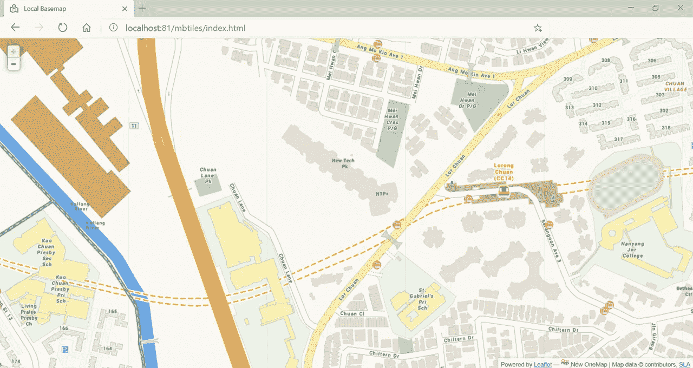

按作者分类的图像|本地托管底图示例

虽然有几种方法可以做到这一点，我的首选是利用小叶的 mbtiles 插件称为[小叶。这需要一些准备步骤，我将在下面介绍。这包括一点计算、一个本地 web 服务器、实用 python 包](https://gitlab.com/IvanSanchez/Leaflet.TileLayer.MBTiles) [mbutil](https://github.com/mapbox/mbutil) 和基础 leafletJS 库(因为选择 mbtiles 插件意味着与 leafletJS 集成)。

# 步骤 1:在线搜索预先存在的底图服务并进行选择

首先，决定离线托管的特定底图。一个好的起点是 http://maps.stamen.com/，那里有大量可供公众使用的底图。此外，决定托管哪个底图有助于清楚地了解每个地图切片的 url 格式 **(KIV:这一点极其重要，我们将在后面看到。)**。为了进行演示，我将选择 MapStamen 的碳粉底图。确定想要托管的底图类型后，继续:

1.  缩放至所需的最小缩放级别，例如`11`，并确保当前浏览器视窗当前正在捕获**所有正在渲染**地区/省份/国家/大陆**的**地图图块图像。例如，假设我的目标是托管国家新加坡的底图，我的浏览器应该如下所示:

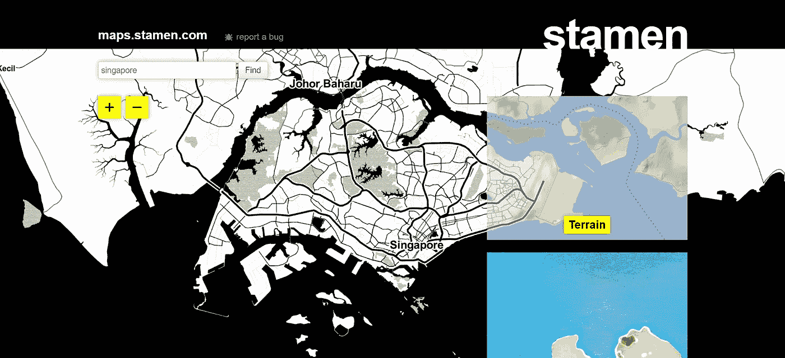

作者图片|展示缩放级别为 11 的[maps.stamen.com](http://maps.stamen.com/)墨粉底图

2.右键单击并选择“检查”或 Ctrl+Shift+i(在 Windows 上)

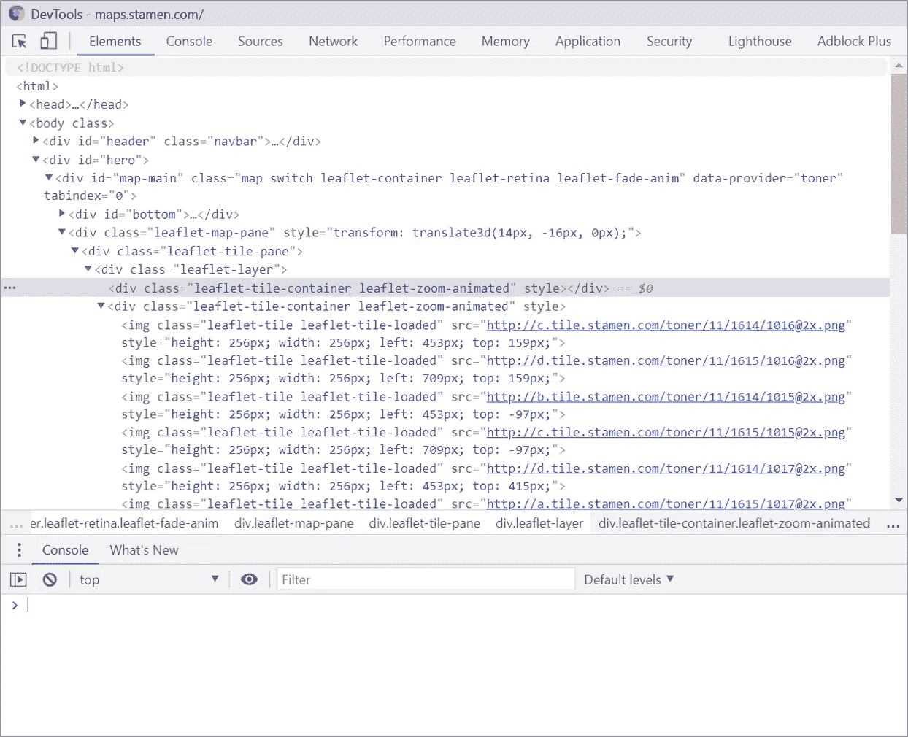

作者图片| Google Chrome 浏览器中的开发者工具截图|请注意，底图的每个切片图像中都嵌入了“src”属性

虽然不同的浏览器有不同的配置，但两个基本组件是:

1.浏览器**控制台**

2.**元素**选项卡查看 html 标记。

从呈现的每个地图区块图像的`src`属性的格式来看，它遵循传统的[滑动地图](https://wiki.openstreetmap.org/wiki/Slippy_map_tilenames)格式，其中 URL 包含`{s}-{z}/{x}/{y}`:

*   `z`:缩放级别
*   `x`:平铺图像的 X 坐标，以像素为单位
*   `y`:平铺图像的 Y 坐标，单位为像素
*   `s`:指子域。由于大量使用地图服务，子域`a`、`b`、`c`配置到位。

将以下 JavaScript 代码片段复制并粘贴到控制台中:

输出应该类似于以下内容:

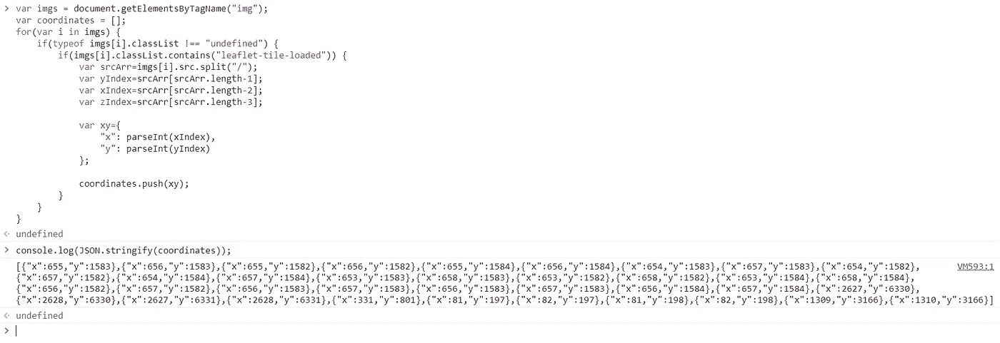

作者图片|运行 JavaScript 代码片段后，从缩放级别为 11 的底图的每个 **< img / >** 标记的图像`**src**` 属性中检索所有 x，y 坐标

**说明**:由于底图中渲染的每个地图分块的 url 格式遵循以下格式:
`http://c.tile.stamen.com/toner/11/1614/1016@2x.png`，通过使用标记`/`对其进行定界并将其转换为数组，我们可以看到以下结果:

**说明**:最上面一列代表数组的索引。在这种情况下，在缩放级别`11`:

*   `x`可以在`5`位置找到
*   `y`可以在`6`位置找到

maps.stamen 中其他可能的底图选项包括:

*   http://tile.stamen.com/toner/{z}/{x}/{y}.png(墨粉)
*   [http://tile.stamen.com/terrain/{z}/{x}/{y}.jpg](http://tile.stamen.com/terrain/%7Bz%7D/%7Bx%7D/%7By%7D.jpg)(特雷恩)
*   http://tile.stamen.com/watercolor/{z}/{x}/{y}.jpg(水彩)

# 第二步。导入 python 包并初始化纬度/经度或 X/Y 转换函数

[Slippy_map_tilenames](https://wiki.openstreetmap.org/wiki/Slippy_map_tilenames#Lon..2Flat._to_tile_numbers_2) 处的代码段源代码|函数`num2deg`根据缩放级别(`zoom`参数)将`x`和`y`分别转换为`latitude`和`longitude`。

[Slippy_map_tilenames](https://wiki.openstreetmap.org/wiki/Slippy_map_tilenames#Lon..2Flat._to_tile_numbers_2) 处的代码段源代码|函数`deg2num`根据缩放级别(`zoom`参数)将`lat_deg`和`lon_deg`分别转换为图块图像的`x`和`y`

# 2.1 将所有图块坐标(x，y)转换成坐标(纬度，经度)以将所有标记组合成一个 [GeoJSON 特征集合](https://tools.ietf.org/html/rfc7946#section-3.3)对象

作者的代码片段|请注意，标记保存在一个文件( **output.geojson** )中，4 个变量—**minx val****maxx val minYVal maxYVal**在这里被初始化，用于后续计算

作者的代码片段|输出将在后续计算中使用的前 4 个变量的值

**上面代码的输出是:**

minXVal 的值为:1612
maxx val 的值为:1616
miny val 的值为:1015
maxy val 的值为:1018

## 2.2 使用 output.geojson 可视化地图标记

将 GeoJSON 文件渲染到任何地图渲染平台上，以查看实际地图上的坐标。我个人推荐[http://geojson.io/](http://geojson.io/)，因为它有直观的界面和实用的功能。基于上述示例，从缩放级别`11`的图块转换的坐标应如下所示:

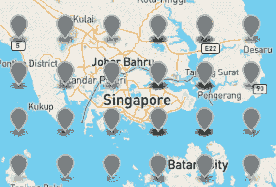

图片作者|可视化 **output.geojson** 数据文件|注意上图尺寸显示的是 **4 × 6 地图标记**，相当于 **4 × 6 平铺**。

# 第三步。计算其他缩放级别的(X，Y)值

在进行实际计算之前，重要的是要确定滑动贴图的图块坐标遵循以下规则:

瓷砖总数= 2ᶻᵒᵒᵐ × 2ᶻᵒᵒᵐ

例如，当缩放级别= `11`时，底图具有 2 × 2 = 2048 × 2048 个切片

根据地图上显示的标记，图块数量为: **4 × 6 图块**，其中:

*   **最小(x)** = 1612
    **最大(x)** = 1616
*   **最小(y)** = 1015
    **最大(y)** = 1018

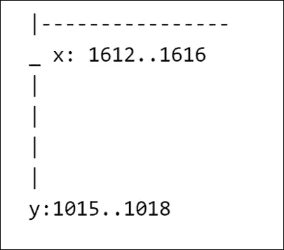

按作者分类的图像|底图缩放级别为 11 的切片尺寸| x 范围为 1612 至 1616(含)| y 范围为 1015 至 1018(含)

因此，基于上述逻辑，对于缩放级别`12`:

瓷砖总数=2 × 2 = 4096 × 4096

这转化为:(4/2048)×4096×(6/2048)×4096 tiles =**8×12 tiles**其中:

*   **min(x)**= 1612/4×8 = 3224
    **max(x)**= 1616/4×8 = 3232
*   **最小(y)**= 1015/6×12 = 2030
    **最大(y)** = 1018/6 × 12 = 2036

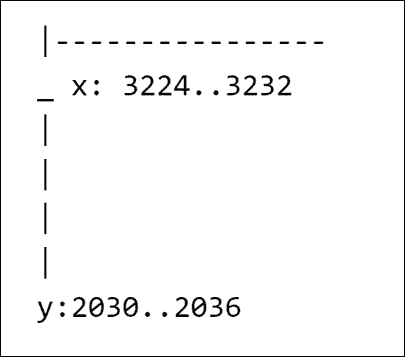

按作者分类的图像|底图缩放级别为 12 的切片尺寸| x 范围从 3224 到 3232(含)| y 范围从 2030 到 2036(含)

# 3.1 上述等式有效的概念证明

作者的代码片段| POC _ equation _ of _ zoom _ map _ tiles . py 的代码片段生成了 **output.json** ，其中包含一个切片 URL 列表|要测试计算是否合法，只需导航到几个链接以确保链接没有断开，预期结果应该是一个切片图像

根据上述计算的图示，现在可以计算和检索所需的所有底图切片图像。接下来，将根据 Slippy 地图规则建立文件夹层次结构，以包含本地保存的后续图块图像。

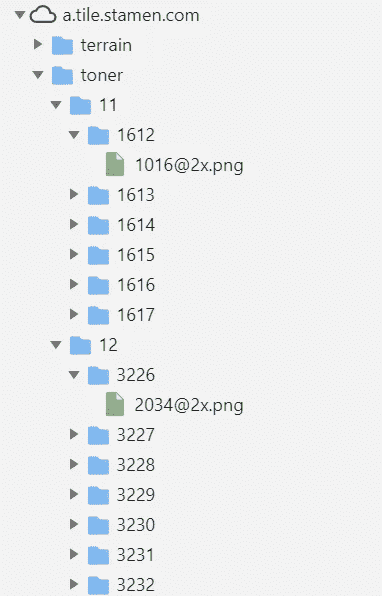

作者图片| http://maps.stamen.com/[浏览器后端截图](http://maps.stamen.com/)显示了存储图片的文件夹结构

因此，从上面可以推断出地图切片图像存储在以下文件夹结构中:

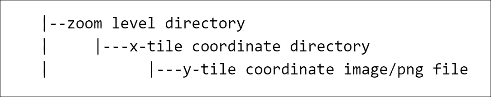

按作者分类的图像|要创建的切片图像的文件夹层次结构

下一节将尝试创建所需的文件夹层次结构。在执行此操作之前，应确定底图的缩放上限。通常，当用户需要查看街道级别的详细信息时，`17`或`18`是很好的选择。对于本教程，我将设置我的缩放水平上限，只是`15`。

早先，缩放级别 11 和 12 的区块尺寸都被导出。因此，在缩放级别`n`，由于平铺数量= 2ᶻᵒᵒᵐ × 2ᶻᵒᵒᵐ，
尺寸应为:(4×(2ⁿ)×(6×(2ⁿ)平铺

**最小(x)** = 1612/4 × 4(2ⁿ)
**最大(x)** = 1616/4 × 4(2ⁿ)

**min(y)**= 1015/6×6(2ⁿ)
**max(y)**= 1018/6×6(2ⁿ)

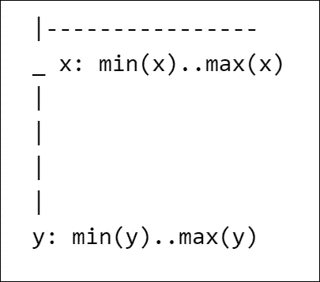

按作者分类的图像|底图缩放级别 n 的切片尺寸| x 范围从最小值(x)到最大值(x)(含)| y 范围从最小值(y)到最大值(y)(含)

为了减少重复代码，应创建一个应用上述逻辑的函数，以便在任何缩放级别检索图块的`x`和`y`坐标:

作者代码片段|输出为:**缩放级别为 11 到 15 的文件夹结构已创建。**

# 第四步。将切片图像流式传输到创建的本地文件夹中

初始化文件夹结构后，我们现在可以从底图服务中检索缩放级别在`minZoomLevel`和`maxZoomLevel`(含)范围内的切片图像。

## 需要注意的是:

1.  如果指定的缩放级别上限很高，例如，高于缩放级别`17`将显著增加运行代码的持续时间，则该步骤可能需要几个小时
2.  输出的切片图像将占用相当多的磁盘空间。通常，来自地图服务(如 OpenStreetMap)的栅格切片(由单个国家的缩放级别`11`到`17`组成)大约占用 500MB。
3.  如果托管的底图类型是卫星地图，由于卫星影像的高分辨率，最终输出通常会达到几 GB，因此明智的做法是在将切片图像保存到本地磁盘驱动器之前确保有足够的可用磁盘空间。

Author | Output 的代码片段是:**缩放级别为 11 到 15 的所有地图切片图像都已保存到本地目录中。**

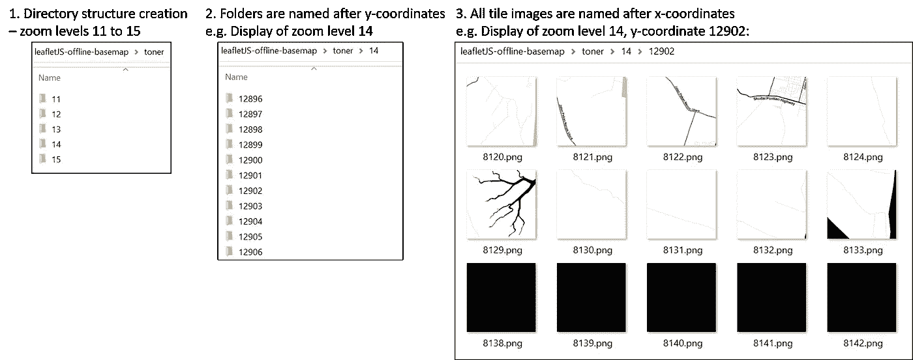

按作者分类的图像|所有图块图像保存到本地文件夹后，它应该与上面类似。基本上，这是上述所有步骤的总结。

# 4.1 在 web 服务器上托管文件夹，以确保切片图像保存成功

最后，为了确保保存正确的切片图像，应设置一个 web 服务器，并直接从文件夹中调用底图(只有在确保底图正确渲染后才能进行打包)。

在本演示中，将使用库`Flask`和`werkzeug`直接在 jupyter 笔记本中设置一个 web 服务器来托管底图。

**先决条件**

*   包含基础传单库:[传单样式表](https://unpkg.com/leaflet@1.0.0/dist/leaflet.css)和[传单 JS](https://unpkg.com/leaflet@1.0.0/dist/leaflet-src.js)
*   包括传单插件 [L.TileLayer.mbTiles 插件](http://ivansanchez.gitlab.io/Leaflet.TileLayer.MBTiles/Leaflet.TileLayer.MBTiles.js)及其依赖关系 [sql.js](https://unpkg.com/sql.js@0.3.2/js/sql.js)
*   将步骤 2 生成的文件`output.geojson`放入下面指定目录结构的`static`文件夹中
*   将图块图像文件夹如**碳粉**复制并粘贴到以下指定目录结构的`static/maps`文件夹中
*   保存一个空白的黑色图块，并将其重命名为`error.png`。将其放入下面指定目录结构的`static`文件夹中

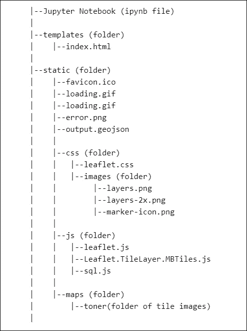

作者图片|代表整个文件夹结构，包括 jupyter 笔记本

最后，继续在``标记之间的`index.html`中包含以下代码片段，以直接从文件夹渲染底图:

作者的代码片段|上面的代码片段使用 leafletJS 初始化了一个新的地图对象|步骤 2 中生成的文件 **output.geojson** 通过 AJAX 调用，并继续在底图的 bbox 中设置地图视图

作者代码片段| Flask web 应用程序的初始化。注意，已经创建了一个关闭 web 服务器的 API。这个 API 是通过链接[http://localhost:9000/shut down](http://localhost:9000/shutdown)访问的

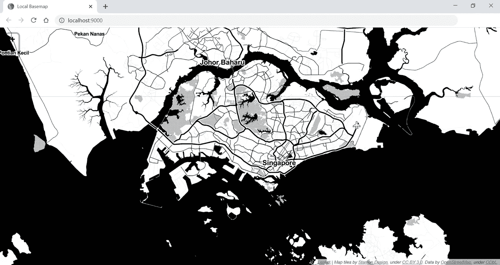

按作者分类的图像|渲染的初始底图视图示例

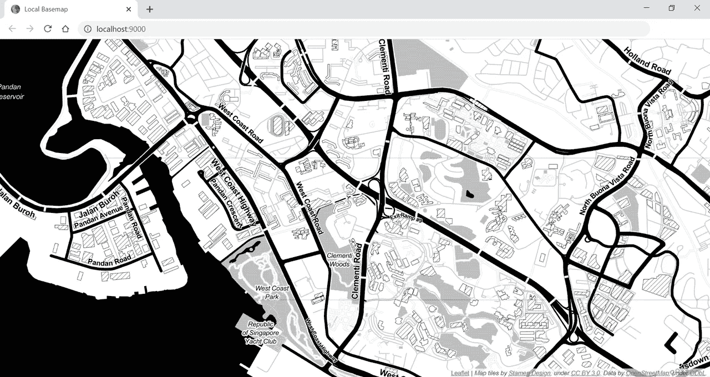

按作者分类的图像|底图的放大视图

# 4.2 用 python 包将文件夹打包— `mbutil`

既然我们已经确保底图渲染了正确的切片图像，现在可以将文件夹打包到单个 mbTile 文件中。这是通过 python 包 [mbutil](https://pypi.org/project/mbutil/) 完成的。要安装 mbutil，我们需要严格遵循以下说明:

1.  导航至 [mbutil](https://github.com/mapbox/mbutil)
2.  继续克隆/下载 git 存储库，并将 ZIP 存档保存到 jupyter 笔记本所在的文件夹中

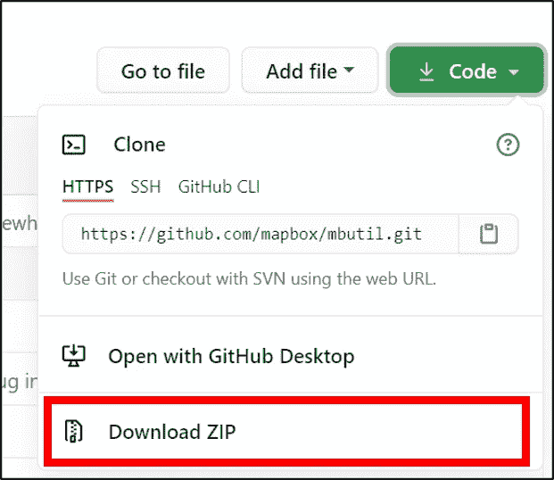

作者图片|为 mbutil 选择“下载 ZIP”

3.提取文件夹`mbutil-master`并重命名为`mbutil`。

4.在 mbutil 文件夹中导航并**删除**文件`.gitignore`。它现在应该是这样的:

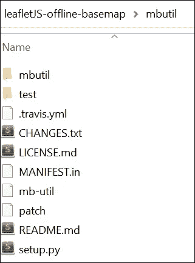

作者图片|显示 mbutil python 包的内容

5.继续打开该文件夹中的终端/命令提示符并运行:`python mb-util ../static/maps/toner ../static/maps/toner.mbtiles`

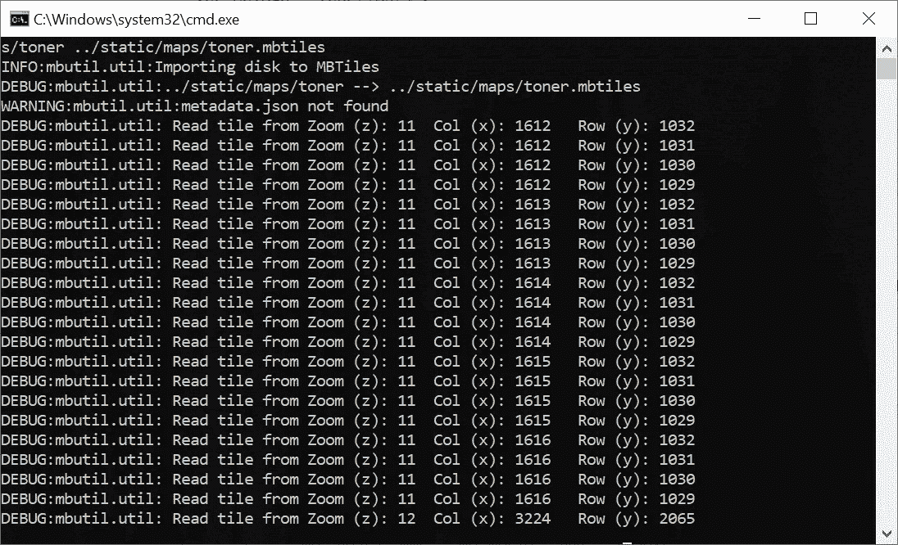

作者图片|显示命令提示符，表明`mbutil`的打包过程正在进行

6.`toner.mbtiles`现在已创建，最新的文件夹结构应该如下所示:

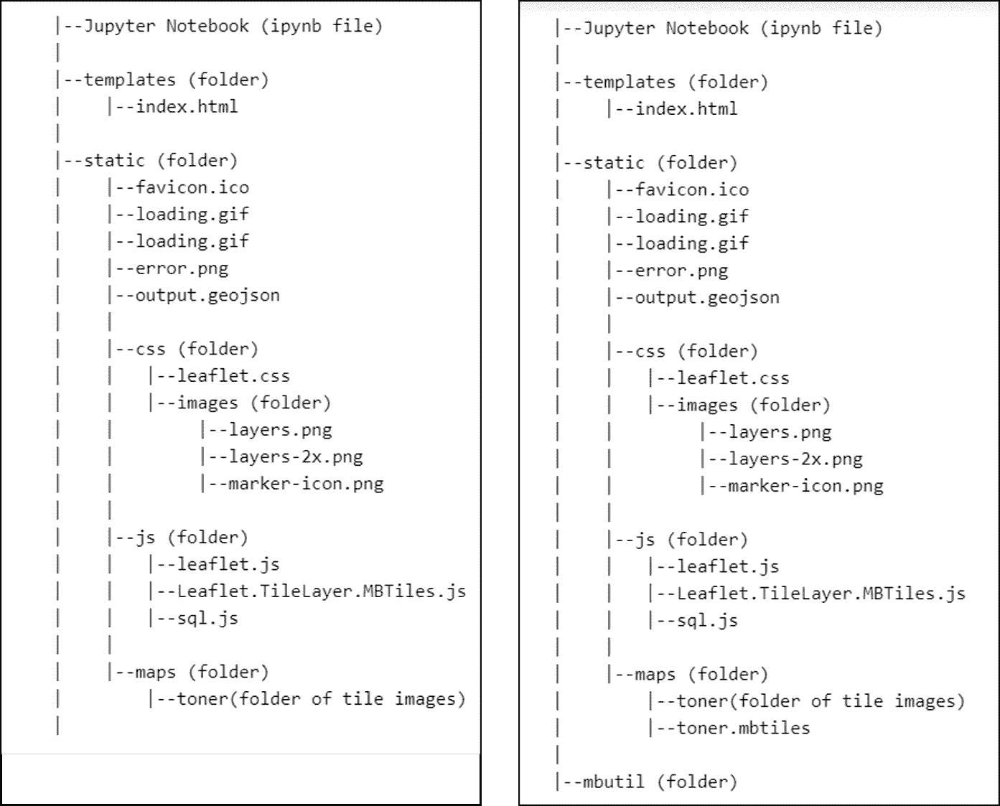

图片作者| ( **左**)上一个项目结构| ( **右**)当前项目结构

7.因此，继续修改标签之间的`index.html`中的代码片段，以渲染来自`toner.mbtiles`文件的底图:

作者代码片段|上面的代码片段与前面的代码片段几乎相同，只是不是从**static/maps/toner/{ z }/{ x }/{ y }渲染底图。png** ，底图现在由打包的 mbtiles 文件**static/maps/toner . MB tiles**渲染而成

# 第五步。使用 mbtile 文件和传单重新运行 web 应用程序。TileLayer.MBTiles.js 插件

作者代码片段|重新初始化 flask 应用程序以渲染底图

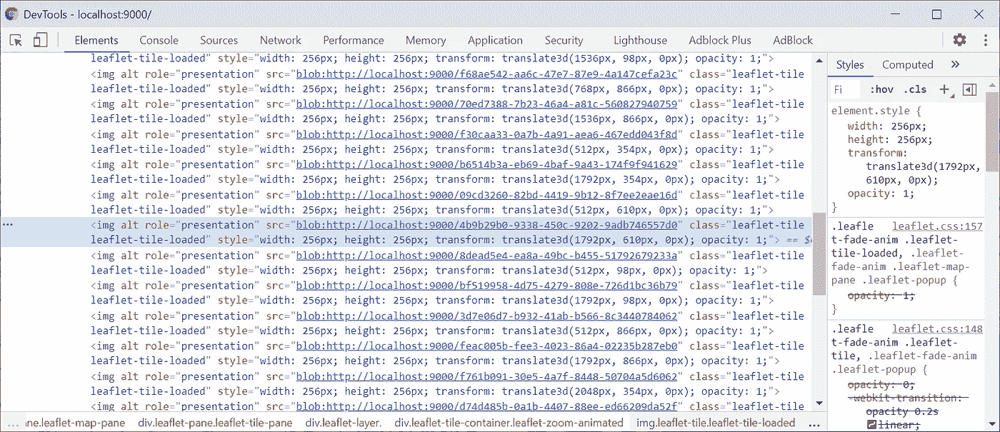

图片由作者提供|如上所述，所有切片地图图像的 url 均以二进制格式呈现，从 **toner.mbtiles** 获取-本地底图现已成功打包到单个 mbtiles 文件中，并部署到本地服务器上以供使用。

**注意**:您可以继续删除文件夹`static/maps/toner`，只留下 mbtiles 文件供应用程序使用。

**恭喜你！现在，您已经在本地服务器上渲染了底图。**

请随意在我的 [GitHub](https://github.com/incubated-geek-cc/offline-mapping-server) 分叉项目，并查看实际的 [Jupyter 笔记本](https://github.com/incubated-geek-cc/offline-mapping-server/blob/master/Host%20Your%20Own%20Offline%20Mapping%20Server.ipynb)。

如果你对更多与地理空间相关的内容感兴趣，你可以在 Medium 上关注我，我很乐意分享更多我自己的作品或发现。

希望你们觉得这有用，感谢阅读！

 [## 通过我的推荐链接加入灵媒——李思欣·崔

### 获得李思欣·崔和其他作家在媒体上的所有帖子！😃您的会员费直接…

geek-cc.medium.com](https://geek-cc.medium.com/membership)