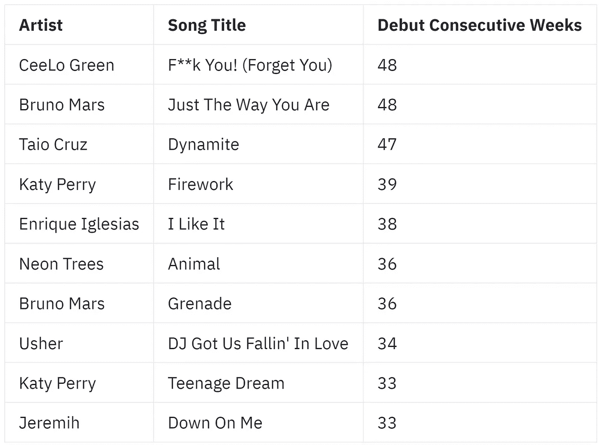
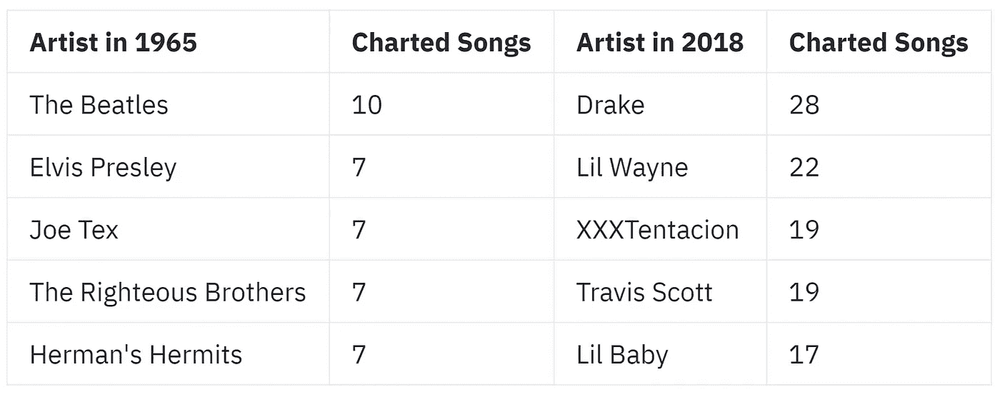
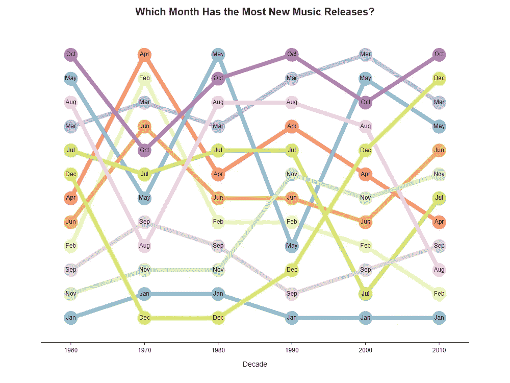

# 热门与否:分析 60 年来美国公告牌百强数据

> 原文：<https://towardsdatascience.com/hot-or-not-analyzing-60-years-of-billboard-hot-100-data-21e1a02cf304?source=collection_archive---------37----------------------->

照片由 [Unsplash](https://unsplash.com?utm_source=medium&utm_medium=referral) 上的 [israel palacio](https://unsplash.com/@othentikisra?utm_source=medium&utm_medium=referral) 拍摄

德雷克和泰勒·斯威夫特是 Billboard Hot 100 无可争议的国王和王后。他们分别拥有 157 首和 109 首不同的歌曲，打破了滚石乐队(57 首)、埃尔顿·约翰(64 首)和披头士乐队(69 首)的记录。意识到这一点后，我想发现音乐行业随着时间的推移发生变化的一些其他方式，即通过确定发行音乐的数量、发行人以及在 Hot 100 上的表现。为此，我将下载 100 个热门图表作为结构化表格，并创建自定义指标来量化这些趋势以及更多内容。

## 探索性视觉效果

Billboard Hot 100 于 1958 年 8 月首次发布，因此在这次分析中，我的数据包括了 1959 年至 2019 年(不包括 1958 年和 2020 年这两个不完整的年份)每年的每一周——特别感谢 [Chris Guo 的 API](https://github.com/guoguo12/billboard-charts) 。

(图表由作者提供)

随着时间的推移，进入前 100 名的不同艺术家的数量正在减少，这意味着争夺热门 100 名的流行歌星的舞台每年减少大约三个。对于超级巨星来说，这个市场已经成熟，他们可以发行更多的歌曲，同时减少同行的排挤。

(图表由作者提供)

流行音乐在 60 年代末经历了多样性的顶峰，并在 2001 年稳步下降到重复性的顶峰(巧合的是，那一年 Napster 正处于流行的顶峰并被关闭)。自 2001 年以来，宋综艺上的热度有所上升，但仍没有 60 年代那么高。

(图表由作者提供)

另一个相当重要的指标是一首歌首次进入热门 100 强时的周转时间。在 90 年代和 00 年代初，歌曲首次亮相时会有很长的首演片段。快进到 2010 年，大多数歌曲都会在排行榜上停留一两周，然后反弹。

虽然中位数确实描述了大多数情况，但离群值仍有打破这一标准的空间。以下是 2010 年的一些主要外围案例:

沿着记忆之路走一趟……(图片由作者提供)

有如此明显的异常值，平均出道时间怎么会是两周？？我认为这些数据支持了一个现实，即有几个艺术家发行了大量的音乐——其中大部分不会持续很久，但那些坚持下来的歌曲会持续很久。谁能忘记席洛·格林和布鲁诺·马斯在排行榜上几乎长达一年的统治！

(图表由作者提供)

随着越来越少的艺术家登上排行榜，这些艺术家中的每一个人每年都会创作 1.5 到 2 倍的歌曲，并在 2018 年爆发。比较 1965 年和 2018 年间最多产的 5 位艺术家:

披头士和德雷克在同一年发行了他们的第五张录音室专辑(图片由作者提供)

“救命！”甲壳虫乐队的(1965)包含了专辑中的 14 首歌曲，而德雷克的“蝎子”(2018)包含了 25 首歌曲，这 25 首歌曲都进入了当年的前 100 名。专辑越来越长这个话题已经被广泛研究过，安德鲁·梅斯就这个话题写了一篇文章:

 [## 说唱专辑真的越来越长了吗？

### 到目前为止，2018 年一直被看似无止境的大型说唱唱片所主导，这些唱片有着令人生畏的长曲目列表和…

pitchfork.comS](https://pitchfork.com/features/lists-and-guides/are-rap-albums-really-getting-longer/) 

流媒体时代伊始，Billboard 开始将专辑中的歌曲作为热门 100 首销售报告的单曲，因为它们可以在 Spotify、Apple Music 和 Tidal 等平台上点播。这与 20 世纪形成了鲜明对比，在 20 世纪，单曲报道主要来自电台广播。如今，鲜为人知或被抛弃的歌曲更有可能登上排行榜。像德雷克这样的艺术家拥有压倒噪音的音量，流媒体时代注定会有流行歌星打破 LP 和 CD 时代艺术家的单曲记录。

# 新音乐季节性趋势

除了解决空前的单曲唱片的问题，我还想以历年来发行音乐的最佳和最差时机的分类来结束我的分析。传统智慧和音乐营销博客规定了一些关于发布音乐的规则:除了节日音乐，不要在 12 月发布，不要在 SXSW 期间发布，等等。但我想看看哪些月份实际上发行了最多的新音乐，以及随着时间的推移这种情况是如何变化的。(点击放大)

(图片由作者提供)

一月、二月和九月一直是发行音乐的糟糕月份，而十月和三月(SXSW 发生时)通常是新音乐的好月份。六月、十一月和七月似乎是“还可以”的月份，其余的月份噪音太大，无法得出可靠的结论。

# 最后的想法

与 20 世纪相比，在 2020 年以新艺术家的身份发行音乐是一种完全不同的体验。那些日子的一些守门力量已经被社交媒体、YouTube 和我们所知的互联网所回避。然而，算法、播放列表和数字广告等新时代的把关者继续以独特的方式影响着这个行业。总而言之，这些力量的影响似乎正在缩小新音乐人的机会，但我相信，随着音乐收入恢复到昔日的辉煌，新艺术家成名的机会将会增加。

感谢检查我的分析！要了解我是如何从原始的 Billboard 图表变成你上面看到的指标的，请查看我对这个项目的 [GitHub repo](https://github.com/azhadsyed/billboard-hot-or-not) 。