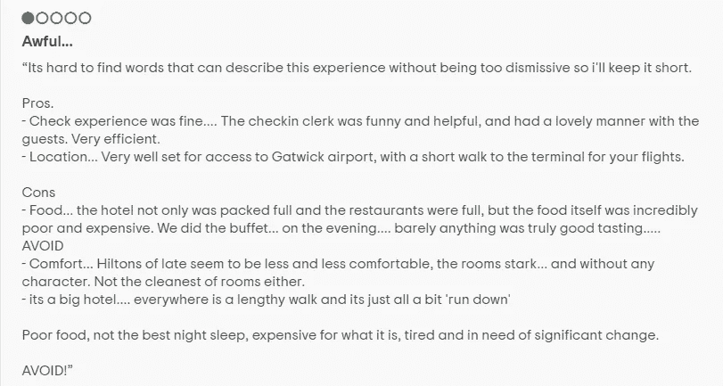
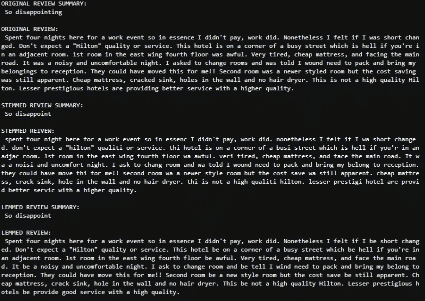
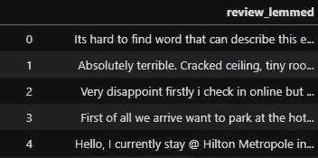
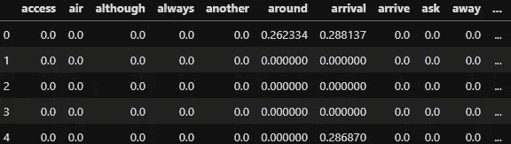
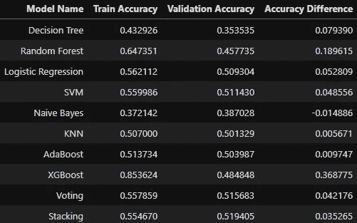
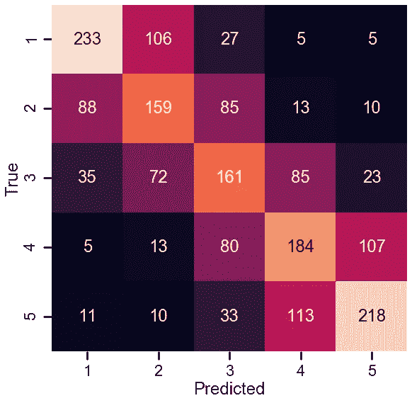
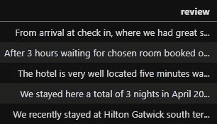
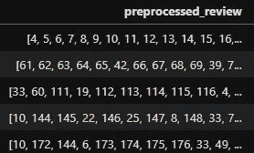
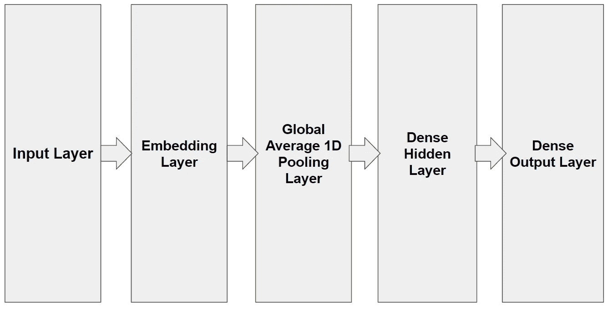
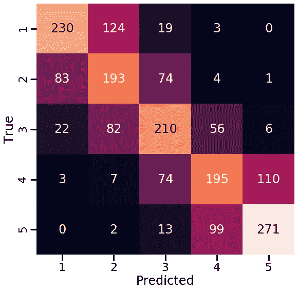

# 希尔顿酒店评论 NLP 分类器

> 原文：<https://towardsdatascience.com/hotel-review-nlp-classifier-for-the-hilton-7e2dd304f8e2?source=collection_archive---------29----------------------->

## 遵循 CRISP-DM 框架的详细项目报告。包括工作演示应用程序。


在这篇博客中，我将回顾我是如何通过为希尔顿酒店评论的 NLP 项目实现一个神经网络模型来改进我的分类器的。我的模型旨在使用情感分析，可以对评分在 1 到 5 分之间的评论进行分类。

这是我项目的 Github 链接:[www.github.com/awesomeahi95/Hotel_Review_NLP](https://github.com/awesomeahi95/Hotel_Review_NLP)

**我会回顾我项目的目标、过程和结果。**

## 我的项目的商业案例:

*如今，公众对产品和服务的讨论和评论已经超越了专门的媒介，现在也出现在社交媒体领域。*

*目前在 tripadvisor、trustpilot 和 expedia 上可以找到希尔顿酒店的在线评论。大多数评论者给出的分数在 3 到 5 之间，因此，如果一个新客户在前面提到的任何评论网站上浏览在线评论，他们可能会考虑在希尔顿酒店预订房间。*

如果他们在听完朋友的话后就已经下定决心了呢？潜在客户的酒店选择可能会受到一条推文的影响。观点不断在社交媒体平台上分享，并被其追随者阅读。通过阅读这些在线帖子，了解这些关注者对我们酒店的看法，可以帮助我们更好地了解公众对我们酒店的看法。

*通过使用情感分析，基于 Tripadvisor.com 现有的酒店评论，我创建了一个模型，该模型可以在 1-5 的范围内量化 twitter 上的推文或 reddit 帖子的作者对我们酒店的感受，以及读者对我们的看法。如果评论分类低于 3 分，可以调查这篇帖子/推文，找出他们对我们酒店有负面看法的原因，并解决问题。*

## Tripadvisor 上的点评示例:



伦敦盖特威克希尔顿酒店 1 星评价

通过阅读文本，人类可以相对容易地对以上评论的分数(在某种程度上)进行分类。我们习惯于从另一个人使用的词语和上下文来理解他对一个话题的感受。

对于一台计算机来说，既要解释人的观点，又要理解人的情感，需要几个阶段:

*   **将单词分解成它们的词根形式:**



综述(原文/词干/词条)

使用词干化和词尾化这样的技术，把恶心和厌恶这样的词分解成一个词根，厌恶。

*   **标记化:**

使用正则表达式将句子分解成单词，没有标点符号。

*   **删除停用词**

像“我”、“他”、“和”等词是最常见的词，可能会影响其他词的值，所以我们删除这些词。至于我的项目，那是以酒店为导向的，我也删除了诸如“酒店”、“房间”和“机场”等常用词。

*   **矢量化**

***(这是最不人性化的一步)***

在建模的初始阶段之前，我有两个选择:计数矢量化(单词袋)和 TF-IDF 矢量化。这两种方法都将词频作为通用度量，尽管 TF-IDF 也将词频与整个语料库进行比较，以获得更有意义的度量。

我决定在我的项目中使用 TF-IDF 矢量化。所以我的 lemmatised 评论专栏从这个开始改变了:



对此:



因此，现在一篇评论由一个与我的评论语料库中最常见的 138 个单词相关联的奇异值来表示。

我对我看到的零的数量不太满意，尽管这很有意义。

*   **建模和测试**

机器学习阶段。在这里，我试验了 5 种分类算法和 5 种集成方法，都进行了一些超参数调整。要了解更多细节，请查看我在博客开头分享的 Github 回购链接中的第三个笔记本。

这些是我的结果:



模型训练阶段的训练和验证准确性


模型测试阶段的训练和测试(在验证准确性栏中)准确性+每个分数的额外指标

我选择了 Stacking(逻辑回归和逻辑回归的 Adaboost 的集合)模型，因为它具有相当好的训练精度和合理的验证精度。你可能会想，这些精度在 0.5 到 0.6 的范围内，肯定不是很好。好吧，考虑到这是一个 5 向多类分类，随机选择一个并且正确的几率是 0.2。此外，这些都是主观分数，即使是人也很难选择正确的分数。用混淆矩阵可以更好地说明这一点。



你可以看到大多数时候模型预测正确的分数，用斜线表示。我们看到的大部分误差(准确度在 50–60%范围内)来自相邻的分数，例如，预测分数为 1，但实际分数为 2。我对此很高兴，因为这个模型仍然足够好，可以区分优秀的评论、一般的评论和糟糕的评论。

在这一点上，计算机可以解释输入的文本，并多少理解其中的含义。

我想要更好的。

为什么不让它更人性化呢？神经网络的设计类似于我们大脑中神经元的功能，所以这可能是我可以做出的改变，以改善我的模型。

*   **神经网络**

在创建我的神经网络模型之前，预处理有点不同。

我创建了一个字典，其中的关键字是单词，语料库中所有独特的单词，以及值，即与每个独特的单词相关联的数字。我还添加了 4 个特殊键，用于填充、开始复习、未知单词和未使用的单词。我在字典里总共有 17317 个词条。这来自 9405 条评论。

```
word_index_dict['<PAD>'] = 0
word_index_dict['<START>'] = 1
word_index_dict['<UNK>'] = 2
word_index_dict['<UNUSED>'] = 3
```

预索引:



索引前的审查

索引后:



索引后的评论

作为最后的预处理步骤，我添加了一个填充层，最大长度为 250 个单词。然后我训练了模型。

*   **神经网络架构:**



所用神经网络模型的架构

这里 NLP 的特殊层是嵌入层。

单词被映射到向量空间中的向量，在我的例子中是 16 维向量。这一次，每个单词都有一个基于其周围单词的向量，即上下文。矢量化不同于之前的 TF-IDF 矢量化，我们不只是关注基于频率的指标，而是实际关注每个词在给定上下文中的影响。

这越来越像人类了。

现在，像好、好、坏、更坏这样的词有了一些更有意义的数字(向量)与之相关联。可以测试该模型的新评论不仅包含这些单词，还包含围绕这些单词的单词，这些单词更好地描述了评论作者试图表达的内容。这种情况可以用更多的数据来更好地解释，但目前的 9405 审查将做得很好。

*   **测试神经网络模型**

该模型的测试精度达到了 **0.5710** ，优于我们之前模型的精度 **0.5077。**因此，我们有了 7%的改进，这是非常显著的，但观察这种 5 向多类分类的最佳方式还是通过查看混淆矩阵。



神经网络模型测试数据混淆矩阵

如您所见，该模型没有将评分为 5 的评论预测为 1，反之亦然。其他错误分类的分数有所改善，大多数预测更接近中间对角线。

*   **应用**

我用 Streamlit 和 Heroku 设计了一个模型的演示应用程序，你可以在这里试用:[www.hilton-hotel-app.herokuapp.com/](https://hilton-hotel-app.herokuapp.com/)

## **待改进:**

*   使用更大的训练数据集
*   尝试更深层次的神经网络
*   将分类的复杂性降低到二元分类
*   实施其他预制的矢量化方法— word2vec 或 GloVe