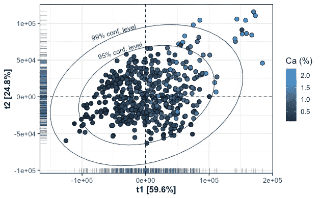
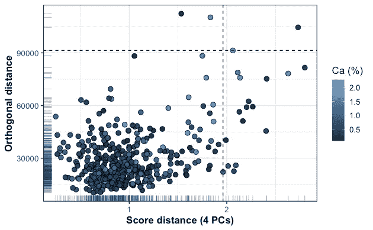
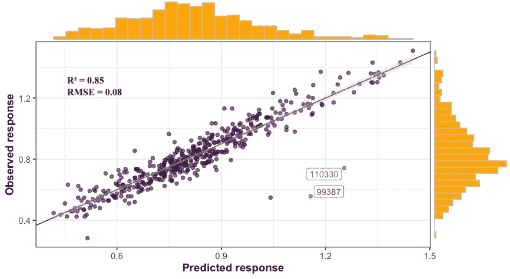
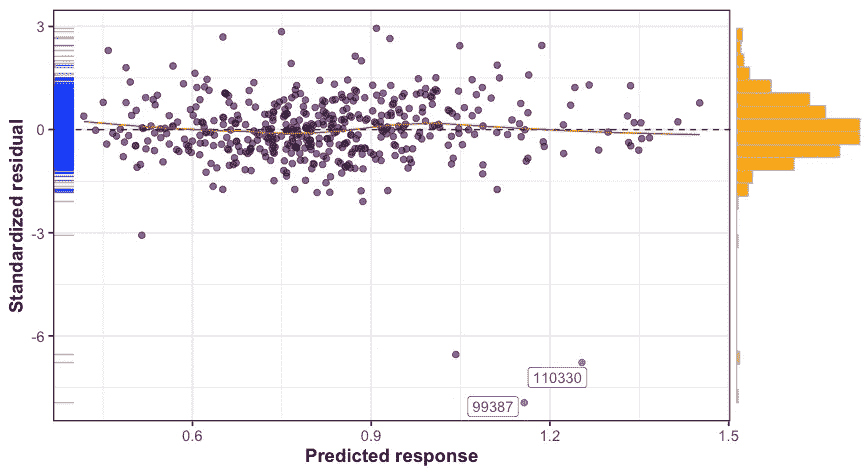
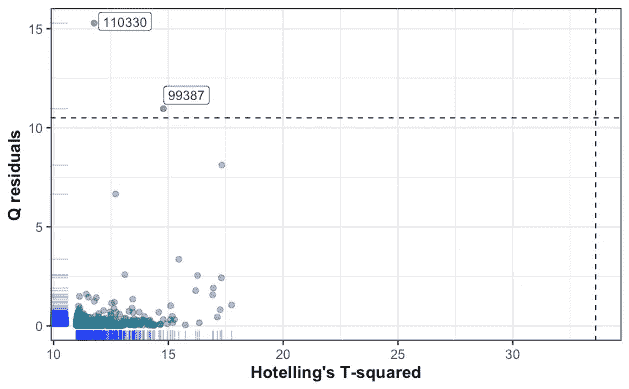
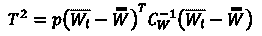
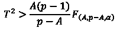
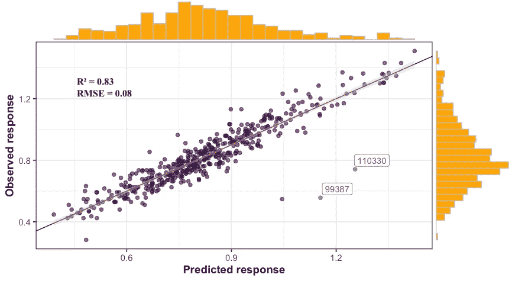
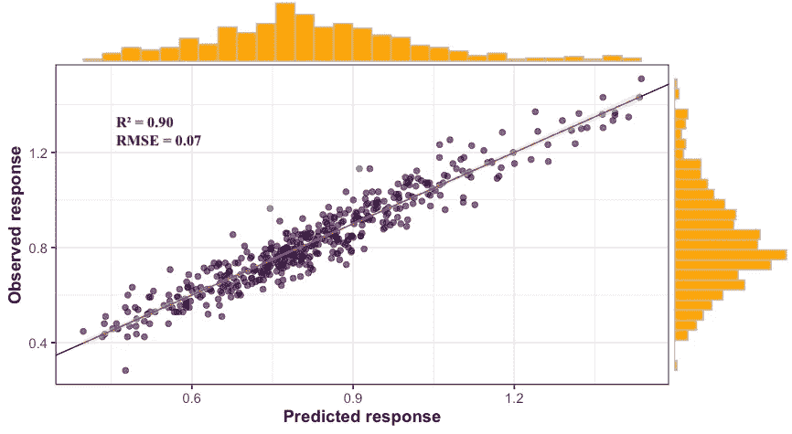
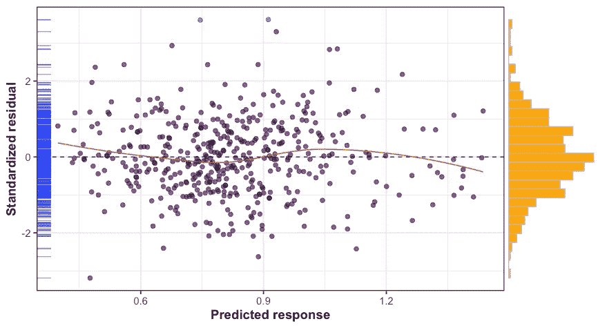

# 基于 Hotelling-T 的偏最小二乘变量选择

> 原文：<https://towardsdatascience.com/hotelling-t%C2%B2-based-variable-selection-in-partial-least-square-pls-165880272363?source=collection_archive---------25----------------------->

## 本文旨在探索基于 Hotelling-T 变量选择的偏最小二乘模型的高维光谱数据。

图片由本·哈里特拍摄

# 背景

O 光谱数据建模中最常见的挑战之一是从与响应变量相关的大量变量中选择一个变量子集(即波长)。对于光谱数据来说，相对于观测值的数量而言，具有大量变量是很常见的。在这种情况下，选择较少数量的变量是至关重要的，特别是如果我们希望加快计算时间并提高模型的稳定性和可解释性。通常，变量选择方法分为两组:

基于过滤器的方法:选择最相关的变量作为独立于预测模型的预处理步骤。
基于包装器的方法:使用监督学习方法。

因此，任何基于 PLS 的变量选择都是一种包装方法。包装器方法需要一个选择标准，该标准只依赖于手头数据的特征。

# 方法

让我们考虑一个回归问题，假设响应变量 ***y*** ( *n* × 1)和预测矩阵***X***(*n*×*p*)之间的关系可以用线性模型***y***=*β****X***来解释我们的数据集由来自各种植物材料的 *n* = 466 个观察值组成，并且 ***y*** 对应于每种植物的钙(Ca)浓度。矩阵 ***X*** 是我们测得的 LIBS 光谱，它包括 *p* = 7151 个波长变量。因此，我们的目标是找到对 Ca 含量具有令人满意的预测能力的 ***X*** 的一些列子集。

## ROBPCA 建模

让我们首先执行稳健的主成分分析( [ROBPCA](/multivariate-outlier-detection-in-high-dimensional-spectral-data-45878fd0ccb8) )来帮助可视化我们的数据，并检测是否存在不寻常的结构或模式。获得的分数由下面的散点图显示，其中的省略号代表霍特林 T 的 95%和 99%置信区间。大多数观察值低于 95%置信水平，尽管一些观察值似乎集中在分数散点图的右上角。

ROBPCA 得分散点图。

然而，当更仔细地观察时，例如使用异常值图，我们可以看到最终只有三个观察值似乎会造成问题。我们有两个观察被标记为正交异常值，只有一个被标记为坏的杠杆点。一些观察被标记为良好的杠杆点，而大多数是常规观察。

ROBPCA 离群图。

## PLS 建模

值得一提的是，在我们的回归问题中，由于 *n* ≪ *p* ，普通最小二乘(OLS)拟合是不可选择的。PLS 通过搜索一小组所谓的潜在变量(LVs)来解决这个问题，潜在变量执行对 ***X*** 和 ***y*** 的同时分解，约束条件是这些分量尽可能多地解释 ***X*** 和 ***y*** 之间的协方差。下图是从 PLS 模型中获得的结果。我们获得的 R 为 0.85，RMSE 和平均相对误差分别为 0.08 和 0.06，这相当于平均绝对百分比误差(MAPE)约为 7%。

观察图与预测图(完整数据集)。

残差图(完整数据集)。

与 ROBPCA 异常值图类似，PLS 残差图标记了三个显示高标准化残差值的观察值。检查异常值的另一种方法是从 PLS 模型中计算 Q 残差和 Hotelling T，然后定义一个标准来判断某个观察值是否为异常值。高 Q-残差值对应于模型不能很好解释的观察，而高霍特林 T 值表示远离常规观察中心的观察(即得分= 0)。结果绘制如下。

q 残差与霍特林 T 图(完整数据集)。

## 基于 Hotelling-T 的变量选择

现在，让我们从我们的 PLS 模型中进行变量选择，这是通过计算 T 统计来进行的(有关更多详细信息，请参见 [Mehmood，2016](https://www.sciencedirect.com/science/article/abs/pii/S0169743916300375) )，

其中 *W* 是负载权重矩阵， *C* 是协方差矩阵。因此，基于以下标准选择变量，

其中 *A* 是来自我们 PLS 模型的 LV 数，1-𝛼是来自 *F* 分布的置信水平(𝛼等于 0.05 或 0.01)。

因此，从我们原始数据集中的 7151 个变量中，只有 217 个是基于上述选择标准选择的。观察到的与预测的图显示如下，以及模型的 R 和 RMSE。

观察与预测图(选定变量)。

在下面的结果中，标记为异常值的三个观察值已从数据集中删除。平均绝对百分比误差为 6%。

观察图与预测图(选定变量，剔除异常值)。

残差图(选定变量，剔除异常值)。

## 摘要

在本文中，我们使用偏最小二乘法成功地执行了基于 Hotelling-T 的变量选择。与使用具有完整数据集的模型相比，我们获得了所选变量数量的巨大减少(-97%)。