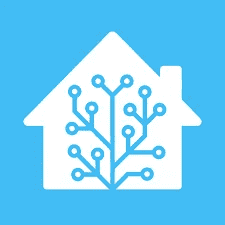
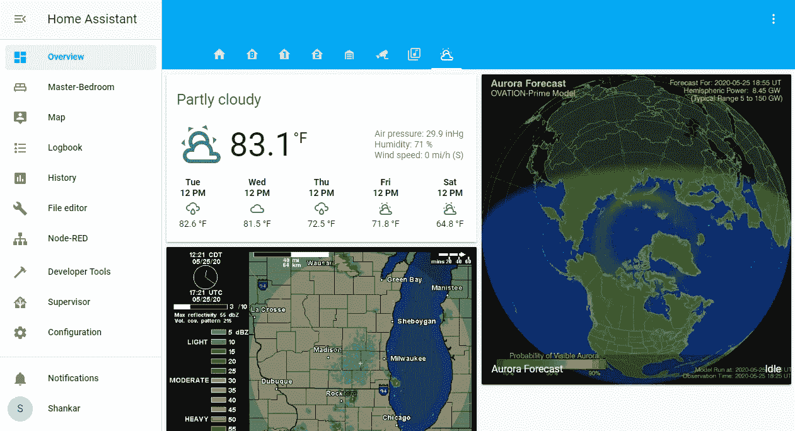
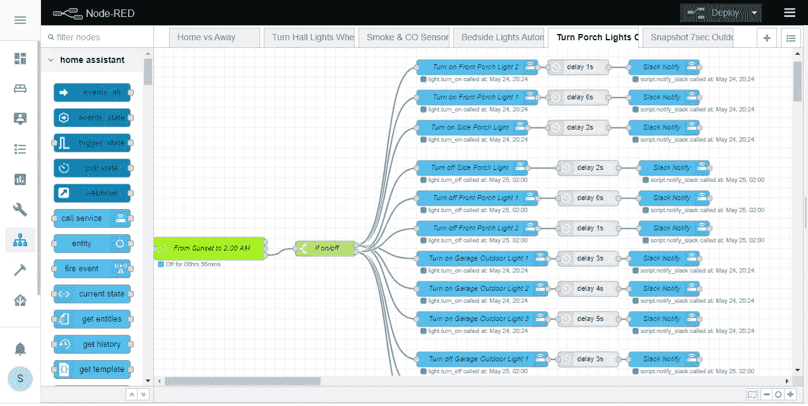
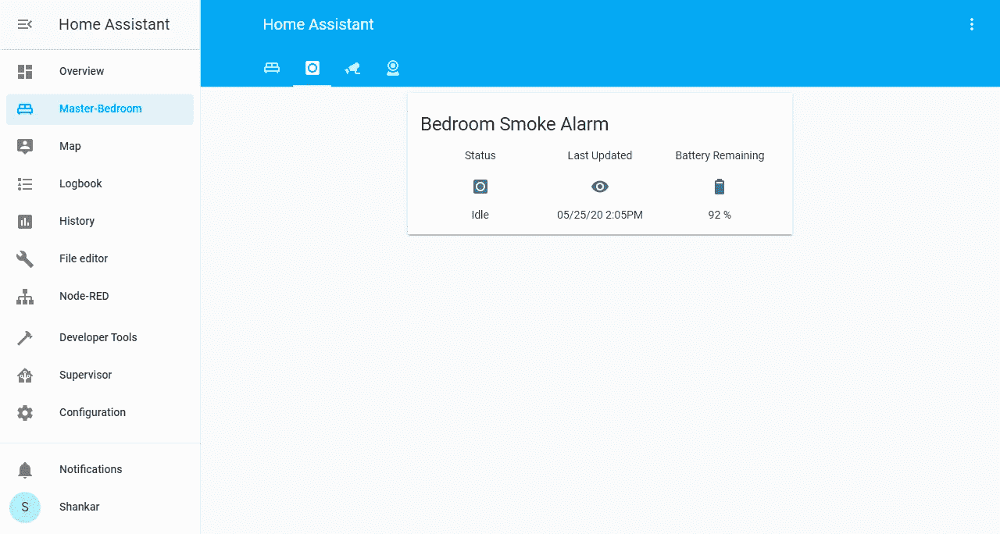
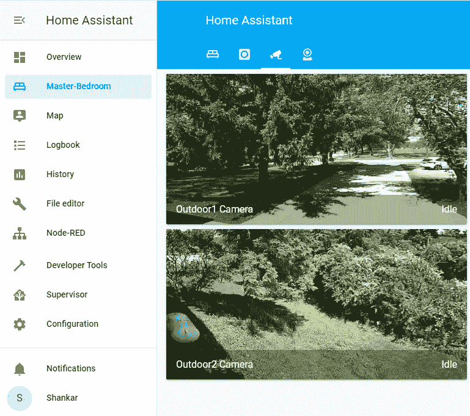
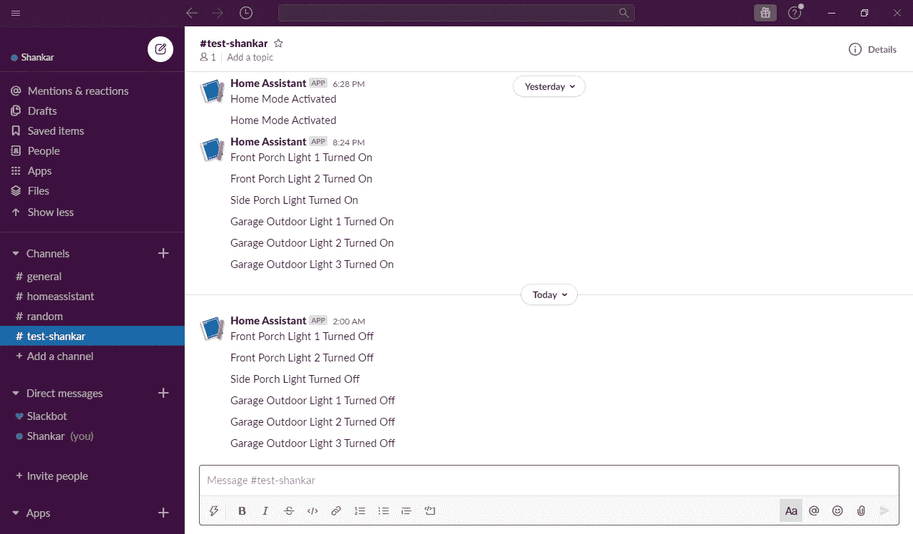

# 使用家庭助理的家庭自动化

> 原文：<https://towardsdatascience.com/house-automation-using-home-assistant-191ee017027d?source=collection_archive---------12----------------------->

## 我采用开源和隐私优先的家庭自动化系统的旅程

# 为什么选择家庭自动化？

我一直想用科技。它可以让我们的生活更轻松，也可以让我变得懒惰。🙂十几岁的时候，我的卧室拥有极致的奢华:天花板上有一台液晶显示器，可以看电影、听摇滚音乐会、玩电脑游戏，甚至不用坐起来。

当我和妻子去年买了我们的第一套房子时，我知道我想享受一些高质量的家庭自动化。我心中的工程师要求一个系统:

> 1.开源
> 2。注重隐私的
> 3。面向快速设置和用户友好的定制
> 4。当我想编码和开发定制特性时，让我得到引擎盖下面

# 家庭自动化软件选项

会有这样的系统吗？我在网上做了大量研究，评估了许多私有云自动化系统。最终，我找到了名为[家庭助手](https://www.home-assistant.io/)的完美搭档。

Home Assistant 不仅是一个隐私第一的开源家庭自动化系统，而且它还有一个由出色的人组成的伟大社区，他们为大量流行的智能设备构建并支持强大的集成。作为一个刚刚尝试家庭自动化的新用户，这对于我来说是一个巨大的优势。我根据家庭助理用户社区的建议和已经开发的集成插件投资了家庭自动化硬件。

我意识到，与硬件和现有集成一样重要的是，运行 Home Assistant 的服务器也同样重要。

# 家庭助手靠什么运行？

家庭助理在 Raspberry Pi 或本地服务器上运行。我从 [canakit](https://www.canakit.com/raspberry-pi-4-starter-kit.html) 买了一个树莓 Pi 4 入门套装。

我把它连接到我的路由器的以太网上，并安装了来自这个来源的 Hassio。
Hassio 仅在 Pi 上运行家庭助理软件，允许软件充分利用其资源。没有其他软件的竞争，它可以全天候运行。我还采取措施，在一个自定义端口上安全地将我的 Hassio 实例暴露给 web，并启用双因素身份验证和 https 来建立到它的安全连接。

# 灯光和运动传感器:

我和妻子开始购买智能 LED 灯，作为迈向自动化的第一步。我们需要一套照明系统，能够根据我们不同房间的需求自动开关。我们还希望柔和的灯光帮助我们在漫长的一天后放松下来，醒来时没有刺眼的强光。我研究了好几个系统，最后选择了飞利浦 Hue。飞利浦系统有各种尺寸的灯泡和一个将它们连接在一起的集线器。诚然，市场上有更便宜的智能灯选择，我觉得我们在价格和性能之间做出了最好的决定。Hue hub 通过局域网连接，没有必要将 hub 暴露在互联网上，除非您想用智能手机启用地理围栏(稍后我会详细介绍)。我还买了几个飞利浦 Hue 运动传感器，放在我们家的重要位置，与灯光配合得非常好。我们告别了传统的墙壁开关，开始拥抱自动化。

我还想让我所有的户外灯在日落时亮起，在日出前熄灭。将飞利浦 Hue 中心与 Hassio 联系起来是有意义的。Hassio 有一个很棒的插件用于 [node-red](https://nodered.org/) ，可以让你使用 GUI 拖放和连接流，快速直观地设置事件。我添加了插件的定时器功能，在适当的时候打开和关闭我的户外灯。维奥拉。我们的户外灯不再需要开关了。如果我想从运动检测器和定时器那里夺回控制权，Hassio 的 iPhone 和 Android 应用程序允许我远程控制飞利浦 Hub。

# 让我们谈谈安全:火警和一氧化碳探测器

我们和一只小狗和两只小鸟分享我们的家。去年，我们的邻居经历了一次短暂的恐慌，一次惊慌失措的下班回家，还有一个有故障的探测器，之后我们决定优先考虑烟雾和一氧化碳探测器的自动化。自动化还有一个额外的好处，即使你在旅行时也能知道家里发生了什么。

我认为，如果传统的烟雾和一氧化碳报警器不能向房子里的人或当地的消防和紧急救援人员发出警报，那么它们的作用是有限的。然而，你可能会得到误报，然后消防队会因为一片烤焦的烤面包而上门。这种缺乏精确性和控制的情况令人沮丧。经过一番研究后，我们选择了[首款启用 Z-Wave 的电池烟雾报警&一氧化碳组合报警](https://www.firstalertstore.com/store/products/z-wave-smoke-and-carbon-monoxide-alarm-zcombo-g.htm)。感觉这是一个不错的选择，因为它们成本相对较低，而且还具有智能修改功能。

但是，它们无法直接连接到 Hassio。这些警报需要一个 z-wave 接收器连接到 Hassio，以接收警报并实时报告。我在有用的 Hassio 论坛上做了更多的研究，发现了非常容易集成的 Zoos Z-Wave S2u 盘。我所要做的就是将 USB 设备插入我的 Raspberry Pi，Hassio 会自动检测到它。在这之后，我不得不把我的第一个警报设备一次配对一个。诚然，这需要一些试验和错误，特别是为了将多个烟雾警报的名称映射到 z-wave 节点，并按位置正确标记它们。

这花了整整一个下午，但现在他们的工作没有一点瑕疵，定期报告他们的状态是空闲还是活跃。每个警报还报告状态的时间和它们当前的电池电量。这本身就是一个巨大的优势:当电池电量低时，不再需要猜测更换电池，并帮助我们知道这些设备正在频繁报告，而不是出现故障。我还在 node-red 中连接了通知服务，当探测器的状态从空闲变为火灾或一氧化碳警报时，它会向我发送电子邮件并在我的手机上提醒我。系统得到了一个很大的考验:我的妻子在做饭的时候不小心触发了警报。我当时在外面，马上就收到了手机警报。问题解决了！

下次警报发生时，我可以快速查看每个房间的运动传感器温度事件。如果是假阳性，我可以关闭警报。如果是真正的警报，无论我在地球的哪个角落，我都可以打电话给当地的消防部门。

# 室内和室外摄像机

受詹姆斯·邦德恶棍和他们超酷的骗子的启发，他们配备了多个摄像头的闭路电视录像，我决定投资一个强大的家庭安全摄像系统，供室内和室外使用。我想要的是能够检测运动、提醒我、记录信息、本地保存、尽可能少依赖云、便宜且易于集成的东西。[易家居室内外摄像机](https://www.yitechnology.com/)无论是从预算上，还是从存储和检测上，都符合要求。他们可以让你在每台相机的 SD 卡上存储大量的视频。它们还具有夜视功能，能够全天候进行运动检测。我花了一段时间安装室外的。他们需要有线电源，需要一段时间来确定安装它们的最佳位置。这是值得的规划:我设法涵盖了我家的所有角落。

我计划在未来通过 Hassio 创建更多带警报的智能报告，但这是坚实的第一步。一些额外的室内摄像头有助于监视小鸟和小狗，确保它们安全，不会在我们不在的时候搞什么恶作剧。这里的外卖？只是更安心。

# 主场与客场模式的 Hassio 设置

Hassio 的智能手机伴侣应用程序可以让您通过网络安全地从您的设备向 Hassio 家庭服务器报告您的位置。通过应用程序设置这一点非常容易。它与 Hassio zones 配合得很好，Hassio zones 是一种地理围栏，可以让您跟踪设备的位置。我将我和我妻子的手机与 Hassio 配对，并在 node-red 上设置流程，以可靠地跟踪我们的设备。我启用了一个变量，当我们中至少有一个人在家时，该变量设置为 Home。如果我们都不在，它会设置为离开模式。

这种主场对客场的检测真的为许多额外的自动化打开了大门。例如:我们不希望运动传感器在我们不在的时候打开室内灯，如果我们的狗把灯打开了。我们希望当我们都不在家的时候，如果忘记关门，车库门会自动关闭。如果我们离开超过一定的时间阈值，假期模式应该自动激活，在晚上随机开灯，模拟人们在家，等等。自动化的可能性只受到你的想象力的限制！

# 时差通知

我一直很喜欢 Slack 的通知功能，并在工作中广泛使用。Hassio 应用程序有通知功能，但与 Slack 相比，它们没有那么丰富和详细。我想要一个更详细的通知系统，通过一个我通常会静音但想浏览时会浏览的频道实时通知我家里发生的任何事情。我还希望我妻子和我需要知道的一天中家里发生的重要事情有一个最小限度的通知。当然，还有用于紧急警报通知的红色警报频道。幸运的是，一位好心人在 Hassio 社区发布了[这篇内容丰富的文章](https://community.home-assistant.io/t/how-to-get-actionable-notifications-using-slack/145035)，满足了我所有的通知需求。Slack 也有一个功能有限的免费帐户，对于我的用例来说已经足够了，所以我设置了通知，它们工作得很好，很可靠！

# 结束语

经过几个月的家庭自动化集成，我意识到这是一个无止境的追求。我未来打算整合的一些例子有:想办法把我的智能洗衣机和 Hassio 连接起来，在我上班的时候继续报告洗涤进度；更智能的运动检测，适用于厨房、浴室风扇、燃气壁炉、喷水系统和类似的自动化设备。我已经投资了 [MyQ Chamberlain](https://www.chamberlain.com/myq) 车库门系统，我可以将它与各种警报和自动化系统连接起来。专注于隐私的语音集成系统[迈克罗夫特](https://mycroft.ai/)在本地运行，提供了优于 Alexa 或谷歌家庭云助手的优势。

我知道我可以继续投资硬件，并在家里找到更多自动化的东西，但在某些时候，你开始怀疑这是否值得。对我来说，我觉得这是一个有趣的附带项目，但我可以说这种方法并不适合每个人，除非他们愿意弄脏自己的手，花时间将东西组装在一起并进行故障排除。最终，我明白了这是一场马拉松，而不是短跑。我一直在缓慢而稳步地实现我的家庭自动化愿景。

如果你喜欢这篇文章，并想和我谈谈你已经计划或完成的其他有趣的家庭自动化想法，请在 [LinkedIn](https://www.linkedin.com/in/lakshmananshankar) 上与我联系，我很高兴听到你的想法并讨论家庭自动化项目。