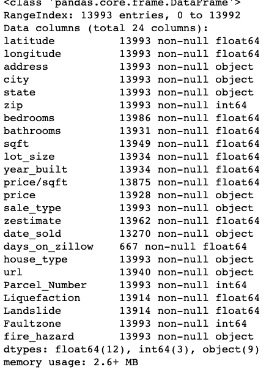
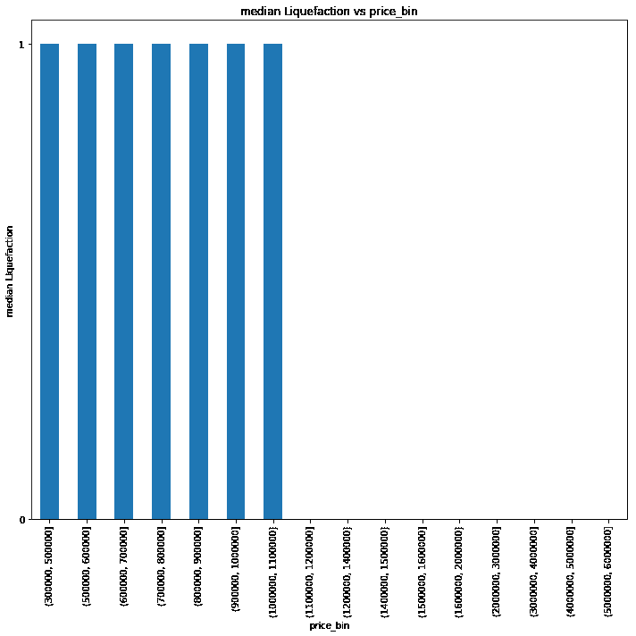

# 自然灾害多发地区的房价预测(一)

> 原文：<https://towardsdatascience.com/house-price-prediction-in-natural-hazard-prone-areas-part-1-ddd2cdef386?source=collection_archive---------50----------------------->

## 第 1 部分:探索性数据分析(EDA)

# 介绍

加州以地震闻名，大地震早就该来了。在 1989 年的洛马普列塔地震中，世界见证了液化能做什么，因为码头区的街区变成了瓦砾。一些房产位于断层线上，比如在南纳帕被破坏的房产，断层线穿过这些房产。当地面在地震中裂开时，它对建筑物和公用事业线路的破坏远远超过了震动所能造成的。

除了地震灾害，2018 年的野火肆虐了超过 120 万英亩的土地，摧毁了加州 1200 多所房屋。在北加州遭受破坏后，房地产市场发生了变化。

> *法律要求容易“搁浅”的房产向潜在买家披露可能改变买家决策的信息。此外，在交易开始之前，信息并不总是容易找到的。*

# 问题陈述

给定一组房产详情和自然灾害属性，**使用 Zillow 房产数据**结合**地震、滑坡和火灾等自然灾害数据，预测**圣何塞市的中值房价。主要目标是找到圣何塞市房价贡献的主要属性。

# 数据收集和数据争论

最初的挑战是获取不容易获得的数据，如 Kaggle 网站或其他一些网站的数据提取。在使用不同的数据争论技术从各种来源提取数据后，下一个挑战是使用 python merge & append 方法合并不同的数据框，并形成单个可分析的数据框。在下一节中，将详细讨论数据收集和数据争论方法。

# 数据源

## 住房数据

收集了圣何塞市的 Zillow 财产数据。使用 python 和 Web 抓取包(如 selenium 和 BeautifulSoup)来访问 [Zillow 属性数据](https://www.zillow.com/homes/san-jose_rb/)。

## 自然灾害数据

断层带、滑坡、液化和火灾等自然灾害数据从以下来源收集:

*   [*地震(断层、液化和滑坡带)危害数据*](https://gis.conservation.ca.gov/server/rest/services/CGS_Earthquake_Hazard_Zones)
*   [*野火潜在危害数据*](https://osfm.fire.ca.gov/divisions/wildfire-planning-engineering/wildland-hazards-building-codes/fire-hazard-severity-zones-maps/)

# 数据收集

## 来自 Zillow 的住房数据

Zillow 网站 API 在从 Zillow 提取数据方面存在固有的限制。另外， [Zillow API](https://www.zillow.com/howto/api/APIOverview.htm) 没有下载邮政编码/城市数据的规定。因此，我们决定对圣何塞不同邮政编码的待售和待售(按代理、按业主、新建、止赎、即将推出)的单户房产和联排别墅的以下字段进行网络搜集。提取纬度、经度、地址、邮政编码、卧室、浴室、平方英尺、地段大小、建造年份、价格、销售类型、zestimate、销售日期、销售天数、房屋类型、url。

[编写了 Python 代码](https://github.com/ChrisMuir/Zillow)，它导入 Selenium 和 BeautifulSoup 包来抓取我在圣何塞所有邮政编码的 Zillow 特性。下面是从 Zillow 收集的样本数据。

来自 Zillow 的样本抓取数据

## 地震危险区数据

编写 Sql 代码以从加州地质调查局(CGS)的地震风险数据 web 应用程序中提取数据。但问题是，CGS 使用 sql 查询一次只能检索 1000 行的所有属性。决定只使用 python 程序获取对象 id，然后使用这些对象 id 获取实际的行。使用 python 请求和 json 包，所有提取的数据都存储在 csv 文件中。数据帧中的全部特征和属性:261195 & 7。

地震危险区域图

来自 CGS web 应用程序的地震风险数据示例

断层带、液化带和滑坡带柱值根据以下条件转换为 0，1，NA:

***若液化区:***

位于液化区内= 1

CGS 未对液化危险进行评估= NA

不在液化区= 0

***如果滑坡带:***

位于滑坡区= 1

CGS 未对地震滑坡危险进行评估= NA

不在滑坡区= 0

***如果断层带:***

位于地震断裂带内= 1

不在地震断裂带内= 0

未被 CGS 评估= NA

如上所述转换特征后，样本地震危险数据以 csv 格式存储，如下所示。

格式化地震危险数据示例

## 火灾危险严重区域数据

[火灾数据](https://osfm.fire.ca.gov/media/5935/san_jose.pdf)以 pdf 格式提供。圣何塞市属于火灾危险严重区的面积非常有限。仅在火灾危险严重区域手动提取地块编号和地址。总特性和属性:53 & 6。火灾危险严重区域图和样本输出数据如下所示。

非常高火灾危险严重区域

# 数据争论

## 合并数据帧

收集 Zillow 属性、地震风险和火灾风险数据后，下一个挑战是合并所有数据框。以下步骤用于合并:

*   基于“地址”列的 Zillow 属性和地震危险性数据被合并。然后在合并的数据框中添加了“火灾”列。
*   火灾和地震危险数据根据“地址”栏合并。
*   上述第一合并数据帧被附加到第二合并数据帧。

合并数据帧信息

## 处理重复

根据包裹编号和地址，重复的包裹被丢弃。在 13993 行中，删除重复项后获得了 13617 行。

## 更正格式

*   注意到价格列类型是 object 而不是 integer。价格列被报告为售出:$ — M。使用剥离法去除文本并将单位 M 转换为美元。
*   人们还注意到，在地址一栏中，很少有房子的名称是 UNT 公寓号。但被列为单户住宅。对于地址栏中提到的 APT，UNT #的房屋类型已更改为联排别墅。
*   售出价格为 2016 年至 2019 年。为了使销售价格正常化，根据一段时间内 Redfin 销售价格中值的变化，将销售价格调整为当前价格。

一段时间内的中等销售价格变化(圣何塞)

## 纠正数据中的错误

*   很少有房产的售价很低或很高。它还与 Redfin 和 Trulia 等其他网站进行了交叉检查，并替换了这些值。36 处房产被替换为正确的售价和出售日期。
*   很少有房产低于 100，000 英镑，这些房产是在非 arm 交易类型下出售的。这些都不是房地产价格。因此，我们决定通过找出 Zestimate 和调整后销售价格之间的百分比差异来删除这些数据。根据频率分布图，决定删除价格差异百分比超过 38%的物业。

## 更正数据类型

售出日期格式已从对象类型转换为日期时间。

## 处理缺失数据

*   Year _ built 列被替换为 median。
*   零数的卧室被移除。考虑大于或等于 1 的卧室。工作室没有被考虑。
*   没有卧室，浴室和平方英尺细节的财产被删除。
*   丢失的 sqft 属性已被删除。
*   对于缺失的卧室和浴室，基于排序的 sqft 值使用了 *ffill* 方法。
*   缺失的批量用中间值填充。
*   销售日期分为月份和年份，以便进一步探索性分析。
*   除了 Zestimate 和 Zillow 上的 days 之外，所有缺少的值都被处理。

## 处理异常值

*   绘制标准化价格箱图是为了查看数据中的异常值。在 Zillow 发现了一个超过 30 米的房子，并进行了检查。这是错误的数据。它已从数据中删除。
*   同样，很少有房子超过 4 米，如下图所示。它还与 Zillow 进行了交叉检查，发现其中一所房子不是独栋住宅。它已从数据中删除。
*   遵循以下程序移除异常值:
*   计算数据的四分位数范围。
*   四分位距(IQR)乘以数字 1.5。
*   第三个四分位数增加了 1.5 倍(IQR)。任何大于这个值的数字都被怀疑为异常值并被删除。
*   从第一个四分位数减去 1.5 x (IQR)。任何大于这个值的数字都被怀疑为异常值并被删除。

箱线图(调整后的价格)

# 探索性数据分析

收集数据后，对数据进行辩论，然后进行探索性分析。我想到了以下问题，并对这些问题进行了探索性分析。

*   单一家庭和联排别墅中自然灾害房屋的地理空间可视化
*   独户和联排别墅最常见的特征(卧室、浴室、年份、液化、断层带、滑坡、火灾)
*   单户家庭和联排别墅价格区间的住房数量分布
*   单户家庭和联排别墅的卧室、浴室和带价格箱的平方英尺的中位数
*   液化，断层带，滑坡，火灾危险与价格箱在单个家庭和联排别墅
*   各种邮编、单户住宅和联排别墅危险和非危险的销售价格分布
*   出售独栋和联排别墅的最佳月份
*   最受欢迎的邮政编码销售单家庭和联排别墅
*   2016 年至 2019 年出售的独栋和联排别墅的数量
*   自然灾害对销售价格的影响
*   危险和非危险房屋的中值价格/平方英尺
*   施工年度的价格趋势中值
*   液化、滑坡、断层带、火灾对单户住宅和联排别墅价格的影响
*   人们对危险地区房屋的评论
*   功能和价格之间的关联图
*   影响房价预测的特征

## 哪里是危险易发区？城市中最常见和最不常见的危险是什么？它们在城市中是如何分布的？

在深入数据分析的数字部分之前，我们进行了地理空间分析，以观察城市中最常见和最不常见的危险是如何分布的。树叶和底图包用于绘制这些地图。以下是单户家庭和联排别墅的地理空间分析结果。

断层带分布点聚集在东圣何塞陆地和山脉之间。

断层带分布图(单户住宅)

断层带分布图(城镇住宅)

滑坡带分布点沿山脉东侧堆积。

滑坡分布图(单户住宅)

滑坡分布图(城镇住宅)

液化是最常见的灾害，在城市中广泛分布。

液化分布图(单户住宅)

液化分布图(城镇住宅)

液化区是圣何塞最常见的灾害，当它与滑坡结合在一起时，甚至更糟。

液化和滑坡分布图(单户住宅)

在收集的数据点中，没有滑坡、液化和滑坡的复合危险。这些是收集的点，而不是圣何塞的全部分布。经过地理空间分析后，我们决定在每个要素类别中调查房屋数量。用分组数据绘制条形图，以查看数据的分布。

## 有多少间卧室最受欢迎？

“带房屋数量的卧室数量”柱状图的分布显示，对于独栋和联排别墅，最受欢迎的卧室数量为 3。

卧室 vs 计数(单户住宅)；卧室与数量(联排别墅)

## 有多少间浴室最受欢迎？

“带房屋计数的浴室数量”柱状图的分布显示，最受欢迎的浴室数量是独栋住宅 2 个，联排住宅 3 个。

浴室 vs .计数(单户住宅)；浴室与柜台(联排别墅)

## 哪个邮政编码受买家欢迎？

在 30 个邮政编码中，有十几个邮政编码同样适用于单户住宅。对于联排别墅，8 个邮政编码更受欢迎。

邮政编码与房屋数量(单户住宅)；邮政编码与房屋数量(联排别墅)

## 哪一年建造的最常见？

“房屋建造年份”柱状图的分布显示，对于单个家庭来说，最常见的建造年份是 1959 年。对于联排别墅，大多数建于 1988-1973 年和 2005-2008 年。

建造年份与房屋数量(独栋和联排别墅)

## 哪个月卖房比较热门？

“出售房屋数量的月份”柱状图的分布显示，对于独栋和联排别墅来说，出售房屋的最佳月份是 5 月至 8 月。这是因为，在暑假期间，大多数人计划搬迁。

月 _ 销售与房屋数量(独栋和联排别墅)

## 哪一年房子卖得最多？

“year _ sold with house count”条形图的分布显示，大多数房屋是在 2018 年(独栋)和 2016–2018 年(联排别墅)售出的。

年 _ 销售与房屋数量(独栋和联排别墅)

**哪种危险最常见？**

“危险与房屋数量”柱状图的分布表明，在独栋和联排住宅中，许多房屋都容易发生液化。

危险与房屋数量(独栋和联排住宅)

## 有多少不同价位的房子？

Price_bin vs count(独栋和联排别墅)

## 不同价位的房间有多少间？

Price_bin vs 中值卧室(独栋和联排别墅)

## 各种价位的卫生间有多少个？

Price_bin vs 中值浴室(独栋和联排别墅)

## 在各种价格箱中，哪种平方英尺中位数是常见的？

Price_bin 与中位数平方英尺(独栋和联排别墅)

## 哪些价格范围的房屋处于液化区？

Price_bin vs 液化(独栋和联排住宅)

## 哪些价格范围的房屋处于滑坡地带？

Price_bin vs 滑坡(单家)

## 不同邮政编码、危险区和非危险区的价格分布

价格分配盒图(单户住宅)

价格分配盒图(联排别墅)

上图清楚地显示了自然灾害对房价的影响。例如，与非液化区相比，易液化区的价格较低(在第四个地块中)。同样，断层带区域的价格低于无断层带区域(在 6 号地块)。但是对于滑坡区域(在第 5 个地块)这是矛盾的。滑坡地区主要在山区。这表明人们在买房时更喜欢壮观的景色，而不是滑坡的危险。更多细节将在后续章节中介绍。

## 自然灾害(液化)对价格有什么影响？

价格分配盒图(单户住宅)

价格分配盒图(联排别墅)

上图显示了价格分布，价格/平方英尺，危险和非危险单户住宅的各种邮政编码。为了研究液化对价格的影响，在价格/平方英尺相同的附近邮政编码中分析了相同数量的危险和非危险房屋。为此，考虑了有液化危险的邮政编码 95116 和无液化危险的邮政编码 95127。低于中间值的表格表明易液化房屋的销售量低于非液化地区。下表列出了每个邮政编码的街区名称。

## 自然灾害(滑坡)对价格有什么影响？

价格分配盒图(单户住宅)

价格分配盒图(联排别墅)

上图显示了价格分布，价格/平方英尺，危险和非危险单户住宅的各种邮政编码。为了研究滑坡对价格的影响，在附近具有相同价格/平方英尺的邮政编码中，分析了相同数量的危险和非危险房屋。为此，考虑了有滑坡危险的邮政编码 95138 和没有液化危险的邮政编码 95135。低于中间价格值的表格表明易滑坡房屋的售价高于非滑坡地区。这表明人们在买房时更喜欢壮观的景色，而不是滑坡的危险。这里包含了来自 95138 社区的评论样本，显示了人们对这个社区的看法。

> ***“安全友好。开放空间附近，包括公园、山麓和小路。好的小学，初中&高中。非常靠近常青谷学院。合理的杂货店购物。好餐馆刚刚开始出现。”***
> 
> ***“很棒的小区，很好的学校，很安全的高档小区。步行即可到达杂货店、牧场高尔夫俱乐部。***

## 自然灾害(断裂带)对价格的影响是什么？

价格分配盒图(单户住宅)

价格分配盒图(联排别墅)

上图显示了价格分布，价格/平方英尺，危险和非危险单户住宅的各种邮政编码。为了研究断层带对价格的影响，在价格/平方英尺相同的附近邮政编码中分析了相同数量的危险和非危险房屋。为此，考虑了有故障风险的邮政编码 95127 和无故障风险的邮政编码 95140。低于中间值的表格表明易受故障危害房屋的销售量低于非故障危害地区。

## 自然灾害(火灾危险区)对价格有什么影响？

价格分配盒图(单户住宅)

价格分配盒图(联排别墅)

在所有邮政编码区出售的房产都没有火灾隐患。绘制散点图，以查看单户家庭和联排别墅的平方英尺与价格的分布。

## 每个邮政编码的价格分布是怎样的？

价格分布条形图(单一系列)

价格分布条形图(联排别墅)

## 每年建造的价格分布是怎样的？

价格分布条形图(单户住宅)

价格分布条形图(联排别墅)

## 所有特征的条形图分布

条形图分布

## 地理空间框架中的价格分布

地理空间框架中的价格分布

上图显示了圣何塞西部和南部的高价格。最南端的价格最高，因为它靠近桑尼维尔和圣克拉拉的科技公司。上面生成的图与 [Trulia](https://www.trulia.com/real_estate/San_Jose-California/market-trends/) 观察到的价格市场趋势图一致。

## 散点图分布

卧室数量与价格呈正相关

浴室数量与价格呈正相关

sqft 显示与价格正相关。

批量与价格呈正相关

建造年份与价格呈弱负相关

液化与价格呈正相关

滑坡与价格呈弱负相关

断层带与价格呈正相关

火灾风险和价格之间没有关联

售出月份与价格呈负相关

房型与价格呈正相关

邮政编码与价格呈正相关

## 平均价格条形图分布

平均价格分布

## 推断统计学

进行了假设检验，以检查建造年份、液化危险、滑坡危险、平方英尺、断层带危险、邮政编码、卧室、浴室、房屋类型、地块大小和价格之间是否存在显著相关性。对于这些测试，零假设被指定为没有显著相关性，而替代假设在特征之间具有显著相关性。如果假设检验的 p 值小于显著性水平 0.05，则无效假设将被拒绝，这表明存在相关性。卧室、浴室、平方英尺、地段大小、液化、断层带、房屋类型和邮政编码的 p 值小于 0.05，表明这些特征和价格之间存在相关性。其他特征如建造年份、出售月份、滑坡、p 值都大于 0.05，这表明这些特征与价格之间没有显著的相关性。

## 编码

[Jupyter 笔记本资料收集笔记本](https://nbviewer.jupyter.org/github/umaraju18/CapStone-Project/blob/master/sanjose_data_collection.ipynb):

[单科 EDA 笔记本](https://nbviewer.jupyter.org/github/umaraju18/CapStone-Project/blob/master/sanjose_eda_single_family.ipynb):

[联排别墅 EDA 笔记本:](https://nbviewer.jupyter.org/github/umaraju18/CapStone-Project/blob/master/sanjose_eda_townhouse.ipynb)

## [第二部分:机器学习模型](https://medium.com/@umacivil2003/house-price-prediction-in-natural-hazard-prone-areas-part-2-b73ef366a229)