# 自然灾害多发地区的房价预测(二)

> 原文：<https://towardsdatascience.com/house-price-prediction-in-natural-hazard-prone-areas-part-2-b73ef366a229?source=collection_archive---------53----------------------->

## 第 2 部分:机器学习模型

# 介绍

使用了不同的回归模型，即线性回归、决策树回归、梯度推进回归和随机森林回归。使用 R 对这些模型的性能进行了比较。基于这些性能得分，提出了性能更好的模型来预测房价。

首先，数据分为自变量 X 和因变量 y。自变量 X 用于预测目标变量 y。价格、id 和日期列从 new_df 数据帧中删除以创建变量 X。new _ df 数据帧中的价格列用于创建变量 y。不同的指标用于回归模型的性能，如均方误差、均方根误差、R 平方得分、平均绝对偏差、平均绝对百分比误差等。均方根误差和 R 平方分数用于评估回归模型的性能。为了保存模型的度量，创建了一个数据框，并将其命名为 metrics。接下来，数据被分成训练集和测试集。80%的随机选择数据作为训练集，20%的随机选择数据作为测试集。该模型使用 80%的数据进行学习，其余 20%的测试数据用作未知的未来数据集来预测房价。

使用默认参数构建线性回归模型，并使用训练数据集拟合该模型。X_test 数据用于使用模型进行预测。然后，计算均方误差(MSE)、均方根误差(RMSE)、R 平方得分(r2_score)、平均绝对偏差(MAD)和平均绝对百分比误差(MAPE)。

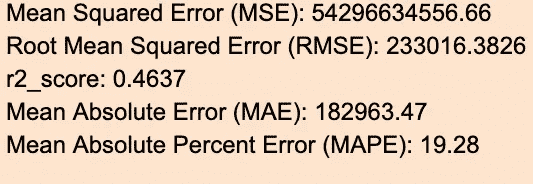

# 特征选择

采用特征选择的向后淘汰法。特征选择是选择可以提高模型性能的相关特征子集的过程。首先，要素中最差的属性被移除。date_sold_month 被删除，因为它与房价的相关性非常弱。然后，year _ built _ decade _ mapped 从功能集中删除。然后，尝试了来自 sklearn 库的名为*选择测试*的单变量特征选择包。以下是不同特征的相关系数。

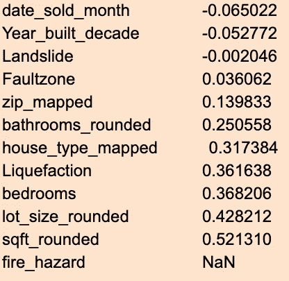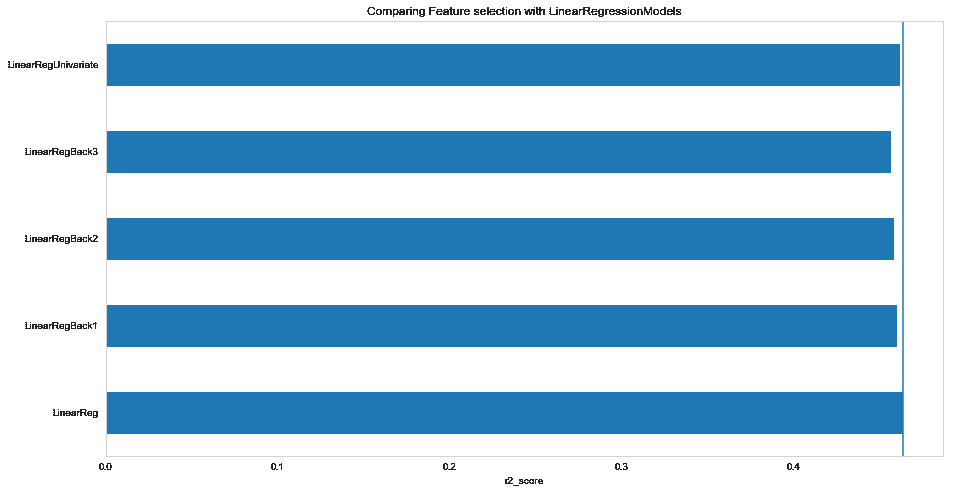

使用 R2 评分比较特征选择与线性回归模型

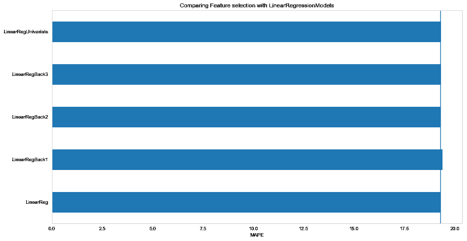

使用 MAPE 评分比较特征选择与线性回归模型

比较所有不同的线性回归模型与特征选择，两个条形图表明，我们应该保留所有的特征，以更好地预测房价。

## 决策树回归

使用默认参数构建决策树回归模型，并在下面列出性能得分。示例决策树回归流程图如下所示:

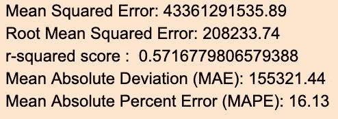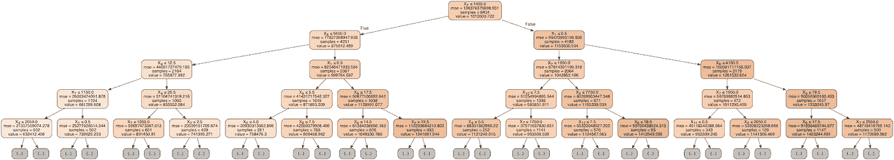

决策树图表示例

## 梯度推进回归

使用默认参数建立梯度回归模型，并在下面列出性能得分:

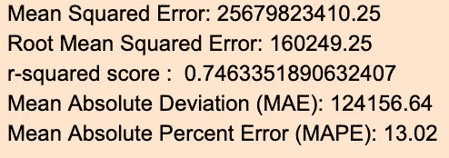

## 随机森林回归

使用默认参数构建随机森林回归模型，并在下面列出性能得分:

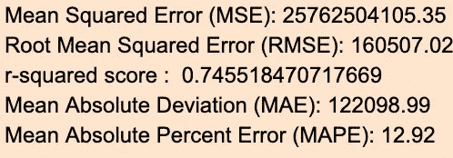

如下所示的水平条形图比较不同回归量的 r2_score 和 MAPE。

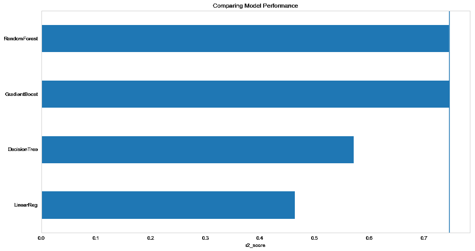

使用 r2 得分比较不同回归模型的模型性能

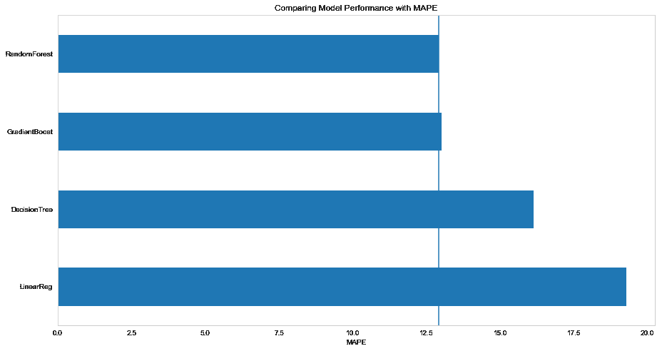

使用 MAPE 评分比较不同回归模型的模型性能

根据 r2_score，梯度推进回归模型是表现最好的模型。对于该数据集，随机森林回归模型是性能第二好的模型。

根据平均绝对百分误差(MAPE)，随机森林回归模型是表现较好的模型。梯度推进回归模型是表现第二好的模型。

## 超参数调谐

接下来，使用 GridSearchCV 调整模型的超参数，以提高模型的性能。GridSearchCV 是一种交叉验证方法，它允许我们使用一组我们想要在给定模型中尝试的参数。这些参数中的每一个都被用于执行交叉验证，并且最终保存模型的最佳参数。创建了一个新的 dataframe，并将其命名为 tuned_metrics，以保存优化模型的指标。的方法。get_params()用于查找模型的所有参数。对于线性回归模型，在 param_grid 中使用了“copy_X”、“fit_intercept”和“normalize”参数。param_grid 是一个字典，参数名作为键，参数设置列表作为值。使用 cv = 5，这是使用的折叠次数。我们可以使用 GridSearchCV 的 best_params_ attribute 来获得这个数据集的任何回归模型的最佳参数。使用 GridSearchCV 调整线性回归模型和决策树回归器模型。然后，使用 RandomizedSearchCV 调整梯度推进回归模型和随机森林回归模型。RandomizedSearchCV 有助于最大限度地减少计算时间，因为 GridSearchCV 对于梯度推进回归器和随机森林回归器都需要很长的计算时间。使用 RMSE 评分的不同回归模型的优化模型性能比较如下所示:

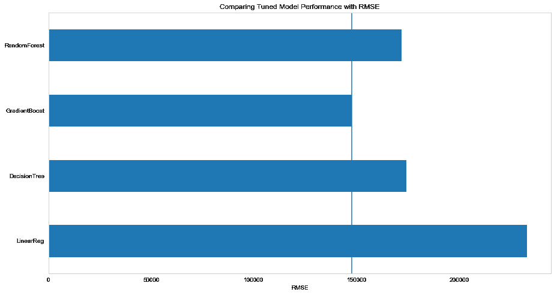

使用 RMSE 评分比较不同回归模型的优化模型性能

根据均方根误差，梯度推进回归模型是表现最好的模型，误差最小，为 147773。

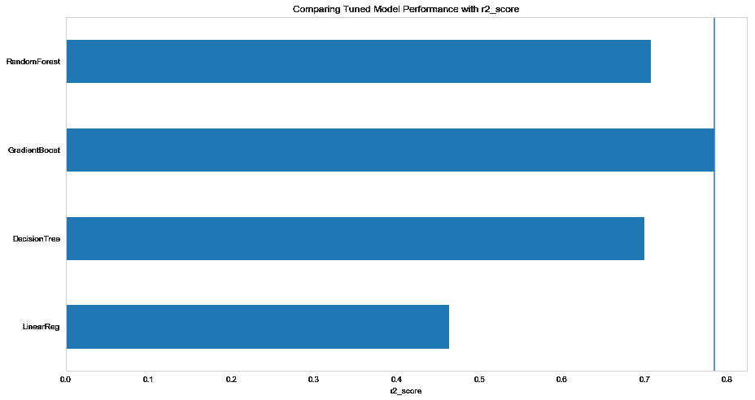

使用 R2 评分比较不同回归模型的优化模型性能

根据 r2_score，梯度推进回归模型是表现最好的模型，得分最高，为 0.78。

使用 MAE 评分比较不同回归模型的调优模型性能

根据平均绝对误差(MAE ),梯度推进回归模型是表现最好的模型，误差最低为 113737。

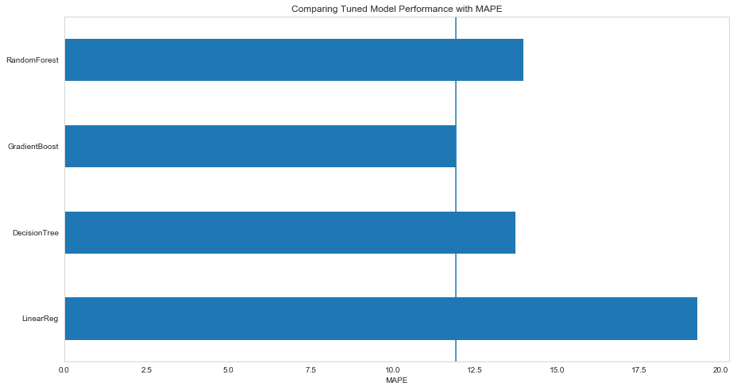

使用 MAPE 评分比较不同回归模型的优化模型性能

根据平均绝对百分误差(MAPE)，梯度推进回归模型是表现最好的模型，最低百分误差为 12%。所有指标都表明，梯度推进回归模型是该数据集的性能更好的模型。

# 摘要

梯度推进回归模型是一个很好的房价预测模型，因为它优于随机猜测，并且优于其他三个回归模型。随着更多数据的收集，该模型将来可能会得到改进。这里没有包括的许多其他回归模型也可以建立和尝试。对于未来的工作，我会推荐这个梯度推进回归模型来预测房价。

## 代码:

[用于机器学习的 Ipython 笔记本](https://nbviewer.jupyter.org/github/umaraju18/CapStone-Project/blob/master/sanjose_machine_learning_model.ipynb)

## [第 1 部分:探索性数据分析(EDA)](https://medium.com/@umacivil2003/house-price-prediction-in-natural-hazard-prone-areas-part-1-ddd2cdef386)