# 基于 Zillow 经济学数据集的房价预测

> 原文：<https://towardsdatascience.com/house-price-prediction-with-zillow-economics-dataset-18709abff896?source=collection_archive---------9----------------------->

## [现实世界中的 DS](https://towardsdatascience.com/data-science-in-the-real-world/home)

## 基于中等收入、学校数量、犯罪率、失业率、医院数量及其评级等因素的 XGBoost 和线性回归预测模型

我点击的照片—西雅图天际线

买房是人一生中的一个重大决定，需要相当多的思考和研究。人们希望以最好的利率和最小的风险购买一所房子，并希望这是对未来的最佳投资。各种在线网站、房地产经纪人和房地产经纪人试图通过让购房者比较可供购买的不同房屋来引导他们。

在本文中，我们将讨论一个用于房价预测的数据科学项目的结果。我们正在尝试使用机器学习算法 XGBoost 和线性回归来预测房价，考虑的因素包括一个县的中值收入、该县的犯罪率、公立学校、医院、医院评级和该县的失业率等。

该项目的目的是为寻找开发新公寓楼或购买新公寓的地方的国家房地产开发商、个人买家和银行提供美国最佳的投资县/区。另一个目标是预测某县未来几个月的房价。

未来几个月，给定邮政编码/县的房屋每平方英尺的预计价格是多少？我们能否根据 Zillow 提供的某个邮政编码/街区/县的犯罪率、学校和其他信息/指标来预测价格？

“2020 年是买房的好年吗？”以及“应该在哪里买房？”都是重要的问题。这个房屋预测项目试图借助各种来源的数据并考虑影响房价的因素来回答这些问题。

我点击的照片

此类项目的利益相关方包括:

a)客户和房地产经纪人-房地产行业长期以来一直按照自己的传统运营，但海量数据的可用性正在彻底改变该行业的工作方式。大数据分析技术正在创造一个新的房地产市场，在这个市场中，客户和代理商都比以往任何时候都更加知情。

Zillow 和 Trulia 等公司可以利用这种分析，根据当地学校、犯罪率、收入水平、医院等因素，计算房屋可能吸引的估计价格。并决定营销策略。

c)银行——不仅仅是消费者在使用大数据为他们的房屋买卖决策提供信息。银行还利用大量数据来预测特定抵押贷款申请可能带来的风险，使用的信息包括房屋价值以及申请人的财务状况和历史。此外，银行也在避免丧失抵押品赎回权和卖空的损失，因为大数据正在帮助他们预测市场可以承受的最大出售价值。

根据预测的房价，人们可以投资房地产，找到一个更适合他们需要的郡房子，在那里他们可以买房子。通过这个数据科学项目所做的预测，房屋买卖决策将变得更加容易。

## **用于本项目的数据**

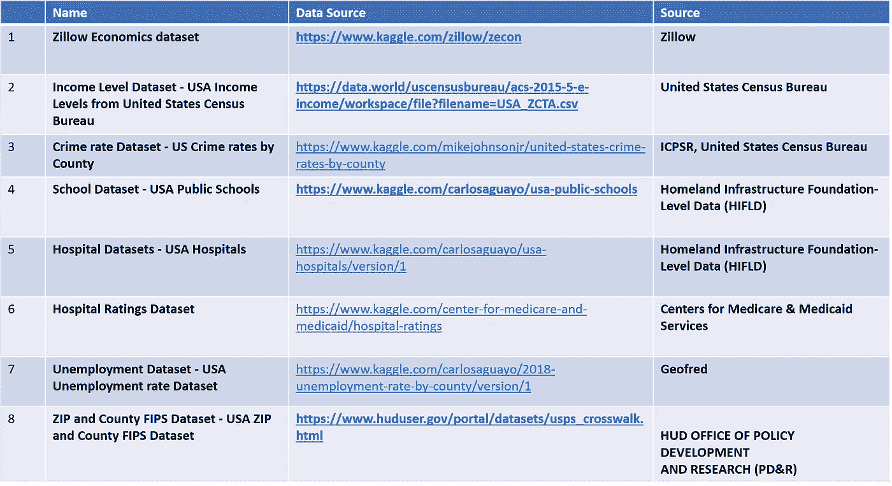

# 挑战

1) Zillow 经济学数据集—很难从 Zillow 中找到合适的数据集进行处理，因为没有现成的描述。虽然数据字典是可用的，但它并没有指定 Zillow 经济学数据集中包含的每个数据集。没有关于各种 csv 文件及其相互关系的详细信息，也没有关于不同属性的详细信息。

2)不知道 FIPS、FIPS、FIPS 是什么，以及如何将其与县或邮政编码联系起来

3)为各种因素找到合适的数据集，如学校、犯罪率、收入水平、医院评级、失业率等。经过大量的搜索找到了可以在这个项目中使用的数据集。

4)收入水平数据集有邮政编码，但没有 FIPS 代码，因此我必须找到一个将邮政编码转换为 FIP 代码的解决方案。为此，我不得不搜索一个 FIPS 数据集，并将其与收入水平数据集合并。

5)收入水平数据集——探索并选择中等收入水平的适当属性用于项目

6)如何合并所有这些数据集，使其成为基于收入水平、犯罪率、学校、医院、失业率等因素预测房价的有用数据集。

# **数据故事和探索性数据分析**

**1。你应该在哪个州买房或租房？**

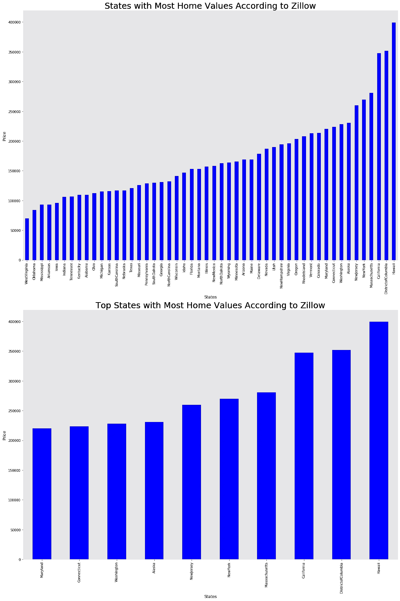

**根据 Zillow** 排名，房价最高的州

Zillow 房屋价值指数( **ZHVI** )是一种平滑的、季节性调整的衡量标准，用于衡量特定地区和房屋类型的典型房屋价值和市场变化。

根据 Zillow 的估计，夏威夷是平均房价接近 40 万美元的顶级州。第二个最重视住房的州是哥伦比亚特区，平均房价为 35 万英镑。一些其他上端 ZHVI 州是加利福尼亚州，马萨诸塞州，纽约州，阿拉斯加州，华盛顿州，康涅狄格州，马里兰州和科罗拉多州。然而，问题是这些州的价格是如何随时间变化的？因为如果我们想在这些州中的一个买房子，我们需要知道价格是如何随时间变化的。

**2。最贵州的房价变化**

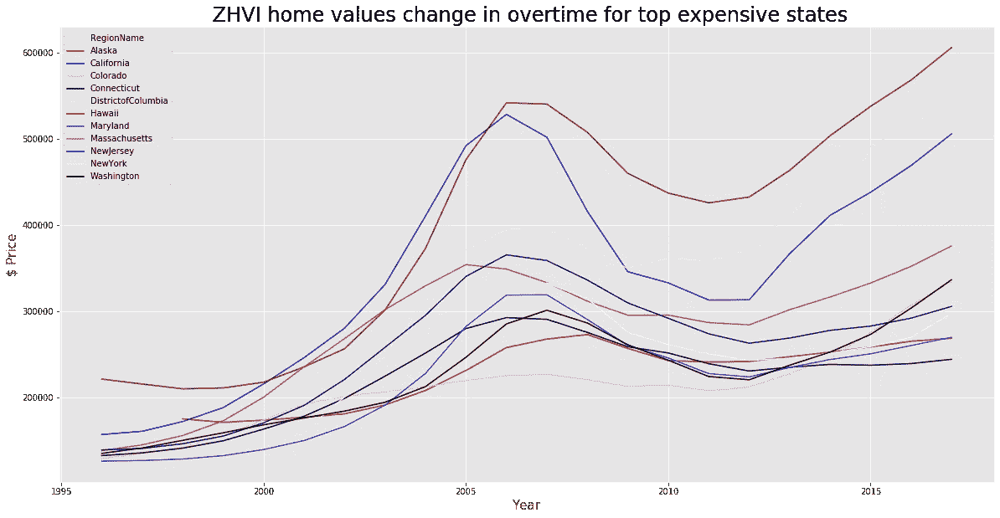

在物价最高的州，房价会随着时间的推移而上涨

根据该数据集，自 2010 年以来，夏威夷州、哥伦比亚特区和加利福尼亚州似乎都在竞相提高 ZHVI 的平均水平。与此同时，纽约和新泽西等其他高端州开始缓慢，并略有下降，直到 2012 年，价格似乎有所上升，纽约的加速略快于新泽西。另一方面，科罗拉多州在这张图表中持续上升，与康涅狄格州保持一致，在 2017 年约为 33 万。

**3。租金最高的州**

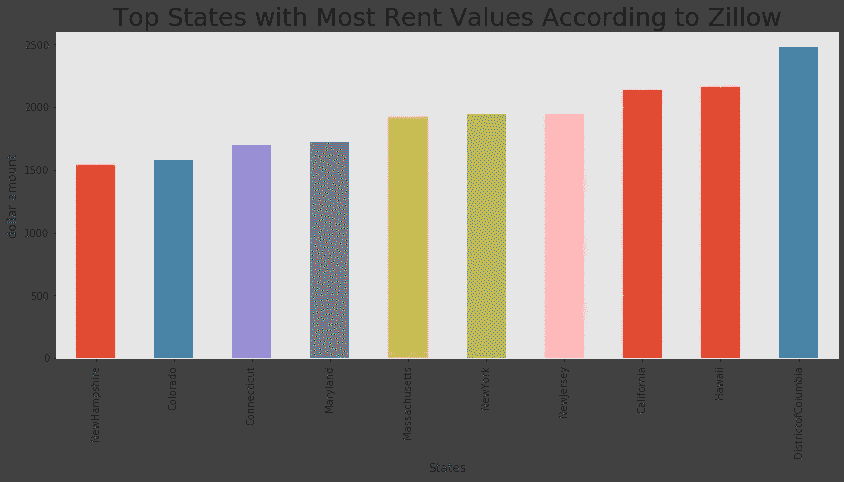

租金最高的州

**4。不同州每平方英尺房屋价值中位数**

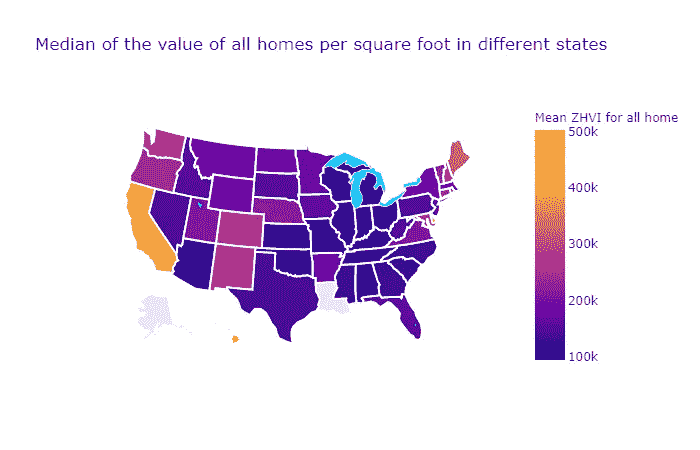

可以看出，加州每平方英尺的房屋价值中值最高，威斯康星州最低。

**5。Zillow 的每平方英尺估计价格**

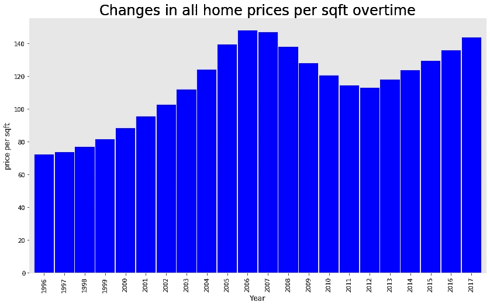

历年来每平方英尺的房价

我们来看看 Zillow 的每平方英尺预估价格。看起来房价在 2005-2008 年间上涨，在 2011-2012 年间下跌。

**6。每平方英尺价格中位数的前 7 个州**

这些是所有房屋每平方英尺挂牌价格中值最高的 7 个州

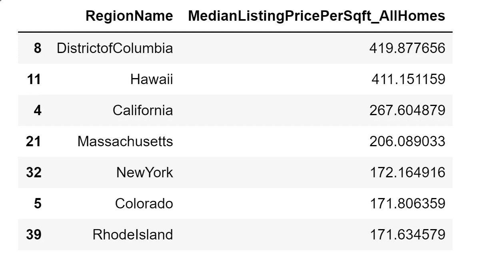

**7。所有房屋每平方英尺挂牌价格中位数的后 5 个州**

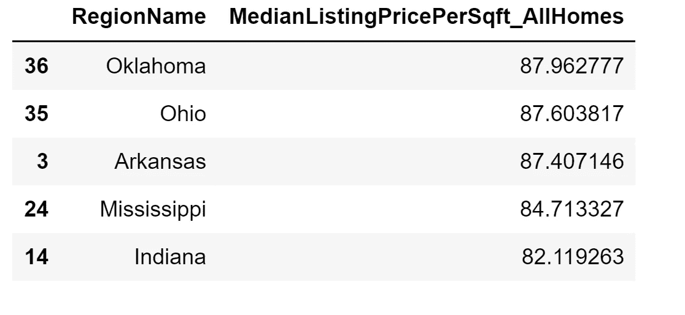

**8。所有房屋的租金中值**

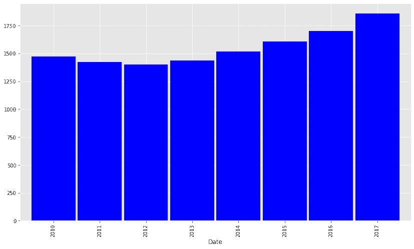

从 2012 年到 2017 年，所有房屋的租金中位数都有所上升，但从 2010 年到 2012 年略有下降。

**9。所有房屋的挂牌价格中位数**

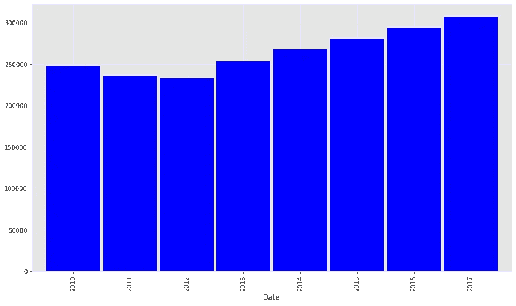

历年所有房屋的挂牌价格中值

从 2012 年到 2017 年，所有房屋的挂牌价格中值都有所上升，但从 2010 年到 2012 年有所下降。

## XGBoost 和线性回归预测模型

为了使用 Zillow Economics 数据集构建房价预测模型，我使用了 County_time_series 数据，因为它提供了一个县中所有房屋的房价。预测房价的不同因素包括该县的收入中位数、犯罪率、公立学校、医院和医院等级、失业率。

我用过 XGBoost XGRegressor 和线性回归算法。

## 线性回归

监督机器学习算法有两种类型——回归和分类。前者预测连续值输出，而后者预测离散输出。例如，预测房子的美元价格是一个回归问题，而预测一封电子邮件是否是垃圾邮件是一个分类问题。用于机器学习的 Python Scikit-Learn 库用于实现线性回归。

线性回归是一种基本且常用的预测分析类型。回归的总体思路是考察两件事:(1)一组预测变量在预测一个结果(因变量)时是否做得很好？(2)哪些变量是结果变量的重要预测因子，它们是如何影响结果变量的——由β估计值的大小和符号表示？这些回归估计用于解释一个因变量和一个或多个自变量之间的关系。具有一个因变量和一个自变量的回归方程的最简单形式由公式 y = c + b*x 定义，其中 y =估计的因变量得分，c =常数，b =回归系数，x =自变量得分。

## XGBoost

XGBoost 是免费的开源软件，可以在许可的 Apache-2 许可下使用。XGBoost 代表“极限梯度提升”，它是梯度提升机器的一种实现。XGBoost 是一种流行的有监督机器学习模型，具有计算速度快、并行化和性能更好的特点。

XGBoost 是一个优化的分布式梯度增强库，旨在高效、灵活和可移植。XGBoost 提供了一种并行的树提升(也称为 GBDT，GBM ),可以快速准确地解决许多数据科学问题。相同的代码运行在主要的分布式环境(Hadoop、SGE、MPI)上，可以解决超过数十亿个例子的问题[11]。

XGBoost 库实现了梯度推进决策树算法。这种算法有许多不同的名字，如梯度推进、多重加法回归树、随机梯度推进或梯度推进机器。

Boosting 是一种集成技术，其中添加新的模型来纠正现有模型产生的错误。模型按顺序添加，直到不能再进一步改进。一个流行的例子是 AdaBoost 算法，它对难以预测的数据点进行加权。

梯度推进是一种方法，在这种方法中，创建新的模型来预测先前模型的残差或误差，然后将它们加在一起以做出最终预测。它被称为梯度提升，因为它使用梯度下降算法来最小化添加新模型时的损失。

这种方法支持回归和分类预测建模问题。

**XGBoost 中的超参数**

这些参数解释如下:

1.  objective ='reg:linear '指定学习任务是线性的。
2.  colsample_bytree 是构造每个树时列的子样本比率。子采样将在每个提升迭代中发生一次。这个数字的范围是从 0 到 1。
3.  learning_rate 是步长收缩，用于防止过拟合。这个数字的范围是从 0 到 1。
4.  max_depth 指定树的最大深度。增加该数值会使模型变得复杂，并增加过度拟合的可能性。默认值为 6。
5.  α是权重的 L1 正则化。增加这个数字会使模型更加保守。
6.  n_estimators 是要拟合的提升树的数量

## 使用的指标

1.  R 表示项(数据点)与曲线或直线的拟合程度。
2.  **MSE -** 均方误差
3.  **RMSE-** 均方根误差。它是 MSE 的平方根。
4.  **均方根对数误差(RMSLE) -** 它只是一个以对数标度计算的 RMSE。实际上，为了计算它，我们取预测值和目标值的对数，并计算它们之间的 RMSE。

## **不同因素与房价的相关矩阵**

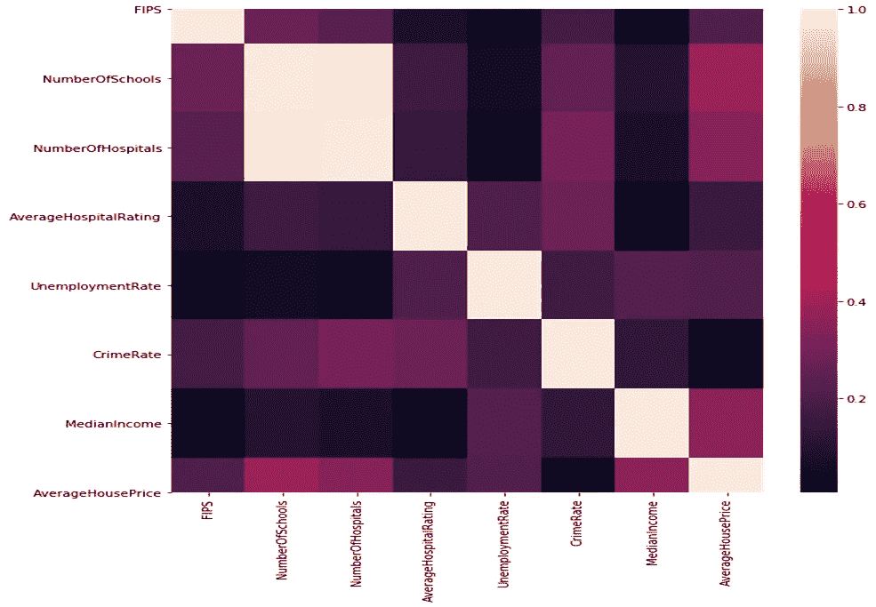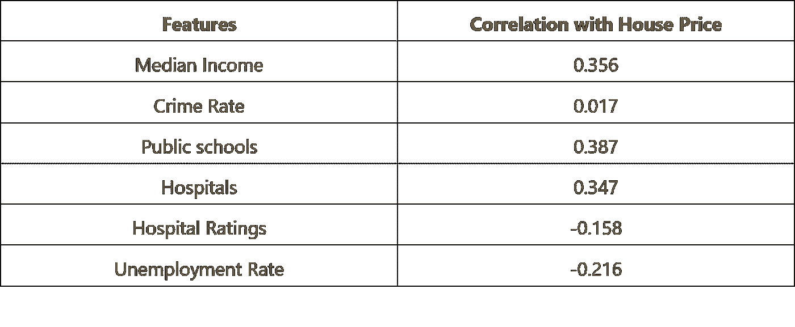

**矩阵中的相关值**

# 结果:预测建模— XGBOOST 和线性回归

我合并了 8 个不同的基于 FIPS 码的数据集，构建了一个新的数据集，用于预测房价。我使用 Zillow 的 county_time_series 数据集来预测美国每个县的房价。

预测模型使用 80:20 的训练测试分割。

**XGBoost**

XGBoost 预测用两组超参数进行了测试。这两个结果都在这里。

**XGBoost 超参数集 1 结果**

xgboost = XGBRegressor(objective = ' reg:linear '，colsample_bytree = 0.3，

learning_rate = 0.1，max_depth = 5，alpha = 10，random_state=777，

n _ 估计值= 100)

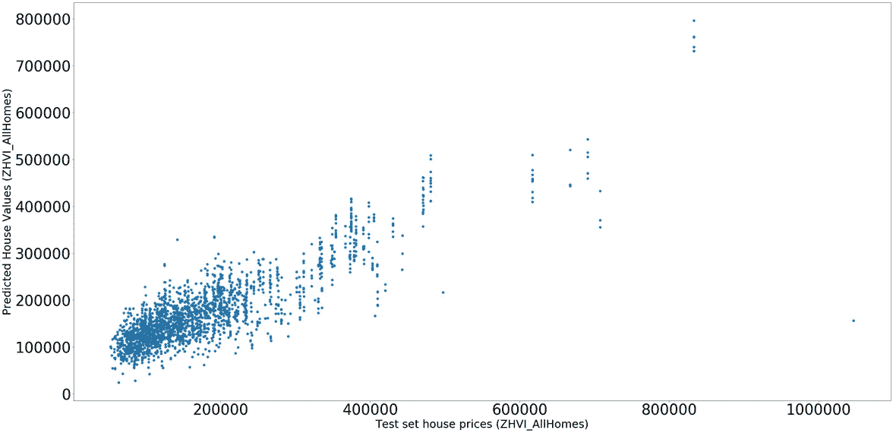

**使用 XGBoost 超参数集- 1 进行预测**

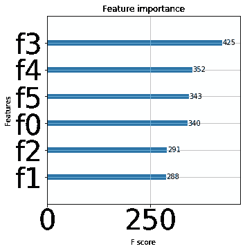

**XGBoost 超参数集-1 的特征重要性**

这里，f0 是学校数量，f1 是医院数量，f2 是平均医院评级，f3 是失业率，f4 是犯罪率，f5 是收入中位数。

从上图可以看出，在预测房价时，失业率的重要性最高，其次是犯罪率、收入中位数、学校数量，然后是平均医院等级，最不重要的是医院数量。

**XGBoost 超参数集-2 结果**

xgboost = XGBRegressor(objective = ' reg:linear '，

n_estimators=100，learning_rate=0.08，gamma=0，子样本=0.75，

colsample_bytree=1，max_depth=7)

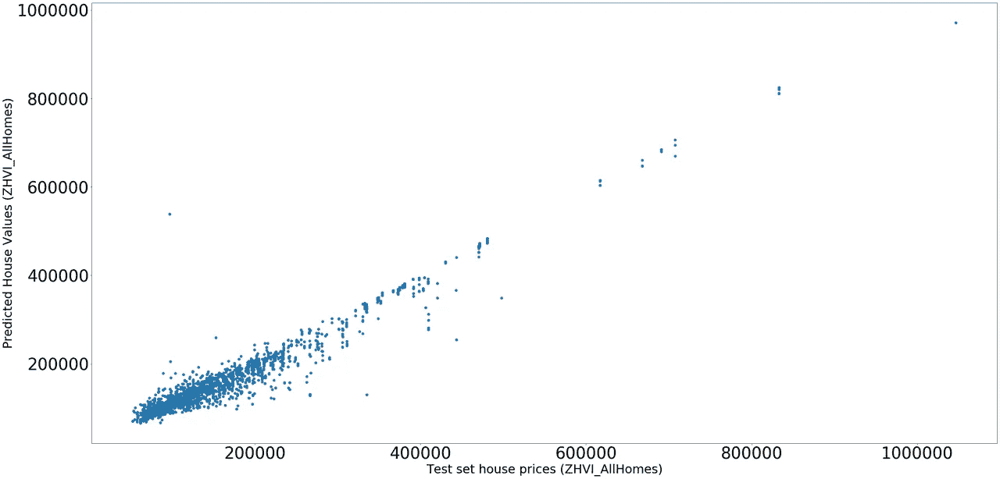

**XGBoost 超参数集-2 预测**

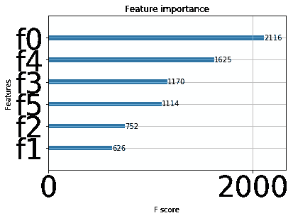

**XGBoost 超参数集-2 的特征重要性**

这里，f0 是学校数量，f1 是医院数量，f2 是平均医院评级，f3 是失业率，f4 是犯罪率，f5 是收入中位数。

从上图可以看出，在预测房价时，学校数量的重要性最高，其次是犯罪率、失业率、收入中位数，然后是平均医院评级，最不重要的是医院数量。

**线性回归结果**

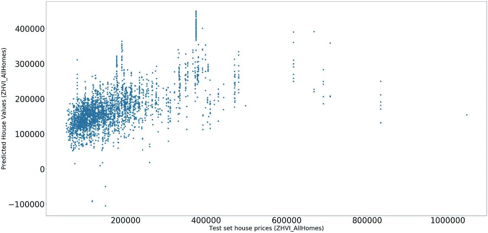

**线性回归预测**

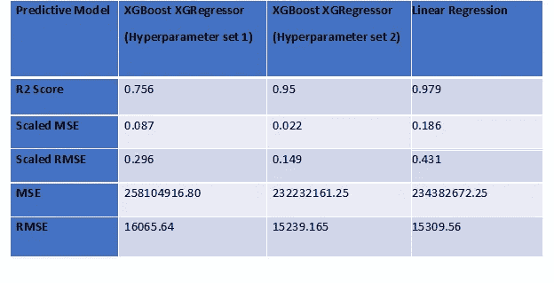

正如我们所看到的，与线性回归相比，XGBoost 的第二组超参数给出了更好的结果。

## **下一步**

下一步，对于预测，我想尝试其他回归算法，如 Light GBM。

## 确认

我真诚地感谢我的数据科学导师 Ramakrishna Soma 博士对我完成这个项目的指导和鼓励。

## 参考

1) Zillow 经济学数据集

【https://www.kaggle.com/zillow/zecon】T5[T6](https://www.kaggle.com/zillow/zecon)

2)犯罪率数据集-美国各县的犯罪率

[https://www . ka ggle . com/mikejohnsonjr/United States-crime-rates-by-county](https://www.kaggle.com/mikejohnsonjr/united-states-crime-rates-by-county)

3)学校数据集——美国公立学校

[https://www.kaggle.com/carlosaguayo/usa-public-schools](https://www.kaggle.com/carlosaguayo/usa-public-schools)

4)收入水平数据集—美国人口普查局美国收入水平[https://data . world/uscensusbureau/ACS-2015-5-e-Income/workspace/file？filename=USA_ZCTA.csv](https://data.world/uscensusbureau/acs-2015-5-e-income/workspace/file?filename=USA_ZCTA.csv)

5)美国人口普查局的收入数据集

[https://www.census.gov/programs-surveys/acs/](https://www.census.gov/programs-surveys/acs/)

6)医院数据集

[https://www.kaggle.com/carlosaguayo/usa-hospitals/version/1](https://www.kaggle.com/carlosaguayo/usa-hospitals/version/1)

7)医院评级数据集

[https://www . ka ggle . com/center-for-medicare-and-Medicaid/hospital-ratings](https://www.kaggle.com/center-for-medicare-and-medicaid/hospital-ratings)

8)失业数据集-美国失业率数据集

[https://www . ka ggle . com/carlosaguayo/2018-各县失业率/version/1](https://www.kaggle.com/carlosaguayo/2018-unemployment-rate-by-county/version/1)

9)FIPS 邮政编码和县数据集-美国邮政编码和县 FIPS 数据集

[**https://www.huduser.gov/portal/datasets/usps_crosswalk.html**](https://www.huduser.gov/portal/datasets/usps_crosswalk.html)

10)[https://www . ka ggle . com/carlosaguayo/correlation-between-house-prices-and-other-factors](https://www.kaggle.com/carlosaguayo/correlation-between-house-prices-and-other-factors)

11)XG boost[https://xgboost.readthedocs.io/en/latest/index.html](https://xgboost.readthedocs.io/en/latest/index.html)

12)【https://www.zillow.com/research/data/】T2

13)[https://whisper . real estate/blog/2019-2020 年住房市场预测/](https://whisper.realestate/blog/predictions-for-the-housing-market-in-2019-2020/)

14)[https://www . Washington post . com/business/2019/01/07/experts-weigh-what-housing-market-will-bring/](https://www.washingtonpost.com/business/2019/01/07/experts-weigh-what-housing-market-will-bring/)

15)[https://machine learning mastery . com/gentle-introduction-xgboost-applied-machine-learning/](https://machinelearningmastery.com/gentle-introduction-xgboost-applied-machine-learning/)