# 基于深度学习的房价预测

> 原文：<https://towardsdatascience.com/house-prices-prediction-using-deep-learning-dea265cc3154?source=collection_archive---------3----------------------->

## Keras 回归与多元线性回归


照片由佛罗里达州 KW insta gram 上的@ [Kusseyl](https://www.instagram.com/p/B-2gBVqhuME/?utm_source=ig_web_copy_link) 拍摄

在本教程中，我们将创建一个模型来预测房价🏡基于不同市场的各种因素。

# 问题陈述

这一统计分析的目的是帮助我们理解房屋特征之间的关系，以及如何使用这些变量来预测房价。

# 目标

*   预测房价
*   在最小化预测和实际评级之间的差异方面使用两种不同的模型

**所用数据:**[ka ggle-KC _ house Dataset](https://www.kaggle.com/harlfoxem/housesalesprediction)
**GitHub:**你可以在这里找到我的源代码

# 步骤 1:探索性数据分析(EDA)

首先，让我们导入数据，看看我们正在处理哪种数据:

```
**#import required libraries** import pandas as pd
import numpy as np
import seaborn as sns
import matplotlib.pyplot as plt**#import Data** Data = pd.read_csv('kc_house_data.csv')
Data.head(5).T**#get some information about our Data-Set** Data.info()
Data.describe().transpose()
```

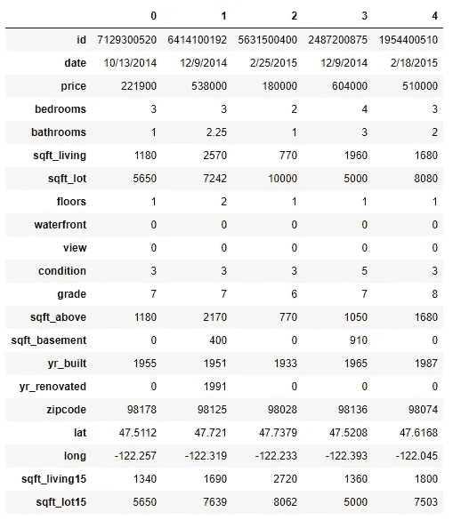

我们数据集的前 5 条记录

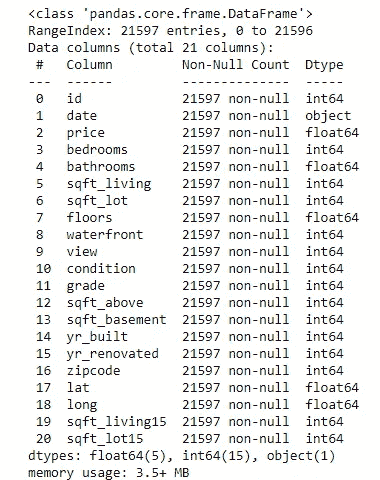

关于数据集的信息，你的变量是哪种数据类型

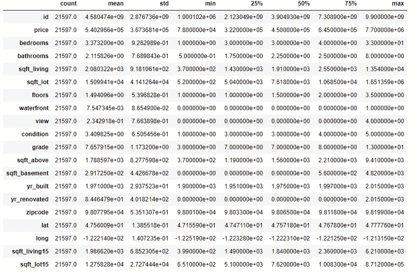

数据集的统计摘要

已提供以下功能:***日期:*** *房屋出售日期* ✔️ ***价格:*** *价格为预测目标* ✔️ ***卧室:*** *卧室/房屋数量* ✔️ ***卫生间:*** *卫生间数量 拍品镜头* ✔️ ***楼层:*** *房屋总层数* ✔️ ***滨水:*** *可以看到滨水景观的房屋* ***查看:*** *已查看* ✔️ ***根据景县分级系统* ✔️***sqft _ above:****房屋面积(不含地下室)* ✔️***sqft _ base:****地下室面积* ✔️***yr _ build:****建造年份
【T10 坐标* ✔️ ***长:*** *经度坐标* ✔️***sqft _ living 15:****客厅面积 2015 年(暗示—部分装修)* ✔️***sqft _ lot 15:*****

让我们绘制几个特征，以便更好地理解数据

```
**#visualizing house prices**
fig = plt.figure(figsize=(10,7))
fig.add_subplot(2,1,1)
sns.distplot(Data['price'])
fig.add_subplot(2,1,2)
sns.boxplot(Data['price'])
plt.tight_layout()**#visualizing square footage of (home,lot,above and basement)**fig = plt.figure(figsize=(16,5))
fig.add_subplot(2,2,1)
sns.scatterplot(Data['sqft_above'], Data['price'])
fig.add_subplot(2,2,2)
sns.scatterplot(Data['sqft_lot'],Data['price'])
fig.add_subplot(2,2,3)
sns.scatterplot(Data['sqft_living'],Data['price'])
fig.add_subplot(2,2,4)
sns.scatterplot(Data['sqft_basement'],Data['price'])**#visualizing bedrooms,bathrooms,floors,grade** fig = plt.figure(figsize=(15,7))
fig.add_subplot(2,2,1)
sns.countplot(Data['bedrooms'])
fig.add_subplot(2,2,2)
sns.countplot(Data['floors'])
fig.add_subplot(2,2,3)
sns.countplot(Data['bathrooms'])
fig.add_subplot(2,2,4)
sns.countplot(Data['grade'])
plt.tight_layout()
```

通过价格分布图，我们可以看到大多数价格在 0 到 100 万之间，只有少数异常值接近 800 万(豪宅😉).在我们的分析中去掉那些异常值是有意义的。

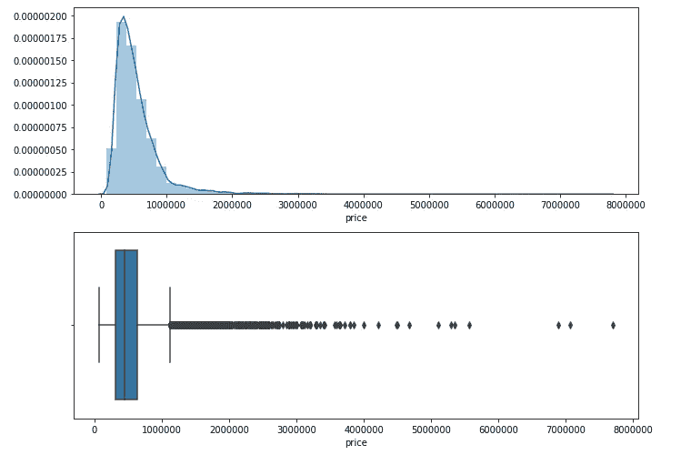

房价预测

快速浏览不同特征分布与房价的关系是非常有用的。

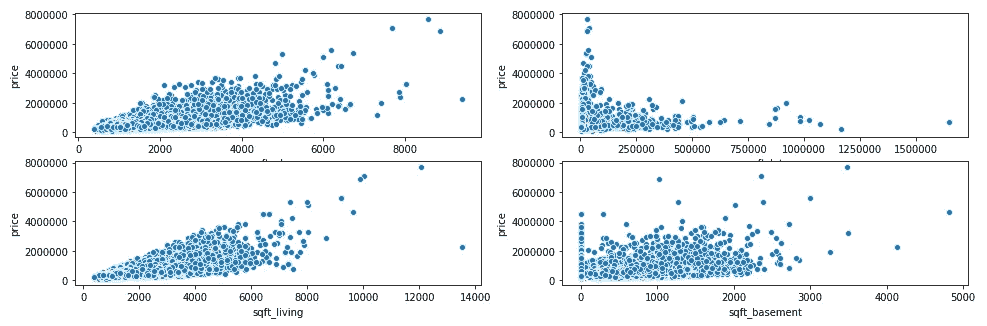

散点图——平方英尺(住宅、地段、楼上和地下室)

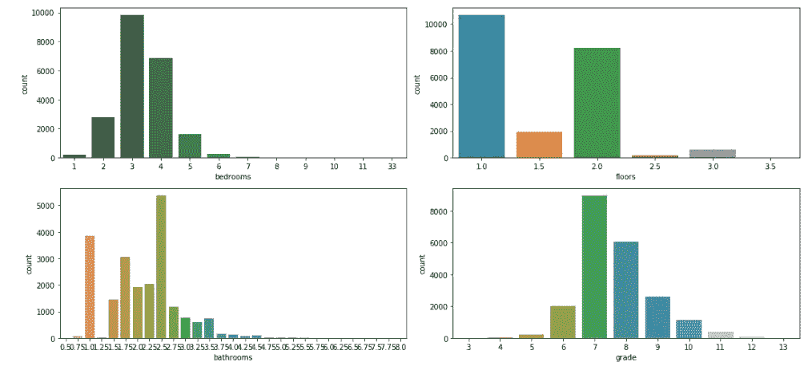

计数图—卧室、浴室、地板、等级

在这里，我将日期列分解为年和月，以查看房价是如何变化的。

```
**#let's break date to years, months** Data['date'] = pd.to_datetime(Data['date'])
Data['month'] = Data['date'].apply(lambda date:date.month)
Data['year'] = Data['date'].apply(lambda date:date.year)**#data visualization house price vs months and years**
fig = plt.figure(figsize=(16,5))
fig.add_subplot(1,2,1)
Data.groupby('month').mean()['price'].plot()
fig.add_subplot(1,2,2)
Data.groupby('year').mean()['price'].plot()
```

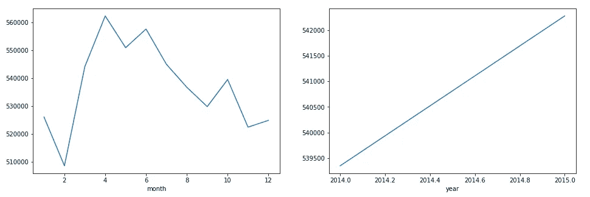

房价与月份和年份

让我们检查一下是否有空数据，并删除一些我们不需要的列(这个数据集没有一些丢失的值)

```
**# check if there are any Null values**
Data.isnull().sum()**# drop some unnecessary columns** Data = Data.drop('date',axis=1)
Data = Data.drop('id',axis=1)
Data = Data.drop('zipcode',axis=1)
```

# 步骤 2:数据集准备(拆分和缩放)

数据分为`Train`组和`Test`组。我们使用`Train`集合让算法学习数据的行为，然后在`Test`集合上检查我们的模型的准确性。

*   特性(`X`):插入到我们的模型中的列将用于进行预测。
*   预测(`y`):特征预测的目标变量

```
X = Data.drop('price',axis =1).values
y = Data['price'].values**#splitting Train and Test** from sklearn.model_selection import train_test_split
X_train, X_test, y_train, y_test = train_test_split(X, y, test_size=0.33, random_state=101)
```

特征缩放将帮助我们从相同的镜头(相同的比例)看到所有的变量，它还将帮助我们的模型学习得更快。

```
**#standardization scaler - fit&transform on train, fit only on test** from sklearn.preprocessing import StandardScaler
s_scaler = StandardScaler()
X_train = s_scaler.fit_transform(X_train.astype(np.float))
X_test = s_scaler.transform(X_test.astype(np.float))
```

# 步骤 3:模型选择和评估

# 💡**模型 1:** 多元线性回归

多元线性回归是简单线性回归的延伸(此处阅读更多)并假设因变量`Y`和自变量`X`之间存在线性关系

让我们在回归模型中总结训练过程:

```
**# Multiple Liner Regression** from sklearn.linear_model import LinearRegression
regressor = LinearRegression()  
regressor.fit(X_train, y_train)**#evaluate the model (intercept and slope)** print(regressor.intercept_)
print(regressor.coef_)**#predicting the test set result**
y_pred = regressor.predict(X_test)**#put results as a DataFrame**
coeff_df = pd.DataFrame(regressor.coef_, Data.drop('price',axis =1).columns, columns=['Coefficient']) 
coeff_df
```

通过可视化残差，我们可以看到正态分布(证明与因变量具有线性关系)

```
**# visualizing residuals** fig = plt.figure(figsize=(10,5))
residuals = (y_test- y_pred)
sns.distplot(residuals)
```

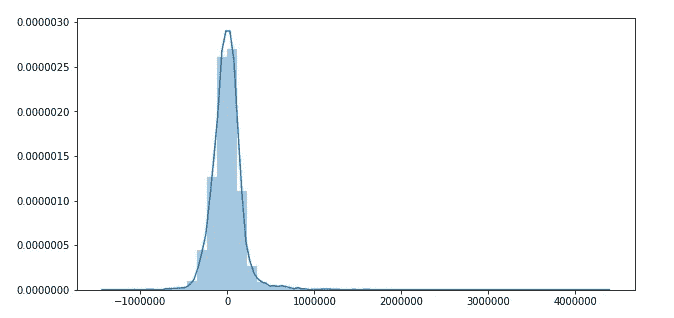

剩余可视化

让我们比较实际产量和预测值，以衡量我们的预测与实际房价有多远。

```
**#compare actual output values with predicted values**
y_pred = regressor.predict(X_test)
df = pd.DataFrame({'Actual': y_test, 'Predicted': y_pred})
df1 = df.head(10)
df1**# evaluate the performance of the algorithm (MAE - MSE - RMSE)** from sklearn import metricsprint('MAE:', metrics.mean_absolute_error(y_test, y_pred))  
print('MSE:', metrics.mean_squared_error(y_test, y_pred))  
print('RMSE:', np.sqrt(metrics.mean_squared_error(y_test, y_pred)))print('VarScore:',metrics.explained_variance_score(y_test,y_pred))
```

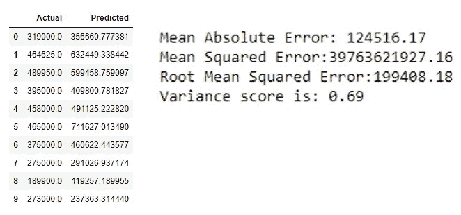

多元线性回归结果

# 💡模型 2: Keras 回归

让我们为回归问题创建一个基线神经网络模型。从所有需要的函数和对象开始。

```
**# Creating a Neural Network Model** from tensorflow.keras.models import Sequential
from tensorflow.keras.layers import Dense, Activation
from tensorflow.keras.optimizers import Adam
```

由于我们有 19 个特征，让我们插入 19 个神经元作为开始，4 个隐藏层和 1 个输出层由于预测房价。

此外，ADAM 优化算法用于优化损失函数(均方误差)

```
**# having 19 neuron is based on the number of available features** model = Sequential()
model.add(Dense(19,activation='relu'))
model.add(Dense(19,activation='relu'))
model.add(Dense(19,activation='relu'))
model.add(Dense(19,activation='relu'))
model.add(Dense(1))model.compile(optimizer='Adam',loss='mes')
```

然后，我们对模型进行 400 个历元的训练，每次都在历史对象中记录训练和验证精度。为了跟踪模型在每个时期的表现，模型将在训练和测试数据中运行，同时计算损失函数。

```
model.fit(x=X_train,y=y_train,
          validation_data=(X_test,y_test),
          batch_size=128,epochs=400)model.summary()
```

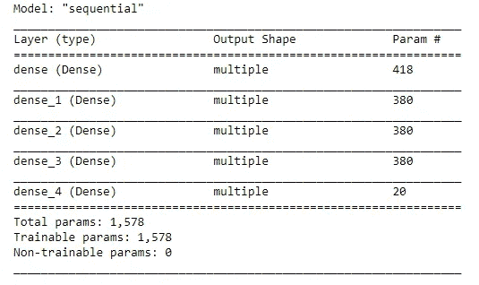

```
loss_df = pd.DataFrame(model.history.history)
loss_df.plot(figsize=(12,8))
```

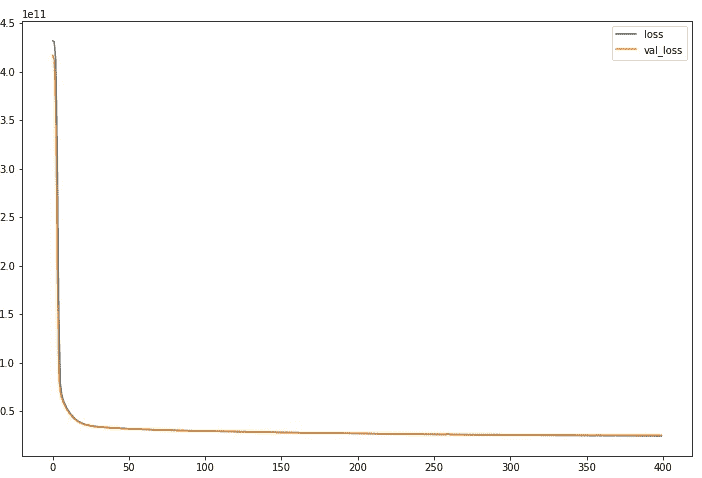

# 测试数据评估

```
y_pred = model.predict(X_test)from sklearn import metricsprint('MAE:', metrics.mean_absolute_error(y_test, y_pred))  
print('MSE:', metrics.mean_squared_error(y_test, y_pred))  
print('RMSE:', np.sqrt(metrics.mean_squared_error(y_test, y_pred)))print('VarScore:',metrics.explained_variance_score(y_test,y_pred))**# Visualizing Our predictions** fig = plt.figure(figsize=(10,5))
plt.scatter(y_test,y_pred)
**# Perfect predictions** plt.plot(y_test,y_test,'r')
```

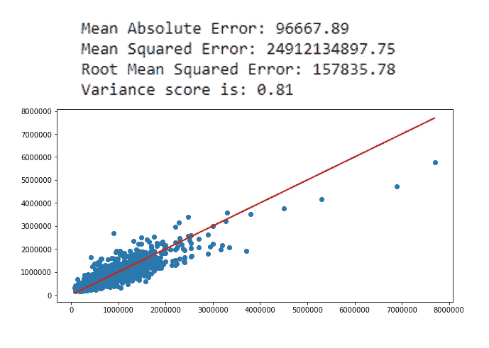

```
**# visualizing residuals** fig = plt.figure(figsize=(10,5))
residuals = (y_test- y_pred)
sns.distplot(residuals)
```

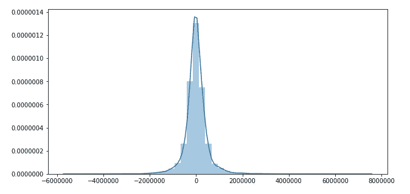

# Keras 回归 vs 多元线性回归！

我们成功了！💪
我们用两种不同的 ML 模型算法预测了房价。

我们的**多元线性回归**的得分在 69%左右，所以这个模型还有改进的空间。然后我们用 **Keras 回归模型**得到了约 81%的准确率。
另外，请注意，Keras 回归模型的 RMSE(损失函数)较低，这表明我们的预测更接近实际评级价格。

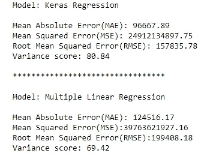

结果:喀拉斯区。vs 多个线性稳压器。

毫无疑问，这个分数可以通过特征选择或使用其他回归模型来提高。

感谢您的阅读🤓。再次反馈总是受欢迎的！

