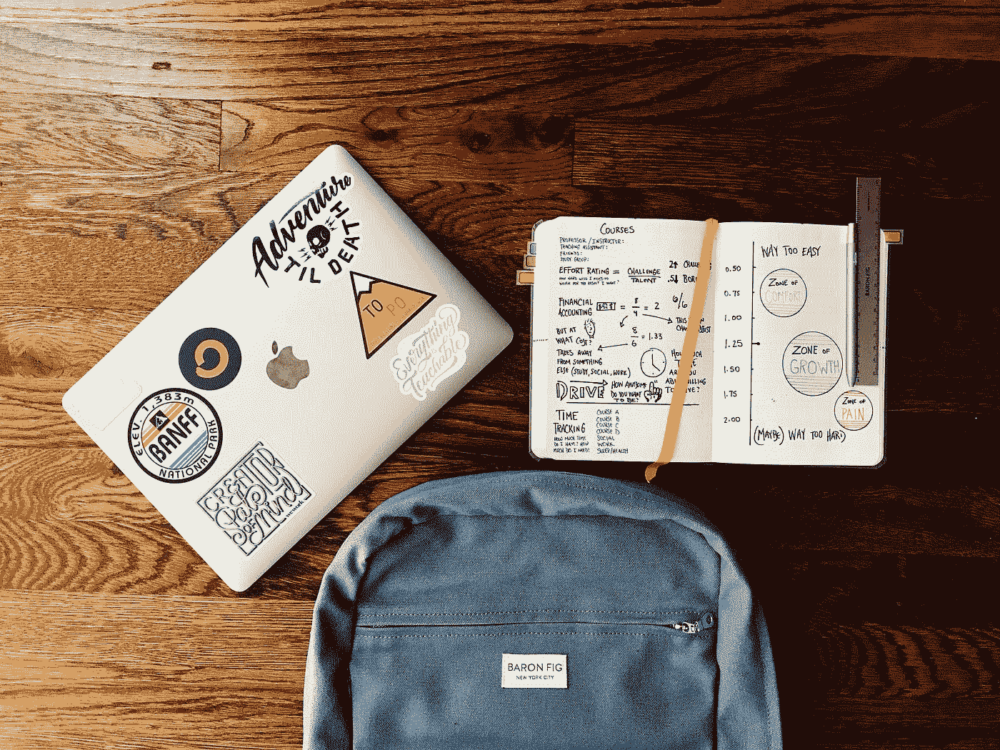

# 一本关于习惯的书如何帮助我更有效地学习数据科学

> 原文：<https://towardsdatascience.com/how-a-book-about-building-habits-helped-me-learn-data-science-more-effectively-b176e2fd572f?source=collection_archive---------66----------------------->

## 作为一名数据科学家，我从 James Clear 的原子习惯中学到了什么

卡里姆·甘图斯在 [Unsplash](https://unsplash.com?utm_source=medium&utm_medium=referral) 上拍摄的照片

阅读关于习惯和行为改变的书籍是我在过去几年中经常做的事情。作为一个对各种生产力技巧和生活优化感兴趣的人，我觉得这类书真的很有趣。尤其是当这种类型的书最终给我的生活带来意想不到的改善时。

*James Clear 所著的《原子习惯:建立新习惯和改掉坏习惯的简单而行之有效的方法*,是我去年非常喜欢读的一本书，因为它帮助我提高了数据科学学习的质量。它使阅读变得容易，并且如果需要的话，允许以非常愉快和方便的方式返回和重新引用它。

这本书的一大优点是它没有试图从头再来。相反，它以一种简明扼要的风格融合了它所要传达的内容。在本文中，我将解释这本书的要点如何影响我的数据科学学习过程。

## 微小的增量变化会带来巨大的成果

这个概念可以归结为这样一个想法，即专注的微小改进最终会产生巨大的结果。如果我们每天在某项任务上取得 1%(只有 1%)的进步，那么到每年年底，我们在这项任务上的表现会提高 37 倍。这是巨大的进步！

尽管这里的想法简单明了，但很难付诸实施。长期坚持就更难了。当我刚刚开始学习在线数据科学课程时，我不知所措。我雄心勃勃，想立刻了解外面的一切。不用说，有些事情不太顺利。

> “成功是日常习惯的产物，而不是一生一次的转变”——詹姆斯·克利尔

马特·拉格兰在 [Unsplash](https://unsplash.com?utm_source=medium&utm_medium=referral) 上拍摄的照片

我必须让事情运转起来！就是这个时候，我决定换个角度，采纳复合效应倡导者的观点。这样做，我开始更好地学习概念，更彻底地理解事物，最重要的是，开始享受学习的过程。亲爱的读者，我的建议是，不要嚼得太多。让习惯培养的复合效应来关注你正在取得的进步，同时确保你每天为小的可管理的目标努力工作。

## 学习、进步和习惯的养成不会在一夜之间发生

你的学习和进步是有门槛的。只有跨过这个门槛，你才能在学习和习惯养成中看到切实的成果。

这是一个无价的教训，在你的学习过程中要牢记在心。期待伟大的成果和知识在一夜之间神奇地同化，是取得长久进步的最大敌人。这也适用于您学习数据科学基础知识的过程。

在一两天内完成 Python 语言基础的在线课程不应该让你期望已经完成了值得与潜在雇主分享的项目组合。您的代码和项目的质量在达到所需的“阈值”之前需要时间和奉献

## 动机被高估了。你的系统承载着你的进步。

在发展某项技能的过程中，再多的动力也不足以推动一个人从最底层走到最高层。将动力视为你唯一的“燃料”是不太实际的。简而言之，你总是会耗尽燃料，筋疲力尽，或者干脆放弃。

相反，你在学习和培养习惯中建立的系统应该在你有动力和没有动力的时候都带着你。当你耗尽了你所有的动力时，尤其如此。您在掌握数据科学基础知识方面的进步反映了您在整个学习过程中设置和使用的系统有多好。

> “你不会上升到你的目标的高度，你会下降到你的系统的高度！”—詹姆斯·克利尔

艾萨克·史密斯在 [Unsplash](https://unsplash.com?utm_source=medium&utm_medium=referral) 上拍摄的照片

你的目标是成为一名伟大的数据科学家。你的系统是你用来成为一个人的过程！《T4 原子习惯》中让我印象深刻的一点是，赢家和输家都有相同的目标。换句话说，这既不是关于你的目标，也不是关于你的动机和野心。相反，它是关于你的系统让你失望或者为你工作。

## 让它变得明显、有吸引力、简单和令人满意

这四条著名的行为改变法则规定了如何培养良好的习惯。它们的对立面(即让它看不见、没有吸引力、困难和不满意)规定了打破坏习惯的过程。

让您的数据科学学习变得显而易见始于 Clear 所说的“实现意图公式”这遵循看起来非常明显和简单的食谱。然而，它所产生的心理影响是惊人的。

当您告诉自己将在[在此插入地点]的[在此插入时间]在[在此插入行为]时，食谱就开始了。一个显而易见的例子是，当你告诉自己“我将在明天上午 9:00 在洛克菲勒图书馆练习编写 20 个中级到高级的 SQL 查询。”

由 [Unsplash](https://unsplash.com?utm_source=medium&utm_medium=referral) 上的 [chuttersnap](https://unsplash.com/@chuttersnap?utm_source=medium&utm_medium=referral) 拍摄

当你把你渴望学习的东西(数据科学)和你真正喜欢做的事情联系起来时，你的学习习惯就会变得有吸引力。说你一生最大的爱好就是写作！如果你开始将你的写作习惯和你的数据科学学习习惯捆绑在一起，你很有可能会学得更好。

当你开始时，学习过程将开始变得更有吸引力，例如，写下你的数据科学学习之旅，甚至写下关于你试图掌握的数据科学概念的技术文章。

让它变得简单是双重的。第一，你想减少好习惯的摩擦。第二，你想增加坏的摩擦。然而，这两者都是从你考虑你的环境和更加意识到你周围的事物开始的。

通过将您用来学习的网站设置为打开浏览器时加载的默认页面，减少学习数据科学的摩擦。始终保持您的注册帐户登录，以减少键入您的电子邮件和密码的摩擦。每当你开始学习时，你的手机仍然是一种干扰？把手机完全移到另一个房间会增加分心的摩擦。

照片由[桑迪普·辛格](https://unsplash.com/@funjabi?utm_source=medium&utm_medium=referral)在 [Unsplash](https://unsplash.com?utm_source=medium&utm_medium=referral) 上拍摄

让它令人满意意味着理解您的数据科学学习只有在长期内才会开始有回报。但是，因为你需要短期的满足感，以便继续回到你试图建立的学习习惯，你必须通过奖励自己来使学习过程更令人满意。

奖励自己可以从做你真正喜欢的事情开始(比如长跑或弹钢琴)，每次你每天在你正在培养的习惯上取得 1%的进步。这让回归习惯变得更加容易和有趣。从长远来看，你会独立于这些短暂的回报而成长。习惯本身将开始成为奖励，而不是获得奖励的方式。

养成习惯您的数据科学学习很像一个“深度”决策树。你在每个分支做出的正确选择越多，你在旅程结束时落在“好”叶子上的机会就越大！