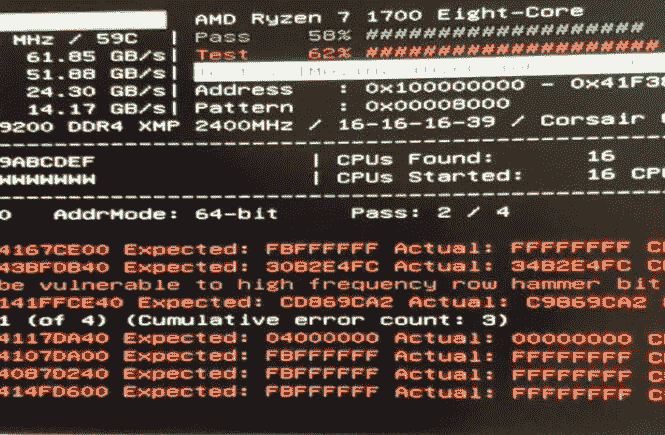
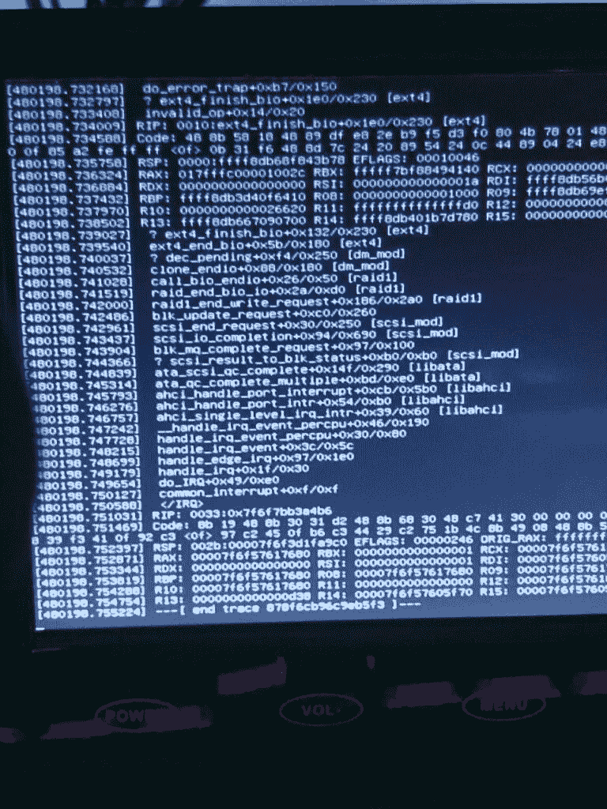
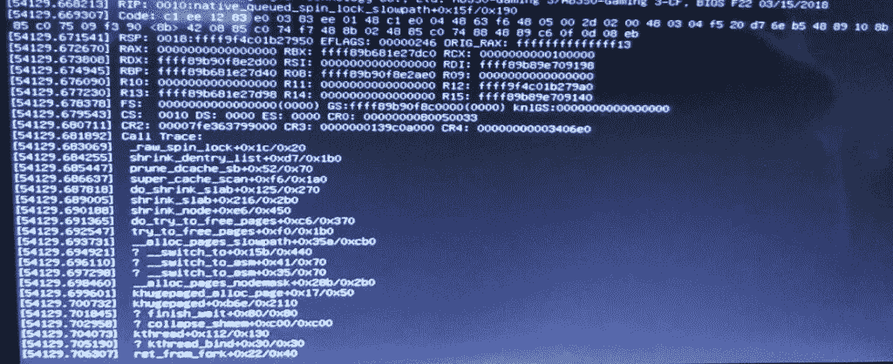
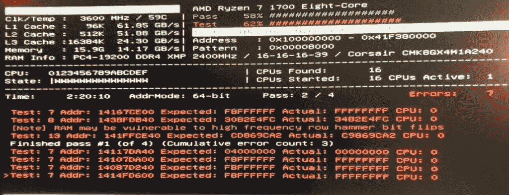

# 一个损坏的内存模块是如何隐藏在众目睽睽之下的——以及我是如何指责 Linux 内核和两个无辜的硬盘驱动器的

> 原文：<https://towardsdatascience.com/how-a-broken-memory-module-hid-in-plain-sight-and-how-i-blamed-the-linux-kernel-and-two-innocent-ef8ce7560ecc?source=collection_archive---------29----------------------->



梅斯特不高兴了— *来源:克里斯蒂安·霍林格*

我们大多数人在生活中见过、调试并解决了很多技术问题——从理解廉价的 PSU 意味着大量的烟雾，通过你最喜欢的编程语言中一个接一个的错误，一直到在 grep 中寻找 segfaults。

这是一个关于 DDR-4 内存的断棒如何隐藏在众目睽睽之下近一年的故事。

# 卑微的出身

2019 年 4 月，[我搭建了一个家庭服务器](https://chollinger.com/blog/2019/04/building-a-home-server/)。在大多数情况下，它运行得很好。唯一奇怪的是:我的两个最老的驱动器，一对 WD Red 3TB NAS 驱动器，对他们的年龄来说很年轻，只有大约 20，000 小时，似乎拒绝接受更大的数据量。

一个简单的`rsync`运行如下:

```
sudo rsync -P -aht --out-format="%t %f %b" /mnt/3TB/ /mnt/6TB/ --exclude=".Trash-1000" --exclude="Thumbs.db"
```

会随机停下来，似乎没有什么好的理由。它不仅停止了，而且使整个机器无法使用。

当将整个事件(包括`stderr`)传送到日志时，输出会像这样停止:

```
3TB/Photos/2002/02/dad/IMG-0814.JPG # <- nothing here
```

# 配置失误

问题中的驱动器是作为软件 RAID-1，在作为文件系统的`ext4`之上有`mdadm`、LUKS 加密，这并不是一个非常复杂的设置，这使我相信我搞砸了配置。仍然值得一看。

使用`mdadm --detail`检查阵列没有显示任何问题、挂起的重新同步或任何其他明显错误配置的迹象。关于`cryptsetup luksDump`也可以这么说——一切都按照预期设置好了(关于缺少 ZFS、btrfs 甚至 LVM 的评论将通过管道传送到`/dev/null`)。

甚至`badblocks`，这个检查坏扇区的工具，也没有产生任何结果。

```
nohup badblocks -nvs /dev/sda 1>&2 | tee sda.out &
```

我甚至试图使用`strace`找到最初的命令:

```
sudo strace -o strace-output.log -f rsync -P -aht --out-format="%t %f %b" /mnt/3TB/ /mnt/6TB/ --exclude=".Trash-1000" --exclude="Thumbs.db"
```

无济于事。

因此，肯定是一个坏的硬盘驱动器(或者可能是 SATA 电缆或一个垂死的 PCI-to-SATA 卡)。诚然，两个驱动器同时损坏的可能性很低，但并非不可能。

# 责怪错误的事情

因此，我干脆不挂载阵列。毕竟，服务器是全新的，在我最终将所有现有的备份驱动器迁移到它之前，它仍然有足够的空间。所以何必呢？

我的懒惰很快就咬了我。几个月后，我在服务器上移植了我的`pihole`，一个基于 DNS 的网络级广告和跟踪拦截器。它也恰好是一个 DHCP 服务器。

DHCP 服务器的问题是它们缺乏可用性不会马上显现出来。如果网络上的每台设备都分配了 IP 地址，就没什么好担心的了。对于 DNS 来说也是如此——大多数设备将简单地与它们的备用 DNS 对话，如`8.8.8.8`或`1.1.1.1`。

有一天，我的网络似乎中断了。我很快责怪康卡斯特，愤怒地重启调制解调器和路由器，但无济于事。WiFi 是有的，但是设备得不到 IPs。嗯，奇怪。

过了一会儿，我明白了——是服务器在分配地址。如果它关闭，没有设备可以加入网络。由于时间紧迫，我重启了服务器，解密了驱动器，然后继续我的快乐之路，归咎于一个反常的事故。

回来后，我继续翻看`/var/log`，愤怒地寻找罪犯。我敢说，这可能是潮人科技的错——Kubernetes、Docker、nodejs、golang——魔鬼的杰作！

嗯，在一个死内核上找到日志是很困难的——毕竟，没有一个内核做 I/O，死内核写日志是不太可能的。但是有一点很突出:`munin`。

在不可避免的硬重置之前收到的最后一个日志如下所示:

```
bigiron smartd[786]: Device: /dev/sdd [SAT], SMART Usage Attribute: 194 Temperature_Celsius changed from 113 to 112
22:43:15 bigiron smartd[786]: Device: /dev/sdf [SAT], 1 Currently unreadable (pending) sectors
22:43:15 bigiron smartd[786]: Device: /dev/sdf [SAT], SMART Usage Attribute: 194 Temperature_Celsius changed from 61 to 60
22:50:01 bigiron CRON[9239]: (root) CMD (if [ -x /etc/munin/plugins/apt_all ]; then /etc/munin/plugins/apt_all update 7200 12 >/dev/null; elif [ -x /etc/munin/plug
ins/apt ]; then /etc/munin/plugins/apt update 7200 12 >/dev/null; fi)
08:09:52 bigiron systemd-modules-load[465]: Inserted module 'lp'
```

Munin，作为久经沙场的监控软件，可能遭遇了配置不良、软件包过时或类似的问题。有道理——北美某处房子里的一台服务器发现了监控全球成千上万台机器的软件中的一个破坏游戏的漏洞。

我不想再为此烦恼了，就把穆宁搬走了。反正我太笨了。

# 法伦海特 233

但是另一件困扰我的事情是:硬盘温度不太可能超过 110 摄氏度——大多数硬盘可能会在 80 摄氏度左右失效。在 reddit 的一个帖子上(关于我的服务器！)，用户`Tired8281`发帖:

> `*Unfortunately I made a single stupid mistake with the hardware setup and the software setup I used didn't catch it, and three months later half of the drives died*`
> 
> `*Promise you won't laugh? I installed the fan wrong. Instead of sucking the hot air from the CPU out of the case, it sent that hot air into the drive cage, slow roasting my hard drives*`
> 
> [*https://old . Reddit . com/r/Linux/comments/CQ 9 view/building _ a _ home _ server/ewvcx 9 o/*](https://old.reddit.com/r/linux/comments/cq9few/building_a_home_server/ewvcx9o/)

我没有笑。我以为我也做了同样的事。坐下来，把东西拆开，检查气流，甚至搜索“如何安装机箱风扇”——我已经做了几十次了(我的电脑太多了)——结果发现一切都很好，事实上，那里没有任何东西看起来异常温暖。盒子旁边有一个空调通风口，我用了很多高质量的风扇。

肯定是 S.M.A.R.T .蠢东西，从来不靠谱。这就更有理由去责怪驱动了！

只是… /dev/sdf 从来不是看似破碎的 3TB 阵列的一部分。

# 追逐错误的东西

我们总结一下:融化硬盘。复制数据时系统死锁。在系统被监控软件锁定之前记录消息，可能会进行大量的 I/O 操作。

是时候追踪这个问题了:在“坏的”驱动器上启动另一个 rsync，迎接我的是:



ext4_finish_bio — *来源:克里斯蒂安·霍林格*

哈，**我就知道**！`ext4_finish_bio`！Ext4！`fs`模块！一定是硬盘的问题！令人讨厌的是:

```
static void ext4_finish_bio(struct bio *bio)
{
 int i;
 struct bio_vec *bvec;bio_for_each_segment_all(bvec, bio, i) {
  struct page *page = bvec->bv_page;
#ifdef CONFIG_EXT4_FS_ENCRYPTION
  struct page *data_page = NULL;
#endif
  struct buffer_head *bh, *head;
  unsigned bio_start = bvec->bv_offset;
  unsigned bio_end = bio_start + bvec->bv_len;
  unsigned under_io = 0;
  unsigned long flags;if (!page)
   continue;#ifdef CONFIG_EXT4_FS_ENCRYPTION
  if (!page->mapping) {
   /* The bounce data pages are unmapped. */
   data_page = page;
   fscrypt_pullback_bio_page(&page, false);
  }
#endifif (bio->bi_status) {
   SetPageError(page);
   mapping_set_error(page->mapping, -EIO);
  }
  bh = head = page_buffers(page);
  /*
   * We check all buffers in the page under BH_Uptodate_Lock
   * to avoid races with other end io clearing async_write flags
   */
  local_irq_save(flags);
  bit_spin_lock(BH_Uptodate_Lock, &head->b_state);
  do {
   if (bh_offset(bh) < bio_start ||
       bh_offset(bh) + bh->b_size > bio_end) {
    if (buffer_async_write(bh))
     under_io++;
    continue;
   }
   clear_buffer_async_write(bh);
   if (bio->bi_status)
    buffer_io_error(bh);
  } while ((bh = bh->b_this_page) != head);
  bit_spin_unlock(BH_Uptodate_Lock, &head->b_state);
  local_irq_restore(flags);
  if (!under_io) {
#ifdef CONFIG_EXT4_FS_ENCRYPTION
   if (data_page)
    fscrypt_restore_control_page(data_page);
#endif
   end_page_writeback(page);
  }
 }
}
```

[https://elixir . boot Lin . com/Linux/v 4 . 19 . 106/source/fs/ext 4/page-io . c # L62](https://elixir.bootlin.com/linux/v4.19.106/source/fs/ext4/page-io.c#L62)

经过搜索，以下是 2005 年以来的邮件列表主题中互联网智慧的全部:[https://www . red hat . com/archives/DM-devel/2015-10 月/msg00046.html](https://www.redhat.com/archives/dm-devel/2015-October/msg00046.html)

只是……我运行的是`Debian 10`，内核`4.19`。

比以往任何时候都更困惑——`ext4`内核模块中的一个标准调用如何会在一个最新的(稳定的)内核上导致死锁，这超出了我的理解范围。

同样，我们可以看到这一点:

```
invalid_op+0x14/0x20
```

呃，无效的操作码？

```
ENTRY(invalid_op) ASM_CLAC pushl $0 pushl $do_invalid_op jmp error_code END(invalid_op)
```

[https://elixir . boot Lin . com/Linux/v 4.2/source/arch/x86/entry/entry _ 32。S#L743](https://elixir.bootlin.com/linux/v4.2/source/arch/x86/entry/entry_32.S#L743)

嗯，中央处理器的问题？知道了旧版本的 BIOS 会引起 AMD 锐龙 CPU 的问题，我现在开始更新 BIOS，希望能有所改变。这并没有发生。

# 找到线索

沮丧之余，我几乎准备好花费数百美元购买一对新的 NAS 驱动器。幸运的是，一个周日下午，我和我的搭档在好市多看到一个 8TB 的外置硬盘，售价 120 美元。在最终更换驱动器之前，运行一些额外的备份似乎是一项不错的投资。除了餐馆供应的一加仑橄榄油和鸡汤，我们回到家，我开始准备开车。

像我这样天真的人，我把它插入服务器，格式化成 ext4，加上 LUKS……然后遇到了一个“无效的密码短语”,甚至是一个单字符的密码。归咎于一个坏了的 USB 端口，我把它插到我的笔记本电脑上——运行 popOS！还有一个更新的内核，我可以补充一下——它工作起来非常棒。

回到服务器，启动`rsync`，我就不管它了。

第二天早上我看到了这个:



_raw_spin_lock — *来源:克里斯蒂安·霍林格*

打扰一下。`[_raw_sping_lock](https://www.kernel.org/doc/Documentation/locking/spinlocks.txt)`？那个跟**有什么关系？嗯，我想如果机器锁死了，从多线程和中断的调用中得到一个异常是有意义的，但是这次我不能责怪`ext4`。发生了什么事？**

# 认识到真正的邪恶

我恍然大悟。服务器通常在晚上崩溃。自动备份在晚上运行，但通常情况下，考虑到它们的增量性质，它们不会做很多事情(特别是如果我只是在 Windows box 上玩魔兽世界的话)。由于这些备份从来没有接触过看似失效的驱动器，所以我从来没有完全建立起这种联系。

`rsync`读取、比较和写入数据。底层内核调用缓存数据、分配页面并处理所有需要的模块——文件系统、mdadm、dm-crypt(使用内核的加密 API)——同时处理多个线程。

虽然这些操作可能不会对系统造成巨大的负载(从绝对意义上来说，如所用 CPU 内核的百分比),但它会执行许多需要同步的小操作

如果在任何时候，坏的内存导致内核弄乱了各自的锁，它很可能会死锁并导致系统不可用，而不会出现真正的内核崩溃。

我越深入调查，就越发现:

```
Message from syslogd@bigiron at Feb 22 12:38:40 ... 
kernel:[ 7467.252060] page:ffffe29fc735a400 count:-1 mapcount:-1 mapping:0000000000000000 index:0x1 
kernel:[53370.089111] watchdog: BUG: soft lockup - CPU#0 stuck for 22s! [smbd:21214]
```

内存损坏也可以解释很多更奇怪的问题——比如硬盘看起来就要融化成一片火海，尽管它处于一个舒适的温度。

# 检验假设

这很简单:我在实时系统上运行`memtester`，发现了多个问题；然后，我在一个可启动的 USB 驱动器上使用了用过的`memtest86`，只发现许多问题。理论证实。



梅斯特不高兴了— *来源:克里斯蒂安·霍林格*

在关掉内存之后——问题中的一个是一套海盗船复仇 LPX 2x8GB DDR 4 cmk 8 GX 4 m1 a 2400 c 16——强制一个大的`rsync`工作，看着机器像为它而建一样工作。

# 结论

我不完全确定该说什么——但我真诚地希望有人在寻找一个模糊的、看似随机和不相关的问题时发现了这一点，并被阻止发疯。

就我而言，在走后一条路之前，我将开始更换 RAM 模块。

*原载于 2020 年 2 月 25 日 https://chollinger.com*[](https://chollinger.com/blog/2020/02/how-a-broken-memory-module-hid-in-plain-sight-and-how-i-blamed-the-linux-kernel-and-two-innocent-hard-drives/?preview=true&_thumbnail_id=475)**。**