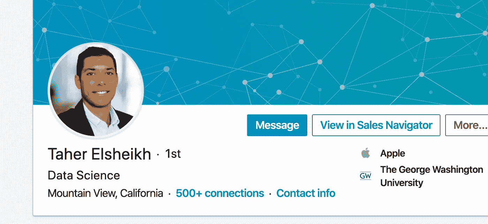

# 数据科学家如何在 FAANG 进行面试

> 原文：<https://towardsdatascience.com/how-a-data-scientist-approached-his-interviews-at-faang-6bf20003402c?source=collection_archive---------39----------------------->

## 以及数据科学的未来走向

*在* [*面试查询*](http://interviewquery.com/) *，我们爱聊我们的成功故事。本周，我与最近加入苹果公司担任数据科学家的塔赫尔进行了交谈。我问了他上一次面试的情况，他为面试做了哪些准备，以及他对数据科学未来的展望。你可以在推特上找到塔赫尔*[*@ tahere Sheikh*](https://twitter.com/TAHERELSHEIKH)*和* [*中*](https://medium.com/@TAHERELSHEIKH) *。*

# 你好！你的背景是什么，你是如何进入数据科学的？

大家好，我是塔赫尔·埃尔舍伊克，我刚刚加入苹果公司，成为一名专注于苹果音乐的数据科学家。在此之前，我在 Intuit 工作，担任工资团队和产品内发现团队的数据科学家。在那之前，我在华盛顿特区完成金融数学硕士学位，同时在一家名为 Red Oak Strategic 的咨询初创公司担任数据科学家。

我知道我对很多不同的领域感兴趣，比如计算机科学、统计学、产品管理、分析学等等。因此，成为一名数据科学家似乎非常适合我。

在 Intuit 工作很棒，我学到了很多东西。那里的数据科学团队嵌入在产品中，所以这个角色更像是一个技术产品管理角色，你每天与产品经理和工程师一起工作，创建新功能，调试现有指标，并进行大量实验。不过，最终我想去一家更面向消费者的公司，从事我个人使用的产品，这就是我转投苹果的原因。

# 找新工作时，你的整体面试体验如何？

这次面试的时候，我考虑得很周到，争取到了很多面试机会，并确保把我最想要的安排在最后。上次我面试数据科学职位时，我收到了 Intuit 的录用通知，我就接受了。所以这一次，我想扩大我的视野，我最终得到了 6 到 7 次面试。

我的数据科学面试很艰难，因为**这些面试彼此完全不同**。数据科学是非结构化的，要在面试中胜出非常困难，因为你无法对每一个面试都做好 100%的准备。数据科学技能非常广泛。我觉得很多人都说在你掌握诀窍之前，你必须去很多公司面试，但事实并非如此，因为每次面试都与之前的完全不同。例如，在脸书，面试侧重于产品感觉问题和统计数据，但在谷歌，面试更多地围绕机器学习和咨询类问题。

# 什么帮助你为面试做准备？

[面试查询](https://www.interviewquery.com/)上的 SQL 问题非常有用。你永远找不到专门针对数据科学家的 SQL 问题。通常，Leetcode 或 Hackerrank 都有针对软件工程师的 SQL 问题。因此，为数据科学家找到更侧重于分析和数据处理的 SQL 问题是非常有帮助的。

面试询问中的产品问题对许多面试也很有帮助。考虑到许多产品问题是如此的零星和多变，在制定指标和深入问题时了解如何思考**组织你的答案是有益的。**

此外，招聘人员会发给我很多材料，为即将到来的现场面试做准备。虽然有些内容可能会有帮助，但很多时候这些材料是误导性的，我最终浪费了很多宝贵的时间。LinkedIn 和脸书就是如此。

# 你认为数据科学未来会走向何方？

老实说，在我看来，机器学习越来越不相关了。在数据科学的工作环境中，**公司更想要数据分析师和技术产品经理，而不是构建模型的核心数据科学家**。例如，Intuit 的分析职位比机器学习职位空缺更多。我认为这与这样一个事实有关，即公司需要能够沟通和制定战略并且能够推动产品前进的人。

# 感谢阅读

*   对更多这样的故事和指南感兴趣？查看 [**面试查询简讯**](https://www.interviewquery.com/) **。**
*   订阅我的 [**Youtube 频道**](https://www.youtube.com/channel/UCcQx1UnmorvmSEZef4X7-6g) 了解更多数据科学访谈！