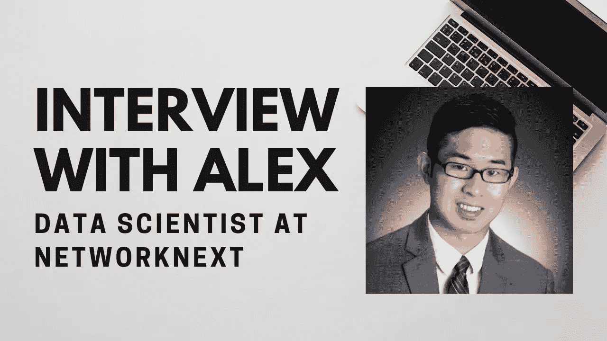
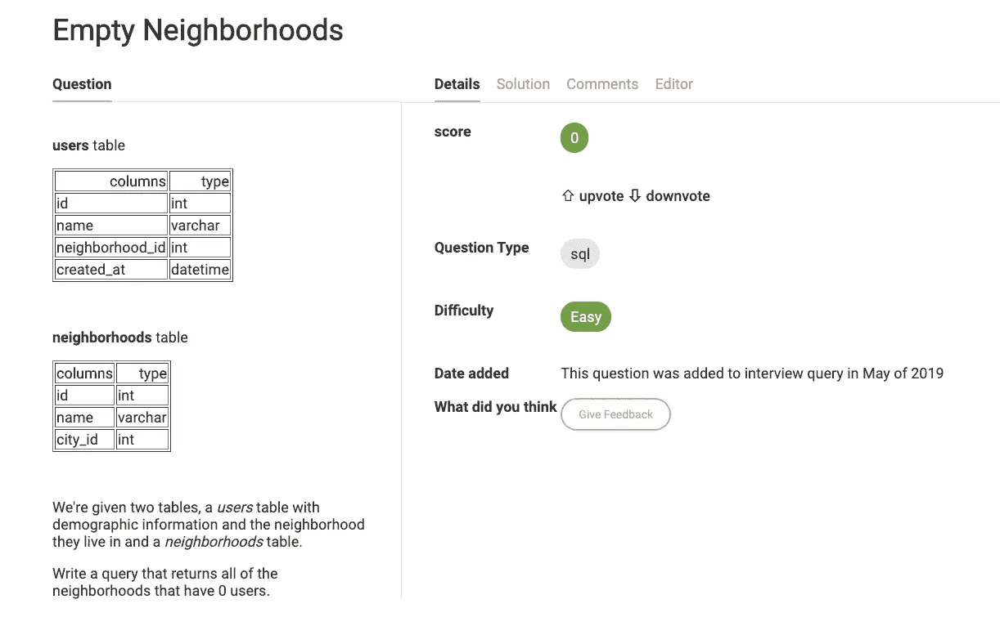

# 一个数据科学家如何在他梦想的行业找到工作

> 原文：<https://towardsdatascience.com/how-a-data-scientist-found-a-job-in-his-dream-industry-c8c7e13b145a?source=collection_archive---------73----------------------->

## 亚历克斯在疫情之前加入了网络

*在* [*面试查询*](http://interviewquery.com/) *，我们爱聊我们的成功故事。本周，我与 Alex 进行了交谈，他最近以数据科学家的身份加入了 NetworkNext。我们谈到了他富有挑战性的面试经历、对其他求职者的建议，以及进入数据科学的非传统方式。可以* [*在 Linkedin 上关注 Alex*](https://www.linkedin.com/in/alexandervictorpan/)*。*

# 你好！你的背景是什么，你是如何进入数据科学的？

嗨，我叫亚历克斯。我的背景是计算物理硕士。我刚开始的时候，数据科学在 2015 年还没那么大，但是开始快速回升。毕业后，我试图涉足数据科学，但发现这真的很难。我最终被一个训练营接受，这个训练营帮助我理解了机器学习的基础和算法。

我走了一条非常非传统的路线，最终在 Upwork 上做自由职业者的工作，并找到了一个客户，科莫多科技公司，它对我最初的一些工作印象深刻。在做了几个月的合同工后，我得到了 Statusquota 公司的一份工作，这是这位首席执行官的另一家公司，也是她帮忙工作的公司。

# 我听说在 Upwork 找到合同工作很难。你的体验如何？

肯定是从做零工开始的。不同的客户会有零星的工作，但有一天**我联系了一个需要基本建模工作的人**。当他们有一个职位，需要一个承包商时，它结束了科莫多，这是一个很好的方式进入一个更稳定的演出。我做了一年左右的顾问，直到他们资源耗尽。

我认为努力获得升级工作的经验是有用的，因为许多初级数据科学家没有与客户合作的经验，也没有搞清楚一家企业最终真正想要什么的经验。当我从事几份自由职业时，这给了我理解不同企业需要什么的经验。

# 你的数据科学面试经历是怎样的？

我开始在西雅图、佛罗里达和其他一些我想去的地方接受面试。我在机器学习基础和编码方面有很强的背景，但在处理所有不同类型的数据科学面试时遇到了麻烦。一般来说，如果我做得不好，我知道我搞砸了什么。

有些面试有点像 Geico 或 Statefarm，因为他们都在保险行业。例如，存在保险业特有的问题，围绕解决数据存在的不平等问题。

# 有没有超有挑战性的面试？

我不得不说，国家安全局在数据科学方面的立场是最令人难忘的。你被邀请参加一个数据科学考试，最后你进入一个测试机构，在那里你在一台超级安全的计算机上参加考试，不允许使用手机或任何东西。

最终在你离开后，你会收到一封邮件，询问你是否通过了考试，然后他们会在几个月内联系你进行面试。我收到的电子邮件说我通过了，但我再也没有收到回复。虽然考试对我显示我需要学习什么概念很有帮助，它填补了很多空白。

我遇到的最具挑战性的面试问题来自对 Karat 的一次面试。我最终参加了技术面试，但后来他们改变了态度，告诉我**他们现在更需要一名数据工程师，而不是数据科学家**。这似乎是一个非常普遍的问题，因为在构建数据基础设施之前，您无法真正进行数据科学研究。带回家的作业是超级乱的数据。试图从杂乱的数据中建立一个好的模型需要大量的探索。

# 你找到对你的采访有价值的资源了吗？

我发现 [**采访查询高级**](https://www.interviewquery.com/pricing) 在展示其他数据科学技术公司的问题方面对我非常有用。很容易就可以列出清单，问自己每个问题，并通过检查答案来确保自己知道正确的答案。我发现情景商务问题很有帮助，因为像脸书、亚马逊、谷歌等大公司..总是在寻找一个特定的具有行业知识的人。

面试查询 SQL 问题

我也用过几本书。其中一本是 O'reilly 写的实用统计学书籍，它确实帮助我恢复了记忆。我申请和面试的一些公司有建立模型，你需要在最后得到一个分数才能通过。这实际上给了我一个机会来了解更多关于不同的升压算法。

# 你会给现在正在找工作的数据科学家什么样的建议？

不要沮丧。每个公司都是不同的，只要你能从面试中学到东西，那么下一次面试会更好。我在新冠肺炎期间开始找工作，当时正处于两家公司的最后面试过程中，它们都冻结了招聘。

我的租赁合同将于四月底到期，所以我开始担心找不到地方住。3 月中旬，我开始重新搜索，试图将我申请的公司类型从一般的咨询公司改为传统的科技公司。

我发现与咨询公司交谈真的很奇怪，因为技术筛选是与顾问而不是数据科学家一起进行的。这导致了怪异的案例研究。

我最终发现我面试的最后三家**公司是我最好的面试**。他们也是结构化程度最低的数据科学家面试。但当我与一位数据科学家进行了一个半小时的非常随意的对话时，我真的非常喜欢，因为我们可以讨论工作和职责。

我最终接受了 NetworkNext 的邀请。面试由两个 30 分钟的面试组成。他们只是知道他们想给我一份工作，因为他们说我对在视频游戏行业工作的热情一直是我的梦想。

# 你认为数据科学面试的未来会怎样？

我认为数据科学面试的未来需要远离带回家和询问人。我不认为带回家做任何事情，因为他们给用户实践，但 [**你做了很多工作，却没有得到很多回报**](/passing-the-dreaded-data-science-take-home-assignment-8ae5d55f256b) 。当你可以和某人谈论一个项目，谈论细节时，更多的东西会显露出来。

# 感谢阅读

*   如果您即将参加数据科学面试，请查看 [**面试查询**](https://www.interviewquery.com/) **！**
*   查看我的 [**Youtube 频道**](https://www.youtube.com/channel/UCcQx1UnmorvmSEZef4X7-6g) 了解更多数据科学内容、面试指南和解决问题的技巧&。
*   查找更多数据科学面试指南，如面试查询博客上的 [**谷歌数据科学家面试**](https://www.interviewquery.com/blog-the-google-data-scientist-interview/) 和[**DoorDash 数据科学家面试**](https://www.interviewquery.com/blog-doordash-data-science-interview-questions/) 。

*原载于 2020 年 6 月 2 日 https://www.interviewquery.com**[*。*](https://www.interviewquery.com/blog-how-a-data-scientist-found-a-job-in-his-dream-industry/)*