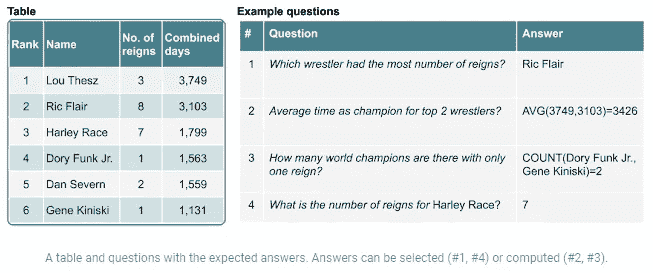

# 写作学位如何帮助我在数据科学领域找到工作

> 原文：<https://towardsdatascience.com/how-a-degree-in-writing-helped-me-get-a-job-in-data-science-801faef03b0c?source=collection_archive---------58----------------------->

## 科学和技术交流打开了大门

[Pixabay](https://pixabay.com/photos/influencer-writing-girl-woman-4081842/) 免费图片

# 写作支付了我的账单

几年过去了，经济开始复苏，但金融危机导致的经济衰退让应届毕业生的就业市场变得艰难。2011 年底大学毕业后，我开始寻找一份技术写作的工作，并获得了科学和技术交流的学士学位，为了给那些 2008 年不在的人提供视角，我的学位课程不得不取消实习要求，因为学生们找不到他们。几乎没有人在招聘！过了一段时间，我满足于在一家软件公司做全职带薪实习，做产品文档专员。我需要经验，这似乎是一个很好的工作场所，而且报酬比我的零售工作高！此外，我在六个月内就完成了，如果我不喜欢，甚至更短，所以这是一个很好的风险/回报。

与一群编辑和评论我作品的人一起一天专业写作八小时是一次奇妙的经历，教会了我很多。当然，除了写作，我还做了其他事情，比如组织可视化和编辑信息，参加与业务团队的会议，以及与公司的主题专家(SME)一起工作，但是我的大型项目是编写涵盖软件功能的面向客户的文档。我钻研业务分析师概述的需求，自己摆弄软件，然后开始记录文档。如果有人想以写作为职业，我强烈推荐探索技术写作和产品文档作为职业道路！知道全国各地的人们发现我的话很有帮助，同时我磨练了我的沟通技巧，可以转化到其他行业和专业，这让我感觉很有收获。

# 被迫写作的瓶颈

实习结束后，我决定留在这家公司，并加入他们的支持团队，因为文档团队没有空缺。我在实习期间获得的知识和技能很容易转化到我的新工作中。虽然没有人编辑我的作品，但我仍然每天写作，通常是类似于文档的一步一步的指导，所以我仍然得到了练习。随着时间的推移，我利用我的沟通技巧创建了培训项目和内部知识文章，为团队增加了很多价值。总的来说，这份工作真的很有回报，我赚了不少钱，所以我坚持了很长时间。

几年过去了，我终于看到了两条前进的道路:

1.继续关注前端支持，寻找更多写作和培训的机会。

2.转向关注软件支持和学习数据库的技术方面。

作为一个一直对计算机感兴趣的终身学习者，我选择了第二个选项。这也让我走上了一条硬技能之路，我可以把这些硬技能添加到我的简历中。一旦我学会了如何查询数据库，我就着了迷，并把写博客放在一边，在空闲时间学习[结构化查询语言(SQL)](https://en.wikipedia.org/wiki/SQL) 。我向我的技术支持同事询问复杂的 SQL 示例，并在家里设计数据库来存储股票市场报价。我付出了巨大的努力，最终爬上了技术支持的阶梯。

# 我，一个文艺复兴时期的人

文艺复兴时期的男人([莱昂纳多·达芬奇](https://en.wikipedia.org/wiki/Leonardo_da_Vinci)，[阿克巴大帝](https://www.culturalindia.net/indian-history/akbar.html)，[伽利略](https://en.wikipedia.org/wiki/Galileo_Galilei)，我(埃里克·克莱彭))

当我在大学开始学习技术写作时，我从未想过十年后我会成为一名计算机程序员。其实我学写作的原因之一就是因为不喜欢数学和数字。我年轻时尝试过编程，在大学里我喜欢逻辑和符号逻辑，但计算机科学和高等数学就是不适合我。无论如何，进入 SQL 充当了推动我进入数据分析的催化剂:[我对金融感兴趣作为一种爱好](/collect-stock-and-options-data-easily-using-python-and-ally-financial-api-3-example-queries-45d162e4f055)，我研究了可用性和人体工程学作为我的技术写作学位的一部分，所以我熟悉一些统计数据。我说的重点是，查询数据感觉像是另一种形式的技术写作，因为两者都是将复杂的步骤分解成小的逻辑部分。我在技术写作方面的教育使我很容易过渡到数据分析。

这是一个艰难的决定，但我决定放弃我的空闲时间，冒险从事技术支持方面的轻松工作，并通过加倍学习分析来致力于职业发展。我不仅每天在工作中使用 SQL，而且还参加了我所在的州立大学举办的数据分析编码训练营。我回学校了！在为期六个月的项目中，我使用 Excel、Python、NoSQL、SQL、R 和 JavaScript 探索数据。这是大量的工作，但它让我接触了大量的语言和概念，如机器学习。

大约在同一时间，数据科学一词到处出现，并被吹捧为当今“最性感的工作”。我在训练营之前就听说过数据科学，我在通过一些编码书籍学习 Python 基础知识的同时也涉猎了 sci-kit learn，但是我并没有真正理解这个领域到底是什么。我知道我喜欢科学和数据，所以我想我应该去看看。训练营的重点不是数据科学，但是我的最后一个项目是使用 TensorFlow 建立的一个[葡萄酒推荐网站](http://www.robotsdodream.com),该网站至今仍在运行！训练营正是我需要建立势头并打入分析或数据科学的地方。

# 尼奥也没有进行第一次跳跃

我带着不错的项目组合从训练营毕业，并对自己的编码能力有了新的信心。我注意到数据科学部门有一个数据工程师的职位空缺，所以我申请了。在该公司工作多年后，我拥有广泛的领域知识，我有资格证明我是一个快速的学习者，能够处理一些 SQL 和 Python。不幸的是，这还不够。我需要更快地编码，并对我的算法和计算机科学概念的知识更有信心。这是一个令人失望的结果，但是这个部门需要一个比我更有经验的人，所以我接受了这个结果，全力以赴。

在我被拒绝后不久，部门经理联系我，询问团队中一个产品分析师的职位。我调查了一下，这份工作非常适合我的技能。[这个职位需要大量的交流，但是给了我自由去编码，这样我就可以提高我的技能](/the-business-side-of-data-science-5-tips-for-presenting-to-stakeholders-fb624a9a6e54)。我想从事数据科学方面的工作，我想写作和编码。这份工作似乎是天作之合！

[肘击(2020)](https://www.pexels.com/photo/photo-of-man-and-woman-doing-elbow-bump-4148838/)

随着我职业生涯的顺利进行，我继续在业余时间学习和编写代码，最终也回到了写作中；我不能永远离开。当我进入数据科学领域时，我经常看到在线出版物《走向数据科学》。在阅读了足够多的文章后，[我建立了信心，开始在 Medium 上写博客，记录我的编码项目和生活经验](https://medium.com/@erickleppen01)。我的文章得到了很多积极的反馈，Medium 已经变成了一个巨大的额外收入来源。我强烈推荐任何对写作感兴趣的人尝试一下。

# 自然语言分析师

在数据科学的所有主题和子领域中，我*自然地*抓住了自然语言处理(NLP)。我们交流的复杂性和微妙性似乎一直是让我们成为独特而聪明的物种的决定性因素，因此训练机器理解语言将交流从模糊、有说服力和充满感情的东西转变为机械、有序和可预测的东西。然而，我对 NLP 了解得越深，我就越明白它是一个新类型的技术作家将会出现的脚手架:*自然语言分析师*。

几周前，在他们的人工智能博客[上，谷歌宣布了使用自然语言查询数据库的进展](https://ai.googleblog.com/2020/04/using-neural-networks-to-find-answers.html)。研究人员使用高级语言模型(BERT)和机器学习提出了一种不使用 SQL 等查询语言返回查询结果的方法:

[https://ai . Google blog . com/2020/04/using-neural-networks-to-find-answers . html](https://ai.googleblog.com/2020/04/using-neural-networks-to-find-answers.html)

虽然这篇文章的结论是这项技术还有很长的路要走，但有理由认为在十年内自然语言查询将成为普遍的做法。数据分析和技术写作将以前所未有的方式融合在一起，为这两个领域的新机遇让路！这是有意义的，因为在分析和技术写作之间有很多重叠的技能:统计、批判性思维、视觉修辞、逻辑、有说服力的讲故事…仅举几例！

# 探索技术写作！

作为一名产品分析师，我在数据科学领域工作，与利益相关者就团队项目进行交流，查询数据库以获得商业智能，编写 python 应用程序以共享分析，并探索机器学习模型/管道以改善内部分析基础设施。要想在这个职位上取得成功，强大的写作能力是必备的条件，所以我感谢我在科技交流方面的背景。虽然我既不是“数字迷”，也不是杰出的数据科学家，但写作背景让我能够追随自己对数据和编程的热情，这让我在数据科学领域找到了一份我非常喜欢的职业！

# 谢谢大家！

*   *如果你喜欢这个，* [*在 Medium 上关注我*](https://medium.com/@erickleppen) *了解更多*
*   [*通过订阅*](https://erickleppen.medium.com/membership) 获得对我的内容的完全访问和帮助支持
*   *我们连线上* [*LinkedIn*](https://www.linkedin.com/in/erickleppen01/)
*   *用 Python 分析数据？查看我的* [*网站*](https://pythondashboards.com/)

[**—埃里克·克莱本**](http://pythondashboards.com/)

 [## 将我的作品转化为赚钱内容的四个原则

### 学习如何写产生收入的文章！问问你自己写作是否适合你。找到一个合适的位置，成为一个…

medium.com](https://medium.com/swlh/the-four-principles-that-transformed-my-writing-into-content-that-earns-money-db9786086cb3)