# 佛兰德制图员和 PNGs 如何让网络地图成为我们日常生活的一部分

> 原文：<https://towardsdatascience.com/how-a-flemish-cartographer-and-pngs-made-web-maps-a-part-of-our-everyday-lives-e390806ecd98?source=collection_archive---------55----------------------->

## 或者 web 地图的简史

你上次迷路是什么时候？真的好好想想。

除非你没有手机或者你的手机没电了，否则你很可能会有方向告诉你去哪里，或者你最终会看到一个蓝点告诉你你到底在哪里。

这个概念，在任何给定的时间知道你的确切位置，仅仅在 15 年前还是一个遥远的想法。然而，在此后的几年里，地图、位置以及我们与周围世界互动的方式都发生了变化，你可能再也不会感到迷失。

任何浏览过新闻机构网站的人都可能看过一张地图，上面显示了疫情冠状病毒每天是如何变化的。在线可视化地理空间数据并不总是一件容易的事情，这一时期也带来了我们与地理空间数据在线交互方式的重大变化。

位置以及我们如何与之互动已经在我们的生活中无处不在。我们如何走到这一步的故事包括一长串个人、公司和想法，它们最终塑造了我们与世界的互动方式。这个故事没有一个版本可以讲述每一个部分，但我希望它能帮助你了解我们是如何走到这一步的。

# 制图学的简要背景

这段历史与漫长的地图绘制历史紧密相连。地图学既是科学又是艺术。它是关于呈现世界的本来面目，同时也要做出巨大的妥协:对于每一个包含某些东西的选择，你都必须排除某些东西。

这适用于地图上的实际内容(不可能在一张地图上表示地球上的每个特征)，也适用于地图的[投影](https://en.wikipedia.org/wiki/Map_projection)，或者 3D 地球如何投影到 2D 表面。

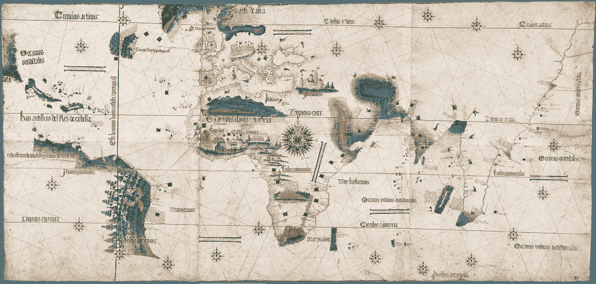

葡萄牙发现地图和密克罗尼西亚棒图

整个制图员都明白这个概念，他们的地图告诉一个单一的故事，只有一个目的。[玻利尼西亚和密克罗尼西亚航海家](https://manoa.hawaii.edu/exploringourfluidearth/node/34)创造了详细的棒图，使他们能够绘制岛屿之间的联系，了解海浪模式。葡萄牙探险家[绘制了详细的海岸线地图](https://en.wikipedia.org/wiki/Portuguese_discoveries)，内部几乎空无一物，因为他们只专注于发现和航行。

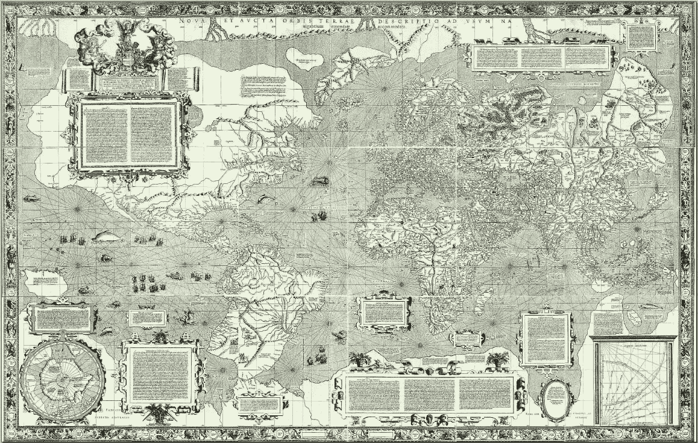

墨卡托 1569 年世界地图

1569 年，一位名为**杰拉杜斯·麦卡托**的佛兰德制图员发布了一张带有新投影的[地图，它只有一个目的:帮助水手们用一条直线在地图上找到任何航线。](https://en.wikipedia.org/wiki/Mercator_projection)

数百年前创建的这种投影在我们与在线地图互动的方式中发挥了重要作用。几乎我们在网上看到的每一张地图都使用墨卡托投影或它的细微变化。

然而，网络地图提供商使用它不是因为它能够找到两点之间的直线路径，而是因为你可以将整个地球投影到一个几乎正方形的图像上。我们稍后会谈到这一点的重要性。

当然，对于从墨卡托投影中获得的东西，地图工程师也放弃了一些东西——在这种情况下，当你远离赤道时，物体的扭曲。

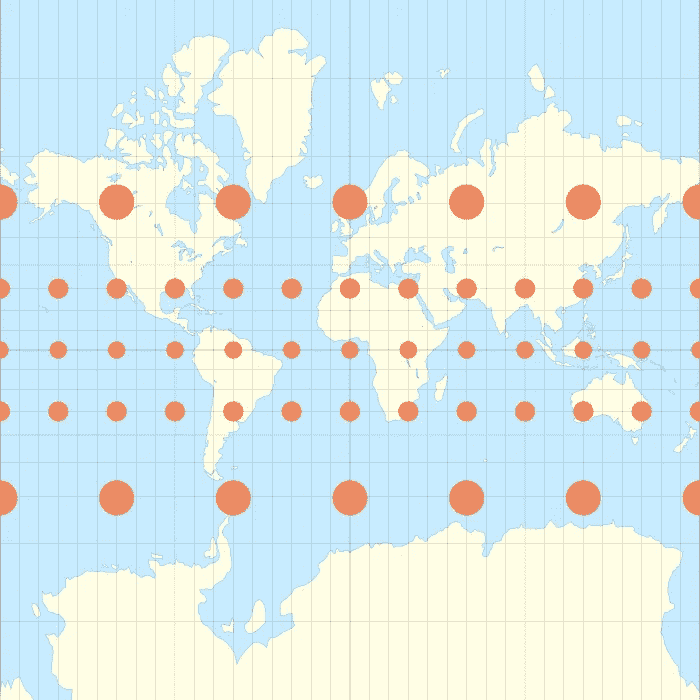

墨卡托投影中的尺寸失真

这在大范围内(或当地水平)你不会注意到，比如在你的街道上，甚至在你的城市或州。但是在小范围内(全球视角),这使得格陵兰岛看起来和整个非洲大陆差不多大，实际上[非洲比格陵兰岛大 14 倍](https://www.businessinsider.com/greenland-africa-comparison-2014-5)

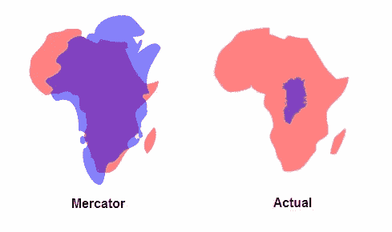

在我们进入在线地图的详细历史之前，有两个关键点需要注意。首先，网络制图惯例从一开始就与制图设计和科学惯例不一致。询问任何受过 GIS 培训的人，他们可能会告诉你墨卡托不是他们显示全球地图数据的首选。

第二个后果是大多数 web 地图中地球的变形。随着网络制图成为我们与世界互动的默认方式，数十亿人对世界的理解将发生根本性的扭曲。《白宫群英》中的这个片段很好地解释了这个问题，几乎所有从事地理或制图工作的人都知道这个问题。

# 网络上的第一批地图

尚不清楚第一张在线地图是什么。它很可能是我们永远不知道的某个地点的静态地图图像。区别静态网络地图和真实网络地图的是交互性。事实上，用户可以参与并选择在地图上看到的内容，这使得网络地图成为一个独特的类别。有史以来第一次，地图的查看者可以决定他们看到什么，而不仅仅是制图员。

许多人都同意，施乐公司在 1993 年推出了第一批网络地图之一的 **PARC 地图浏览器**。功能很简单，你可以查看地图，放大和缩小，打开和关闭图层，等等。即使在这个早期的应用程序中，我们也可以了解今天网络地图的一些基础知识。

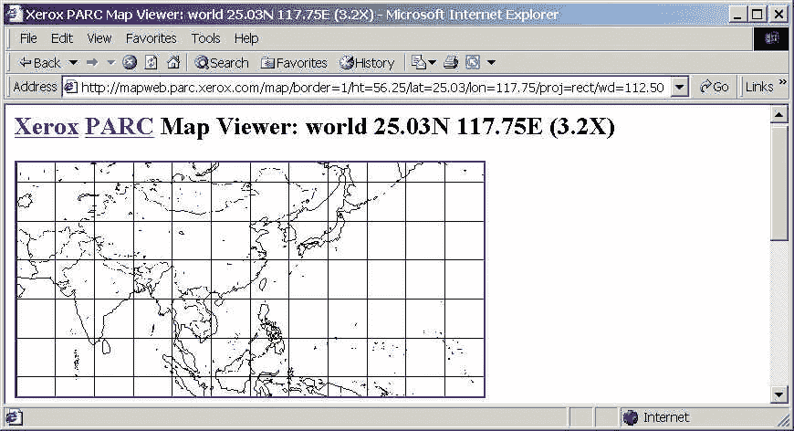

施乐 PARC 地图查看器

为了在地图上显示数据，PARC 地图查看器将读取来自用户的请求，并使用地理数据库呈现地图图像，然后将地图图像从服务器返回到浏览器。

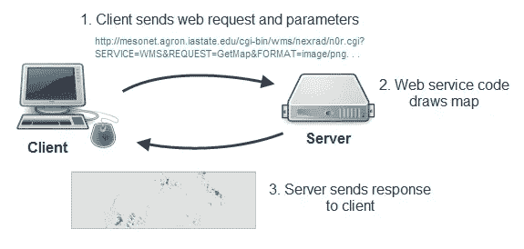

宾夕法尼亚州立大学地理 585 课程的网络地图请求循环([链接此处](https://www.e-education.psu.edu/geog585/node/643)

这个循环——用户请求、数据渲染、返回给用户——仍然是大多数 web 地图的核心。甚至包括经度和纬度参数的 PARC 地图浏览器 URL(见上)今天仍然在谷歌地图中。

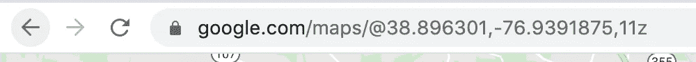

PARC 地图查看器还用于 web 制图的另一个基本元素:在地图上显示其他数据。在这种情况下，它是显示全球地震的数据。全球地震定位器****是由爱丁堡大学于 1994 年开发的，该项目页面仍然在线，并提供了地图如何工作的描述:****

> ****最初的系统使用美国地质调查局(USGS)下属的国家地震信息中心(NEIC)提供的数据。这些数据提供了地震发生后几小时内的基本信息。作为对查询的响应，数据是从科罗拉多州戈尔登市的美国地质调查局服务器上动态获取的。这些数据然后在爱丁堡被处理成适当的格式，最后在美国加利福尼亚州帕洛阿尔托的施乐 PARC 地图浏览器上显示出来。阅读原始地震定位器的完整理由。****

****这被称为**混搭**，在谷歌地图发布后不久，我们将看到一个开发者如何采用同样的概念，并开始了一系列创造新行业的活动。要让网络地图真正起飞，需要两家有相同愿景的公司:允许用户查找一个地址，并向他们展示该地址的地图。****

****1996 年， **Mapquest** 上线。同年不久， **Multimap** 在英国推出。这些是第一批面向消费者的 web 地图服务，从这一点开始，世界上每个人与位置交互的方式开始改变。****

****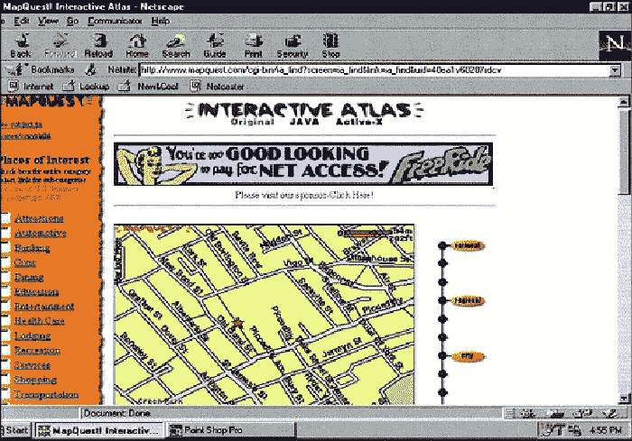********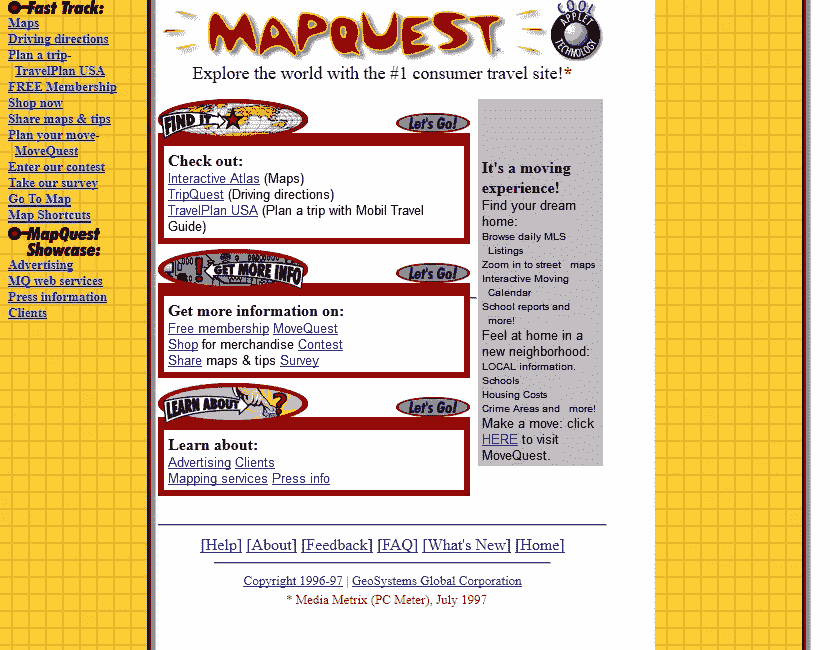****

****早期输入你的地址并看到一颗红星出现在他们家所在的地图上的新奇感是如此独特，以至于这些服务很快成为最受欢迎的在线网站。Mapquest 最终成为一家上市公司，并最终在 1999 年被 AOL 以 11 亿美元收购。****

****当然，这不仅仅是在地图上找到你家的新奇感，而是在两个地点之间获取驾驶方向的能力。印刷道路地图的缓慢衰落已经开始，显然基于消费者的在线地图有着巨大的市场。****

****Mapquest 本身为我们今天所知的网络地图添加了一些基本元素。缩放栏以及平移地图位置的功能是 web 地图的新增功能。****

****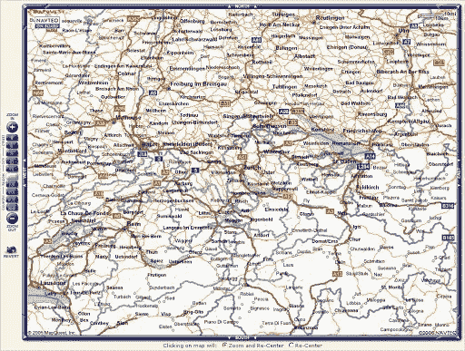****

****带有平移和缩放功能的 Mapquest****

****对于用户来说，平移和缩放地图的主要缺点是每次地图移动时，都会重新加载完整的地图视图。因此，虽然地图是交互式的，但最终还是相当慢。****

****在可预见的未来，大多数 web 地图将使用这种基本结构。这一时期[见证了其他几个地图提供商的兴起](https://www.slideshare.net/stevenfeldman/history-of-web-mapping):传统的 GIS 提供商也推出了他们的网络服务(MapInfo 和 ESRI)，一个名叫 Steve Coast 的人在 2004 年启动了一个名为 OpenStreetMap 的项目，同时雅虎和微软也开始探索地图服务。****

****在此期间，谷歌一直在进行几项重要的收购，这些收购最终构成了谷歌地图的基础。然后在 2005 年 2 月 8 日，一切都变了。****

# ****谷歌地图和地图切片****

****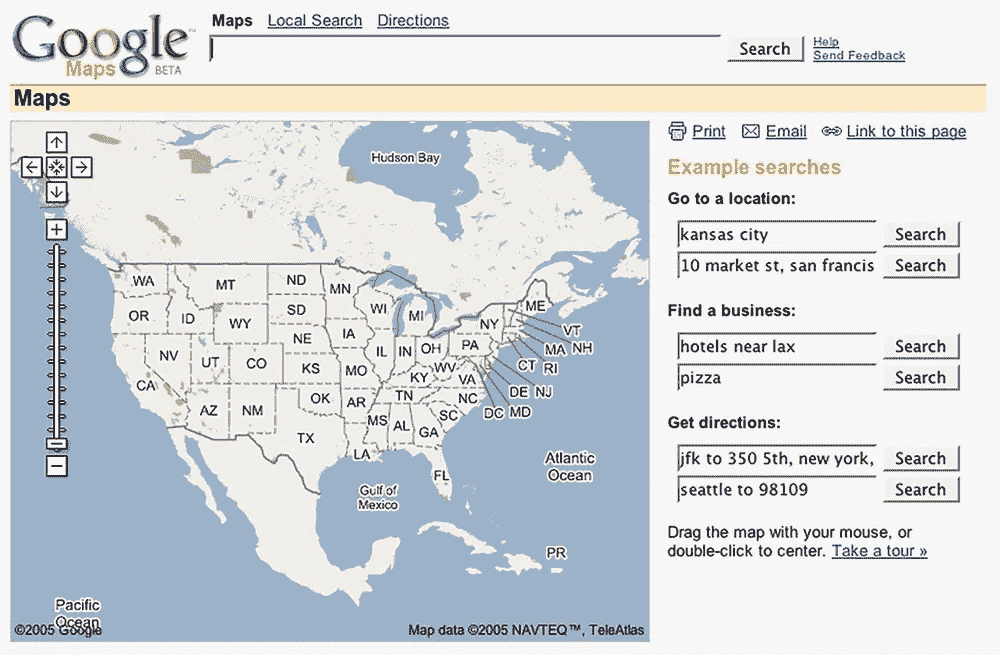****

****谷歌地图(2005 年)****

****谷歌地图并不是第一次尝试基于位置的搜索。该公司在 2003 年推出了一项名为“谷歌本地”的功能，用户可以在搜索中加入一个地点。如果你想找到伊利诺伊州芝加哥附近的咖啡店，你只需输入你的位置和搜索词。****

****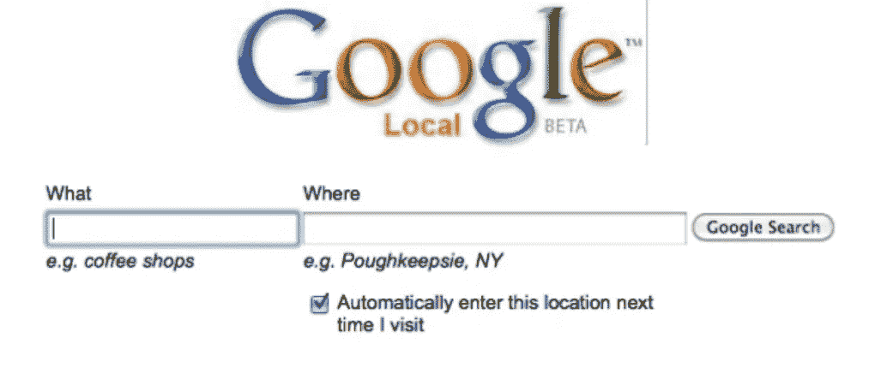****

****谷歌本地搜索****

****该功能在一天结束时并不是很受欢迎。 [Recode](https://www.vox.com/2015/2/8/11558788/ten-years-of-google-maps-from-slashdot-to-ground-truth) 采访了 2015 年谷歌地图早期的几名团队成员，本地产品经理 Bret Taylor 分享了他对该项目的见解:****

> ****“这是一个几乎无用的项目，”泰勒说。****
> 
> ****按位置搜索的最大例子是你应该能够搜索帕洛阿尔托附近的咖啡店。但是 Taylor 记得 Sun Microsystems 把它的地址放在了它网站的每一页的底部，并且它用咖啡来命名它的产品(最著名的是 Java)。这破坏了整个例子。****
> 
> ****“它每天的用户数为零，”泰勒说，他现在是生产力初创公司 Quip 的首席执行官，此前他曾担任脸书的首席技术官。****

****但是谷歌并没有尝试将位置引入他们的搜索产品，2004 年，该公司开始了收购 Keyhole、T2 where 2 Technologies 和 T4 Zipdash 的进程。这三种技术将分别形成我们所知的谷歌地球、谷歌地图和谷歌地图移动版。****

****Chris Sacca 现在因他的各种投资而闻名，他是领导收购 Keyhole 的投资团队的一员，他分享了来自同一篇 [Recode 文章](https://www.vox.com/2015/2/8/11558788/ten-years-of-google-maps-from-slashdot-to-ground-truth)的内容:****

> ****我永远不会忘记，我们在一次会议上讨论收购 Picasa，这个看起来有点像莫里西的年轻人 Adrian Graham 正在浏览幻灯片，推销我们如何整合 Picasa，而[谷歌联合创始人] Sergey [Brin]完全被分散了注意力。这是在 42 号楼的一个会议室里，里面有一个爬梯机，因为谢尔盖想在会议中更好地利用他的时间。****
> 
> ****他把他的笔记本电脑给几个人看，人们说，'哦，妈的，干我，干我。'这个做演示的家伙真的开始流汗了，谢尔盖最终站起来拔掉投影仪，说‘这东西很酷，我们应该买下来’，然后他把笔记本电脑插到投影仪上，给我们看了锁眼。从字面上看，这些高管喊出他们的地址是因为他们想从太空中放大他们的房子。****

****用户在 Mapquest 地图上看到一颗红星时的兴奋感，谷歌团队和谷歌地球推出后的数百万用户，都来自于从太空放大他们的房子。****

****Zipdash 将成为谷歌地图移动版的第一个版本，谷歌于 2004 年收购了这个版本。该应用程序允许用户在手机上看到交通延误，还允许用户利用手机的 GPS 定位来获取与他们实际位置相关的信息。****

****Where2 是我们在笔记本电脑和电脑上使用的谷歌地图的基础，事实上，也是今天所有网络地图的基础。他们的愿景是将地图放在导航体验的中心，而 Mapquest 依赖于一系列打印的方向和街道标志图标。****

****这家澳大利亚公司几乎被红杉资本收购，红杉资本最终放弃了这笔交易，但最终将团队介绍给了拉里·佩奇。然而，2 构建的技术是桌面应用程序。 [Stephen Hutcheon](https://medium.com/@lewgus/the-untold-story-about-the-founding-of-google-maps-e4a5430aec92) 描述了团队如何快速将它转变为一个网络应用:****

> ****但是拉里·佩奇和谷歌对应用软件不感兴趣。“我们喜欢网络，”据说他对戈登的合伙人之一拉斯·拉斯穆森说。他给团队设定了一个截止日期，让他们的想法在网络浏览器中工作。****
> 
> ****该团队完成了交易，并于 2004 年 8 月签署了一项金额未披露的交易，这是谷歌有史以来第二次收购 Where 2。****

****该团队使用了相同的基本循环，即从浏览器向服务器传递请求以返回地图数据，然后将其加载到浏览器中。主要区别是他们如何使用 AJAX，这是 Web 2.0 转换中的一个基本工具，它允许这个循环在后台发生，而不会中断用户的体验。****

****一旦这三家公司正式加入谷歌，他们就开始构建谷歌地图。从现在开始，他们构建的东西最终将成为所有网络地图的标准，并允许用户用鼠标来平移、缩放和移动地图——滑动地图**。******

****技术上称为切片 web 地图，让地图以这种方式工作的关键是，地图图像不是一个单一的图像，而是许多拼接在一起的切片。这很重要，原因有几个。****

****首先，瓷砖本身非常小。他们想出的尺寸，256 像素乘 256 像素，成为网络地图的默认尺寸，可能只有几千字节。每一个都可以很快加载，当它从服务器返回时就会显示出来。****

****不像 Mapquest 和 PARC 地图查看器那样每次都要为完整的地图做一次完整的往返旅行，地图分块会做 10 到 20 次非常短的旅行。这些地图也足够智能，可以加载地图视图之外的切片，因此当您开始平移地图时，这些切片将可供您使用。****

********

****Google Maps 上加载地图切片的示例****

****每个缩放级别都有自己的一组切片，因此当您放大时，会加载另一个切片图层用于该缩放。缩放级别为 0 时，整个地球将适合一个单幅图块，缩放级别为 1 时，它将拆分为 4 个单幅图块，缩放级别为 2 时，它将拆分为 16 个单幅图块，以此类推。[艾伦·麦康琪](http://maptime.io/anatomy-of-a-web-map/)的演讲非常详细地解释了瓷砖是如何工作的。****

****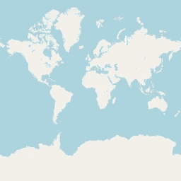****

****来自 OpenStreetMap 的图块 0([链接此处](https://tile.openstreetmap.org/0/0/0.png))****

****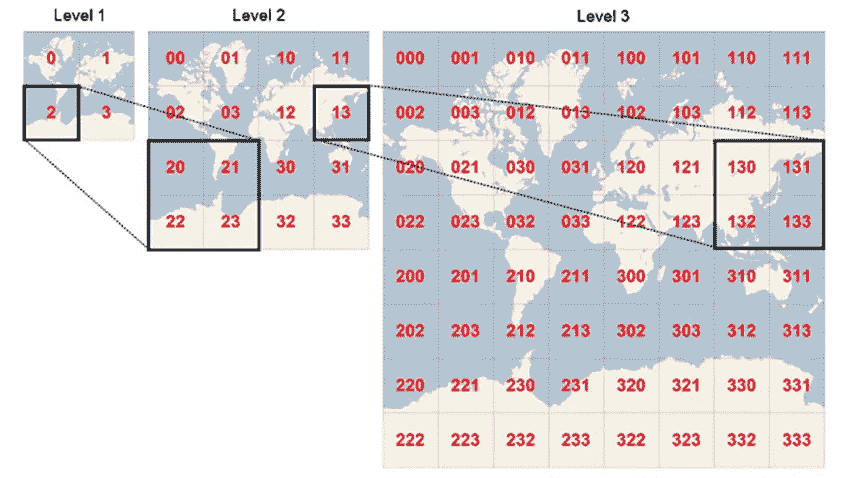****

****不同缩放级别的地图分块****

****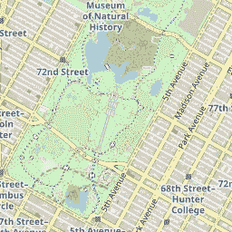****

****来自 OpenStreetMap 的一个单幅图块([链接此处](https://tile.openstreetmap.org/14/4825/6156.png))****

****在已经开发的所有地图投影中，有一种非常适合将整个地图放在一个正方形的 PNG 图块上，这就是**墨卡托投影**。为航海导航设计的地图投影现在将被推向数十亿台计算机和手机，仅仅因为它为创建小正方形 PNG 瓦片提供了效率。****

****第二个效率提升体现在图块的缓存上。虽然以前的地图服务每次都必须渲染地图，但一旦生成了切片，谷歌只需将其放入存储中，如果再次请求，它就会使用缓存的版本。这意味着更快的地图。第三，如果一个图块出现故障，地图上不会显示该图块，整个地图也不会受到影响。****

****当谷歌地图在 2005 年推出时，它获得牵引力的速度很慢，但最终，随着他们添加卫星图像，它变得越来越受欢迎，因为人们开始找到谷歌高管在地图上找到自己房子时找到的那种快乐。第一次发射将作为“岛屿地图”被永远记住，因为地图上唯一的陆地是北美，四面环水。****

********

****岛屿地图****

****许多其他公司纷纷效仿:雅虎、必应、Teleatlas(现在是 TomTom)、Navteq(现在是诺基亚的一部分)、Yandex 和百度。ESRI 也跟上了，但他们都使用了谷歌地图的相同基础和创新。****

****谷歌最终赢得了面向消费者的在线地图之战。以至于当苹果公司需要一个地图提供商来发布他们的新 iPhone 时，他们形成了一个高度秘密和令人不安的忠诚，这种忠诚从 2007 年开始持续了五年。****

****当谷歌添加一个小蓝点显示你的确切位置时，它开启了一个基于你的位置的整个行业。Foursquare 和 Yelp 等公司，以及从嵌入在其他应用程序中的广告工具收集位置数据的数据提供商将开始涌现，并继续改变我们与周围世界的互动方式。****

****到目前为止，大多数创新都涉及到地图本身——道路、水和你看到的其他一切。但是一个好奇的开发人员问了一个问题“我可以把我自己的数据放在地图上吗”，而其他许多人问，“如果我想使用我在地图上看到的数据怎么办”。这两个问题将推动网络地图的下一阶段创新。****

# ****Mashups 和 OpenStreetMap****

****到目前为止，大多数 web 地图都集中在基础地图上:道路、高速公路、公园、水景等。然而，即使在最初的网络地图中，也很明显需要在地图上显示其他数据。****

******保罗·拉德马赫**破解了**混搭**地图，或者使用你拥有的数据并将其放在网络地图服务之上，保罗·拉德马赫有效地[找到了一种方法，使用谷歌地图中未经批准的 API](http://googlemapsmania.blogspot.com/2010/04/google-maps-hack-5-years-on.html)在谷歌地图之上显示 Craigslist 的租房列表。****

****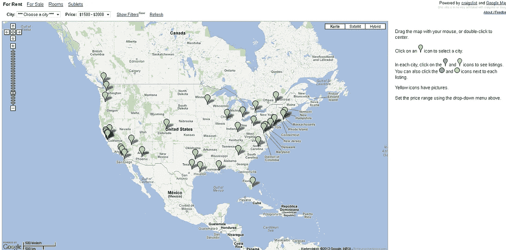********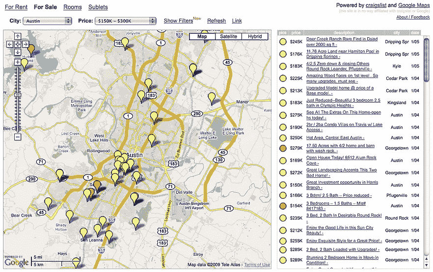****

****HousingMaps.com****

****结果是[housingmaps.com](http://housingmaps.com/)(现在是一个活着的遗迹)，它允许你在地图上查看房屋列表，过滤结果，并点击打开 Craigslist 中的列表。这种功能是我们今天认为理所当然的，但这是这种类型的第一张地图。****

****Rademacher 有效地破解了谷歌地图，在免费提供的谷歌地图基础上开发了自己的产品。虽然谷歌本可以采取关闭网站和限制访问这些 API 的路线，但他们看到了一个机会。****

****他们最终雇佣了 Rademacher，根据他的 LinkedIn，他现在在苹果工作，并创建了**谷歌地图 API** 。这使得任何开发者都可以将谷歌地图作为一项服务来使用，并将地图产品商业化。****

****这项服务已经有了很大的发展，包括许多其他工具和产品，并取得了财务上的成功。在优步 IPO 的披露表格中，[该公司在 2016 年 1 月至 2018 年 12 月期间向谷歌支付了 5800 万美元](https://www.androidauthority.com/uber-google-maps-deal-975566/)。****

****在 2000 年代后期，在线地理数据的整体可视化仍然非常不成熟。首先，数据仍然很难访问，除非你知道在哪里可以找到和如何使用 GIS 数据。****

****许多 web 地图可视化都是在 Flash 中构建的，完全由制图员/开发人员定制和管理。D3.js 开放了许多在线显示地图数据的选项，但对于新手用户来说，这个库仍然很难掌握。****

****虽然谷歌为用户在地图上放置数据开辟了许多不同的途径，但地图上的数据仍然完全掌握在谷歌手中。****

****地图空间开始像 2010 年代初那样增长的原因并不单一。这在一定程度上与用户希望创建自己定制风格的底图有关，谷歌在这方面的灵活性有限。****

****其中一些与数据访问有关。谷歌地图允许你进行编辑，但你自己以后不能访问这些数据。有些是出于需要。在人道主义危机或地图绘制不足的地区使用地图是国际援助界日益增长的需求，或者在地图上显示比谷歌允许的更多的数据，如森林砍伐数据。****

****不管是什么原因，有越来越多的公司和项目在这个时候开始或受到欢迎。始于 2004 年的 OpenStreetMap 随着更多的贡献者和更多的数据被添加到地图中而慢慢获得了关注。****

****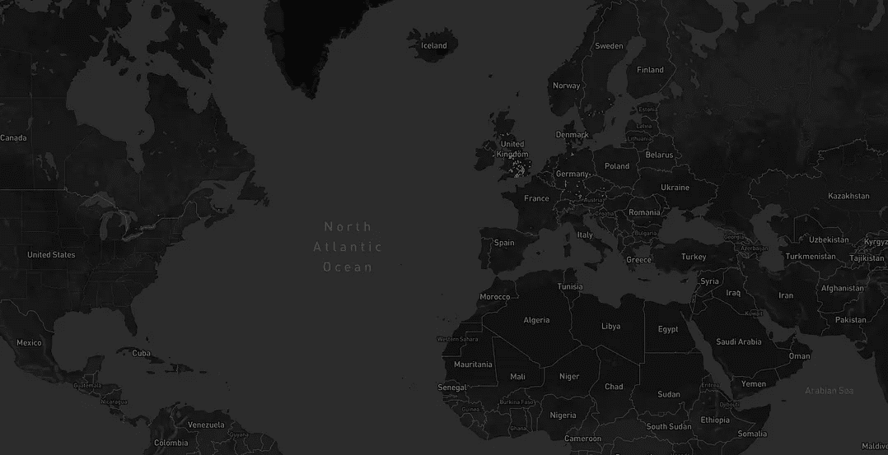********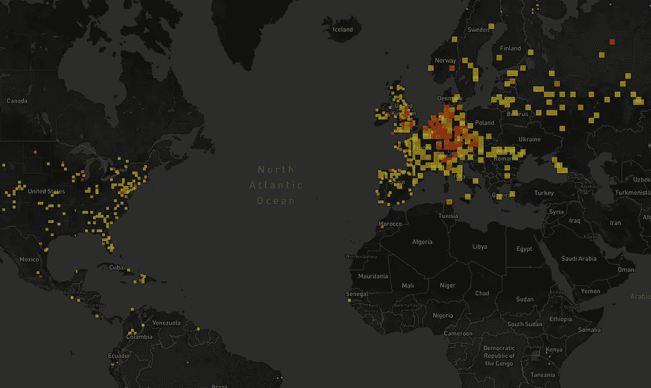****

****与 2010 年相比，2006 年 OpenStreetMap 的贡献****

****OpenStreetMap (OSM)或多或少起到了地图维基百科的作用，允许任何注册用户在地图上添加或编辑特征:道路、水路、兴趣点等。世界各地的社区正在慢慢地向地图添加更多的数据(你可以在这里[看到一段时间的贡献](http://mapbox.github.io/osm-analysis-collab/)，在 [OSM 维基](https://wiki.openstreetmap.org/wiki/History_of_OpenStreetMap)上看到更详细的事件时间表)。****

****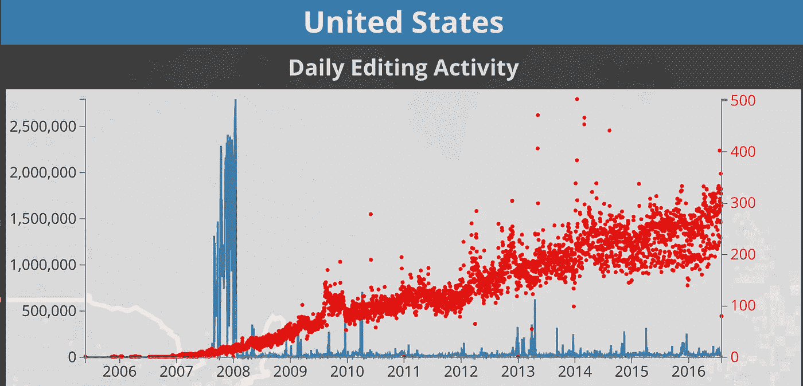****

****OSM 在美国的贡献****

****随着地图上的数据成为一个可行的来源，其他公司开始起步，其中许多是开源社区。 [**Mapbox**](https://en.wikipedia.org/wiki/Mapbox) 成立于 2010 年，目的是在 Development Seed 的资助下，使用 OpenStreetMap 数据为非营利组织提供定制地图服务。CartoDB (现在的 CARTO)成立于 2011 年，是一个可视化大量森林砍伐数据的项目。以及同年发布的 [**Leaflet.js**](https://en.wikipedia.org/wiki/Leaflet_(software)) ，允许用户用 Javascript 开发任何底图和数据的 web 地图。****

****对地图感兴趣的用户群体正在世界各地扩大。[**Maptime**](http://maptime.io/about/)meetups、 [**免费开源地理空间软件(FOSS4G)**](https://wiki.osgeo.org/wiki/FOSS4G) 和 [**地图状态**](https://wiki.openstreetmap.org/wiki/State_Of_The_Map) 会议，许多不同的 MeetUps 正在成长和扩大。****

****所有这些趋势的共同点是，他们都在探索网络地图技术，使用与谷歌地图相同的技术基础，但使用开放的工具和技术。****

****发生了两件大事，改变了数据在线可视化的方式:2010 年海地地震和谷歌地图 API 的变化。****

****2010 年海地发生地震时，该国没有可行的受灾地区在线地图。谷歌地图几乎没有任何数据，地面救援工作没有任何地图导航太子港提供援助。****

****所发生的事情会戏剧性地改变 OSM 的道路。地震后几天，来自世界各地的用户开始在地图上添加数据，几天后，OSM 成为该国救援工作使用的地图。[这篇来自世界银行的博客](https://blogs.worldbank.org/latinamerica/4-years-looking-back-openstreetmap-response-haiti-earthquake)详细回顾了人们的反应:****

> ****来自大约 29 个国家的 450 多名 OpenStreetMap 志愿者使用这些图像对道路、建筑物和其他特征进行数字化处理，在短短几周内创建了现有的最详细的海地地图。OpenStreetMap 很快成为许多参与响应和重建的组织的实际底图。****

****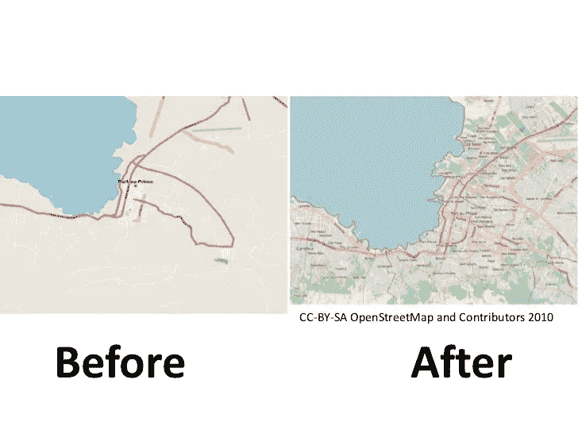****

****2010 年地震前后的 OSM 太子港****

****[**人道主义开放街道地图团队(HOT)**](https://www.hotosm.org/) 至今仍然活跃，社区成员向有需要的地区提供地图数据。这次活动显示了这个社区的力量有多大，OpenStreetMap 中的数据可以创建一个可行的地图，其数据可以与谷歌和其他提供商相媲美。****

****OSM 是建立在开放数据的基础上的，这意味着你可以下载和使用该项目的数据，并根据他们的服务条款使用它。新的地图提供商现在有了一种可行的方法来创建带有不断增长的全球数据库的底图。****

****第二个事件是谷歌地图 API 的[重大价格变化](https://www.theverge.com/2011/10/30/2525110/google-maps-api-usage-limits)。对于那些对创建简单的 mashups 来将地图集成到他们的产品中感兴趣的用户来说，Google 是他们的首选平台。对于许多组织来说，免费或低成本的工具现在非常昂贵，成本高得令人望而却步。****

****谷歌最终[改变了他们的限制](https://techcrunch.com/2012/06/22/google-maps-api-gets-massive-price-cut-in-the-wake-of-developer-defections/)，但在此之前，许多人已经离开了这项服务，最突出的是 [Foursquare](https://www.theverge.com/2012/3/1/2835722/foursquare-open-street-map-web-version-drops-google-maps-api) 转而使用 Mapbox 提供服务。****

****诞生于开源社区的地图公司现在有了一条可行的路线来进行商业竞争，并为那些想要在线创建地图的人提供新的工具。****

****这些新工具和数据帮助地图成为我们日常生活的一部分。地图成为 Yelp 和 Foursquare 等热门应用的入口。新闻媒体将更多地图添加到他们的故事中，应用程序开发人员可以围绕地图创建完整的体验。****

****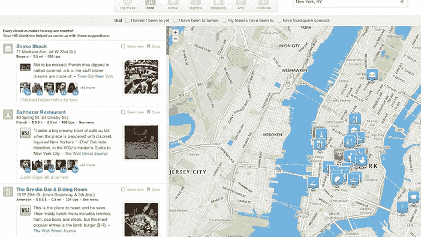********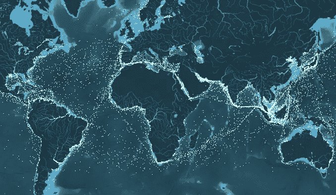********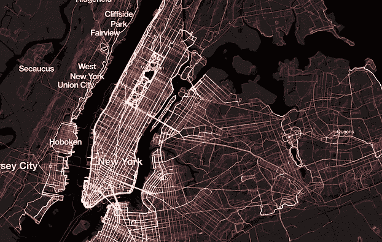********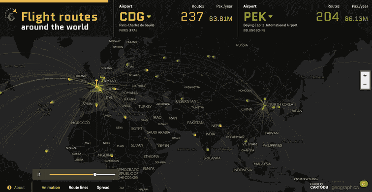********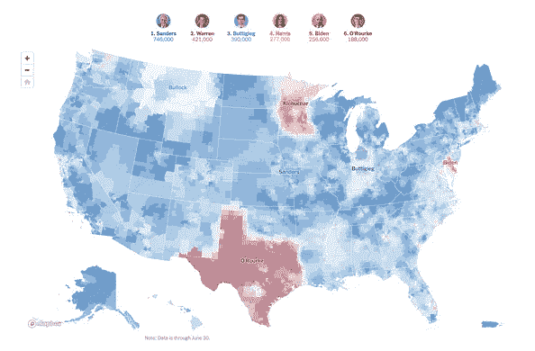********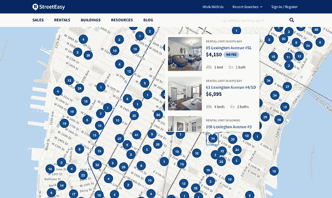****

****各种 web 地图和应用程序****

****随着 OpenStreetMap 提供更多位置数据，开发人员能够创建自己的位置数据服务，如路线指引或地理编码(从地址获取地理位置)，以直接与谷歌产品竞争。用于可视化地理数据的网络地图空间发展如此之快，以至于谷歌最终[在 2016 年关闭了其用于可视化数据的谷歌地图引擎](https://www.zdnet.com/article/google-maps-engine-quietly-coming-to-a-halt-as-sign-up-window-shutters/)产品。****

****在此期间发生的一项重大创新是矢量瓷砖。该技术的工作方式与前面讨论的地图切片相同，请求发送到服务器，切片返回给用户。然而，返回的不是图像块，[数据本身存储在块](https://docs.mapbox.com/vector-tiles/reference/)中，浏览器在数据上添加样式。****

****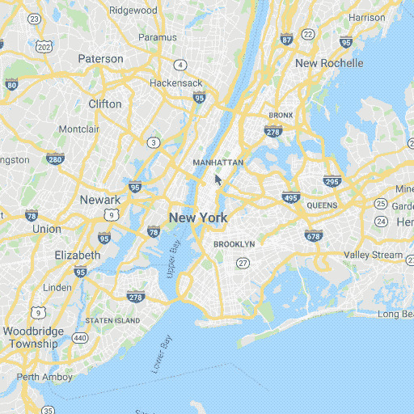****

****矢量缩放****

****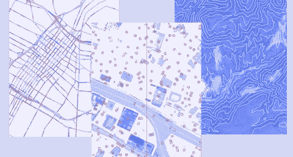****

****不带样式的矢量单幅图块(来自地图框)****

****这意味着不仅地图控制更加流畅，而且地图可以根据其他数据改变样式，比如用户偏好。谷歌地图这样做是为了让广告出现在他们的地图上，并根据你的谷歌活动强调你可能喜欢的兴趣点。这意味着谷歌地图的每个用户在地图上可能会有不同的体验。****

****随着我们继续与周围的世界互动，我们也产生了大量关于我们的运动、偏好和位置的数据。为了可视化这些数据，出现了一套新的技术，也是来自开源社区，将这些数据放到地图上。****

# ****更多数据、人类流动性和未来****

****近年来，随着地图数据从地图切片进入浏览器，web 制图突然向一批新的开发人员开放。 [WebGL](https://en.wikipedia.org/wiki/WebGL) 于 2011 年发布，旨在更高效地在浏览器中渲染图形。****

****从 3D 渲染到视频游戏，它被广泛应用于各种技术中。随着数据以更快的速度在浏览器中可用，这项技术最终非常适合在地图上可视化地理空间数据。****

****这些创新源于需求——产生了越来越多需要可视化的数据。优步是一家在这方面苦苦挣扎的公司，它拥有包含数百万乘车记录的数据，这些记录可用于确定从高峰定价到寻找更有效的城市出行方式的一切事情。****

************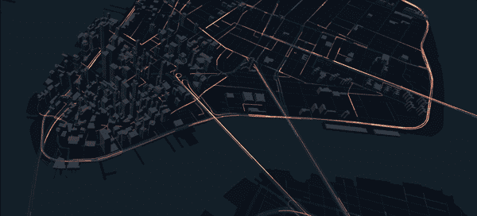****

****虽然许多其他公司已经开发了具有类似技术基础的工具，但优步接受了创建工具的挑战，这些工具使大量数据的可视化既高效又具有视觉吸引力。利用将矢量数据传入浏览器的先进技术，优步数据可视化团队开发了 [**Deck.gl**](https://deck.gl/#/) 。****

****由于 WebGL 使用 Javascript 并且被所有主流浏览器支持，它成为了前端开发者的热门。几年前，Mapbox 发布了 [Mapbox GL](https://blog.mapbox.com/announcing-mapbox-gl-for-the-web-16a41e07df43) ，它将相同的技术引入了基础地图，但 Deck.gl 允许任何开发者在地图上显示大量数据，并执行聚合和 3D 可视化。****

****来自 [Nicolas Belmonte](http://philogb.github.io/) 的 Deck.gl 演示****

****优步不久后也发布了[**Kepler . GL**](https://kepler.gl/)**，允许非开发者上传数据，并通过用户界面创建自己的可视化。我们很可能会看到更多的 GL 可视化，这些第一批项目提供了一个令人兴奋的视图，我们可以开始期待在线地图。******

******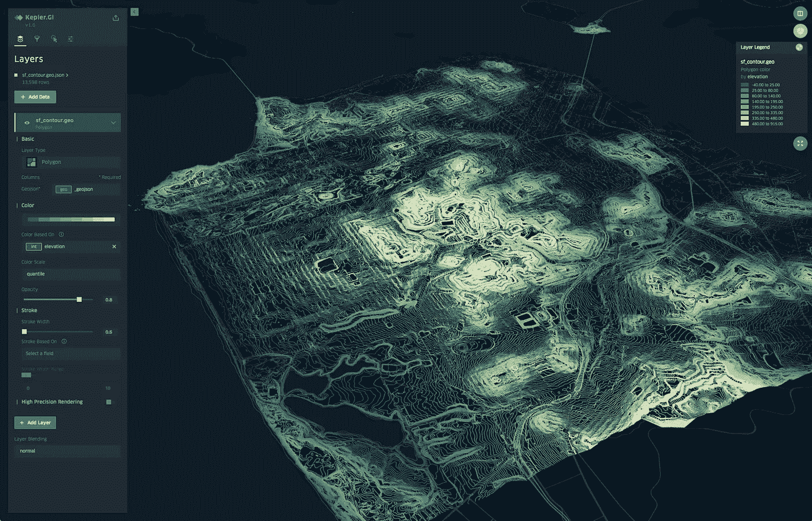******

******开普勒******

******海量数据的可视化当然离不开海量数据。我们所有使用移动设备的人都以这样或那样的方式通过手机上的应用程序贡献了这些数据。******

******从嵌入在移动应用、地图或其他应用中的 SDK 中获得的位置数据已经爆炸式地成为一个主要行业，随着时间的推移，它使用你的位置 ping 来做从城市规划到广告定位的一切事情，最近还跟踪了[社交距离的有效性](https://www.unacast.com/covid19/social-distancing-scoreboard)。******

******虽然这些数据可以为城市交通规划等广泛的分析提供有价值的见解，但该行业实际上不受监管，这意味着数据的收集和分发方式因公司而异。这些数据对营销人员来说非常有价值，追踪你在哪里生活和购物可以告诉他们很多关于你的行为，并允许非常有针对性的广告。******

************

*******一个国家的登陆页面，跟踪*******

******《纽约时报》发表了一个围绕位置数据行业的强大系列，名为， [***【一个国家】，跟踪了***](https://www.nytimes.com/interactive/2019/12/19/opinion/location-tracking-cell-phone.html) 潜入数据的[，它如何保护和不保护你的个人信息，以及你如何跟踪个人，包括总统。](https://www.nytimes.com/interactive/2019/12/20/opinion/location-tracking-smartphone-marketing.html)******

****Foursquares 首席执行官[呼吁政府监管行业](https://www.nytimes.com/2019/10/16/opinion/foursquare-privacy-internet.html)，尽管他们的业务已经从消费者应用转向移动数据提供商本身，但立法可能会在某个时候更好地保护消费者。****

****虽然位置数据行业与我们互动的网络地图没有直接关系，但你手机上的蓝点是一个不那么微妙的提醒，表明你的设备知道你在哪里，并在某种程度上可能让消费者知道他们为什么会看到一个小时前刚刚逛过的商店的广告。****

****自从最初的地图首次出现在网上以来，网络地图已经发生了几次变化和转变。当前围绕通过像 Deck.gl 这样的库在浏览器中可视化数据的开发将继续前进，特别是随着支持技术的进步。****

****作为一个开源项目，尚不清楚它将如何以及是否会商业化，但很可能许多公司将开始赶上一些已经发生的进步。****

****随着监管或其他控制措施将被置于行业之上，位置跟踪领域可能会看起来非常不同，最有可能的是首先从州级开始，因为加利福尼亚州已经围绕这些数据探索了立法。然而，在短期内，移动性数据提供了关于行为如何影响感染率和住院率的重要见解。****

****在新的地理区域，数据的需求只会增加，包括质量和更广泛的可用性。Mapbox，这家开始使用 OpenStreetMap 数据来帮助非营利组织的公司，已经将[汽车用例](https://www.mapbox.com/automotive/)作为一个主要焦点，包括使用相同 OSM 数据的增强现实导航。****

****随着机器学习的增加，对机器学习模型中使用的大量空间数据的需求也将增加。全球人口普查和兴趣点等数据仍由商业提供商控制。一些公司，如 CARTO，已经开始为来自公共和私人提供商的位置数据创建一个中心资源。****

****道路和物理特征已经被世界各地的合作者开放，不同类型的数据如何进入开放环境还有待观察。随着需求的扩大，这很可能会成为一些合作项目的一部分。****

****这些年来，Web 地图发生了巨大的变化，然而发展的步伐似乎并没有放慢。它是由我们对世界的答案和信息的渴望和需要所驱动的。最终，接下来会发生什么，就像第一张地图被人类创造出来时一样，将由我们想知道的关于我们世界的事情来驱动，并由我们所有人来决定。****