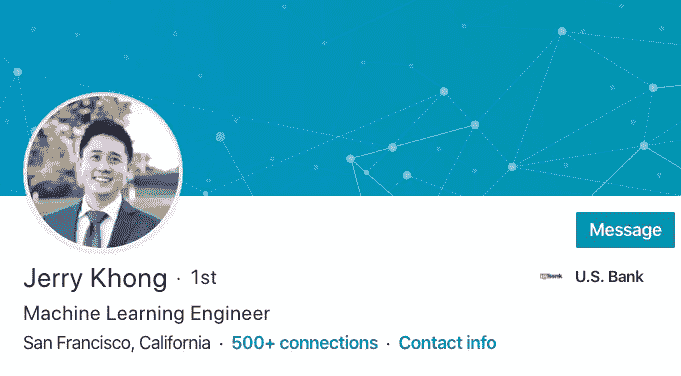

# 一名 ML 工程师如何在找到工作之前与 50 多家公司进行沟通

> 原文：<https://towardsdatascience.com/how-a-ml-engineer-talked-to-over-50-companies-before-landing-a-job-100302f1f891?source=collection_archive---------38----------------------->

*原载于* [*采访查询博客*](https://www.interviewquery.com/blog)

*找一份数据科学的工作有多难？我喜欢与当前的数据科学家和机器学习工程师交谈，他们来自非传统背景，已经成功地在数据科学就业市场上导航。今天我写了一篇对 Jerry 的采访，Jerry 是一名前数据科学训练营和硕士毕业生，在获得目前的机器学习工程师工作之前，他经历了大量的面试。*

# 你好！你是什么背景，怎么进入数据科学的？

大家好，我是美国银行的机器学习工程师 Jerry。我最初是作为一名数据分析师工作了几年，然后在纽黑文大学获得了数据科学的硕士学位，并与 genville 合作。我知道我想更多地进入机器学习领域，但在这个项目结束后很难获得面试机会。最终，在接受美国银行的邀请之前，我在丹佛野马队的分析团队实习。

我现在的角色更多的是软件工程，但是包括大量的数据知识。大量构建机器学习系统和基础设施意味着知道如何将工程效率应用于生产中的服务模型。

# 你的整体面试体验如何？你最终接受了多少次数据科学采访？

最后从 2019 年 4 月到 8 月面试了五个月。有些星期我只有一次面试，有些星期大约有 7-8 次面试。这是一个相当累人的过程，我想我最终跟 50 多家公司谈过。

我最终接受了这么多的采访，因为我觉得数据科学是一门很难学习的学科，而且我不知道应该关注什么。一些公司问了关于软件工程类结构和面向对象编程的问题，而其他公司则更关注统计。但我觉得我一般能通过 95%的招聘和招聘经理筛选，但只有 30%的技术筛选和带回家的挑战。

主要问题是，每次数据科学面试都非常不同。我参加了一个分析经理职位的面试，在去现场之前，我面试了六个人！我不得不与产品副总裁、招聘经理、总经理、工程师、数据科学家等交谈

> *“鉴于 SQL 中有许多不同的方法，即使你用一种方法来做，面试官有时也会要求你用一种更有效的方式来写。”*

# 什么帮助你为面试做准备？

带回家的挑战和技术筛选最初真的很难。*数据科学家*是一个非常宽泛的术语，可以涵盖纯分析、机器学习、应用深度学习或更面向业务。我觉得因为每个职位都不一样，所以**一开始就很难理解该期待什么。[面试提问](http://interviewquery.com/)题库无疑帮助我看到了不同公司每个问题的共性，明确了如何有效地利用我的时间学习。**

面试中的 SQL 问题也是我有一段时间的弱项。我总是在 Pandas 中做一些东西，并使用 SQL 来提取数据以在 Pandas 中操作。因此[访谈查询](http://interviewquery.com/)解决方案对于理解如何思考和构建 SQL 问题非常有帮助。考虑到在 SQL 中有很多不同的方式来做事情，即使你用一种方式，面试官有时也会要求用更有效的方式来写。

但是最终面试是一件苦差事，练习是获得成功并为每次面试做好准备的最好方法。随着我做更多的采访和练习更多的问题，我变得更好了。

# 你想传授的最后一课是什么？

面试真是一件苦差事。尤其是如果你是新来的，没有很多经验。一旦你有了经验，那就不一样了，因为尽管我觉得我的技能相当相似，但因为我有一年额外的实习经验，我会更容易进入下一轮。

能够真正深入地谈论我参与的项目也确实有助于巩固我过去的经验。招聘经理想知道你能影响企业，让它变得更好。但是作为一个进入数据科学的新人，你没有太多的方式来展示这一技能组合，这就是为什么技术面试如此严格。许多公司更害怕假阳性而不是假阴性。