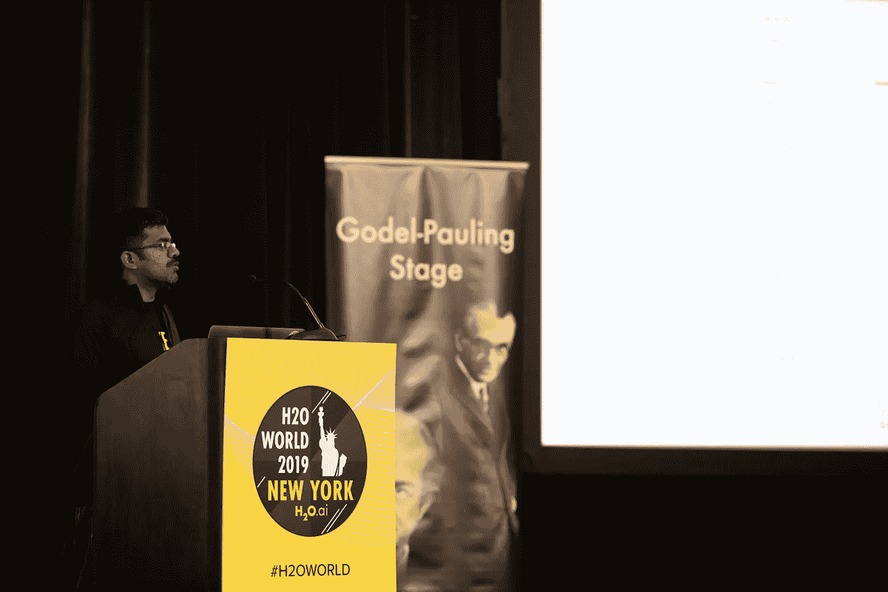
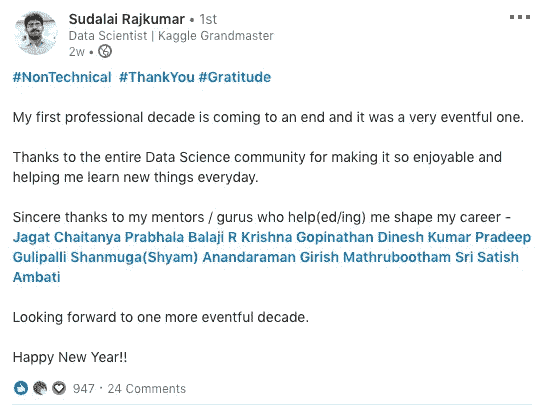
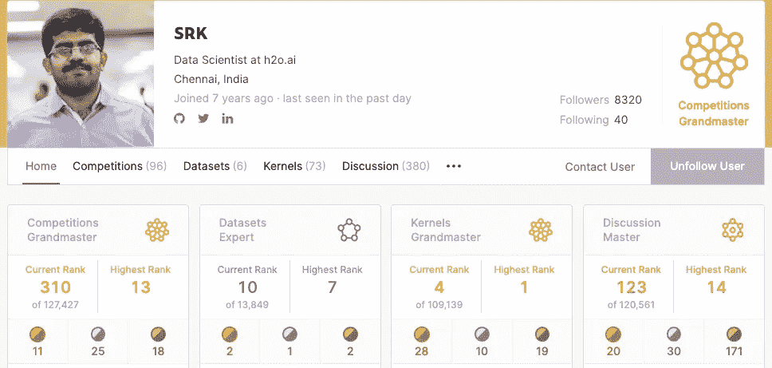
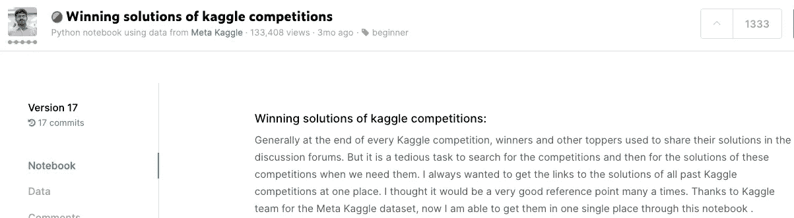
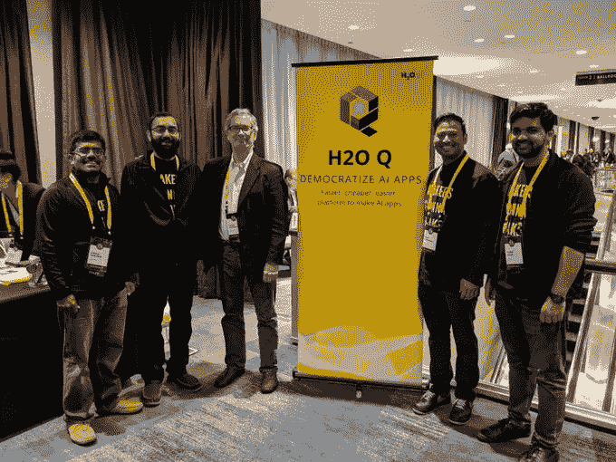
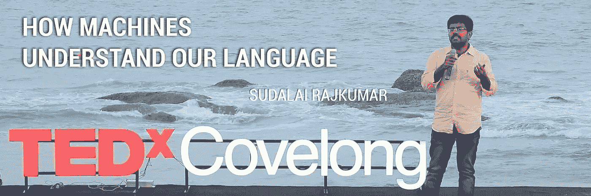
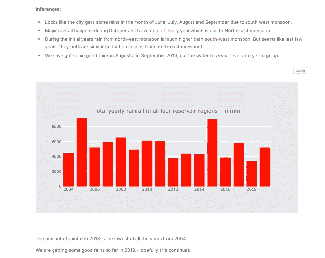

# 对数字的热情是如何将这位机械工程师变成了一位围棋大师的

> 原文：<https://towardsdatascience.com/how-a-passion-for-numbers-turned-this-mechanical-engineer-into-a-kaggle-grandmaster-8b1ae218afc?source=collection_archive---------4----------------------->

## 与 Sudalai Rajkumar 的对话:Kaggle 双特级大师，H2O 大学的数据科学家。

有人说得对，一个人永远不应该寻求表扬，相反，让努力来证明自己。成功人士的基本特征之一是从不吹嘘他们的成功，而是不断学习。在数据科学领域，当我们谈到谦逊时，一个引起共鸣的名字是 Sudalai Rajkumar，他以谦逊的天性和分析能力而闻名。作为同事和他一起工作，每天学习新的东西，这确实是一种特权和绝对的荣誉。

在本期采访中，我将展示成功数据科学家的旅程，我将与 **Sudalai Rajkumar，又名 SRK、** a **Kaggle 竞赛和内核的大师、**和数据科学家在 **H2O.a** i. Sudalai 完成了他在 PSG 技术学院的工程，然后继续在**印度管理学院-班加罗尔获得了商业分析和情报的执行学位。**

RK 在机器学习和数据科学方面拥有十年的经验。他在印度和国外都有大量的追随者，对全世界有抱负的数据科学家来说，他是一个巨大的鼓舞。除了在 Kaggle 的几个比赛中获得高排名之外，SRK 也因其深入的内核而闻名。事实上，他已经是 Kaggle 内核部分的前第一号人物。

SRK 在 Linkedin 上用一封漂亮的感谢信宣布了他在数据科学行业十年的结束。因此，有什么比这更好的时机来与他本人谈论他进入数据科学的旅程以及他对该领域新进入者的建议。

*以下是我与苏达莱对话的摘录:*

*   ***你有机械工程背景。向软件工程的过渡是如何发生的？***

***SRK*** :当我完成学位后，我收到了两份工作邀请——一份是在一家知名的机械工程公司，另一份是在一家创业分析公司。机械工程的工作对我来说是梦寐以求的，就像其他机械工程毕业生一样。然而，入职日期离毕业还有四个月，所以我决定接受另一份工作。

最初，我的想法是加入分析公司，以更多地了解公司和工作性质，因为他们的面试过程非常有趣。在这个过程中，我完全被在数据中寻找模式所吸引，尽管我对软件工程完全是个新手。我对数字的热情让我继续做那份工作，今天回头看，我非常高兴我做了那个决定。

*   ***你和 Kaggle 的幽会是如何开始的，是什么让你在你的一代宗师的旅程中一直保持动力？***

***SRK*** :我来自机械工程专业，没有受过软件工程或数据科学方面的正规教育。因此，我开始学习 MOOCs 来了解这些概念。我遇到了像随机森林，SVM 等算法。但是没有看到任何人在工作中使用它们。这促使我寻找途径来试验这些新算法，以便更好地理解它们。就这样我偶然发现了 Kaggle，开始了我的 Kaggle 之旅。

[SRK 的卡格尔简介](https://www.kaggle.com/sudalairajkumar)

我想说，一旦我们开始做 Kaggle，它也是一种瘾，我也不例外。建立更好的模型和获得更好的排名的瘾有时会控制你。在多项比赛中有几次失败，但痴迷和激情让我坚持了下来。当然，这花费了很多下班后的私人时间，但是在这个过程中有大量的学习。

*   ***你如何决定参加哪些比赛？***

***SRK*** :在最初的日子里，我几乎参加了所有的比赛。我们可以从他们每个人身上学到新的东西。

我曾经一次至少做两个，因为当我在其中一个遇到障碍时，我会去另一个，几天后带着全新的心态回到第一个。这经常帮助我。

目前，我主要参加 NLP 比赛，我在其他比赛中并不活跃。

*   你通常如何处理一个难题？任何喜欢的 ML 资源(MOOCS，博客等。)有什么想分享的吗？

***SRK*** :在临近比赛的时候，我会记住一些重要的方面:

*   我做的第一件事是为问题建立一个适当的交叉验证框架。
*   下一件事是构建一个简单的建模管道，以确保端到端的代码运行良好。
*   我阅读论坛，探索内核部分，以了解更多关于这个问题和其他人的观点。
*   我确保在探索性分析、阅读相关论文或文章以及特性工程上花费大量时间。
*   最后的步骤是关于建模和组装。

这是一场关于数据科学竞赛的[优秀 ***课程***](https://www.coursera.org/learn/competitive-data-science) 。除此之外，阅读过去的解决方案并尝试在正在进行的解决方案中实施一些想法也是很好的。我创建了 [***一个方便的内核***](https://www.kaggle.com/sudalairajkumar/winning-solutions-of-kaggle-competitions) 来帮助解决这个问题。

**SRK 内核关于卡格尔竞赛的获奖方案**

*   ***作为 H2O.ai 的数据科学家，你的角色是什么，在哪些具体领域工作？***

2019 年纽约 H2O 世界期间，SRK 和 H2O.ai 的同事们在一起。

***SRK*** :作为 [H2O.ai](https://www.h2o.ai/) 的数据科学家，我参与了[无人驾驶 AI](https://www.h2o.ai/products/h2o-driverless-ai/) 的开发，这是一个自动化的机器学习平台，具体是在**自然语言处理**领域。我的职责是探索 NLP 领域的最新发展，并将它们集成到产品中。NLP 在过去的两年里经历了巨大的变化，所以我的工作很有趣，因为它涉及到赶上他们。

*   如果你要和 H2O.ai 的大师们组队，他们会是谁，为什么？

SRK:我们已经作为一个团队在 H2O 建立自动化机器学习平台😃

在 Kaggle 比赛中，当然是所有的比赛！到目前为止，我已经在 Kaggle 与 **Rohan** 、 **Marios** 、 **Mark** 和 **Mathias** 合作过，但没有与其他人合作过，所以我很乐意有机会在 H2O.ai 与其他 GM 合作，以学习更多新东西。

*   你在 H2O.ai 的专业工作中运用到的通过 Kaggle 学到的最好的东西有哪些？

***SRK*** :结构化和逻辑思维是我从 Kaggle 身上学到的一些重要的东西。在数据科学领域，试图解决问题时很容易迷失方向。解决 Kaggle 问题帮助我发展了一个结构化的逻辑思维过程，并应用到我的工作中。

大多数时候，当一些新的技术或模型出现在 ML 领域时，它们首先在 Kaggle 比赛中进行实验，然后才成为主流。像 **XGBoost** 这样的模型，今天在社区中使用得更多，最初在 Kaggle 中广泛使用。因此，我们可以及早发现这些趋势，并保持自我更新。

模型泛化和特征工程技术是从 Kaggle 学到的两个更重要的知识，它们在专业工作中帮助了我。

*   ***数据科学领域正在迅速发展。你是如何设法跟上所有最新发展的？***

SRK:博客和社交媒体是我了解最新发展的两种方式。我定期关注的一些博客有[*Analytics vid hya*](https://www.analyticsvidhya.com/)*[*走向数据科学*](https://towardsdatascience.com/)*[*KD nuggets*](https://www.kdnuggets.com/)。这些博客帮助我详细理解这些概念。**

****

**SRK 在他的 TED 演讲中解释了自然语言处理的关键方面。**

**为了立即跟上最新的趋势，我在 Twitter 上关注了许多数据科学家和 ML 研究人员。ML 社区在 twitter 上非常活跃。每当有新的东西出现，无论是一篇论文还是一个项目，Twitter 上通常都会有很多关于它的活动。**

*   **你想在 ML 中应用你的专业知识吗？**

*****SRK*** :我希望把机器学习应用到有助于社会进步的问题上。例如，我最近收集了发生干旱时钦奈市 (我居住的城市)的 [***水数据，以了解不同水库的水位。一个简单的预测模型将有助于提前预测病情并制定相应的计划。这些项目将会给人们带来巨大的好处，并有助于改善社会。***](https://www.kaggle.com/sudalairajkumar/chennai-water-management)**

****

**[**探险解渴**](https://www.kaggle.com/sudalairajkumar/exploration-to-quench-chennai-s-thirst)**SRK****

**我感兴趣的另一个领域是将自然语言处理技术应用于印度的方言。英文版的 NLP 资源很多，白话版的资源不多。**

*   *****对刚刚开始或希望开始数据科学之旅的数据科学有志者有什么建议吗？*****

*****SRK*** :首先，数据科学爱好者必须明白这个领域是他们真正感兴趣的，还是仅仅因为对它的大肆宣传而想与之相关联。这是一个快速发展的领域，需要不断的学习，所以只有热情才能帮助长期持续下去。**

**一旦人们从课程或书籍中理解了机器学习的基本概念，关键的一步就是获得实践知识。有多种方式可以做到这一点，包括参加数据科学黑客马拉松，为开源项目做贡献，写博客，实习等。你可以选择上述一项或几项技能来磨练和展示自己的才能。**

**SRK 的旅程鼓舞了我们所有人。然而，从这个讨论中得出的一个重要结论是，认识到你的兴趣是否真正在于数据科学是至关重要的。这个领域是由激情驱动的，需要大量的自我激励和学习。不要仅仅因为周围的大肆宣传而选择这个领域，因为这可能很容易失败。想一想为什么你首先会想成为一名数据科学家，以及你将如何把这些技能应用到长期工作中。**

*   **[Bojan Tunguz:从学术界到 Kaggle:物理学家如何在数据科学中找到爱情](/from-academia-to-kaggle-how-a-physicist-found-love-in-data-science-d57bdc500d04)**
*   **[Rohan Rao:数据科学家从数独到 Kaggle 的旅程](/a-data-scientists-journey-from-sudoku-to-kaggle-120876b7fa33)**
*   **[Shivam Bansal:数据科学家，负责 Kaggle 上的“数据科学为善”竞赛](/the-data-scientist-who-rules-the-data-science-for-good-competitions-on-kaggle-ab436595a29f)**
*   **[Yauhen Babakhin:认识一下 Yauhen:第一位也是唯一一位来自白俄罗斯的围棋大师。](/meet-yauhen-the-first-and-the-only-kaggle-grandmaster-from-belarus-ee6ae3c86c65)**

***本文原载于* [*H2O.ai 的博客网站*](https://www.h2o.ai/blog/how-the-passion-for-numbers-turned-this-mechanical-engineer-into-a-kaggle-grandmaster/) *。***