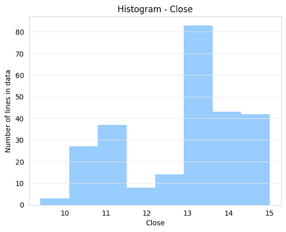
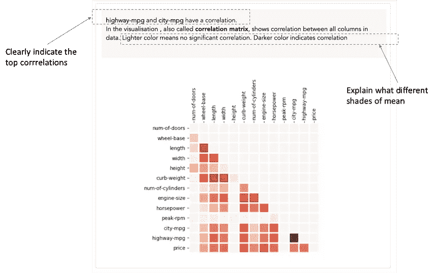
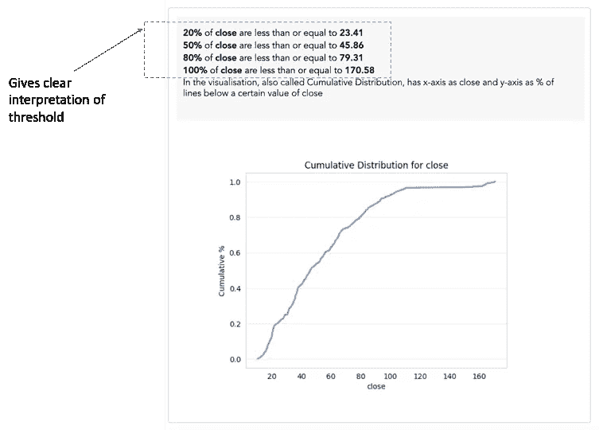
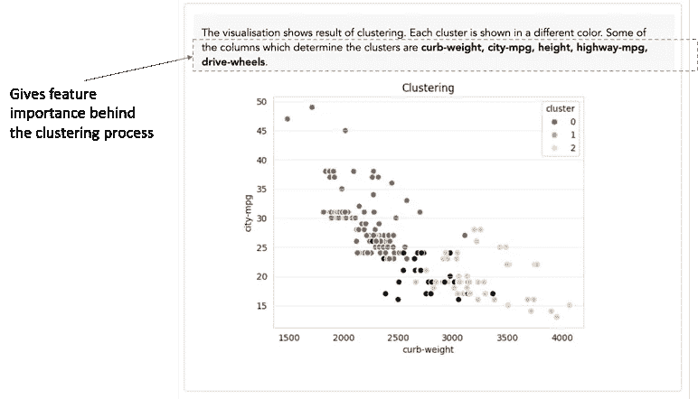

# 一个简单的文本解释如何为您的数据科学结果增加价值

> 原文：<https://towardsdatascience.com/how-a-simple-textual-explanation-can-add-value-to-your-data-science-results-39edd80c82bb?source=collection_archive---------49----------------------->

## 使用文本解释增强您的数据探索能力

流行的说法“一张图胜过千言万语”在数据科学中可能是错误的。以优步预计到达时间(ETA)算法为例，该算法通知用户游乐设备预计何时到达。

在 ETA 的背后，有许多复杂的预测算法和尖端的可视化技术，地图会实时更新。但是，如果没有一行文字说明“最近的司机大约在 1 分钟之外”，所有这些都没有用。

优步估计到达时间(ETA)算法在运行

数据科学家或数据分析师在数据探索阶段产生大量数据可视化。所有酷的可视化看起来都很棒，但是你可以使用简短的文本解释来增强它的价值。同样，在许多情况下，光是观想是不够的。

> 只有没有解释的观想才是误解的来源

举一个直方图的简单例子。下面显示的是股价收盘值的直方图。

仅仅通过观察这种观想，你就可以做出许多解释，比如:

解释 1 —最大出现值介于 13 和(某个值)之间。

解释 2——最低值似乎在 5 到 10 之间

股票交易是一个在价值上必须非常精确的领域。因此，如果解释不精确，光是观想是没有帮助的。

> 讲述数据故事是一种强迫行为，因为光靠想象是不行的

多年的数据以来，讲故事已经成为一个数据科学家的必备技能。但实际上来说，这是一种强迫，因为光靠观想无法传达故事。

一个非常简单的观想背后可能有一个伟大的故事。但除非有人告诉它，否则它永远不会浮出水面。以上面显示的直方图为例。

柱状图背后的真实情况是，股价在 11 和 15 之间波动，并在 12 停留很短的时间。所以 12 日的买入机会非常短暂。这种故事是不可能在视觉中捕捉到的，需要用身体来讲述。即使使用了动画等高级视觉效果，仍然需要有人亲自讲述故事。

这就是文本解释的力量发挥作用的地方。添加一个简短的文本解释增强了可视化的价值。你从展现观想到传达一些有意义的东西。

现在让我们来看一些例子，解释增强了对观想的解释:

**解释相关矩阵，避免“颜色迷宫”的压力**

相关矩阵看起来非常惊人。然而，由于存在许多不同的颜色深浅，人们不得不努力去解读它。然而，仅仅通过添加几行文本解释就极大地增加了对相关矩阵的解释。文本可以解释哪些是最相关的数据，以及不同的颜色阴影意味着什么。

下图是基于汽车数据的相关矩阵。正如您所看到的，仅仅通过添加一个小的解释，就明显增强了好看的相关矩阵的价值。这将使你的用户不必“睁大眼睛”去查看哪些是最相关的数据。

相关矩阵的文本说明示例

**解释累积分布以避免 x 轴和 y 轴“眼花缭乱”**

累积分布对于显示数值的分布非常重要。这也是一种关注数字列的重要阈值水平的创造性方法。

然而，仅仅显示累积分布而没有任何解释是一项令人痛苦的令人眼花缭乱的工作。有了简短的解释，关于不同阈值水平的文本立即获得累积分布到下一个水平的能力，并开始有意义。

下图是股票价格的累积分布。通过对阈值的文本解释(例如 80%的收盘价低于 79.31)明显提高了累积分布可视化的价值。

累积分布的文本说明示例

**解释聚类的结果以避免任何猜测**

对于任何数据探索活动来说，聚类都是一个非常强大的工具。然而，如果解释不清楚，这可能是最被误解的观想之一。聚类的结果通常是散点图，聚类以不同的颜色显示。然而，这里的问题是，2D 散点图只直观地显示了 2 列数据，而聚类本身是由更多的列产生的。

所以为了正确解释聚类结果，需要使用包含聚类结果特征重要性的文本解释

聚类的文本解释示例

**在您的开发中包含文本生成功能**

作为数据科学家，我们专注于从数据准备、特征工程、超参数调整、建模、可视化等所有活动的编码。但是我们大多数人并不关注自动生成结果的文本解释。因此，养成在代码中包含生成文本解释的函数的习惯是一个好主意。

随着越来越多的算法被打包成面向最终用户的产品，结果的文本解释变得非常明显。并将使您的数据科学工作对更广泛的受众更具吸引力。

# 额外资源

# 网站(全球资讯网的主机站)

你可以访问我的网站进行零编码分析。[https://experiencedatascience.com](https://experiencedatascience.com)

请**订阅**每当我发布一个新的故事时，请及时通知我。

 [## 每当 Pranay Dave 发表文章时，您都会收到电子邮件。

### 每当 Pranay Dave 发表文章时，您都会收到电子邮件。通过注册，您将创建一个中型帐户，如果您还没有…

pranay-dave9.medium.com](https://pranay-dave9.medium.com/subscribe) 

你也可以通过我的推荐链接加入 Medium。

 [## 通过我的推荐链接加入 Medium—Pranay Dave

### 作为一个媒体会员，你的会员费的一部分会给你阅读的作家，你可以完全接触到每一个故事…

pranay-dave9.medium.com](https://pranay-dave9.medium.com/membership) 

https://www.youtube.com/c/DataScienceDemonstrated 的 YouTube 频道
这里是我的 Youtube 频道
[的链接](https://www.youtube.com/c/DataScienceDemonstrated)