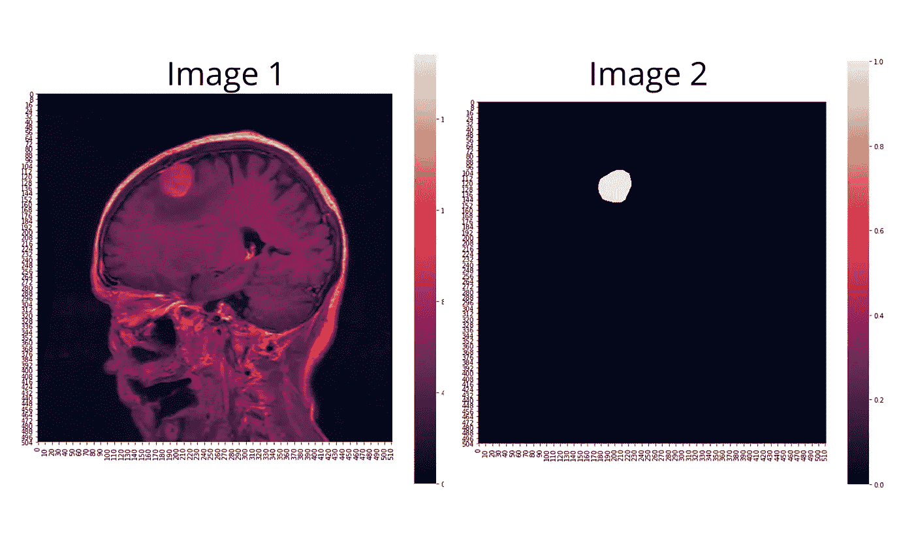

# 如何评价图像分割模型？

> 原文：<https://towardsdatascience.com/how-accurate-is-image-segmentation-dd448f896388?source=collection_archive---------9----------------------->

Riho Kroll 在 [Unsplash](https://unsplash.com/s/photos/throwing-dice?utm_source=unsplash&utm_medium=referral&utm_content=creditCopyText) 上拍摄的照片

## 骰子和雅克卡德的解释…

我们正在研究一个深度学习模型，该模型可以预测脑瘤或皮肤损伤的**面具**。什么是做面膜？我们将图像的像素分为 1 或 0。如果在一个像素中有一个掩模，我们声明 1，如果没有掩模，我们声明 0。对图像进行逐像素的二值分类称为“语义分割”。

图片由作者提供:脑肿瘤磁共振成像和相应的面具

如果我们试图识别图像中的许多对象，我们正在执行“实例分割”。实例分段是多类分段。例如，在自动驾驶汽车中，物体被分类为汽车、道路、树、房子、天空、行人等。

在语义(二元)和实例(多类)分割中，我们需要一个损失函数来计算梯度。

哪个精度损失函数用于图像分割？

让我们看看我们的一些选择:

# **1。像素精度:**

我们可以将每个像素点逐一与地面真相遮罩进行比较。但是在阶级不平衡的地方，这是很成问题的。我举个例子解释一下:

当我们为脑瘤创建一个如图 1 所示的遮罩时，它应该看起来像图 2 所示。

图片由作者提供:脑肿瘤核磁共振成像和面具

现在让我们看看下面的面具。当我们为图 1 中的脑瘤制作以下掩模时，精确度似乎上升了大约 98%。为什么？

作者图片

因为我们检查像素是否被正确分类并为每个像素赋值 0。在 MRI 图像中，肿瘤占据的部分仅占总图像的 2%,其余部分占 98%,因此该模型的准确度为 98%。精确度真的很高，但实际上我们连一个掩模都没有！这就是所谓的“阶层失衡”问题。(对于图像的一个像素，我们有两个类:1 遮罩，0 无遮罩。)

只比较这两个掩码可能是一个更好的主意。让我们看看；

# 2.Jaccard 指数(并集交集，IoU)

在这种准确性度量中，我们将基础真实遮罩(由放射科医师手动绘制的遮罩)与我们创建的遮罩进行比较。

图片作者:脑瘤，真实面具，预测面具。

让我们说得更简单些:

作者与 Canva 的图像:预测和地面真相面具的交集

绿色区域:我们估计为 1，地面真实值为 1。(真阳性，TP)

蓝色区域:我们估计值为 1，但实际值为 0。(假阳性，FP)

黄色区域:我们估计值为 0，但实际值为 1。(假阴性，FN)

灰色区域:我们估计为 0，地面真实为 0。(真阴性，TN)

图片由作者用 Canva: Jaccard 的指数公式

Jaccard 的指数介于 0 和 1 之间。

# **3。骰子系数**

Dice 系数与 Jaccard 的指数非常相似。骰子系数双倍计算交集(TP)。

作者使用 Canva 的图片:Dice 系数公式

骰子系数是两个遮罩之间重叠的度量。1 表示完全重叠，0 表示没有重叠。

作者使用 Canva 的图像:重叠和非重叠图像

骰子损失= 1 —骰子系数。轻松点。

我们计算反向传播中骰子损失的梯度。

> 为什么用 Dice Loss 而不是 Jaccard 的？因为 Dice 很容易微分，而 Jaccard 不容易微分。

# **代码示例:**

让我给你我用 Pytorch 脑瘤语义分割项目的骰子准确度和骰子丢失的代码。在这段代码中，我在一个函数中使用了二进制交叉熵损失和骰子损失。

骰子准确度、骰子损失和二进制交叉熵+骰子损失的代码片段

# **结论:**

在我们的图像分割项目中，我们可以运行“dice_loss”或“bce_dice_loss”作为损失函数。在大多数情况下，我们获得了比单独的二元交叉熵损失更精确的结果。即插即用！

**感谢阅读。**

**如果你想取得联系，你可以给我发电子邮件到 eymatas@gmail.com 的** [**s**](http://www.clausraasted.dk/) **，或者你可以通过 https://www.linkedin.com/in/seyma-tas/的****找到我**