# 年龄、种族和性别如何影响软件工程师的薪酬

> 原文：<https://towardsdatascience.com/how-age-race-and-gender-affect-software-engineering-pay-38380d2d02fd?source=collection_archive---------19----------------------->

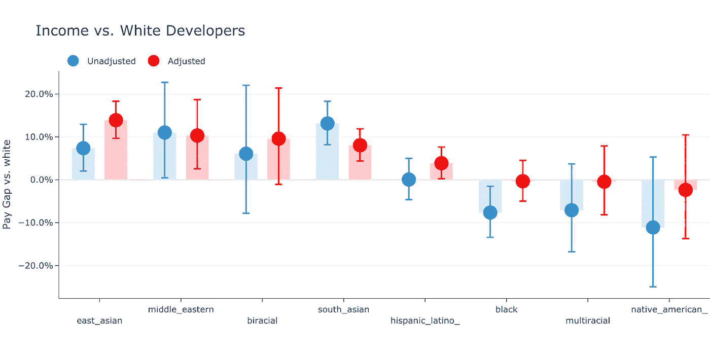

年龄。种族。性别。性取向。

在理想的世界里，这些因素对软件工程师的收入都无关紧要。作为特征，它们不应该必然影响开发人员的生产力或价值，因此也不应该影响报酬。

然而，事实证明确实如此——尽管并不总是以你所期望的方式或程度。

在这篇文章中，我探索了这些人口统计学特征如何与开发者的报酬相匹配，梳理了相关性和因果性，并解释了驱动一些更令人惊讶的结果的混杂因素。

**主要发现:**

*   `age`45-50 岁左右收入达到峰值
*   `Racial minorities`收入最高和最低的开发人员
*   `Female`软件工程师的薪水比他们的男性同事低 10%,但是`professional experience`解释了大部分的差距
*   `Gay and lesbian`调整可观察因素后，工程师比`straight`工程师挣得多
*   `Parents`挣得比`non-parents`多得多，但这是由其他因素造成的

如果您还没有，请查看分析背后的[方法，否则，下面的数字可能很难解释。](https://whoisnnamdi.com/highest-paid-software-engineers-2020)

如果你想复制我的结果，我会把代码发布到我的 GitHub 上。

# 年龄

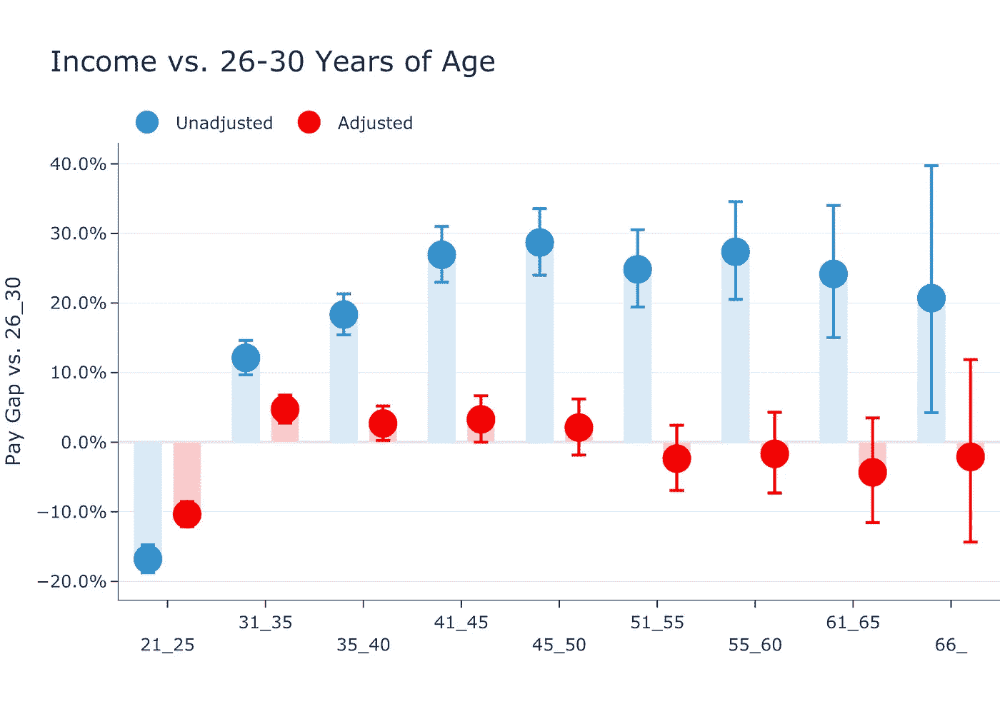

# 收入在 40 年代末达到顶峰

从 20 多岁到 40 多岁，开发者的收入稳步上升。**40 多岁是开发人员一生中收入最高的时期**，开发人员的平均收入比典型的 26-30 岁(数据中最常见的年龄范围)高出 **28.7%** ，之后收入稳定下来，最终在 60 多岁开始下降。

# 35 岁以后年龄就没多大关系了

然而，调整其他特征后，`age`在 31-35 岁区间是最“有利”的，在这个区间，一个开发人员可以期望比比他们小五岁的同等开发人员多挣 **4.7%** 。这一优势在统计学上非常显著。

然而，随着年龄的增加，工资的增长很快消失，失去了统计意义，甚至在 51 至 55 岁的范围内变得有些负，尽管这不是精确的估计。

关键的一点是，年纪大的开发者获得的额外收入，完全是用与年龄无关的因素来解释的。当我们控制其他因素时，35 岁后的**薪酬与** `**age**` **相差不大。**

# 年龄的因果影响很小

为什么在控制了其他因素后`age`与收入的相关性消失了？让我们开始吧:

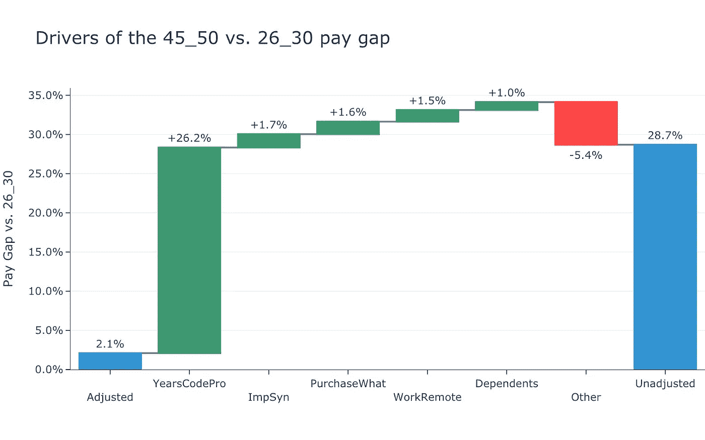

分析表明`years of professional coding experience`比年龄本身更重要，这是你希望看到的。这些额外的`years of professional experience`有效地解释了老软件工程师的全部收入溢价。

此外，重要的变量包括`self-rated competence`，在他们的组织中有`influence over technology purchases`，和`working remotely`(年长的工人更有可能这样做)，以及有家属。

# 人种

# 少数族裔是收入最高和最低的软件开发人员

正如[去年的分析](https://whoisnnamdi.com/highest-paid-software-developer/)中所述，最大的薪酬差距存在于少数群体之间，他们构成了薪酬最高和最低的开发人员。

`East`和`South Asians`在回归分析中，无论有无控制，都可以看到相对于白人开发人员的最具统计意义的薪酬溢价。在`East Asians`的情况下，在控制各种因素后，他们的支付保费*增加*。

这些溢价很大，也很有意义——`East Asians`比白人开发者多赚 **7.4%** 和 **13.9%** 多控制可观察特征，而`South Asians`未调整时多赚 **13.1%** 和调整后多赚 **8.1%** 。

# 审视东亚薪酬优势

分解可解释的收益溢价会产生一些有趣的发现:

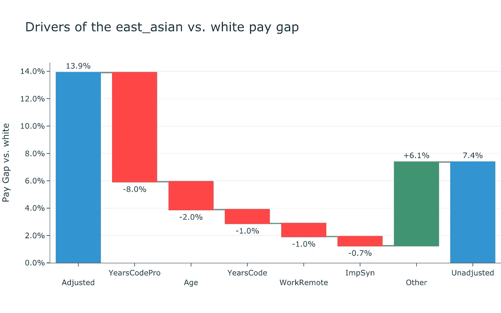

首先——`years of professional coding experience`无疑是压低`East Asian`软件工程师薪酬的最大因素。开发人员通常比白人缺乏工作经验，这降低了他们的收入。

*   我的计算表明，如果开发人员拥有与白人相似的职业经验，他们的收入会高出 8.0%
*   如果我们加上额外的、非专业的编码经验，这个数字会上升到 9.0% 。

`Age`也阻碍了`East Asian`开发者，因为他们通常比白人开发者年轻。这相当于 2.0%的薪酬劣势。

最后，应该注意的是`Asian`开发商所享受的收益溢价的绝对幅度。即使在控制了各种因素后，溢价仍然如此之大令人费解。

# 对黑人软件开发者来说，好消息和坏消息

让我们再来看一个——T4 开发者的薪酬差距。未调整的差距(再次简单地比较了`black`和`white`开发人员的平均收入)为 **-7.6%** ，而调整后的差距有意义地缩小到 **-0.3%** ，这在统计上并不显著:

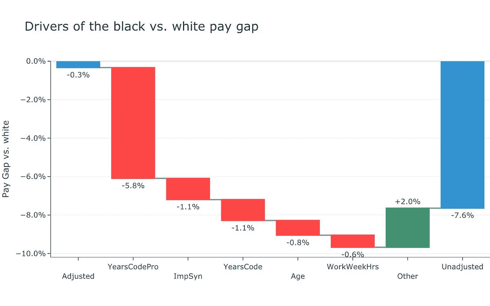

分解`blacks`的可解释差距揭示了与我们在`East Asian`案例中看到的相似的驱动因素。`Years of professional coding experience`是黑人软件工程师相对于`whites`薪酬较低的主要原因，总共推动了 **5.8 个百分点的整体 7.6%差距。没有什么比这更重要的了。**

从某种意义上说，这是令人振奋的。假设一个工程师从额外一年的工作经验中获得的和其他人一样多，仅仅是缩小差距就会使黑人的工资和白人的工资接近。

另一方面，未调整的差距可以通过`years of experience`解释，这也意味着差距不太可能很快缩小。

为什么？工作场所的结构变化缓慢——需要几十年才能看到巨大的变化

*   此外，随着行业的多样化，根据定义，大多数进入软件开发职业轨道的专业人员都是从阶梯的最底层开始的
*   因此，事实上，行业的多样化降低了平均收入，因为刚从训练营出来的开发者挣的钱远不如经验丰富的老手多

这不是一件坏事——但这确实意味着，在没有其他证据的情况下，我不能断定`black`和`white`工资缓慢趋同的背后有什么邪恶的东西。

另一个值得一提的因素是`ImpSyn`，这是一个代表受访者自己作为软件开发人员的技能的变量。越多的`confident`开发者挣得越多，黑人和白人开发者之间的信心差距导致了 1.1%的收入差距。

# 性别

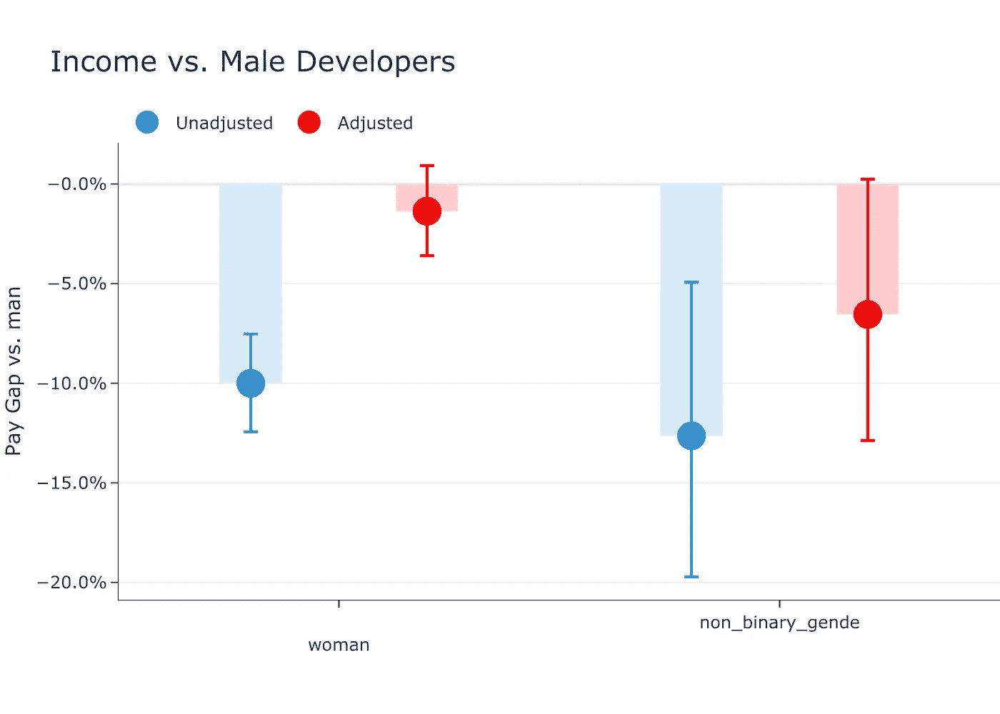

# 进入软件开发队伍的年轻女性拉低了女性的平均收入

平均收入比男性软件工程师低 10.0%，这是一个相当大的差距。然而，一旦我们调整可控因素，这一差距就被有效消除，降至仅 **1.4%** ，这在统计上并不显著。

在诊断`women`未经调整的 10.0%薪酬差距时，`years of experience`再次成为解释大部分差距的主导因素:

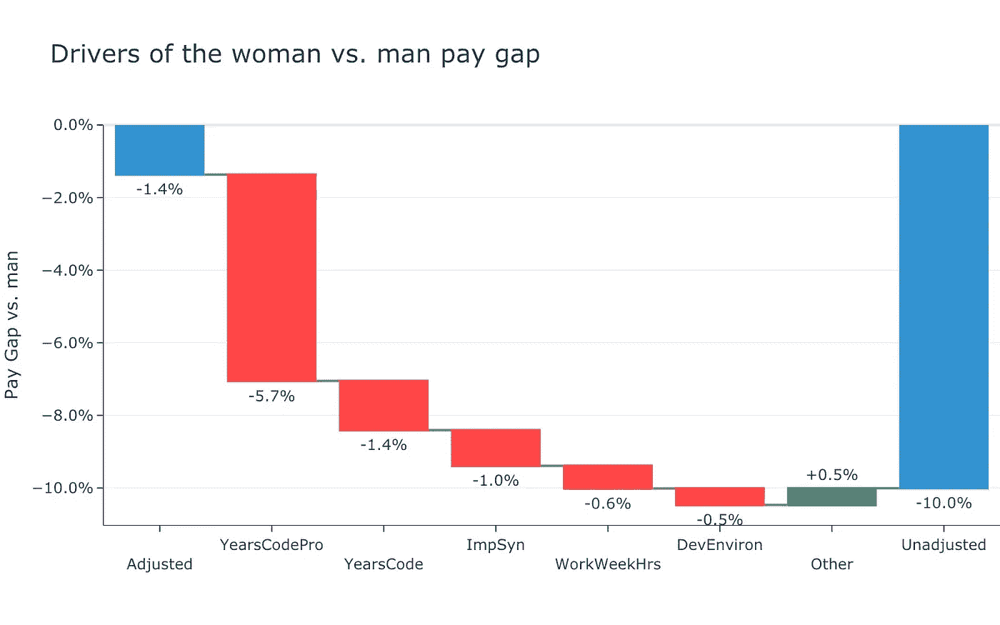

**5.7** 个百分点的`gender`薪酬差距可以用这样一个事实来解释，即平均而言`female`开发人员比`male`开发人员的专业经验少。加上总体`coding experience`解释了 **7.1** 总体差距的总百分点。

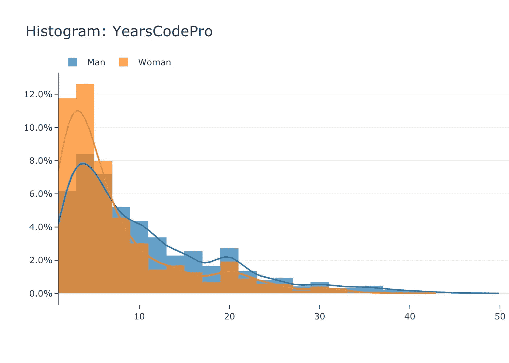

虽然在数据集中`women`平均只比`men`年轻 1.7 岁，但他们比`years of professional coding experience`少 **3.3** (分别为`women`的 7.1 岁和`men`的 10.4 岁)。我们可以在直方图/ [内核密度估计](https://en.wikipedia.org/wiki/Kernel_density_estimation)中看到这一点，比较了`men`和`women`的`years of professional coding experience`的各自分布，其中`women`的分布向左移动并更集中。这种有意义的差异解释了为什么`professional experience`是性别工资差距的主要驱动因素。

`Confidence` ( `ImpSyn`)再次成为拉低`female`工资的一个因素。这里，`confidence`差距解释了总体`female-male` `gender`差距的 **1.0%** ，在数量级上与`black`开发者对`white`开发者非常相似。

# 其他因素的少量贡献

与其他研究一致，`women`对自己的编程技能也没有`men`自信(据我们所知，T9 可能过于自信)，这解释了总差距的另一个 **1.0%** (因为更高的自信会带来更高的薪酬，我将在后面的文章中介绍)。

经验和信心共同解释了软件工程师性别薪酬差距的 **8.1%** ，只剩下 1.9%的差距，包括我们无法解释的 1.4 个百分点的差距。

# 性取向

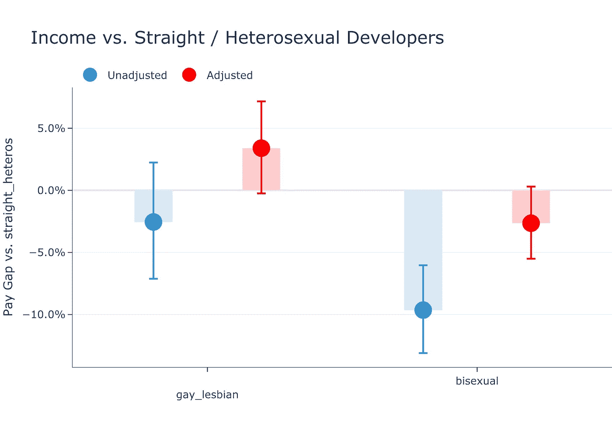

# 在控制了其他因素后，非异性恋开发者的收入损失消失了

非异性恋软件工程师之间未经调整的薪酬差距从`gay`和`lesbian`开发人员的 **2.5%** 到`bisexual`开发人员的 **9.6%** 不等，这仅仅意味着这些人的平均收入低于`straight`工程师。

然而，对于`gay`和`lesbian`开发人员来说，一旦我添加了控件，这种差距就消失了，实际上还会逆转。差距变成了 **3.4%** 的薪酬*优势*。

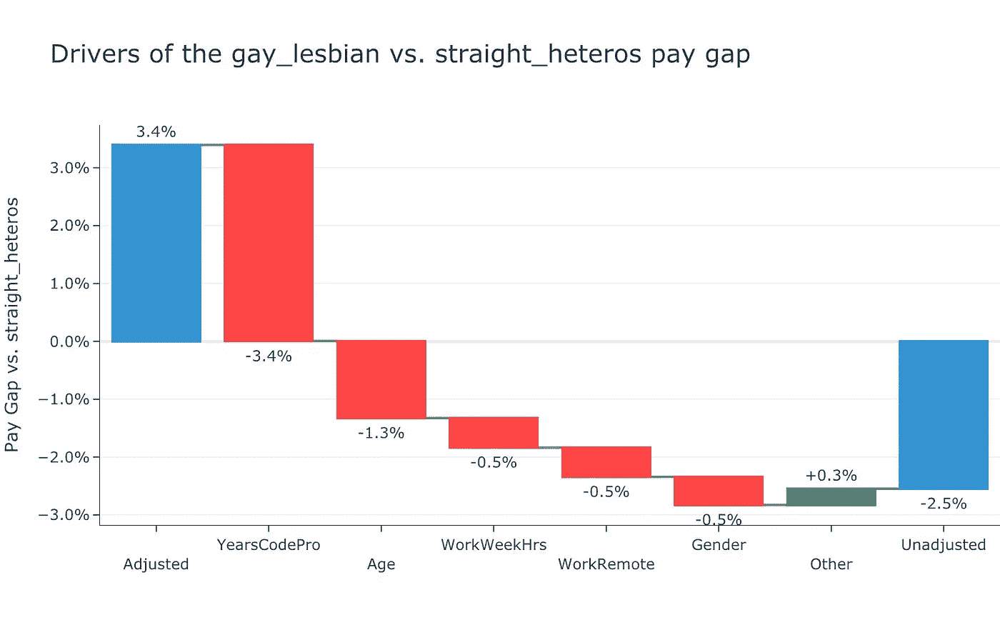

从调整后/未解释的 3.4%溢价开始，较低的平均未调整收益主要是由`years of professional coding experience`(一个反复出现的主题)和`age`造成的，这表明`gay`和`lesbian`开发人员在职业生涯中比`straight`开发人员平均更早。

对于`bisexual`的开发商来说，调整前后薪酬差距的分解非常相似。`Professional experience`和`age`这里继续做最说明问题的工作:

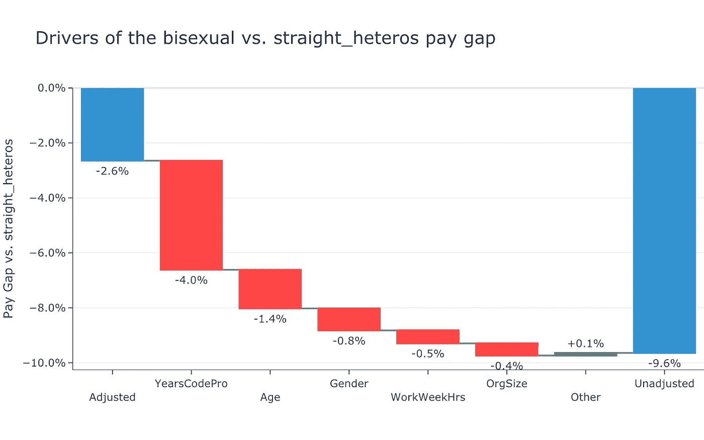

# 亲子关系

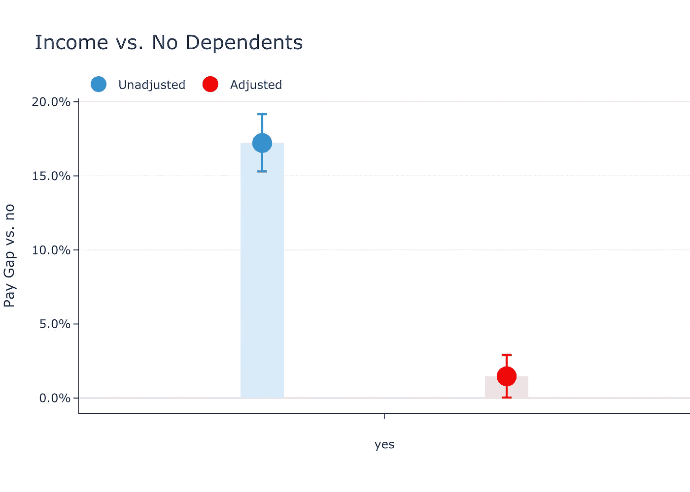

# 父母挣得更多，但这在很大程度上是由其他因素造成的

拥有`dependents`(通常是孩子)的软件工程师比没有的人多挣 **17.2%** ，但这种收入溢价几乎可以完全通过本分析中描述的其他因素来解释。

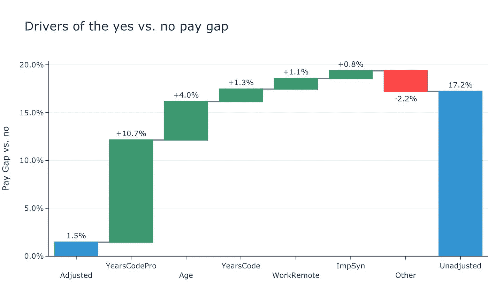

对这些变量进行控制后，父母收入溢价降至 **1.5%** ，虽然很小，但具有统计学意义。

*   也许数据反映出这些开发者为了照顾他们的`dependents`而赚取额外的收入
*   然而，如此小的收入增长并不能覆盖一个孩子或其他`dependent`的额外开支

不出所料，`years of software development experience`和`age`占据了父母收入溢价的大部分。这些大多是职业生涯中后期的工程师。

`Working remote`解释了父母工资溢价的另一个原因 **1.1%** ，因为他们更有可能在家工作，这是有道理的，因为他们可能有一个孩子要照顾。

# 结论:薪酬方面取得重大进展

不是要发表评论，但是我被这里的许多结果所鼓舞。一般来说，在大多数方面，一旦控制了各种因素，软件开发人员收入的差别就很小了。在大多数情况下，最大的因素是`years of coding experience`和`age`的某种组合，这两者都是“问题”，随着行业的多样化，它们将在很大程度上自我修复。

除了`race`之外，大部分差距都不超过几个百分点的量级。就种族而言，这种差距在某些情况下是有意义的，但事实上，这种差异是*有利于像`East Asian`、`South Asian`和`Middle Eastern`软件开发人员这样的少数群体的*。他们的薪酬优势是巨大的，来自 Stack Overflow 调查的数据无法完全解释这些差距。

对薪酬分析的常见警告在这里也同样适用。在控制了`job title`等因素后，发现薪酬歧视很少，并不能完全否定歧视。

*   例如，如果软件工程师面临歧视，表现为职业升迁机会减少，那么这种情况不会出现在分析中，尽管这会降低他们的收入
*   这同样适用于年长的软件开发人员，他们可能会被迫离开他们的组织，为更便宜、更年轻的开发人员腾出空间。

类似的统计警告比比皆是。

也就是说，这些数据表明，软件开发行业在年龄、种族、性别和性取向等重要维度上的薪酬已经趋于平等。

*最初发表于*[*【whoisnnamdi.com】*](https://whoisnnamdi.com/age-race-gender-software-engineering-pay/)*。*