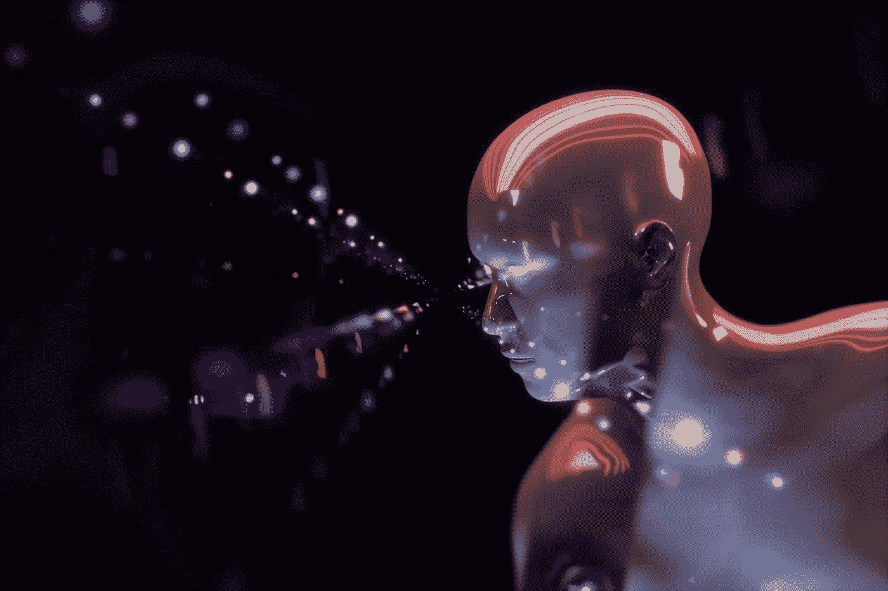
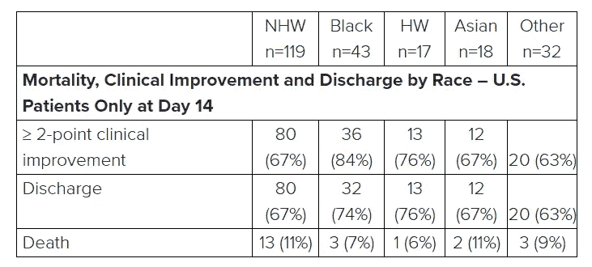
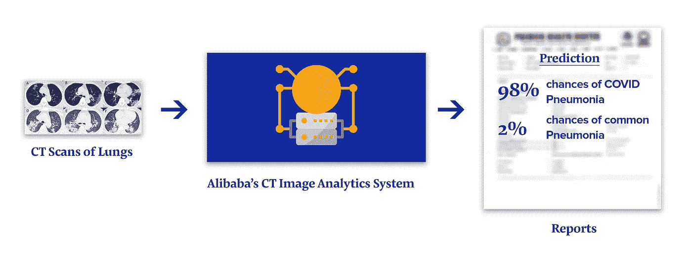
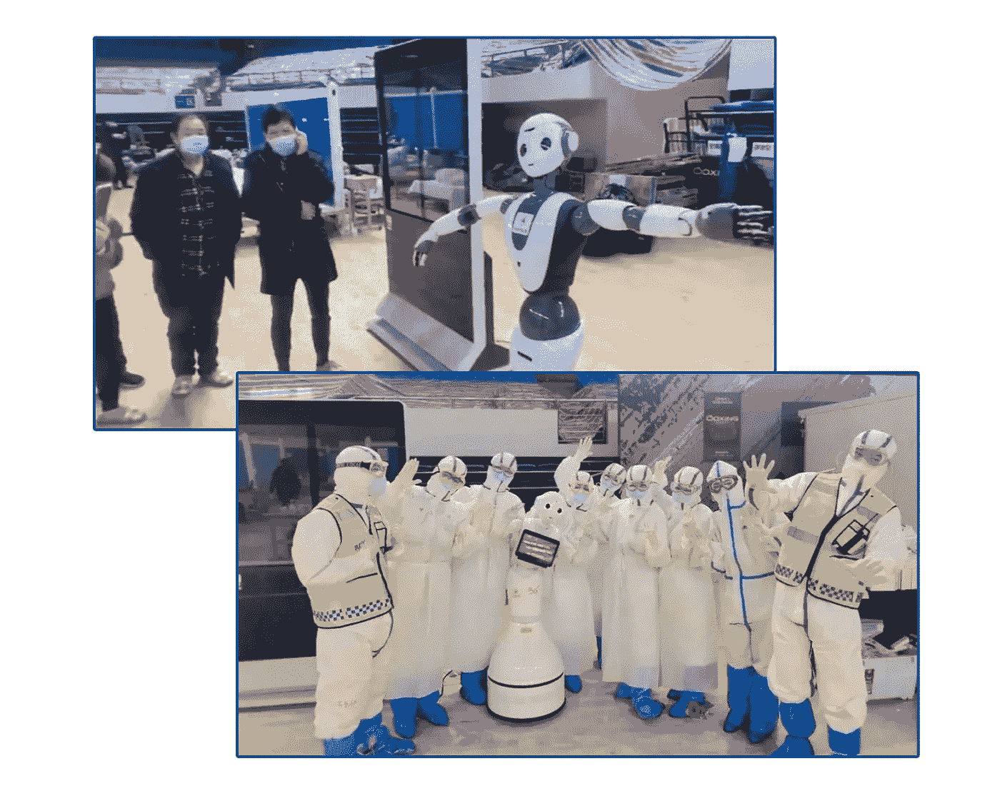

# 人工智能和曼梯·里如何帮助对抗新冠肺炎

> 原文：<https://towardsdatascience.com/how-ai-and-ml-are-helping-to-combat-covid-19-fe8ecbb88b7e?source=collection_archive---------50----------------------->

## 这篇文章总结了世界各地的研究人员和科学家利用人工智能缓解新冠肺炎疫情危机的所有努力。

来自 [Pexels](https://www.pexels.com/photo/ai-artificial-intelligence-machine-learning-616020/?utm_content=attributionCopyText&utm_medium=referral&utm_source=pexels) 的 [Salvatore P](https://www.pexels.com/@salvatore-p-117847?utm_content=attributionCopyText&utm_medium=referral&utm_source=pexels) 摄影

仅仅几周时间，我们周围的世界就发生了变化。就我个人而言，现在每天早上醒来，我首先想到的是我 70 多岁的祖父母，他们患有慢性疾病。随着冠状病毒在世界各地肆虐，以前所未有的方式改变着社会，并在我们说话的时候夺走了生命，我相信你们所有人都以这样或那样的方式关心着你们的亲人和你们的社区。我们许多人都有一种身体上、社交上或精神上的脆弱感。

在这些艰难的时刻，我特别受到全世界科学家、数学家、工程师、社会科学家，特别是医疗工作者的热情和勤奋的鼓舞，他们正齐心协力抗击这种疫情。像新冠肺炎疫情这样的危机带来的挑战触及生活的许多领域，并跨越许多专业领域。他们没有简单的解决方案或快速的解决方法。但是，无论多么具有挑战性或令人生畏，通向解决方案的旅程必须开始。

2019 年 12 月，**蓝点**，一个扫描成千上万外文新闻报道、动植物疾病网络和其他知名来源的人工智能平台，在中国武汉检测到了一群类似肺炎的疾病。这一系统引起了蓝点专家的注意，他们认为这与 2003 年致命的 SARS 爆发类似。甚至在科学家们意识到事态的严重性之前，艾尔系统就已经预测到了即将到来的危险。利用全球航空票务数据，该平台还预测病毒将在未来几天从武汉转移到首尔、东京、曼谷和台北，这被证明是真的。这显示了在这次危机中使用铝的重要性；数据分析、自然语言处理(NLP)、机器学习、深度学习、计算机视觉和聊天机器人方面的进步不仅有助于识别、跟踪和预测疫情，还可以通过帮助医务人员诊断患者来支持他们。现在，让我们看看人工智能如何帮助世界各地的医护人员和医生。

人工智能帮助医疗工作者的不同领域。(图标取自****)****

# **人工智能用于疫苗研究:**

****问题—** 药物发现是一个复杂、耗时且昂贵的过程，其中涉及许多反复试验的方法，需要世界上最聪明的人的不懈努力。当全世界都在努力对抗冠状病毒时，人工授精给人们带来了新的希望，即可以比传统方法更快地开发出疫苗。**

****解决方案—** 研究人员正试图发现可能摧毁 SARS COV-2 病毒的药物组合，这是导致 COVID 19 灾难的病毒的名称。有五家以人工智能为中心的公司正在加速这种药物的开发。其中， **Deargen** 做出了有价值的预测。他们发表了一篇论文，使用基于深度学习的模型 MT-DTI，该模型使用简化的化学序列来预测感兴趣的分子与目标蛋白质结合的强度。该模型预测，在 FDA 批准的抗病毒药物中，HIV 药物 atazanavir 和 Remdesivir 可以有效地阻断 SARS-Cov-2 外部的一种显著蛋白。**

**今天，正如预测的那样，Remdesivir 被吹捧为新冠肺炎的一种可能的治疗方法，但它仍在接受测试，并没有被宣传为一种治疗方法。在 Gilead(一家在全球范围内拥有 Remdesivir 专利的美国公司)进行的一项研究中，该公司对美国不同种族的 229 名患者进行了一项研究，以测试该药物的安全性和有效性。结果如下表所示。**

****

**由 [**基列**](https://www.gilead.com/news-and-press/press-room/press-releases/2020/7/gilead-presents-additional-data-on-investigational-antiviral-remdesivir-for-the-treatment-of-covid-19) 进行的一项研究的表格结果。非西班牙裔白人(NHW)；西班牙裔白人。**

**像 Insilico Medicine、SRI Biosciences 和 Iktos，Benevolent Al 这样的公司也在探索深度学习模型，以预测可能治愈新冠肺炎的新旧药物。尽管业界正在进行大量研究来寻找万灵药，但必须遵循系统的方法，人工智能中聪明人的适当合作将更好地产生积极的结果。**

# **用于快速诊断的人工智能:**

**根据患者的症状做出快速诊断可能是一个非常棘手和难以处理的过程。尽管如此，快速找出阳性病例并采取重要的补救措施是抗击 COVID 19 的必要努力。人工智能可以帮助医生快速诊断病人。中国正在使用的一种方法是基于人工智能的多传感器技术，这种技术被部署在机场等公共场所。该系统每分钟可以筛查多达 200 人，可以检测他们 0.5 摄氏度范围内的体温。这使得机场当局能够迅速隔离疑似发烧的人。然而，这可能只是一种分离高烧患者的方法，以下是目前在医院使用的主要方法。**

## **1.电晕病毒诊断聊天机器人**

**问题- 医院因人员和病例过多而不堪重负。人们不必要地恐慌，并前往医院进行检查。这导致了严重的问题，如在医院等待测试的时间长，以及有需要的人得不到测试包。额外的步行交通有可能增加健康人和感染者之间的污染。正因为如此，医疗保健系统不堪重负，这导致真正受新冠肺炎影响并需要快速诊断的人延误了就诊时间。**

****解决方案-** 为了解决这个问题，一家名为 Paginemediche is 的公司利用自然语言处理(NLP)的能力，开发了一款多语言版本的冠状病毒聊天机器人，帮助对使用它的人进行分类和诊断、症状检查和监控。这有助于向人们提供可靠的信息和明确的指导方针，并可以建议个人是否需要医院筛查或在家自我隔离。**

****

**冠状病毒诊断聊天机器人 UI 图片取自 [**健康软件组**](https://www.healthwaregroup.com/news/coronavirus-diagnostic-chatbot-589) 。(右边图标取自[**Freepik**](https://www.flaticon.com/authors/freepik)**)****

**这可以限制不必要的医疗保健设施，并减少医务人员的工作量，因为自疫情开始以来，他们几乎没有时间为自己和家人服务。使用人工智能进行快速诊断可以极大地帮助任何国家拉平曲线。这可以有效地防止疾病传播，并为高通量诊断提供了关键。应用良好的预防技术有助于防止医疗系统淹没医院。**

## **2.阿里巴巴的新冠肺炎 CT 图像分析:**

****问题-** 作为诊断过程的一部分，医生在整个住院过程中对患者进行大约 2000 次计算机断层扫描(CT)。手动读取和比较这些扫描需要大量的手动工作。一个有经验的医生分析这些扫描大约需要 15 分钟。考虑到病毒传播的情况，随着患者数量的激增，医生和有经验的专业人员的数量已经不足。医疗专业人员不得不通宵工作，评估这些扫描的个人经常筋疲力尽，并在过高的工作量下工作，在这种情况下，人为错误很容易成为问题。**

****解决方案——**因此，需要一个精确的 CT 扫描分析系统。为了加快这一审查过程，阿里巴巴推出了 **CT 图像分析**系统，该系统可以帮助显著提高测试准确度和检测效率。该系统能够以大约 96%的准确度辅助识别冠状病毒肺炎 CT 扫描。这可以在 20 秒内识别扫描，比人工检测方法快 60 倍。这是由阿里巴巴的研究和创新团队 DAMO 研究院开发的。**

****

**人工智能辅助诊断 COIVID-19 的过程。中间的图标取自 [**Freepik**](https://www.flaticon.com/free-icon/artificial-intelligence_2126875)**

**这个人工智能系统已经用超过 5000 个阳性冠状病毒病例的数据集进行了训练。它使用深度学习算法来研究感染模式，可以有效地用于两件事:**一是跟踪确诊病例的反应，二是为疑似病例提供诊断**。这种算法的突出之处在于它能发现普通肺炎和新冠肺炎肺炎的区别。一旦该系统将 CT 扫描识别为阳性冠状病毒病例，它还可以通过提供病变标记和受影响的肺容积比等分析来提供进一步的帮助。这有助于医生有效地跟踪和观察新冠肺炎患者的治疗进展。中国有超过 160 个公共机构正在使用这项技术，并且已经分析了超过 240，000 次 CT 扫描。**

# **通过智能机器人和无人机进行监控的人工智能:**

**在世界上许多国家，政府已经强制要求在公共场合戴口罩。像中国和印度这样的国家对不戴口罩在外面闲逛的人处以重罚。为了让这个过程更容易，一些城市和政府已经加快了 Al 动力无人机的公共部署。他们可以有效地跟踪没有戴防护口罩的人，这是一种经过科学证明的阻止冠状病毒传播的药物。此外，中国正在使用基于人工智能的多传感器技术，部署在机场等公共场所。该系统每分钟可以筛查多达 200 人，可以检测他们 0.5 摄氏度范围内的体温。这使得机场当局能够迅速隔离疑似发烧的人。**

****

**照片摘自 [**Hitconsultant**](https://hitconsultant.net/2020/04/06/new-ai-based-fever-detection-cameras-for-crowds-help-limit-coronavirus-spread/#.XyEZjZ4zZPY) 文章。**

****问题-** 我相信你们很多人可能听说过许多医护人员死于冠状病毒的消息。这是因为在这家医院里，工人们更多地接触到受电晕影响的病人。**

**解决方案- 只有当我们减少医生和患者之间的互动次数时，这个问题才能得到解决。自动驾驶汽车在向医院的病人分发食物和药品方面也发挥着至关重要的作用。达闼科技在中国的医院、酒店和学校部署了 100 多个机器人。**

****

**用机器人管理的武汉智能野战医院。(**上**)图— [建筑](https://aasarchitecture.com/2020/03/smart-field-hospital-in-wuhan-managed-with-robots.html/)和(**下**)图— [智能生活](https://www.intelligentliving.co/smart-field-hospital-robots-china/)**

**这些机器人采用了一种名为**云姜(XR-1)** 的人形机器人和智能运输机器人，可以在没有人与人接触的情况下，从医疗服务提供者那里为患者运送食物和药物。由于这些都是人工驱动的机器人，无聊和孤立的病人发现喜欢他的公司，因为他们提供有用的信息和急需的互动和娱乐。它能够在没有直接接触的情况下远程提供真实的患者生命信号，这对医生来说是非常有益的。**

# **利用人工智能预防下一场瘟疫:**

> **“预防胜于治疗”**

**冠状病毒不是世界上看到的第一个疫情。世界面临过许多大流行，最具毁灭性的一次是 1918 年的西班牙流感，它影响了大约 5 亿人，并导致大约 500 万到 700 万人死亡。但是，随着技术的发展，我们可以利用世界各地最新的科学进步和研究来减少死亡和感染的数量，从表面上看，使用人工智能系统已经被证明是一个救命稻草。我们可以遵循下面提到的一系列步骤来阻止下一次可能的瘟疫。**

****第一步——预测:****

**提前预测疫情并做好准备是我们能采取的最好的预防措施。蓝点和 Metabiota 正在利用 NLP 算法的能力来扫描和监控世界各地的几家新闻媒体。将冠状病毒等高度优先疾病标记为疫情病毒可能爆发，并将艾滋病毒或结核病等地方病标记为流行病。因此，预测下一次可能发生的瘟疫将有助于政府和世界各国应对严峻的形势，建立新的医院，实行封锁和旅行限制，增加医务人员和医院病床的可用性等，将有助于终止瘟疫在世界各国的传播。**

****第二步——找到治愈方法:****

**人工智能可以帮助研究人员搜索世界各地成千上万的研究论文和文件，并可以解开可能的治疗方法和疫苗，这对人类来说是一项具有挑战性的任务。传统疫苗可能需要长达 10 年的时间来开发，我们不能等待这么长时间，看着人民和经济走向死亡。创造治疗方法的一个关键步骤是了解蛋白质和组成抗体蛋白质的基本结构，研究人员可以利用这些结构进行有效的药物发现，同时减少与这些发现相关的成本和时间。谷歌 Deepmind 的 AlphaFold 正在使用人工智能进行预测抗体可能蛋白质结构的科学发现，希望能够产生现实世界的影响。**

# **结论:**

**虽然世界各地都有关于数据隐私的说法，但要让人工智能系统做出准确的预测，它应该用不同类型和类别的数据进行训练。毕竟，人工智能系统是第一个识别出新冠肺炎具有潜在的疫情形成能力的系统。这表明，人工智能与世界上最好的科学头脑的合作将在未来最有效地控制、识别和监测新冠肺炎和任何其他疾病。我们希望人工智能将有助于疾病研究、诊断和监测患者，并最终改善全世界数百万患者的生活质量。**