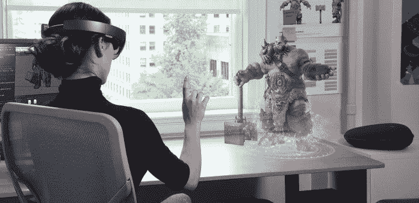

# 人工智能如何改变视频游戏产业:一个增强和合成媒体的时代

> 原文：<https://towardsdatascience.com/how-ai-is-changing-the-video-game-industry-an-era-of-augmentation-and-synthetic-media-8f2e4cf762c?source=collection_archive---------48----------------------->

## 游戏的下一次大变革将来自我们这个时代最具革命性的技术之一:人工智能。

有了*堡垒之夜*，开发商 Epic Games 不仅仅创造了一款国际知名的游戏；他们在 T2 建造了一个新的虚拟社交空间。凭借 PlayStation VR，索尼发布了第一款大众市场主机，让我们可以在客厅舒适地体验高清虚拟现实。在过去的二十年里，游戏行业发生了无数革命性变化的例子。所有这些都指向同一个结论:随着技术的发展和进步，游戏产业也随之发展。

游戏的下一次大变革将来自我们这个时代最具革命性的技术之一:人工智能。这篇文章将解释人工智能是如何改变视频游戏行业的，以及它将如何在未来几年强烈影响这个行业。

# 增强现实和混合现实

在我的童年，公路旅行是在汽车的后座度过的，把我的游戏机放在尴尬的角度，这样太阳就可以照亮屏幕，让我玩游戏。一晃十年过去了，现在我们已经有了背光 3D 游戏机和能够运行增强现实游戏和移动应用的手机。

我【news.microsoft.com】法师 [*法师*](https://news.microsoft.com/)

只需轻点几下屏幕，我们就可以改变周围世界的颜色，通过移动设备的屏幕创造一个新的世界，一个增强的世界。这不是什么新鲜事；举世闻名的[*pokémon Go*](https://en.wikipedia.org/wiki/Pok%C3%A9mon_Go)*是第一款打破增强现实(AR)成为主流的游戏，让新老粉丝们在一个长期喜爱的系列中津津乐道。然而，如果没有人工智能和计算机视觉的突破，这一切都不可能实现。*

***计算机视觉***

*你有没有想过社交媒体应用程序中的照片过滤器是如何将兔子耳朵这样的图像放置在你头顶上方的完美位置的？在 *Pokémon Go* 中，游戏如何将 Pokémon 直立放置在地面上，而不是 10 英尺的空中？答案是[计算机视觉](https://lionbridge.ai/articles/what-is-computer-vision/)。*

**

*图片来自 [lionbridge.ai](http://lionbridge.ai)*

*计算机视觉是人工智能的一个领域，旨在赋予机器像人类一样看待世界的能力，并对视觉信息做出适当的反应。通过[面部识别](https://lionbridge.ai/articles/what-is-facial-recognition/)，我们已经教会了机器如何识别和区分不同的人脸。有了这项技术，计算机可以扫描我们的脸，并使用我们的肖像[来创建游戏中的化身](https://technode.com/2019/09/11/netease-developing-ai-to-turn-selfies-into-3d-game-avatars/)。*

***平面探测***

*计算机视觉模型也用于检测自然环境中的平面或平坦表面。通过检测建筑物的侧面、墙壁或地面等平面，AR 应用程序将了解它可以和不可以放置数字对象的位置，例如 *Pokémon Go* 中的 Pokémon。*

***物体识别***

*随着微软 HoloLens 等混合现实技术的出现，游戏正在以惊人的方式利用物体识别。最受欢迎的 MR 游戏之一是 [Young Conker](https://www.microsoft.com/en-us/p/young-conker/9nblggh5ggk1) ，它使用物体识别来检测游戏所在房间的家具。通过检测家具，游戏可以为每个房间创建一个独特的可玩区域。然后，游戏使用检测到的家具作为一个可玩的区域，让 Conker 跳上去。*

*随着 *Pokémon Go* 和 *Dragon Quest Walk、*的成功，以及对[雄心勃勃的*《我的世界》地球*](https://www.minecraft.net/en-us/earth) *、*越来越多的期待，我们可能会在不久的将来看到 AR 和 MR 游戏的人气更大幅度的上升。*

# *合成媒体*

*在我看来，游戏行业最大的、也是最不可避免的变化可能来自于合成媒体的发展。*

***什么是合成媒体？***

*合成媒体是指经过人工创造的媒体(图像、视频、音频、文本)。例如，如果你想和巴拉克·奥巴马一起拍一个广告，你会怎么做？你可能需要联系他的公关经理，雇佣编剧和制作人员，找一个布景，拍摄广告。人工或合成媒体方法将消除大部分工作流程。*

*为了制作一个合成广告，你可以使用 [deepfake 技术](https://lionbridge.ai/articles/deepfakes-a-threat-to-individuals-and-national-security/)，这是一种能够以令人难以置信的准确性模仿另一个人的声音和面部的人工智能技术。使用这项技术，你可以创建一个具有另一个人的相似性和声音的视频，这正是 BuzzFeed 在下面的视频中所做的。*

***在视频游戏中使用合成声音***

*在视频游戏行业，这项技术可以很容易地应用于为游戏中的对话生成语音表演。像[复制品工作室](https://replicastudios.com/)和 [Lyrebird](https://techcrunch.com/2019/09/18/descript-audio/) 这样的公司已经在开发合成语音技术，你今天就可以下载并试用。有了这项技术，游戏开发者可以简单地输入对话文本，选择一种与场景相匹配的情感，并生成一段对话的音频剪辑。因此，合成音频可以消除传统画外音录音的时间和成本。*

*此外，配音演员也可能从中受益。在最近的一次采访中，复制品工作室声称他们正在创建一个声音市场，配音演员可以录制他们的声音并授权给工作室使用。虽然电影公司可以削减雇佣配音演员的成本，但演员自己也可以通过同时向多家电影公司授权他们的声音来赚钱。*

*如果这项技术能够准确模拟微妙的情感，我们可以看到游戏行业配音方式的重大变革。*

***生成神经网络***

*随着最近 [Open AI 的 GPT-2](https://lionbridge.ai/articles/this-entire-article-was-written-by-an-ai-open-ai-gpt2/) 的发布，生成神经网络和合成媒体技术正在获得越来越多的媒体报道。自然语言处理的最大突破之一，Open AI 的 GPT-2 有能力在几秒钟内生成听起来自然的文本。这项技术有着令人难以置信的能力，可以在飞行中为视频游戏创造独特的对话。*

*一家公司已经使用 GPT-2 创造了一个永无止境的文本冒险游戏， [AI Dungeon。](https://aidungeon.io/)*

*许多围绕人工智能的媒体似乎对这项技术产生了恐惧。虽然人工智能驱动的自动化确实给人类就业率带来了风险，但这项技术也能带来很多好处。*

*如果视频游戏行业要进入一个增强和合成媒体的时代，它应该以开放的心态去做。*

***原载于** [**艾商业**](https://aibusiness.com/how-ai-is-changing-the-video-game-industry-an-era-of-augmentation-and-synthetic-media/)*