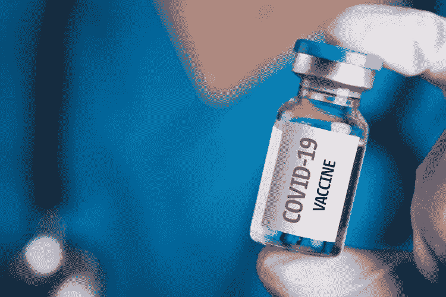
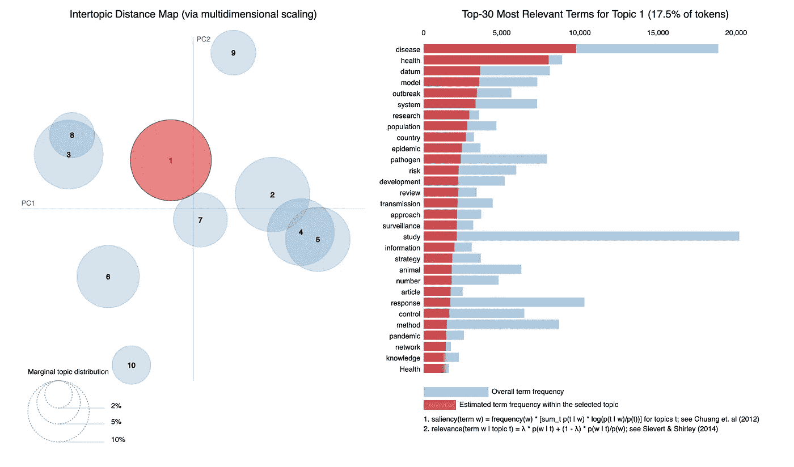

# 人工智能如何对全球应对新冠肺炎做出贡献？

> 原文：<https://towardsdatascience.com/how-ai-is-contributing-to-the-global-response-to-the-covid-19-f2540de65204?source=collection_archive---------62----------------------->

## 先进人工智能技术的七个基本应用

[新冠肺炎的超结构形态](https://des.az.gov/services/coronavirus)

*‘我们在打仗，当然是健康战:我们不是在与一支军队或另一个国家作战。但是敌人就在那里，看不见，摸不着，正在推进，需要我们总动员。*这是法国总统埃马纽埃尔·马克龙在电视讲话中宣布政府应对疫情冠状病毒的最新措施时使用的引人注目的词语。

2019 年 12 月在中国爆发的冠状病毒现已发展到全球，冠状病毒健康疫情正在成为一场全球危机和人类悲剧，影响到数十万人。新冠肺炎危机不仅仅是一种危险的病毒，更是一场加速衰退和去全球化的实验。这场运动异常激烈。边境正在关闭，人们不再能够自由流动，宵禁正在实施，各国央行正在降息以保持市场运转并平抑经济冲击，金融机构试图安抚客户并保持资金流动以实现经济平衡，全球股市暴跌，因为投资者担心病毒蔓延，医院正在努力应对这些前所未有的危重病人。几个月前，只有好莱坞制片人能想象出这样灾难性的场景。

针对前面提到的新冠肺炎疫情带来的一长串挑战，世界各地的研究人员正在努力更好地了解、缓解和阻止它的传播。研究的关键领域包括研究疫情的传播、检测、疫苗和治疗方法的开发，预测疫情的社会经济影响，甚至在封锁几周甚至几个月后对个人的心理影响。在这种全球动员的背景下，世界各地的人工智能研究实验室正在将他们的机器学习专业知识带到科学界，通过加强正在进行的研究工作，提高现有方法的效率和速度，以及提出原创的研究路线，来帮助找到潜在的解决方案。在本文中，我们概述了最近使用深度学习、机器学习以及更广泛的人工智能来解决不同规模的新冠肺炎危机的许多方面的研究。

> *有意地，我们将把流行病学预测模型和疫情进化图的长期争论排除在我们的范围之外，以我们的常客和贝叶斯统计学家朋友😁*

# 1.病毒严重性和传染性

在新冠肺炎的背景下使用机器学习的最初努力集中在试图使用蛋白质序列来理解病毒的严重性和传染性。

用两类样本训练的 SVM 的最大边缘超平面和边缘。边缘上的样本称为支持向量。

例如，[美国国家生物技术信息中心](https://www.biorxiv.org/content/10.1101/2020.04.05.026450v1)的研究人员报告了一项深入的分子分析，以重建新冠肺炎和其他严重人类病原体冠状病毒致病性增强的进化起源。使用众所周知的监督学习估计器；**支持向量机**，区分这次疫情和前两次冠状病毒爆发(SARS 和 MERS)背后的病毒的关键基因组特征已经被确定。冠状病毒蛋白质序列的这些部分将高病死率与低病死率变异区分开来。

[来自德国罗伯特·科赫研究所方法和研究基础设施部门的其他研究人员](https://www.biorxiv.org/content/10.1101/2020.01.29.925354v2)试图从下一代测序读数中预测病毒是否会直接感染人类。作者表明，从 CNN ( **卷积神经网络)**和 LSTM ( **长期短期记忆**)架构构建的深度神经网络显著优于浅层机器学习和标准甚至基于同源性的算法，将错误率减半，并推广到远离训练期间呈现的分类单元。[在西安大略大学，研究人员使用**决策树、支持向量机和 K 近邻**](https://journals.plos.org/plosone/article?id=10.1371/journal.pone.0232391) 结合数字信号处理，根据病毒的基因组序列预测病毒的分类，这再次证实了病毒来自蝙蝠的假设。

# 2.利用基因表达特征进行药物相似性鉴定

在快速治愈患者的旅程中探索的第一种方法包括通过研究 AI 现有药物的分子设置，发现与其他已知有效治疗方法具有类似效果的治疗方法。 [Quantified Mind and BioAge Labs 使用基因表达的 LINCS 数据集](http://lincsportal.ccs.miami.edu/dcic-portal/)并利用**深度神经网络**来学习嵌入层去噪表达数据并识别核心特征，使相同化合物的副本更加相似。根据定义，与以前应用于基因表达测量的相似性度量相比，学习的嵌入空间(潜在表示)准确地预测了药理学相似性并实现了改进的性能。这种方法可能有助于识别具有共同治疗和生物靶标的药物。另一方面，[Gero AI](https://www.researchgate.net/publication/339998830_AI_for_the_repurposing_of_approved_or_investigational_drugs_against_COVID-19)的数据科学团队利用了由三个模块构成的**深度神经网络；DenseNet block，一种包埋层和扰动因子分类器**,用于在对冠状病毒引起的疾病具有潜在活性的实验和批准药物中搜索宿主靶向作用的抗病毒药物。因此，我们敦促迅速对其他预测进行实验表征，并强调现代人工智能/人工智能技术的潜力，以迅速确定针对世界上最紧迫的医疗需求的人类试验疗法。

# 3.新药发现

更激进的方法是试图发现全新的化合物用于靶向新冠肺炎。[在福建省创新药物靶点研究重点实验室，科学家实施了**一种新型先进的深度 Q 学习网络**](https://www.biorxiv.org/content/10.1101/2020.03.03.972133v1.full) ，以片段为基础的药物设计，生成针对新冠肺炎的潜在先导化合物。这种**基于片段的药物设计的强化学习方法**奖励所发现分子的三个方面:药物相似性得分、预定片段的包含以及被认为与化合物有效性相关的已知抽象设计模式的存在。[In silico Medicine](https://chemrxiv.org/articles/Potential_2019-nCoV_3C-like_Protease_Inhibitors_Designed_Using_Generative_Deep_Learning_Approaches/11829102)的作者采用了一种略有不同的方法，拟合了 28 种不同的模型，包括**生成自动编码器**和**生成对抗网络**。作者使用强化学习方法探索潜在的候选人，这种方法具有一个奖励函数，该函数结合了诸如药物相似性、新颖性和多样性等因素。

# 4.疫苗设计和发现

[新冠肺炎疫苗试验](https://www.europeanpharmaceuticalreview.com/news/117523/uk-to-begin-clinical-trials-for-covid-19-vaccine-this-week/)

政府最感兴趣的领域之一是疫苗研发。除了通过适应性免疫反应的主要细胞成分产生病毒中和抗体之外；b 细胞和 T 细胞。有一种称为记忆细胞的 T 细胞亚群，它可以识别以前消除的病原体的抗原，并可以在再次暴露时快速激活更多的效应 T 细胞。这些过程为疫苗设计的目标提供信息。作为反应的一部分，称为主要组织相容性复合体蛋白的辅助蛋白呈递抗原的结合区域，称为表位。因此，疫苗的发现涉及两个主要和基本的目标:确定合适的靶向表位，并确保这些表位能有效地与人与人之间的基因变体一起工作。在一篇斯坦福医学论文中，作者使用了两个**神经网络** ，来识别新冠肺炎基因组中由 HLA 呈现的区域。他们鉴定了 405 个在 MHC-I 和 MHC-II 上存在的病毒表位，并使用来自 SARS-CoV 的已知表位进行了验证。[在密执安大学](https://www.biorxiv.org/content/10.1101/2020.03.20.000141v1)的另一项研究中，作者使用了他们的 [**Vaxign-ML 框架**](https://academic.oup.com/bioinformatics/advance-article-abstract/doi/10.1093/bioinformatics/btaa119/5756199?redirectedFrom=fulltext) (用于改进细菌保护性抗原预测的监督机器学习反向疫苗学模型)，利用监督分类模型，如**支持向量机** (SVM)、**K-最近邻** (KNN)、**随机森林** (RF)和 **XGBoost** (XGB)，努力预测哪些病毒蛋白质虽然作者发现 S 蛋白是最好的候选者，但他们也确定了五种可能的 NSP。

# 5.医学成像加快诊断速度

X 射线和计算机断层扫描(CT)等医学成像在全球抗击新冠肺炎的斗争中发挥着重要作用。基于人工智能的计算机视觉技术进一步加强了它们的力量，并帮助医疗专家。这些新模型有助于疾病诊断、跟踪和预后。

已经探索了新冠肺炎与其他肺炎和健康受试者的分类。来自伦敦布鲁内尔大学的人工智能研究科学家提出了一种**贝叶斯卷积神经网络** 来估计新冠肺炎预测中的诊断不确定性。这种贝叶斯推理将标准 **VGG-16 深度 CNN 模型**的检测准确率从 85.7%提高到 92.9%。[在 Zonguldak Bulent Ecevit 大学，作者提出了三种不同的深度学习 CNN 模型](https://arxiv.org/abs/2003.10849)、( **ResNet50** 、 **InceptionV3** 和 **Inception-ResNetV2** )，用于从 x 光图像中检测新冠肺炎感染。分类性能结果分别为 98.0%，97.0%和 78.0%。[在另一项研究中，作者训练了一个基于 **ResNet 的模型**](https://arxiv.org/abs/2003.12338) 来从 X 射线图像中检测新冠肺炎。召回率(特异性)和特异性分别为 96.0%和 70.7%，AUC 为 0.952。来自清华大学的研究专家使用来自 496 例新冠肺炎阳性病例和 1385 例阴性病例的胸部 CT 图像。提出一种基于 **2D CNN 的模型**来分割肺部，然后识别阳性新冠肺炎病例的切片。实验结果表明，该模型的敏感性为 94.1%，特异性为 95.5%，AUC 为 0.979。

[一名 28 岁男性的胸部计算机断层扫描，显示多灶性双侧周围圆形和边界不清的毛玻璃样阴影(A 和 B ),在下叶(C 和 D)有圆形实变区域。](https://www.cmaj.ca/content/192/17/E455)

除了早期诊断，研究感染的严重程度对于治疗计划也是至关重要的。[在一项有趣的研究中，作者提出了一个基于**随机森林的模型**](https://arxiv.org/abs/2003.11988) ，该模型被训练为基于数量特征来评估严重性(非严重或严重)。从**随机森林**模型计算每个数量特征的重要性，其反映了与新冠肺炎严重性的相关性。

# 6.新冠肺炎文学快速探索

由于新型冠状病毒相关文献的快速增长，医学和更广泛的科学研究团体很难跟上这些多学科研究中发生的一切。因此，越来越迫切需要创新的方法来解决这个问题，并弥合全世界研究人员之间的差距。为了回应这种需求，白宫和一个领先的研究团体联盟准备了**新冠肺炎开放研究数据集(CORD-19)** 。 [CORD-19 是超过 59，000 篇学术文章的资源，包括超过 47，000 篇关于新冠肺炎、新型冠状病毒和相关冠状病毒的全文。](https://www.kaggle.com/allen-institute-for-ai/CORD-19-research-challenge)这个免费提供的数据集提供给全球研究界，以应用自然语言处理和其他人工智能技术的最新进展，产生新的见解，支持正在进行的抗击这种传染病的斗争。从那里，独立数据科学家和组织发起了数以千计的计划。人工智能专家通过应用**主题建模来探索医学/科学文章，以便发现文档集合中隐藏的主题**。文献中涵盖了哪些主题？而且，每个主题的含义是什么，它有多普遍，主题之间有什么联系？此外，其他任务仍然在处理中。此后，我们举几个例子，如:什么是传播，孵化和环境稳定性已知的？我们对病毒遗传学、起源和进化了解多少？我们对疫苗和疗法了解多少？关于伦理和社会科学的考虑已经发表了什么？我们对非药物干预了解多少？

主题建模使用私有内核在 CORD-19 上训练的模型的交互式可视化

# 7.社交媒体上的假新闻和仇恨言论

随着错误信息和虚假信息的传播，最近几个月仇恨言论的增加已成为全球主要社交媒体的重大关切。范围从传播假新闻到欺诈目的的网络钓鱼，再到针对少数族裔的仇恨言论。例如，美国总统唐纳德·特朗普(Donald Trump)在几次新闻发布会上多次为冠状病毒称为“中国病毒”辩护，无视对其种族主义的批评。“这根本不是种族主义，”特朗普说。另一方面，世卫组织推出了一个新平台来对抗他们所谓的*新冠肺炎信息传播*，这是对不正确信息的大规模传播的官方名称，它导致了公众的歇斯底里、恐慌和困惑。目前，该信息刊物已经囊括了从药物建议到阴谋论的所有内容。

冠状病毒:呼吁应用程序从 BBC 获得假的新冠肺炎新闻按钮

例如，在这场战争中， **Twitter** 在危机早期采取行动，确保搜索病毒信息的用户看到可靠和权威的来源，如**世卫组织或卫生服务和政府机构**，而不是经常被标记为传播假新闻的阴谋网站或新闻机构。在宣布新冠肺炎为疫情的几周后，超过 2000 万条推文提到了冠状病毒。随着对疫情的指数兴趣，**自然语言处理高级技术，如**递归神经网络(GRU、LSTM)、变压器(伯特、乌尔姆菲特)**，被广泛用于检测可能造成危害的虚假信息的传播，并标记该内容以进行移除。另一个竞争对手脸书也公布了一系列措施来保护用户免受错误信息和仇恨言论的影响。国家卫生机构和政府也开始与大型科技公司合作，以确保他们想要传播的可靠信息不会被假新闻和机会主义淹没。**

# **了解你的作者**

**拉贝赫·阿亚里是首席数据科学家，致力于信用风险建模和欺诈分析的应用人工智能问题，并在机器学习方面进行原创研究。我的专业领域包括使用深度神经网络的数据分析、机器学习、数据可视化、特征工程、线性/非线性回归、分类、离散优化、运筹学、进化算法和线性编程。随时给我留言[这里](http://rabeh.ayari@polymtl.ca/)！**