# 人工智能技术如何让我成为我们孩子更好的父母

> 原文：<https://towardsdatascience.com/how-ai-techniques-made-me-a-better-parent-for-our-toddler-de1ea14e9226?source=collection_archive---------40----------------------->

## 我利用在人工智能工作中获得的知识和智慧，更有效地理解和教导我两岁的儿子，并恢复了理智。

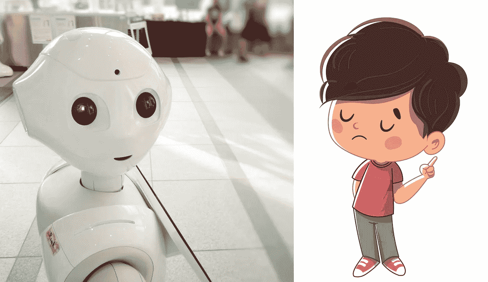

*图像 via*[*Unsplash*](https://unsplash.com)*和* [*Freepik*](https://www.freepik.com)

## 概观

我从构建人工智能(AI)技术中获得的知识可以直接应用于抚养我蹒跚学步的孩子。这不仅有助于我更有效地教他，也有助于我理解他为什么做淘气的事情，我以前认为他只是为了折磨我们。当我在这篇博文中探索这些想法时，我也将给出相关人工智能项目的简要概述，以帮助说明我的类比。

## 我的人工智能相关工作

我已经在人工智能领域工作了五年多，尽管听起来令人毛骨悚然，但我对人工智能的热爱仍然像第一天一样强烈，当时我发现我的图像分类模型 [Cyclops](https://medium.com/carsales-dev/building-our-own-deep-learning-image-recognition-technology-9f40e94a9c41) 能够自动分类从 27 个不同角度(前部、侧面、后部、仪表板、车轮等)拍摄的汽车照片，准确率达到 97.2%。

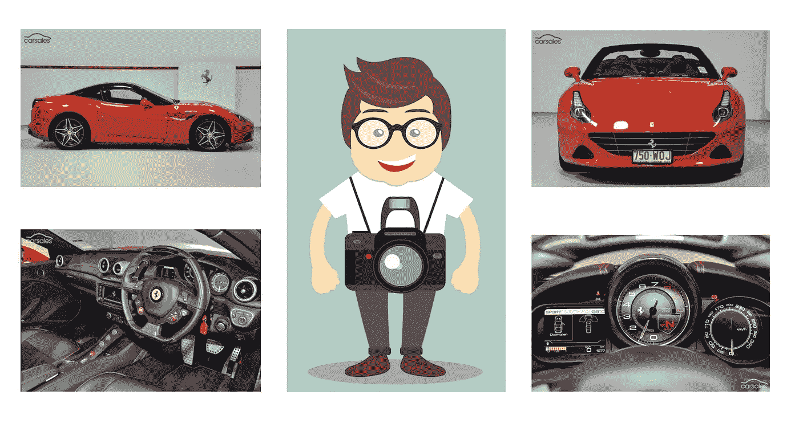

独眼巨人视角图像分类模型。图片 via [*Freepik*](https://www.freepik.com)

人工智能技术通过给你一种全新的方法来解决你以前无法解决的问题。与其用 if-else 语句来命令每一条指令，不如让机器从一组输入和预期输出中学习。尽管一个经过全面训练的人工智能模型仍然由数百甚至数千条 if-else 语句组成，但它们是在训练过程中自动创建的，因此我们不需要费力去设计和维护它们。当需求发生变化时，我们只需用新的数据集重新训练模型。你的数据就是算法，简单来说就是相当优雅。

## 育儿新体验

两年前，我们的儿子德协出生了。在充满挑战的几个月里，我们的世界天翻地覆，因为他每三小时一次的喂食制度保证了许多不眠之夜。

随着德希年龄的增长，挑战慢慢从喂食和打嗝等直接的生命支持转移到如何教他自己做事情:穿衣服，骑自行车，不吃他的袜子，不从餐桌上摔下来。

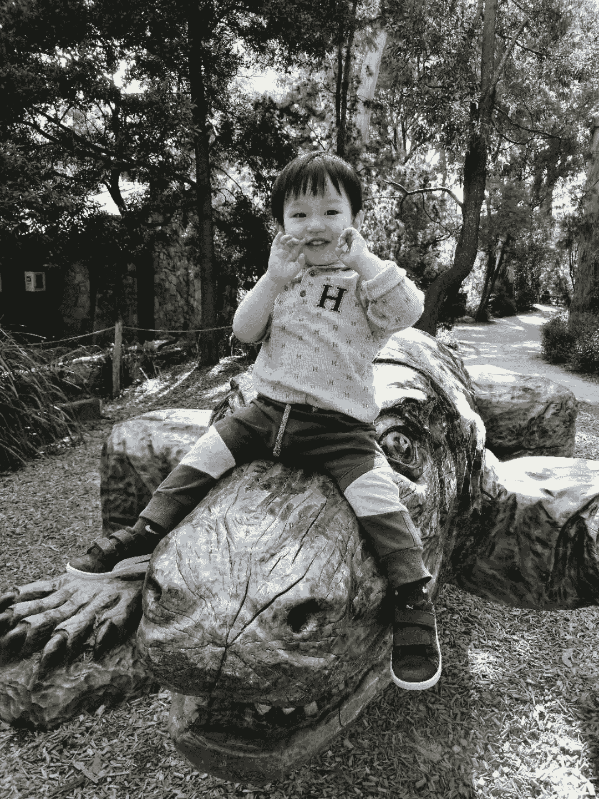

德克西，我们两岁的孩子

他总是有自己的想法，但并不总是听。事实上，80%的时候，他做的和我们告诉他的完全相反。最初，这很令人沮丧。然后，几个月前，我发现了建造 AI tech 和训练德协的许多相似之处。

这个发现帮助我理解了他为什么做某些事情，并让我更有效地教他。

## 通过向技术学习来解决自然

几千年来，人类一直在模仿自然来解决问题——飞机翅膀的灵感来自鸟类，潜艇上的声纳灵感来自蝙蝠。

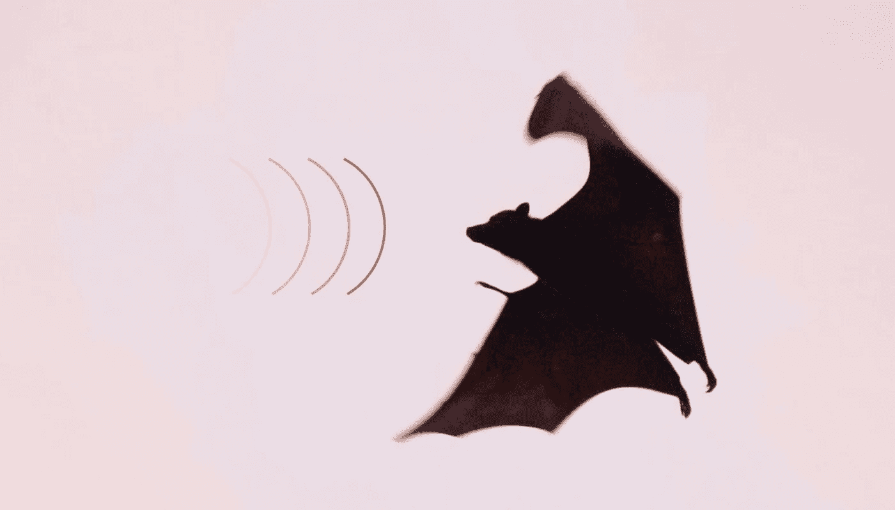

蝙蝠利用回声定位在黑暗中导航。*图像通过* [*去飞溅*](https://unsplash.com)

[Flood fill](https://en.wikipedia.org/wiki/Flood_fill) 是一种受水的运动启发的寻路算法，水总是从高处流向低处。有趣的是，当我们使用技术解决自然问题时，例如抚养一个蹒跚学步的孩子，这种自然启发人类技术的现象可以反过来起作用。

## 底片样本的重要性

德歇和其他同龄的小孩没什么不同。他跑来跑去，爬上桌子、厨房台面和橱柜。他直接把花、玩具和蜘蛛放进嘴里。为了保护自己，我的自然反应总是阻止他做这些危险的事情。当然，这只是放大了他做这些事情的欲望。一天，当我把德谢从餐桌上赶走时，我爸笑着说，“让他摔吧。”他简单的三个字让我意识到这种情况与训练我的一个人工智能模型有多么相似，它们成为了这篇博文中所有实验的催化剂。

去年年底，我在 Carsales.com 的团队部署了一项名为 [Mystique](https://autotalk.com.au/industry-news/ai-blur-carsales-number-plates) 的人工智能技术，用于检测汽车注册号码的存在，并将其模糊化。Mystique 保护卖家的隐私，防止 rego 车牌克隆者寻找像他们一样的汽车，打印出 rego 照片，贴在他们的车上实施犯罪。

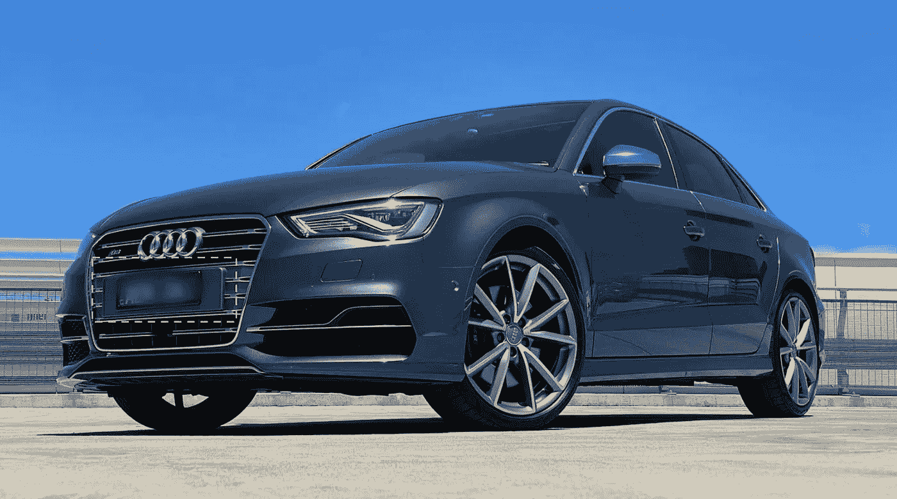

神秘感模糊了汽车的牌照

Mystique 的核心是一个物体检测人工智能模型，它在照片中 rego 板应该在的位置周围寻找所谓的边界框。然而，在预发布测试中，我们发现了很高的假阳性率。人工智能错误地模糊了不是 rego 牌照的物体，如里程表计数器和制造商徽章。进一步的调查显示，根本原因是我们的训练集没有没有 rego 牌照的汽车图像，换句话说，**阴性样本**。负样本在这种情况下很重要，因为它们允许我们的人工智能模型学习如何区分看起来像 rego 盘子但不是的物体。

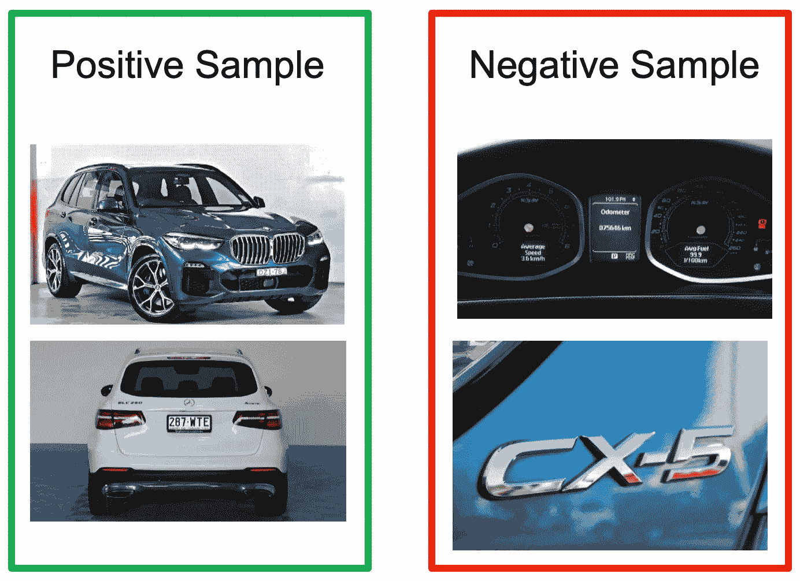

正负样本训练集

使用[一些技巧](https://medium.com/@msubzero2000/how-we-enhance-aws-sagemaker-object-detection-with-mandarins-c112af75db16)来克服对象检测架构的限制，我们使用正负样本的混合来重新训练我们的模型，从而显著降低了误报率。

这与幼儿的学习过程有什么关系？从我们出生的那一刻起，人类就从生活中遇到的积极和消极的经历中学习。每一次经历的结果都提供了一个反馈回路，帮助我们改善未来的决策。在实践中，这意味着我们将避免过去产生负面结果的行为，反之亦然。

假设我们在 2D 空间用绿色和红色标出所有这些积极和消极的行为(下图 1)。你会注意到一条决策边界线将他们分开，正面的行为在左边，负面的行为在右边。我们正在通过反馈循环不断改进这一系列产品的定位。有了更多积极和消极的结果，我们就能更好地辨别未来积极和消极的行动。

现在，假设我只允许 Dexie 从积极的经历中学习(图表 2)。由于他从未经历过任何负面结果，他只知道如何定位他的决策边界线，以确保所有正面样本都在左边。如果他面对消极的行为，他会把其中的四个错误归类为积极的。然后，我们添加一些负样本(图 3)，允许 Dexie 调整他的线，结果只有三个负样本的错误分类。最后，通过添加更多的阴性样本(图 4)，他实现了零错误分类。

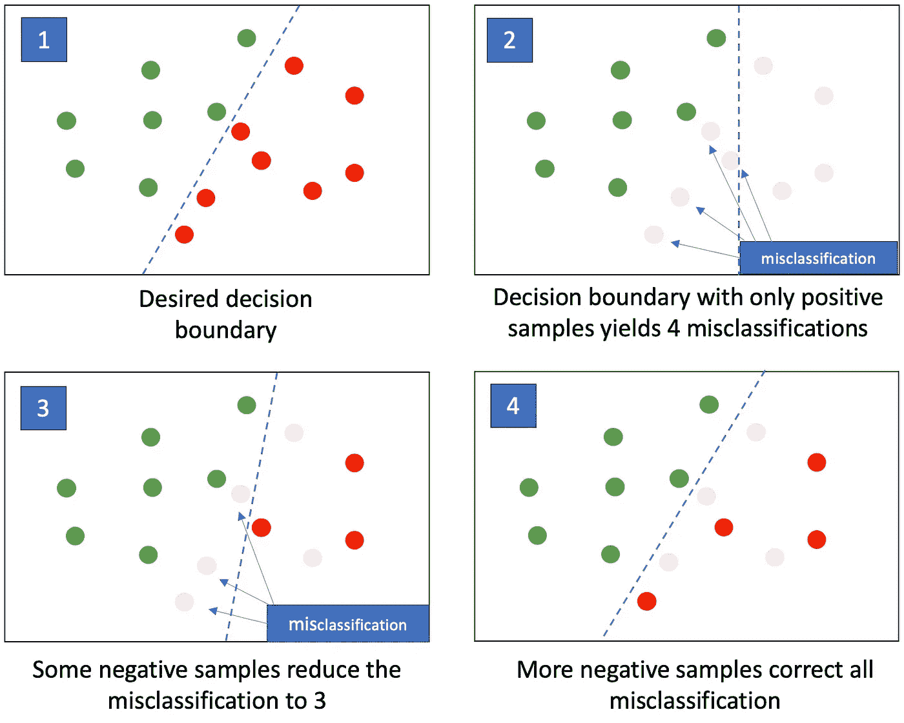

负面经历如何改善我们的决策

事实上，这直接转化为教导 Dexie。他不能只经历有积极结果的行动。*他也需要阴性样本* …比如从桌子上掉下来。

我已经开始让他在合理的范围内体验负面结果。他仍然爬上餐桌。然而，在他第一次跌倒后，我现在注意到他更加小心，不要站得太靠近边缘。第二次掉下来让他更加小心，离边缘更远。德西正在完善他的决策边界线。

## 探索的重要性

我相信很多父母都会有同感:无论你让你的孩子做什么，他都会反其道而行之。和你们许多人一样，我也在挠头，试图找到原因。事实证明，我从人工智能训练的另一个过程中发现了一个似乎合理的答案——ε参数。

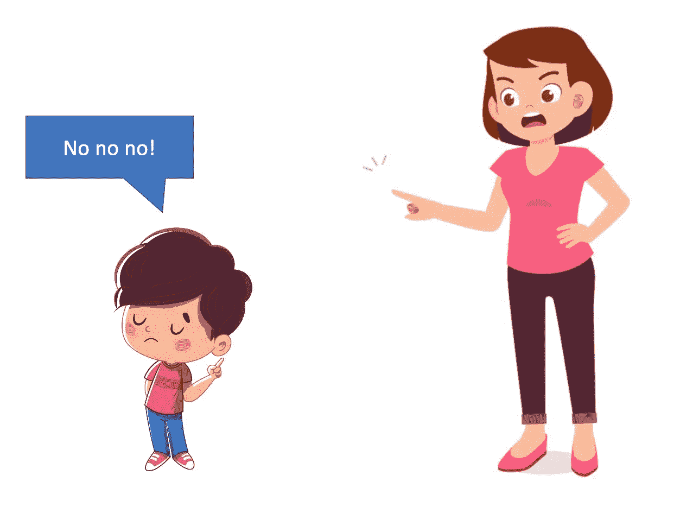

叛逆的学步儿童。*图像 via*[*Unsplash*](https://unsplash.com)*和* [*Freepik*](https://www.freepik.com)

最流行的人工智能技术是监督学习，它已经相当成熟，并且很好理解。神秘物体检测就是一个例子，我们用带标签的训练集来训练我们的人工智能模型。最近，一种称为强化学习(RL)的新技术开始受到欢迎，特别是在游戏和机器人领域，因为它能够通过试错来学习。它可以通过随机选择一个动作，并根据提供的奖励或惩罚来衡量其成功与否，从而进行探索。从探索中产生的反馈循环导致开发，一种选择与过去所见相似的行动的能力，这将产生更大的回报。

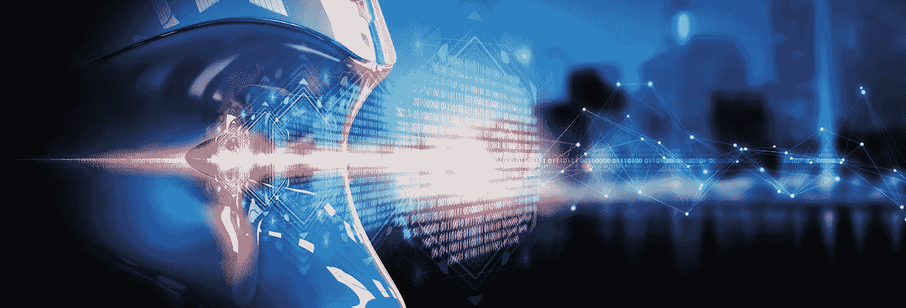

强化学习。*图片经由* [*土坯*](http://stock.adobe.com)

关于 RL 有趣的是，我们可以通过 epsilon 参数控制人工智能使用多少探索或开发来选择一个动作。探索允许人工智能在它从过去的训练集中学习到的内容之外发现更好的行动，并更快地适应趋势的变化。ε= 0.3 意味着 AI 以 30%的概率随机选择动作，而不管这些动作可能带来什么回报。

我们在叛逆的初学走路的孩子(和青少年)身上看到的是现实生活中的 RL，从父母的角度来看，ε值与顽皮程度相关。ε越高，他们看起来就越淘气，越叛逆。

探索因素在本质上也是至关重要的。没有探索，孩子们永远不会尝试与他们所学不同的东西。后代将无法发现任何新事物，导致社会智力下降。逆向进化。事实上，在更高的层面上，探索在进化中起着至关重要的作用，通过创造具有各种技能和物理属性的不同物种来不断进行实验。适者生存作为系统的一种奖励功能，以提高其开发技能，鼓励相似物种的繁殖，这往往更成功。

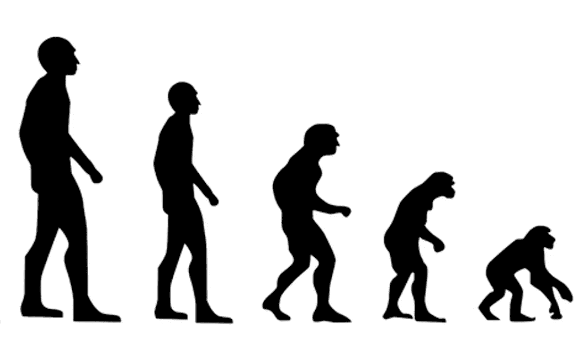

逆向进化。*图片经由* [*Pixabay*](https://pixabay.com)

当德西把水倒了一地时，我从远处尖叫着不要，现在我感觉好一点了。德西大脑的 RL 模块刚刚决定做一个探索。与此同时，我确实需要迅速采取行动，给他一个负面的奖励——惩罚。他可能会把水倒在地板上几次，但我必须有耐心，并不断提供负面反馈。毕竟，一个人工智能模型需要的不仅仅是一个样本，它的输出才会有明显的变化。

## 奖励函数

几周前，我们开始教德协如何骑平衡自行车，这是学习骑真正自行车的一个很好的起点。如图所示，这是一辆没有踏板的自行车。我们试图指导德克西用自己的脚推动自己，就像他在走路一样。我们试图告诉他(考虑到一个两岁孩子有限的语言能力，有些困难)，一旦他能做到这一点，他就能通过反复向前推动自己并快速将双脚抬离地面来移动得更快。

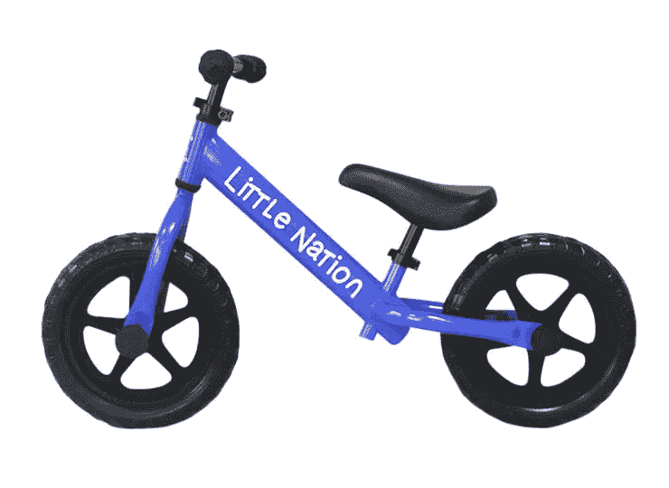

平衡自行车

又一次，人工智能技术来了。如前所述，奖励功能是 RL 成功的关键因素。它为人工智能模型挑选的一系列行动提供了一个反馈回路，以评估它们是否产生积极或消极的结果。对于学习玩超级马里奥游戏的 RL AI 模型，奖励功能被设计为马里奥越快完成课程就给予越积极的奖励。马里奥掉坑死了就给负反馈。正如你所看到的，这个奖励功能是在一个更高的层次上设计的，而不仅仅是为 Mario 执行的每个离散动作(行走、跳跃等)提供奖励。).这使得人工智能可以自己探索哪一系列的行动会产生更大的回报，而不需要微观管理。

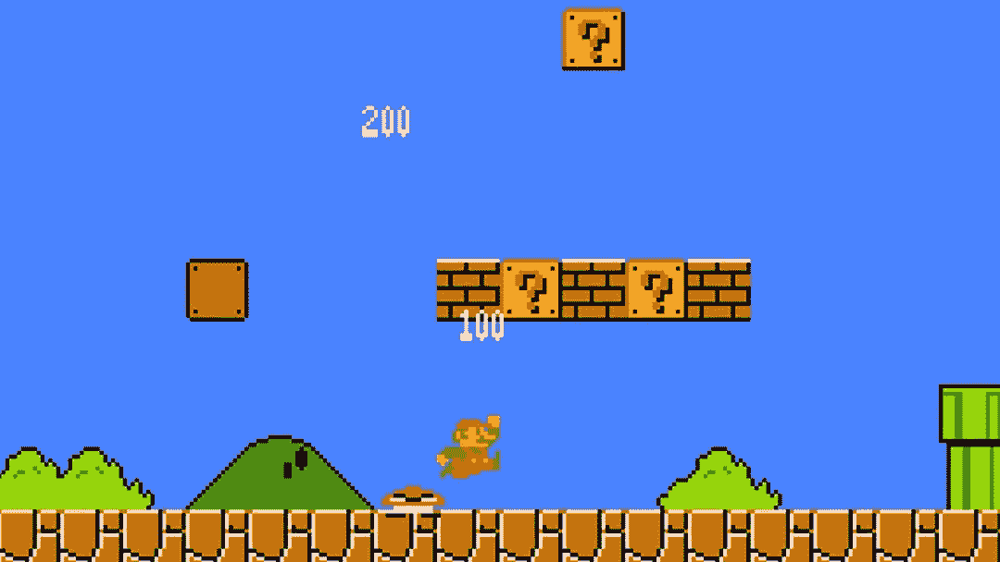

超级马里奥游戏

将这些知识应用到德协的自行车训练中，我不再给他不断的指示。我得到了我需要的奖励函数——让 Dexie 走得更快。唯一的问题是，与总是接受你给它的奖励函数的人工智能不同，一个蹒跚学步的孩子不会。需要一种激励。因此，由于目标是让德歇加快脚步，骑得更快，我们让他和我们一起玩追逐游戏，因为他想抓住我们的愿望与奖励功能完全一致。

为了进一步提高他的技能，我们现在让德谢和已经是平衡自行车专家的邻居孩子一起玩。这使得德克谢能够模仿它们的动作，从而加快移动速度。它类似于用于训练强化学习模型的模仿学习技术。

## 人类大脑的强大力量

我从这些实验中获得了如此多的智慧，这无疑使我成为一个更好的父母，并有助于保持我的理智。尽管抚养一个蹒跚学步的孩子和训练一个人工智能有许多相似之处，但我现在意识到也有显著的差异，包括人工智能技术需要改进多少才能与人类持平。

人脑是一种通用的思维机器，能够学习许多不同的学科，如语言、视觉识别和数学。我们通过使用从这些知识领域收集的信息来做出决策。即使我们从未见过下面照片中的狗物种，我们也知道它是狗(即使它看起来像拖把)，因为我们对人类生活方式的知识告诉我们，人们遛狗而不是拖把。如果人工智能对象检测模型从未在训练集中见过这种类型的狗，它将无法做出这种区分，因为它唯一的知识来源是视觉。

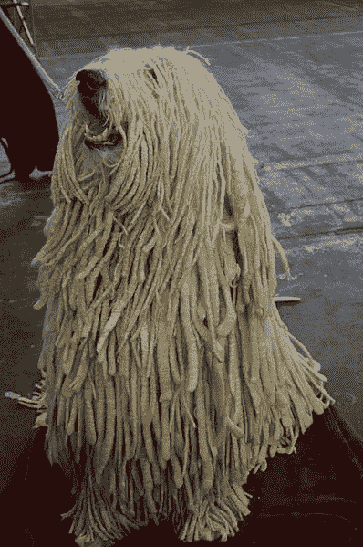

Komondor 犬种。*图片 via* [*flickr*](http://www.flickr.com)

即使面临相当大的不确定性，利用我们的知识图表的能力也能使我们做出更好的决策。让我们的大脑更加神奇的是，我们不断使用这些知识图来理解、消化和验证新信息，同时提取高级抽象，进一步增强我们的知识图。在处理歧义时，我们甚至可以用“为什么？”来询问更多细节

回答这个问题会产生额外的反馈循环，使我们的知识图更加健壮。随着可靠性的提高，获取更多的知识变得更加容易。这个过程叫做**推理**，目前在 AI tech 中缺失。还没有人知道如何构建一个具有推理能力的人工智能，所以不要担心“人工智能正在接管人类”的宣传。至少在未来 50 年内不会发生。

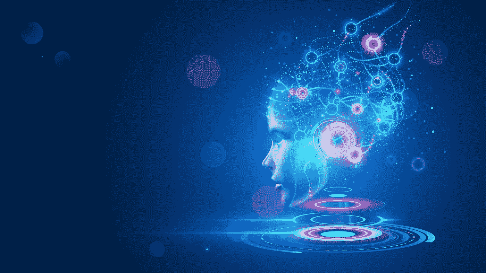

我们大脑内部的复杂网络图。*图片经由* [*土坯*](http://stock.adobe.com)

这是所有的乡亲。我希望这个故事能引起像我一样热衷于技术的父母们的共鸣。