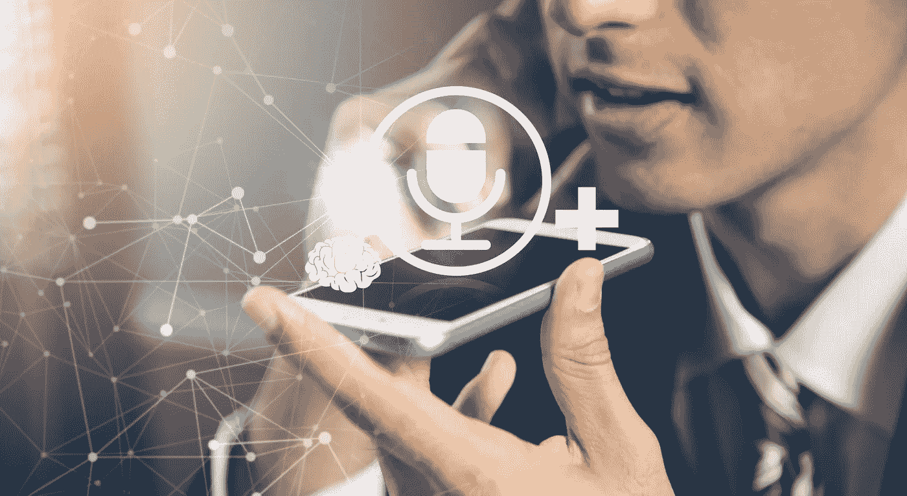
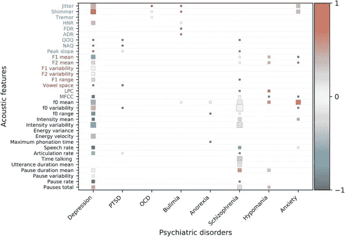
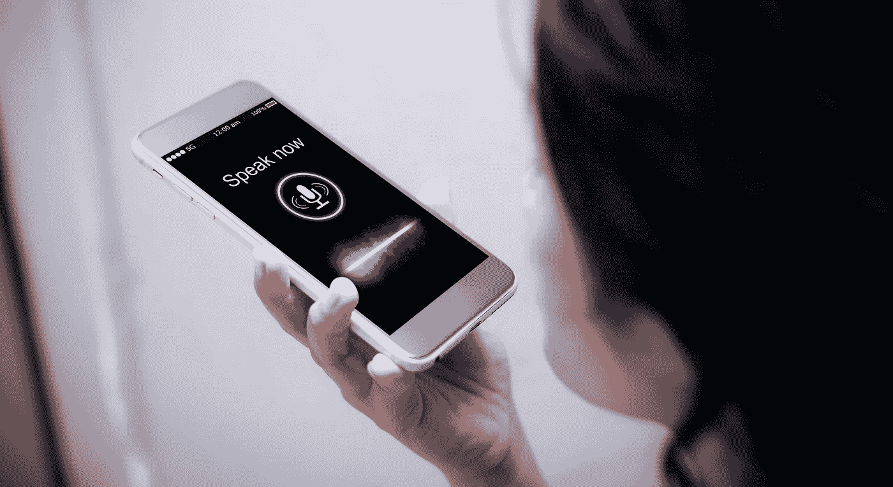
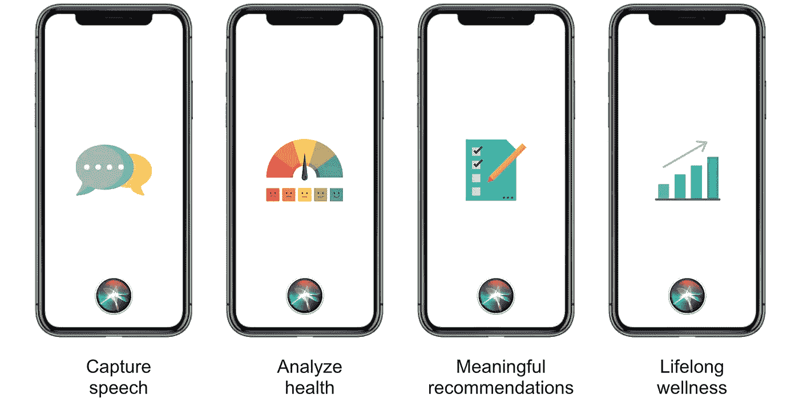
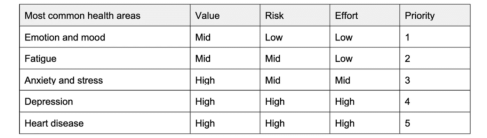

# 用人工智能语音助手彻底改变健康

> 原文：<https://towardsdatascience.com/how-ai-voice-assistants-can-revolutionize-health-b08d925bd018?source=collection_archive---------29----------------------->

## [人工智能](https://towardsai.net/p/category/artificial-intelligence)、[观点](https://towardsai.net/p/category/opinion)、[技术](https://towardsai.net/p/category/technology)

## Siri、Alexa、谷歌以及语音和健康技术的未来

图片来自 [shutterstock](https://www.shutterstock.com/image-photo/speech-recognition-concept-handsfree-communication-machine-687742111)

# 下一次健康革命就在你的声音里

未来的愿景是释放人类的声音，作为一种有意义的健康衡量标准。人工智能语音助手可以将语音转换为生命体征，实现对即将到来的情况的早期检测和预测。类似于温度是发烧的指标，声音生物标记可以为我们提供更完整的健康状况。

## **解决心理健康方面的全球性问题**

全球有四分之一的人会在生活中的某个阶段受到或大或小的心理健康问题的影响。目前约有 4.5 亿人患有焦虑、压力、抑郁或其他疾病，这使得心理健康成为全球健康不佳的主要原因之一。如果早期发现和治疗，许多这些问题是可以预防的，但是，近三分之二的健康不佳者没有寻求或接受适当的帮助。

## 声音是健康的生物标志

口头交流编码了丰富的信息。直到最近，研究和技术才交叉起来，使我们自己的声音成为最有效的健康生物标志之一。

> “想想产生声音需要多少肌肉和大脑区域的精确性和协调性，各种疾病会潜移默化或急剧影响一个人的声音和语言的使用。”
> 
> —[UW 记忆和大脑健康中心的 Ghomi 博士](http://depts.washington.edu/mbwc/news/article/talk-about-a-revolution-the-future-of-voice-biomarkers-in-the-neurology-clinic)

科学研究正在验证声音作为生物标记的有效性。一些重要发现:

*   与精神疾病相关的声学特征，如抑郁症、创伤后应激障碍、焦虑症、饮食障碍[【1】](https://www.ncbi.nlm.nih.gov/pmc/articles/PMC7042657)
*   声音生物标志物与心力衰竭患者的住院和死亡率相关[【2】](http://www.ahajournals.org/doi/10.1161/JAHA.119.013359)
*   与抑郁症严重程度和治疗反应相关的声音生物标记[【3】](http://www.ncbi.nlm.nih.gov/pmc/articles/PMC3409931/)

声音生物标记是来自我们声音特征的医学信号，类似于脉搏和血压等其他生物标记。捕捉和分析我们声音的细微变化:音调、强度、声道协调、抖动、颤动、震颤、停顿等。，创建了一系列健康测量，可在几秒钟内提供更完整的健康状况。

这张图表显示了声学特征和精神疾病之间的相关性。1 分=与健康人群相比，精神障碍人群的声学特征显著更高，也称为正相关。0 分=无显著相关性。得分-1 =负相关。单元格大小反映了支持该效应的研究数量。例如，抖动和微光有大量的研究支持这些声学特征与抑郁正相关。来源:ncbi.nlm.nih.gov/pmc/articles/PMC7042657/

# 释放人类声音，增进健康

今天，技术、产品和服务更加集中于身体健康。但是心理健康呢——可以说是我们整体幸福的更基础的方面？人工智能语音助理技术，如 Siri、Alexa 或谷歌，可以通过打开一扇通往我们心灵健康的新窗口来改变医疗保健。

当健康发生变化时，声学也会发生变化。这些声学特征可以预测情绪状态、情绪、压力、焦虑、抑郁、痴呆、脑震荡、心脏病等状况。由于数据量巨大，人工智能和机器学习可以比人类一年更好地检测和分析这些声音特征。

图片来自 [shutterstock](https://www.shutterstock.com/image-photo/voice-recognitionsearch-technology-concept-woman-talking-708158770) 的[帕努瓦特](https://www.shutterstock.com/g/panuwat+phimpha)

## **与**艾**对话改善心理健康**

人工智能语音助手可以提示不同类型的语音诱导任务。例如，在一天开始时，Siri 会问:“我注意到你今天有很多会议，你感觉怎么样？”或者在一天快结束的时候，Siri 会问:“你今天过得怎么样？”类似于 Apple Watch 在检测到心律不齐时提醒一个人，一旦捕捉到语音，Siri 可以利用机器学习来分析语音反应，并提供有意义的建议。健康问题的早期发现可以挽救生命。

可能的用户体验包括:

*   发现潜在问题并提出有意义的指导建议
*   基于语音特征输出健康或压力分数
*   当用户表现出焦虑时，建议放松
*   当检测到疲劳迹象时提示睡眠提醒
*   根据情绪和心情建议锻炼、其他活动或第三方应用
*   通过发现用户语音和其他健康数据(如睡眠、锻炼、饮食或心率)之间的关系来提供见解
*   与医疗机构和临床医生集成，以监控和跟踪患者的进展

作者图片

## 为什么是 AI 语音助手而不是健康应用？

声音作为生物标记的成功实施需要自然的对话。AI 语音助手的人性化和熟悉的体验使参与和捕捉高质量的语音比一个应用程序更有效。每次打开一个 app 的过程，都可能导致不自然的对话，低质量的声学特性，造成用户掉线。用户也可能将其视为“另一个健康应用”。有了人工智能，用户可以在真正需要的时候，比如在情绪状态下，更加开放和方便地说话。

# **产品成功路线图**

该产品的成功可以从三个主要方面来衡量:

1.  整体精神健康的改善

*   通过自然语言处理和语音情感分析对情绪的改善进行评分
*   在诸如疲劳、焦虑、压力等特定领域取得进步
*   整体精神健康评分的长期改善
*   自我报告的精神健康改善，非 Siri 决定

2.参与人工智能语音助手和健康生态系统

*   每日、每周和每月活跃用户的增加
*   最佳的互动率、对话长度和话语
*   睡眠质量、锻炼和其他健康领域的改善

3.技术准确性

*   通过跟踪真阳性、真阴性、假阳性、假阴性的混淆矩阵，不断提高机器学习模型的准确性
*   减少重复命令以及语音捕获和分析错误

## **已经与 AI 语音助手合作的目标客户**

最初的目标客户可以是那些已经每天多次使用人工智能语音助手的人，从而最大限度地减少额外的行为变化。可以通过缩小范围来提高准确性。例如，对于加利福尼亚的 iPhone 和说英语的用户来说，体验和口音的变化很小。如果可能的话，瞄准那些遇到压力情况的用户，比如让 AI 语音助手告诉某人他们要迟到了。

## **拥有临床医生的二级客户群**

人工智能不应该取代卫生专业人员。相反，它是增强临床医生能力的工具。一些使用案例包括:

*   临床医生让人工智能主动倾听患者，以帮助诊断或识别语音模式，假设没有隐私问题。这类似于 NLP 目前如何帮助卫生编码员转录患者笔记以识别医疗诊断。
*   临床医生鼓励患者与人工智能进行对话，以此作为监控和跟踪进展的一种方式。通过语音分析，临床医生可以确定患者是否已经停止服药，抑郁症复发，或者再次暴食症和呕吐。

## **长期客户关注可访问性和整体健康状况**

受益最大的是那些已经面临风险的客户。人工智能语音助手必须专注于为患有语言、视觉、听觉、运动或其他障碍的人提供无障碍环境，并对那些不太熟悉技术和支持全球语言的人格外友好。为了实现长期的全球利益，使用声音作为生物标记可以扩展到精神健康以外的整体健康。

## **根据高价值、低风险、低投入确定优先级**

健康是一个高影响、高敏感度的空间。可以基于这些变量来确定首先构建哪个区域的优先级:

*   价值:如果提供一个解决方案，一个人的生活可以改善多少
*   风险:潜在的法律、隐私或负面公关问题
*   努力:达到有意义的价值所需的全部工作

情绪和心情是一个理想的起点，因为它可以为用户提供日常价值，与其他人相比不是一个严重的健康问题，并且用于机器学习模型的语音数据集和用于克服情绪状态的有意义的建议很容易获得。该路线图将首先关注心理健康领域，然后扩展到一般健康领域。

## **与内部团队和研究伙伴进行 MVP 实验**

一个快速的测试方法是建立一个内部测试组和控制组。实验将手动进行。对照组没有任何变化。对于测试组:

1.  参与者每天都会收到一条语音信息，询问“你今天感觉如何？”
2.  参与者被要求用一个数字和简短的解释来口头回答
3.  基于响应，提供类似人工智能的推荐
4.  参与者可以自由选择反映现实行为的后续行动
5.  衡量人工智能建议的有效性并做出调整
6.  衡量情绪评级的每日和每周变化
7.  在分析成功之前，进行至少 21 天的实验

我们还希望确保参与者的多样性、隐私、诚实的舒适性，并在实验完成后可能删除所有回答。

同时，与目前研究这一领域的机构合作，进行一个类似的、更科学的实验。如果结果证明是成功的，那么我们就可以证明构建自动化和复杂的特性是正确的。每一次实验都可以让我们收集更多的数据，优化体验，改进算法和推荐，为向真实用户铺开奠定基础。

## **从一开始就加强质量**

机器学习模型的好坏取决于我们提供给它的数据。从一开始，我们就必须确保数据的公平性、多样性和代表性。我们可以通过分阶段关注文化区域来控制范围，例如首先关注美国口音，但我们必须将数据质量放在首位。这包括人口在文化、语言、性别、生命阶段以及各种精神和身体特征方面的多样性。我们应该尽早让客户体验团队参与进来，以审查和确保数据集的公平性和多样性。

不能牺牲用户隐私。为了保证隐私，将个人数据存储在本地，并不断改进可以单独更新的模型。

## **减少风险和未知因素**

巨大的回报伴随着障碍。组织需要仔细思考并采取行动来降低风险:

*   *用户隐私问题和潜在负面公关风险？—* 通过确保符合最高隐私标准来降低风险。不断评估和规避产品、设计、工程、数据收集和其他领域的最坏情况。真实地创造一个真正想要改善健康同时保护隐私的产品。
*   公众对侵入式人工智能的感知风险？— 将信息定位为最有利于我们客户的健康，并与使命和品牌保持一致，以使命驱动产品和公司。
*   *我们应该为孩子开发这项技术吗？* —解决生命早期阶段的心理健康问题具有重要价值，但是，这涉及干预的风险。这需要提升到与监护、人工智能和医疗保健相关的更高伦理讨论。
*   *如果误报导致自我实现的预言，用户实际上变得抑郁了怎么办？假阴性怎么办？—* 关注行业最佳实践，如 Apple Watch 和其他消费者健康相关技术。对抑郁症等严重健康问题有更高的准确率。对用户透明，人工智能是在做预测，推荐，而且从来不是 100%准确。
*   *AI 语音助手给出医疗诊断？—* 明确 AI 不是在诊断，而是在协助，只是在推荐。类似于 Apple Watch 建议用户寻求专业的医疗帮助。
*   如果医疗服务提供者或执法部门想要使用健康数据，该怎么办？— 理解并遵守关于用户隐私的严格信念和准则。向用户和公众清楚地说明这些。

## 光明未来的种子

这个领域有一些有前途的公司在人工智能语音技术方面取得了进步:

*   sondehealth.com——利用声音生物标记检测健康变化
*   【cogitocorp.com —情商语音分析改善客户服务
*   [companionmx.com](https://companionmx.com/)——监测情绪状态的声学生物标志物
*   [neurolex.ai](https://www.neurolex.ai/) —情绪、疲劳、抑郁、阿尔茨海默氏症等的语音数据集
*   [research.ibm.com](http://www.research.ibm.com)——利用自动化语言分析预测精神障碍

# **先行者可以通过彻底改变声音作为生物标记来超越竞争对手**

这一领域的先行者将通过将语音重新分类为生物识别数据来扰乱医疗科技行业。研究和创业公司已经支持这一运动。先行者可以通过拥有人工智能语音助手健康空间来跳过竞争，而不是直接在现有的虚拟助手任务上竞争。有了这么多新的有意义的数据，创业公司可能会在这个领域萌芽，并与生态系统一起建立。这将是公司和全球健康的胜利。

## **健康的未来在你的声音里**

通过与我们已经使用的设备对话来开启健康是医疗保健的一场革命。对于一个公司来说，改善 AI 语音助手来丰富我们的健康意味着增加客户满意度，更好的产品参与度，并可以增加客户的终身价值。对于社会而言，通过我们的声音识别健康问题早期迹象的能力是从被动到预防性医疗保健的变革性步骤。未来听起来很光明，这项技术对我们日常生活产生有意义影响的机会才刚刚开始。