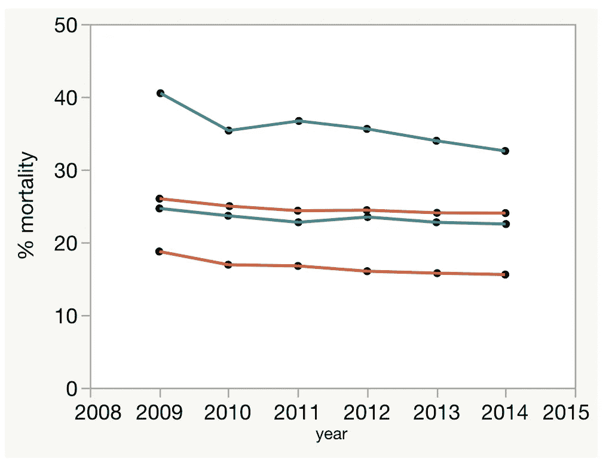
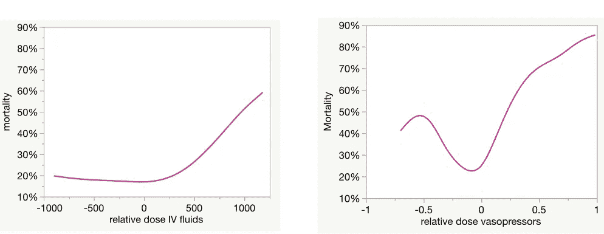
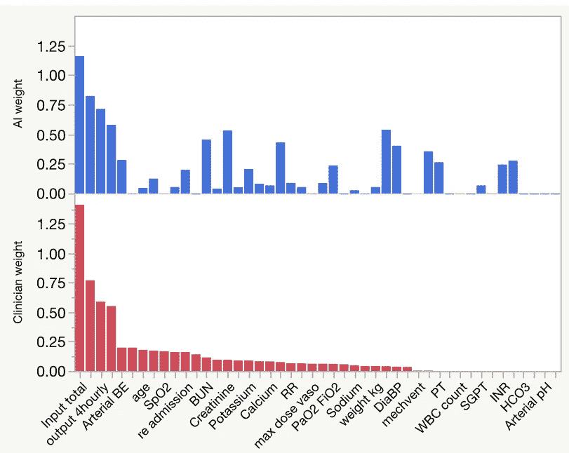

# 人工智能将如何拯救成千上万的生命

> 原文：<https://towardsdatascience.com/how-ai-will-save-thousands-of-lives-96eab3f7b13e?source=collection_archive---------26----------------------->

## 败血症是问题所在；数据是良药

另一家陷入败血症泥潭的生物技术公司。基蒙柏林

当你想到医疗保健中的人工智能时，你可能会想象人工智能驱动的[药物发现](/ai-is-not-going-to-revolutionize-drug-discovery-c41df686732d)，或者[机器人手术](https://spectrum.ieee.org/the-human-os/robotics/medical-robots/autonomous-robot-surgeon-bests-human-surgeons-in-world-first)或者[图像分析](https://www.thelancet.com/journals/lanonc/article/PIIS1470-2045(19)30154-8/fulltext)。有充分的理由——这些应用正在发生或即将发生。

我们都知道人工智能在改善医疗保健方面有很大的潜力。但它最大的影响不会在制药实验室或安静的放射室的安静范围内感受到。取而代之的是混乱的病人护理前线。人工智能在管理“黄金时间”疾病方面将是至关重要的，在这些疾病中[及时和适当的治疗](https://www.ncbi.nlm.nih.gov/pubmed/28345952)可以拯救生命。

脓毒症是这些疾病中首当其冲的。它每年杀死 27 万美国人。这个数字相当于肺癌、乳腺癌、前列腺癌和结肠癌的总和。死亡率为 20 %- 30 %,在过去三十年中几乎没有改善。

所有开发败血症药物治疗的尝试都以失败告终。尽管进行了超过 100 次 2 期和 3 期临床试验，但没有药物显示出疗效。生物技术领域到处都是希望分水的公司的尸体。相反，他们发现自己被困在医学上的 LaBrea 焦油坑。

难怪败血症死亡率居高不下:

根据不同的定义，对脓毒症死亡率的估计有所不同，但没有显示出明显的改善趋势。自己的工作，数据来自[2009–2014 年美国医院败血症的发病率和趋势](https://jamanetwork.com/journals/jama/fullarticle/2654187)

脓毒症(更准确地说，脓毒性休克)是免疫系统对感染的过度反应。面对全身性细菌感染，细胞因子会大量释放。结果是混乱和适得其反的免疫反应。[标准治疗](http://survivingsepsis.org/Bundles/Pages/default.aspx)包括服用抗生素，外加服用升压药(升高血压的药物)和液体。

脓毒症是人工智能知情干预的良好目标。问题很大。最佳治疗方案正在[激烈争论。](https://drewsmithblog.com/2018/09/is-the-clovers-sepsis-trial-unethical/)患者受到严密监控，因此有大量数据需要分析。这种疾病是异质性的，许多共病作为混杂变量。有一个明确的结果(死亡率)。

简而言之，这是一种人类大脑很难分析的疾病，但可以通过机器学习技术来分析。

这就是《自然医学》中这篇论文的背景:“[人工智能临床医生在重症监护中学习脓毒症的最佳治疗策略](https://www.nature.com/articles/s41591-018-0213-5)”。我不能假装懂机器学习。但总体方法是合理的:输入一大组病人变量，包括人口统计、病史、血液化学和生理学；将这些与实际疗法相匹配；与训练集的结果相关联；在独立数据集上验证。

以下是关键结果，以死亡率与实际和人工授精建议的治疗过程之间的一致性的图表表示:

脓毒症转归的回顾性分析。零值意味着实际医生和人工智能推荐的治疗是相同的。自己的工作，数据来自[人工智能临床医生学习重症监护中脓毒症的最佳治疗策略](https://www.nature.com/articles/s41591-018-0213-5)

x 轴显示静脉注射液(左)或血管加压药(右)的实际剂量和建议剂量之间的差异。零值意味着医生的行动与 AI 算法的建议相匹配。这是死亡率最低的地方。这并不奇怪，因为这就是算法的目的。

响应差异曲线的形状提供了信息。静脉输液量为建议水平，低于建议水平为最佳水平；输液过少对死亡率影响不大。但是当液体摄入超过推荐水平时，就会发生不好的事情。死亡率最高时增加了两倍。我怀疑没有人预料到这个结果。大多数医生对低血压患者的反应可能是继续输液。

升压药图表(右图)非常可怕。有一个非常狭窄的治疗窗口。任何高于或低于该值的偏差都会导致死亡率急剧上升。请记住，这不是一个“一刀切”的治疗过程，即一剂升压药对所有患者都适用。这很容易实现，如果它存在的话，我们早就在没有人工智能的帮助下找到它了。相反，这是一个狭窄的治疗窗口，并以患者的病史和生理状况为条件。难怪有效的脓毒症治疗如此困难。

当然，这只是一篇论文。这可能是错误的，需要在对真正的病人进行测试之前进行复制和改进。但是死亡率有很大提高的潜力。这种潜力表明，进一步的发展应该具有高度的优先性。

## 碳与硅

其他几个结果值得注意。以下图表比较了医生(下图)和 AI(上图)给出的相对权重与决定静脉输液量的不同参数:

首先要注意的是，医生赋予最大权重的变量也是 AI 赋予最大权重的变量。这让人放心。临床医生对脓毒症的治疗一无所知，这令人难以置信。经验丰富的医生和人工智能在最重要的变量上达成一致，给人工智能算法带来了可信度。

这些图表更有趣的特征是考虑的变量的数量。临床医生只依赖少量的输入。人工智能赋予更多变量以重要性。

这符合我们对人类思维的了解。我们的工作记忆是微弱的:[我们在任何时候都能记住 3-5 个项目。我们对这些的把握很容易被分心打破。苦恼的临床医生专注于几个关键输入不足为奇。](https://www.ncbi.nlm.nih.gov/pmc/articles/PMC2864034/)

当然，计算机没有这些弱点。他们可以利用数千个数据点来建议治疗过程。他们也不受对他们注意力的破坏性要求的影响。

## 人工智能治疗脓毒症的必然性

这里是关键的要点:如果超过几个数据点在确定最佳治疗中有价值，*那么不可避免的是*人工智能算法最终将胜过人类。它可能不是本文中生成的特定算法，但有一个优化的处理算法。会被发现的。它将拯救成千上万的生命。将败血症死亡率降低 5%相当于找到了乳腺癌的治疗方法。

人工智能在这一应用中的潜力大于所有其他人工智能医疗干预的总和。我们应该继续下去。

*披露:*我曾为 MBio Diagnostics 开发败血症诊断工具提供咨询。我没有参与本文中讨论的工作。